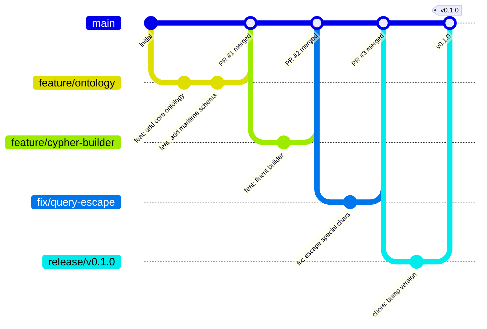
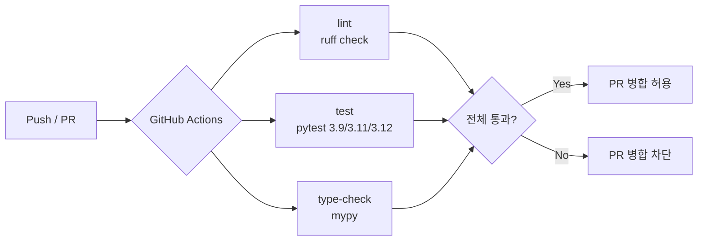
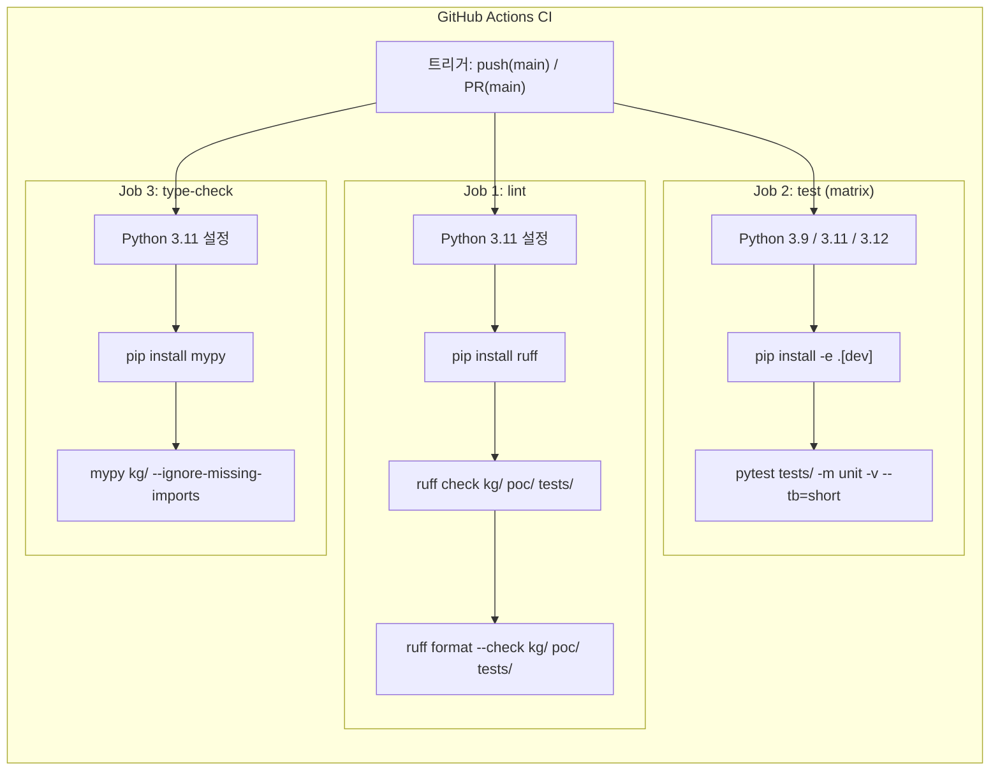
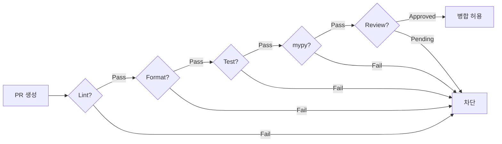
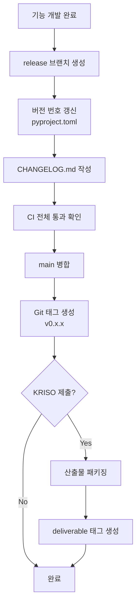
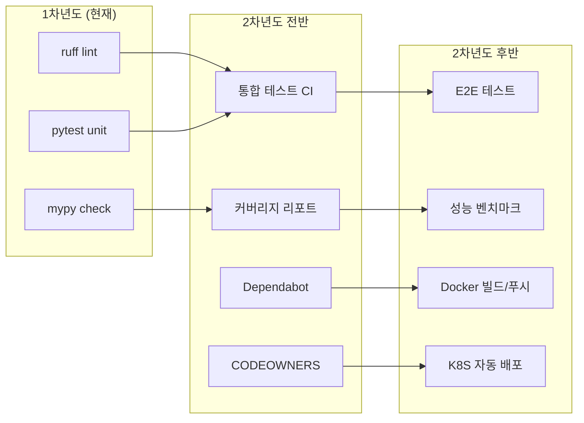

# COM-005: GitHub 기반 산출물 관리 체계

## KRISO 대화형 해사서비스 플랫폼 - 형상관리 및 품질 보증 체계

| 항목 | 내용 |
|------|------|
| **과업명** | KRISO 대화형 해사서비스 플랫폼 KG 모델 설계 연구 |
| **문서 ID** | COM-005 |
| **버전** | 1.0 |
| **작성일** | 2026-02-10 |
| **분류** | 관리/운영 문서 |
| **관련 문서** | PRD v1.0, TER-001 (테스트 계획서), RPT-001 (과업 완료 보고서) |

---

## 목차

1. [개요](#1-개요)
2. [저장소 구조](#2-저장소-구조)
3. [브랜치 전략](#3-브랜치-전략)
4. [산출물 문서 체계](#4-산출물-문서-체계)
5. [CI/CD 파이프라인](#5-cicd-파이프라인)
6. [릴리스 관리](#6-릴리스-관리)
7. [보안 및 접근 제어](#7-보안-및-접근-제어)
8. [백업 및 복구](#8-백업-및-복구)
9. [2차년도 확장 계획](#9-2차년도-확장-계획)
10. [참고문헌](#10-참고문헌)

---

## 1. 개요

### 1.1 목적

본 문서는 KRISO(한국해양과학기술원 부설 선박해양플랜트연구소) 대화형 해사서비스 플랫폼 과업에서 생산되는 **전체 산출물의 체계적 형상관리(Configuration Management) 및 품질 보증(Quality Assurance)** 체계를 정의한다.

GitHub를 중앙 저장소로 활용하여 다음을 달성한다:

| 목표 | 설명 |
|------|------|
| **추적성(Traceability)** | 모든 변경 이력의 완전한 추적 |
| **재현성(Reproducibility)** | 임의 시점의 산출물 상태를 정확히 재현 |
| **품질 보증** | 자동화된 정적 분석, 테스트, 타입 검사로 코드 품질 유지 |
| **협업 효율** | KRISO 내부연구원 - 외부연구자 - 민간개발자 간 원활한 협업 |
| **산출물 일관성** | 문서 번호 체계, 버전 관리, 변경 이력의 일관된 관리 |

### 1.2 적용 범위

- **대상:** 1차년도(설계 + PoC) 산출물 전체 (소스 코드, 설계 문서, 테스트, 인프라 구성)
- **저장소:** `https://github.com/jeromwolf/flux-n8n`
- **유효 기간:** 1차년도 착수 ~ 과업 완료 (2차년도 착수 시 개정)

### 1.3 관련 표준

| 표준 | 적용 내용 |
|------|-----------|
| **ISO/IEC 12207** | 소프트웨어 생명주기 프로세스 - 형상관리 프로세스 참조 |
| **ISO/IEC 15489** | 문서 기록 관리 - 산출물 버전 관리 체계 참조 |
| **Git Flow** | 브랜치 전략 기반 모델 (간소화 적용) |
| **Semantic Versioning 2.0.0** | 릴리스 버전 번호 체계 |
| **Conventional Commits** | 커밋 메시지 규칙 |

### 1.4 용어 정의

| 용어 | 설명 |
|------|------|
| CI/CD | Continuous Integration / Continuous Delivery (지속적 통합/배포) |
| PR | Pull Request (풀 리퀘스트) - 코드 변경 병합 요청 |
| 형상관리 | Configuration Management - 산출물 변경 이력 및 상태 관리 |
| 품질 게이트 | Quality Gate - 코드 병합 전 자동 품질 검증 관문 |
| SemVer | Semantic Versioning - 의미적 버전 부여 체계 |

---

## 2. 저장소 구조

### 2.1 모노레포(Monorepo) 구조

본 프로젝트는 **모노레포** 방식을 채택하여, 소스 코드와 설계 문서, 테스트, 인프라 구성을 단일 저장소에서 관리한다. 이를 통해 코드와 문서 간 일관성을 보장하고 변경 이력을 통합적으로 추적한다.

```
flux-n8n/                        # 프로젝트 루트
├── kg/                          # Knowledge Graph 모듈 (핵심)
│   ├── __init__.py              # 패키지 초기화 및 공개 API
│   ├── config.py                # Neo4j 연결 설정
│   ├── exceptions.py            # 공통 예외 정의
│   ├── cypher_builder.py        # Fluent Cypher 쿼리 빌더
│   ├── query_generator.py       # 다중 언어 쿼리 생성기
│   ├── ontology/                # 온톨로지 정의
│   │   ├── core.py              # Ontology, ObjectType, LinkType
│   │   ├── maritime_ontology.py # 해사 도메인 스키마 (126 엔티티, 83 관계)
│   │   └── maritime_loader.py   # 온톨로지 로더/검증
│   ├── schema/                  # Neo4j 스키마
│   │   ├── constraints.cypher   # 24 제약조건
│   │   ├── indexes.cypher       # 44 인덱스
│   │   ├── init_schema.py       # 스키마 초기화
│   │   └── load_sample_data.py  # 샘플 데이터 적재
│   ├── nlp/                     # 자연어 처리
│   │   └── maritime_terms.py    # 한국어 해사용어 사전
│   ├── rbac/                    # 역할 기반 접근 제어
│   │   ├── models.py            # User, Role, DataClass 모델
│   │   ├── policy.py            # 접근 제어 정책
│   │   └── load_rbac_data.py    # RBAC 시드 데이터
│   └── crawlers/                # 데이터 크롤러
│       ├── kriso_papers.py      # ScholarWorks 논문 크롤러
│       ├── kriso_facilities.py  # 시험시설 크롤러
│       ├── kma_marine.py        # 기상청 해양기상 크롤러
│       ├── maritime_accidents.py # 해양사고 크롤러
│       └── relation_extractor.py # 관계 추출기
├── poc/                         # PoC 구현
│   ├── setup_poc.py             # 원클릭 환경 설정
│   ├── run_poc_demo.py          # 통합 데모 실행기
│   ├── langchain_qa.py          # LangChain NL->Cypher QA
│   ├── kg_visualizer.html       # Cytoscape.js 시각화
│   └── kg_visualizer_api.py     # 시각화 REST API
├── tests/                       # 테스트 (387개)
│   ├── conftest.py              # pytest 공통 설정/픽스처
│   ├── test_ontology_core.py    # 온톨로지 코어 테스트
│   ├── test_maritime_ontology.py# 해사 온톨로지 테스트
│   ├── test_cypher_builder.py   # Cypher 빌더 테스트
│   ├── test_query_generator.py  # 쿼리 생성기 테스트
│   ├── test_nl_query_scenarios.py # NL 쿼리 시나리오 테스트
│   ├── test_nlp_unit.py         # NLP 단위 테스트
│   ├── test_rbac_unit.py        # RBAC 단위 테스트
│   ├── test_crawlers_unit.py    # 크롤러 단위 테스트
│   ├── test_exceptions.py       # 예외 처리 테스트
│   ├── test_integration.py      # 통합 테스트 (Neo4j 필요)
│   └── benchmark_kg.py          # 성능 벤치마크
├── docs/                        # 설계 문서 (13개)
│   ├── PRD.md                   # 프로젝트 요구사항 정의서
│   ├── REQ-001 ~ REQ-004       # 요구사항 분석 (4종)
│   ├── DES-001 ~ DES-005       # 설계 문서 (5종)
│   ├── TER-001                  # 테스트 계획서
│   ├── RPT-001                  # 과업 완료 보고서
│   └── COM-005                  # 본 문서 (GitHub 산출물 관리)
├── examples/                    # 사용 예제
│   └── kg_usage.py              # KG 모듈 사용 예제
├── .github/workflows/           # GitHub Actions CI/CD
│   └── ci.yml                   # CI 파이프라인 정의
├── docker-compose.yml           # 인프라 구성 (Neo4j, Activepieces, PostgreSQL, Redis)
├── pyproject.toml               # Python 프로젝트 설정
├── CLAUDE.md                    # AI 개발 어시스턴트 지침
└── README.md                    # 프로젝트 소개
```

### 2.2 디렉토리별 역할과 소유권

| 디렉토리 | 역할 | 소유 | 변경 빈도 |
|-----------|------|------|-----------|
| `kg/` | 핵심 KG 라이브러리 | 개발팀 | 높음 |
| `kg/ontology/` | 온톨로지 정의 | 설계팀 | 중간 |
| `kg/schema/` | Neo4j 스키마 | 개발팀 | 낮음 (안정화 후) |
| `kg/crawlers/` | 데이터 수집 | 개발팀 | 중간 |
| `kg/rbac/` | 접근 제어 | 보안담당 | 낮음 |
| `poc/` | PoC 시연 코드 | 개발팀 | 높음 |
| `tests/` | 테스트 코드 | 개발팀 전체 | 높음 |
| `docs/` | 설계/분석 문서 | PM + 설계팀 | 중간 |
| `examples/` | 사용 예제 | 개발팀 | 낮음 |
| `.github/` | CI/CD 구성 | DevOps 담당 | 낮음 |

### 2.3 .gitignore 정책

관리 대상에서 **제외**하는 파일 유형:

| 구분 | 패턴 | 사유 |
|------|------|------|
| 환경변수 | `.env` | 비밀번호, API 키 등 보안 정보 포함 |
| Python 빌드 | `__pycache__/`, `*.pyc`, `dist/`, `build/` | 빌드 산출물 (재생성 가능) |
| 가상환경 | `.venv/`, `venv/`, `env/` | 로컬 환경 의존 |
| Docker 볼륨 | `neo4j_data/`, `neo4j_logs/` | 런타임 데이터 |
| IDE 설정 | `.vscode/`, `.idea/` | 개인 개발 환경 |
| 테스트 캐시 | `.pytest_cache/`, `.mypy_cache/` | 임시 캐시 |
| 커버리지 | `htmlcov/`, `.coverage` | 리포트 산출물 (CI에서 재생성) |
| 벤치마크 | `tests/benchmark_results.json` | 실행 환경별 상이 |
| OS 파일 | `.DS_Store`, `Thumbs.db` | OS 메타데이터 |

---

## 3. 브랜치 전략

### 3.1 브랜치 모델

본 프로젝트는 **GitHub Flow** 기반 간소화 모델을 적용한다. 1차년도 PoC 규모에 적합하며, 2차년도 구축 단계에서 Git Flow로 전환을 검토한다.



### 3.2 브랜치 유형

| 브랜치 | 네이밍 규칙 | 목적 | 수명 |
|--------|-------------|------|------|
| `main` | - | 안정 브랜치, 릴리스 가능 상태 유지 | 영구 |
| `feature/*` | `feature/{기능명}` | 신규 기능 개발 | PR 병합 시 삭제 |
| `fix/*` | `fix/{이슈명}` | 버그 수정 | PR 병합 시 삭제 |
| `docs/*` | `docs/{문서명}` | 문서 작업 (설계서, 보고서) | PR 병합 시 삭제 |
| `release/*` | `release/v{MAJOR.MINOR.PATCH}` | 릴리스 준비 (버전 태깅) | 태그 생성 후 삭제 |
| `refactor/*` | `refactor/{대상}` | 코드 리팩토링 | PR 병합 시 삭제 |

### 3.3 브랜치 보호 규칙

`main` 브랜치에 적용되는 보호 규칙:

| 규칙 | 설정 | 사유 |
|------|------|------|
| **PR 필수** | Direct push 금지 | 모든 변경은 PR을 통해 리뷰 후 병합 |
| **CI 통과 필수** | lint + test + type-check 전체 통과 | 품질 게이트 우회 방지 |
| **코드 리뷰 필수** | 최소 1명 승인 | 코드 품질 및 설계 일관성 보장 |
| **Conversation 해결 필수** | 모든 리뷰 코멘트 해결 | 미해결 이슈 없이 병합 |
| **Force push 금지** | 이력 강제 변경 차단 | 추적성 보장 |

### 3.4 커밋 메시지 규칙

**Conventional Commits** 사양을 따른다:

```
<type>(<scope>): <description>

[optional body]

[optional footer(s)]
```

| Type | 용도 | 예시 |
|------|------|------|
| `feat` | 새 기능 | `feat(ontology): add maritime vessel hierarchy` |
| `fix` | 버그 수정 | `fix(cypher): escape special characters in parameter` |
| `docs` | 문서 변경 | `docs: add DES-001 knowledge graph model design` |
| `test` | 테스트 추가/수정 | `test(rbac): add policy enforcement unit tests` |
| `refactor` | 코드 리팩토링 | `refactor(crawlers): DRY extraction of common HTTP logic` |
| `chore` | 빌드/도구 변경 | `chore(ci): add mypy type checking job` |
| `perf` | 성능 개선 | `perf(query): optimize Cypher query generation` |

### 3.5 PR 작성 규칙

```markdown
## 변경 요약
<!-- 1-3줄 핵심 변경 내용 -->

## 변경 유형
- [ ] 새 기능 (feat)
- [ ] 버그 수정 (fix)
- [ ] 문서 (docs)
- [ ] 리팩토링 (refactor)
- [ ] 테스트 (test)

## 관련 이슈
<!-- Fixes #123, Relates to #456 -->

## 테스트 계획
<!-- 테스트 방법 및 결과 -->

## 체크리스트
- [ ] CI 통과 확인
- [ ] 테스트 추가/수정 완료
- [ ] 문서 갱신 (필요 시)
```

---

## 4. 산출물 문서 체계

### 4.1 문서 번호 체계

모든 산출물은 **기능별 접두사 + 일련번호** 체계로 관리한다:

| 접두사 | 구분 | 현재 문서 | 설명 |
|--------|------|-----------|------|
| `REQ-NNN` | 요구사항 분석 | REQ-001 ~ REQ-004 (4종) | 동향 조사, 대상 선정, 기술 비교, 표준 분석 |
| `DES-NNN` | 설계 문서 | DES-001 ~ DES-005 (5종) | KG 모델, 멀티모달, ETL, NL 탐색, 분류체계 |
| `SFR-NNN` | 기능 명세 | SFR-003 (1종) | 기능 명세서 (소프트웨어 요구사항) |
| `TER-NNN` | 시험 계획/결과 | TER-001 (1종) | 테스트 계획서 |
| `RPT-NNN` | 보고서 | RPT-001 (1종) | 과업 완료 보고서 |
| `COM-NNN` | 관리/운영 | COM-005 (1종) | 본 문서 (GitHub 산출물 관리) |

### 4.2 문서 버전 관리

모든 설계 문서 **상단 헤더**에 아래 정보를 필수 기재한다:

```markdown
| 항목 | 내용 |
|------|------|
| **과업명** | KRISO 대화형 해사서비스 플랫폼 KG 모델 설계 연구 |
| **문서 ID** | {접두사}-{번호} |
| **버전** | {MAJOR}.{MINOR} |
| **작성일** | YYYY-MM-DD |
| **분류** | {문서 유형} |
| **관련 문서** | {참조 문서 목록} |
```

**버전 부여 기준:**

| 버전 | 의미 | 예시 |
|------|------|------|
| 0.x | 초안 (Draft) | 0.1 = 최초 초안, 0.9 = 검토용 |
| 1.0 | 최초 승인 버전 | KRISO 검토 후 확정 |
| 1.x | 소규모 수정 | 오탈자, 용어 통일 등 |
| 2.0 | 대규모 개정 | 구조 변경, 범위 변경 |

**Git 태그 기반 문서 스냅샷:**

KRISO 제출 시점마다 Git 태그를 생성하여 산출물 전체를 스냅샷한다.

```bash
# 산출물 제출 시점 태깅
git tag -a deliverable-2m -m "계약 후 2개월: 산출물 #1, #2 제출"
git tag -a deliverable-5m -m "계약 후 5개월: 산출물 #3, #4, #5 제출"
git tag -a deliverable-final -m "종료: 산출물 #6, #7, #8 제출"
```

### 4.3 KRISO 산출물 8종 매핑

KRISO 과업지시서에 명시된 8종 산출물과 GitHub 저장소 내 문서 매핑:

| # | KRISO 제출 산출물 | 기한 | GitHub 문서 | 경로 |
|---|-------------------|------|-------------|------|
| 1 | 해사 데이터 현황 분석 보고서 | 계약 후 2개월 | REQ-001, REQ-002 | `docs/REQ-001_*.md`, `docs/REQ-002_*.md` |
| 2 | KG 구축 대상 자원 선정 보고서 | 계약 후 2개월 | REQ-002 | `docs/REQ-002_*.md` |
| 3 | 해사 도메인 온톨로지 설계서 | 계약 후 5개월 | DES-001, DES-005 | `docs/DES-001_*.md`, `docs/DES-005_*.md` |
| 4 | 지식그래프 스키마 설계서 | 계약 후 5개월 | DES-001 | `docs/DES-001_*.md` |
| 5 | 그래프 DB 기술 비교 분석 보고서 | 계약 후 5개월 | REQ-003 | `docs/REQ-003_*.md` |
| 6 | PoC 프로토타입 및 시험 결과 보고서 | 종료 1달 전 | TER-001 + `poc/` 소스 | `docs/TER-001_*.md`, `poc/` |
| 7 | 2차년도 구축 상세 설계서 | 종료 2주 전 | DES-002, DES-003, DES-004 | `docs/DES-002~004_*.md` |
| 8 | 과업 완료 보고서 | 종료 2주 전 | RPT-001 | `docs/RPT-001_*.md` |

### 4.4 문서-코드 추적 매트릭스

주요 설계 문서와 구현 코드 간 추적 관계:

| 설계 문서 | 핵심 구현 코드 | 검증 테스트 |
|-----------|---------------|-------------|
| DES-001 (KG 모델) | `kg/ontology/core.py`, `kg/ontology/maritime_ontology.py` | `tests/test_ontology_core.py`, `tests/test_maritime_ontology.py` |
| DES-001 (스키마) | `kg/schema/constraints.cypher`, `kg/schema/indexes.cypher` | `tests/test_integration.py` |
| DES-002 (멀티모달) | `kg/crawlers/*.py` | `tests/test_crawlers_unit.py` |
| DES-003 (ETL) | `kg/schema/load_sample_data.py` | `tests/test_integration.py` |
| DES-004 (NL 탐색) | `kg/cypher_builder.py`, `kg/query_generator.py` | `tests/test_cypher_builder.py`, `tests/test_query_generator.py` |
| DES-005 (분류체계) | `kg/ontology/maritime_ontology.py` | `tests/test_maritime_ontology.py` |

---

## 5. CI/CD 파이프라인

### 5.1 파이프라인 개요

GitHub Actions 기반 CI/CD 파이프라인으로 모든 코드 변경에 대해 자동 품질 검증을 수행한다.



### 5.2 정적 분석

#### 5.2.1 코드 린트 (ruff check)

[Ruff](https://docs.astral.sh/ruff/)를 사용한 Python 코드 린트 검사:

| 항목 | 설정 |
|------|------|
| **도구** | ruff check |
| **대상** | `kg/`, `poc/`, `tests/` |
| **규칙** | PEP 8 기반 + 추가 린트 규칙 |
| **실행 시점** | PR 생성/갱신, main 푸시 |

```bash
# 로컬 실행
ruff check kg/ poc/ tests/
```

#### 5.2.2 코드 포맷 (ruff format)

일관된 코드 스타일 적용:

| 항목 | 설정 |
|------|------|
| **도구** | ruff format --check |
| **대상** | `kg/`, `poc/`, `tests/` |
| **스타일** | Black 호환 포맷 |

```bash
# 로컬 포맷 검사 (CI 동일)
ruff format --check kg/ poc/ tests/

# 자동 포맷 적용
ruff format kg/ poc/ tests/
```

#### 5.2.3 타입 검사 (mypy)

Python 타입 힌트 정적 검증:

| 항목 | 설정 |
|------|------|
| **도구** | mypy |
| **대상** | `kg/` |
| **옵션** | `--ignore-missing-imports` |
| **Python 버전** | 3.11 |

```bash
# 로컬 실행
mypy kg/ --ignore-missing-imports
```

### 5.3 테스트 자동화

#### 5.3.1 테스트 구성

| 구분 | 테스트 수 | Neo4j 필요 | 실행 환경 |
|------|-----------|-----------|-----------|
| **단위 테스트** (unit) | 330개 | 불필요 | CI + 로컬 |
| **통합 테스트** (integration) | 57개 | 필요 | 로컬 전용 |
| **전체** | **387개** | - | - |

#### 5.3.2 pytest 설정

```bash
# CI에서 실행 (단위 테스트만)
pytest tests/ -m unit -v --tb=short

# 로컬 전체 테스트
PYTHONPATH=. python3 -m pytest tests/ -v

# 커버리지 측정
PYTHONPATH=. python3 -m pytest tests/ -m unit --cov=kg --cov-report=html
```

#### 5.3.3 테스트 모듈별 커버리지 목표

| 모듈 | 목표 커버리지 | 현재 상태 |
|------|-------------|-----------|
| `kg/ontology/core.py` | 95%+ | 달성 |
| `kg/cypher_builder.py` | 90%+ | 달성 |
| `kg/query_generator.py` | 90%+ | 달성 |
| `kg/nlp/maritime_terms.py` | 85%+ | 달성 |
| `kg/rbac/` | 90%+ | 달성 |
| `kg/crawlers/` | 80%+ | 달성 |
| **전체 평균** | **90%+** | **달성** |

### 5.4 GitHub Actions 워크플로우

CI 파이프라인은 `.github/workflows/ci.yml`에 정의되며, 3개 독립 Job으로 구성된다:



**Job 상세:**

| Job | 러너 | Python | 실행 내용 |
|-----|------|--------|-----------|
| `lint` | ubuntu-latest | 3.11 | ruff check + ruff format --check |
| `test` | ubuntu-latest | **3.9, 3.11, 3.12** (매트릭스) | pytest 단위 테스트 |
| `type-check` | ubuntu-latest | 3.11 | mypy 타입 검사 |

**매트릭스 테스트 전략:** Python 3.9(최소 지원), 3.11(주력), 3.12(최신)에서 테스트하여 버전 호환성을 보장한다.

### 5.5 품질 게이트

PR이 `main`에 병합되기 위해 충족해야 하는 조건:

| 게이트 | 검증 내용 | 실패 시 |
|--------|-----------|---------|
| **Lint Pass** | ruff check 위반 0건 | PR 병합 차단 |
| **Format Pass** | ruff format 불일치 0건 | PR 병합 차단 |
| **Test Pass** | pytest 전체 PASS (3개 Python 버전) | PR 병합 차단 |
| **Type Check Pass** | mypy 오류 0건 | PR 병합 차단 |
| **Code Review** | 1명 이상 승인 | PR 병합 차단 |
| **Conversation Resolved** | 리뷰 코멘트 전체 해결 | PR 병합 차단 |



---

## 6. 릴리스 관리

### 6.1 버전 체계

**Semantic Versioning 2.0.0** 규격을 따른다:

```
v{MAJOR}.{MINOR}.{PATCH}[-{pre-release}]
```

| 구성요소 | 의미 | 변경 시점 |
|---------|------|-----------|
| MAJOR | 호환성 파괴 변경 | API 인터페이스 변경 |
| MINOR | 기능 추가 (호환 유지) | 새 엔티티/관계 추가, 신규 크롤러 |
| PATCH | 버그 수정 | 쿼리 오류 수정, 문서 오탈자 |
| pre-release | 사전 릴리스 | alpha, beta, rc |

**연도별 버전 범위:**

| 단계 | 버전 범위 | 설명 |
|------|-----------|------|
| 1차년도 (설계 + PoC) | `v0.1.0` ~ `v0.x.x` | PoC 단계, API 불안정 |
| 2차년도 (구축) | `v1.0.0` ~ `v1.x.x` | 안정 API, 운영 배포 |
| 3차년도 (MVP 통합) | `v2.0.0` ~ | 멀티모달 RAG 통합 |

### 6.2 릴리스 프로세스



**단계별 상세:**

1. **release 브랜치 생성:** `release/v0.2.0`
2. **버전 갱신:** `pyproject.toml` 내 version 필드 업데이트
3. **CHANGELOG 작성:** 변경 내역 정리 (Added, Changed, Fixed, Removed)
4. **CI 확인:** 모든 품질 게이트 통과
5. **main 병합:** PR 리뷰 후 병합
6. **태그 생성:**
   ```bash
   git tag -a v0.2.0 -m "Release v0.2.0: Cypher Builder + NL Query"
   git push origin v0.2.0
   ```
7. **(KRISO 제출 시)** 산출물 패키징 및 별도 태그

### 6.3 CHANGELOG 형식

```markdown
# Changelog

## [v0.2.0] - 2026-MM-DD

### Added
- Cypher Builder fluent API (kg/cypher_builder.py)
- NL->Cypher 쿼리 생성기 (kg/query_generator.py)

### Changed
- 온톨로지 코어 리팩토링 (kg/ontology/core.py)

### Fixed
- 특수문자 이스케이프 오류 수정

### Removed
- 미사용 유틸리티 함수 정리
```

### 6.4 마일스톤 추적

GitHub Issues 및 Milestones를 활용한 과업 추적:

| 마일스톤 | 기한 | 주요 산출물 |
|---------|------|-------------|
| **M1: 현황 분석** | 계약 후 2개월 | 산출물 #1, #2 |
| **M2: 온톨로지/스키마 설계** | 계약 후 5개월 | 산출물 #3, #4, #5 |
| **M3: PoC 시연** | 종료 1달 전 | 산출물 #6 |
| **M4: 최종 보고** | 종료 2주 전 | 산출물 #7, #8 |

**Issue 레이블 체계:**

| 레이블 | 용도 | 색상 |
|--------|------|------|
| `P0-critical` | 긴급 (과업 차질) | 빨강 |
| `P1-high` | 중요 (기한 영향) | 주황 |
| `P2-medium` | 보통 | 노랑 |
| `P3-low` | 낮음 (개선 사항) | 초록 |
| `deliverable` | KRISO 산출물 관련 | 보라 |
| `ontology` | 온톨로지 관련 | 파랑 |
| `poc` | PoC 관련 | 하늘 |
| `infra` | 인프라/CI/CD | 회색 |

---

## 7. 보안 및 접근 제어

### 7.1 저장소 접근 권한

| 역할 | 권한 | 대상 |
|------|------|------|
| **Admin** | Full access | 프로젝트 관리자 (PM) |
| **Maintain** | Push + Settings | 선임 개발자 |
| **Write** | Push + PR 생성 | KRISO 내부연구원, 민간개발자 |
| **Read** | 읽기 전용 | 외부 자문위원, 검수위원 |

> **참고:** 1차년도 PoC 단계에서는 **Private** 저장소로 운영하며, 2차년도 이후 공개 범위를 결정한다.

### 7.2 비밀 정보 관리

**절대 커밋하지 않는 정보:**

| 항목 | 관리 방식 |
|------|-----------|
| Neo4j 비밀번호 | `.env` 파일 (`.gitignore`에 등록) |
| Activepieces 암호화 키 | `.env` 파일 |
| API 토큰 (Bearer) | `.env` 파일 |
| PostgreSQL 비밀번호 | `.env` 파일 |

**`.env.example` 제공:** 필수 환경변수 목록과 기본값 형식을 `.env.example`로 제공하여, 신규 개발자가 빠르게 환경을 구성할 수 있도록 한다.

```bash
# .env.example
NEO4J_URI=bolt://localhost:7687
NEO4J_USER=neo4j
NEO4J_PASSWORD=<your-password>
NEO4J_DATABASE=neo4j

AP_ENCRYPTION_KEY=<openssl rand -hex 16>
AP_JWT_SECRET=<openssl rand -hex 32>
AP_POSTGRES_PASSWORD=<your-password>
```

### 7.3 GitHub Secrets (CI/CD용)

| Secret 이름 | 용도 | 설정 위치 |
|-------------|------|-----------|
| (현재 미사용) | 1차년도는 외부 서비스 연동 없음 | - |
| `NEO4J_PASSWORD` | 통합 테스트 CI 추가 시 | 2차년도 예정 |
| `DOCKER_TOKEN` | 컨테이너 레지스트리 연동 시 | 2차년도 예정 |

### 7.4 의존성 취약점 관리

| 도구 | 적용 | 주기 |
|------|------|------|
| **Dependabot** | Python 의존성 자동 업데이트 PR | 주 1회 |
| **pip-audit** | 알려진 취약점 스캔 | 릴리스 전 |
| **GitHub Security Advisories** | 취약점 알림 수신 | 상시 |

**Dependabot 설정 (`dependabot.yml`):**

```yaml
version: 2
updates:
  - package-ecosystem: "pip"
    directory: "/"
    schedule:
      interval: "weekly"
    labels:
      - "dependencies"
    reviewers:
      - "jeromwolf"
```

---

## 8. 백업 및 복구

### 8.1 소스 코드 백업

| 계층 | 방식 | RPO | 비고 |
|------|------|-----|------|
| **GitHub 원격** | Git push (분산 저장) | 커밋 단위 | 기본 백업 |
| **로컬 클론** | 개발자별 Git clone | 실시간 | 개발 환경 |
| **오프라인 아카이브** | 릴리스 태그 기준 zip | 마일스톤 단위 | KRISO 제출용 |

> **RPO (Recovery Point Objective):** 최대 허용 데이터 손실 시점

### 8.2 Docker 볼륨 백업

인프라 데이터(Neo4j, PostgreSQL)의 백업 절차:

```bash
# Neo4j 데이터 백업
docker run --rm \
  -v maritime-neo4j-data:/data \
  -v $(pwd)/backups:/backup \
  alpine tar czf /backup/neo4j-backup-$(date +%Y%m%d).tar.gz /data

# PostgreSQL 백업 (Activepieces 메타데이터)
docker exec maritime-postgres \
  pg_dump -U postgres activepieces > backups/pg-backup-$(date +%Y%m%d).sql
```

**백업 주기:**

| 대상 | 주기 | 보관 기간 |
|------|------|-----------|
| Neo4j 데이터 | 주 1회 + 릴리스 전 | 6개월 |
| PostgreSQL | 주 1회 | 3개월 |
| 소스 코드 (zip) | 마일스톤 단위 | 영구 |

### 8.3 복구 절차

| 시나리오 | 복구 방법 |
|---------|-----------|
| 소스 코드 손실 | `git clone` (GitHub 원격에서 복원) |
| 특정 시점 복원 | `git checkout <tag>` (태그 기반) |
| Neo4j 데이터 손실 | 볼륨 백업 복원 + `load_sample_data.py` 재실행 |
| CI 설정 손실 | `.github/workflows/ci.yml` Git 이력에서 복원 |

---

## 9. 2차년도 확장 계획

### 9.1 형상관리 고도화

| 항목 | 1차년도 (현재) | 2차년도 (계획) |
|------|---------------|---------------|
| 브랜치 모델 | GitHub Flow (간소) | Git Flow (develop, release, hotfix) |
| 코드 리뷰 | 1명 승인 | 2명 승인 + CODEOWNERS |
| CI 범위 | 단위 테스트 | 단위 + 통합 + E2E |
| 배포 | 수동 | GitHub Actions CD (자동 배포) |
| 환경 | 개발 only | dev / staging / production |

### 9.2 추가 도입 예정 도구

| 도구 | 용도 | 도입 시기 |
|------|------|-----------|
| **GitHub Projects** | 칸반 보드 기반 과업 관리 | 2차년도 초 |
| **AI 코드 리뷰** | PR 자동 리뷰 (코드 품질, 보안) | 2차년도 초 |
| **성능 벤치마크 자동화** | `benchmark_kg.py` CI 연동, 성능 회귀 감지 | 2차년도 중 |
| **K8S Helm 차트** | Kubernetes 배포 관리 | 2차년도 중 |
| **Grafana + Prometheus** | 운영 모니터링 | 2차년도 후 |
| **SonarQube** | 코드 품질 대시보드 | 2차년도 후 |

### 9.3 CI/CD 확장 로드맵



---

## 10. 참고문헌

| # | 문서/표준 | 설명 |
|---|----------|------|
| 1 | ISO/IEC 12207:2017 | 소프트웨어 생명주기 프로세스 |
| 2 | ISO/IEC 15489-1:2016 | 문서 기록 관리 |
| 3 | [Semantic Versioning 2.0.0](https://semver.org/) | 버전 번호 부여 규격 |
| 4 | [Conventional Commits 1.0.0](https://www.conventionalcommits.org/) | 커밋 메시지 규약 |
| 5 | [GitHub Flow](https://docs.github.com/en/get-started/using-github/github-flow) | 브랜치 전략 가이드 |
| 6 | [Ruff Documentation](https://docs.astral.sh/ruff/) | Python 린터/포매터 |
| 7 | PRD v1.0 | KRISO 프로젝트 요구사항 정의서 |
| 8 | TER-001 | 테스트 계획서 |
| 9 | RPT-001 | 과업 완료 보고서 |

---

> **문서 이력**
>
> | 버전 | 일자 | 작성자 | 변경 내용 |
> |------|------|--------|-----------|
> | 1.0 | 2026-02-10 | 개발팀 | 최초 작성 |
