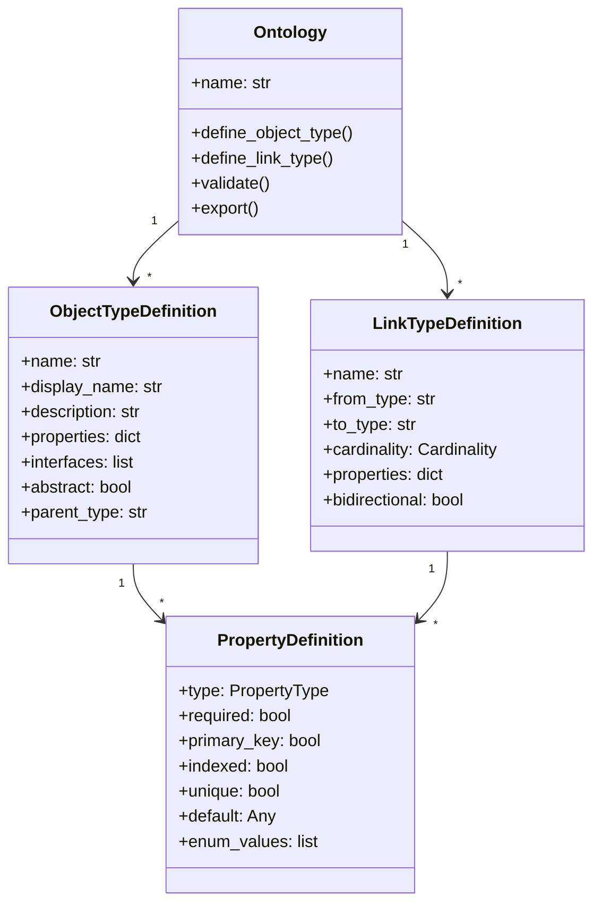
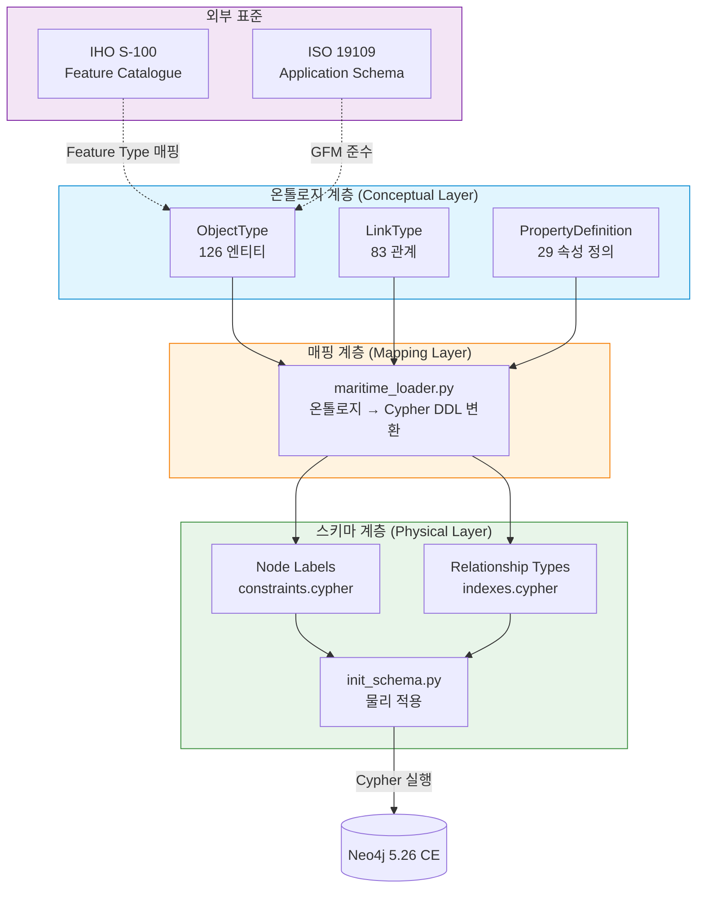
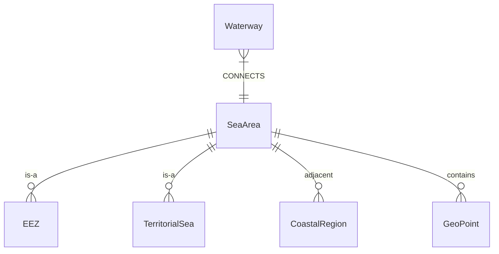
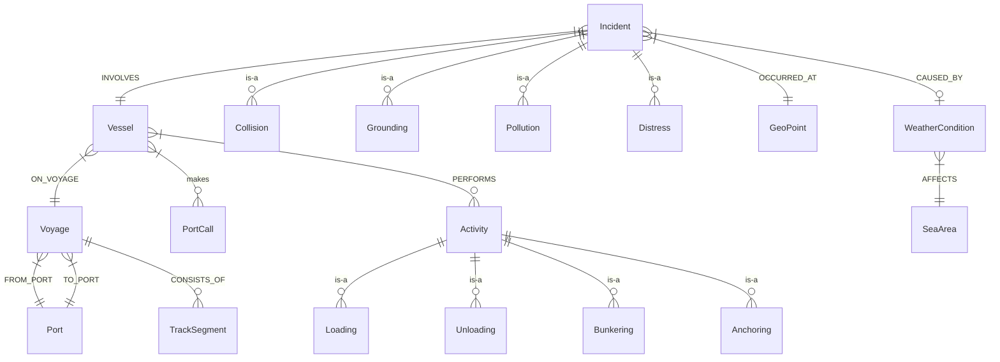
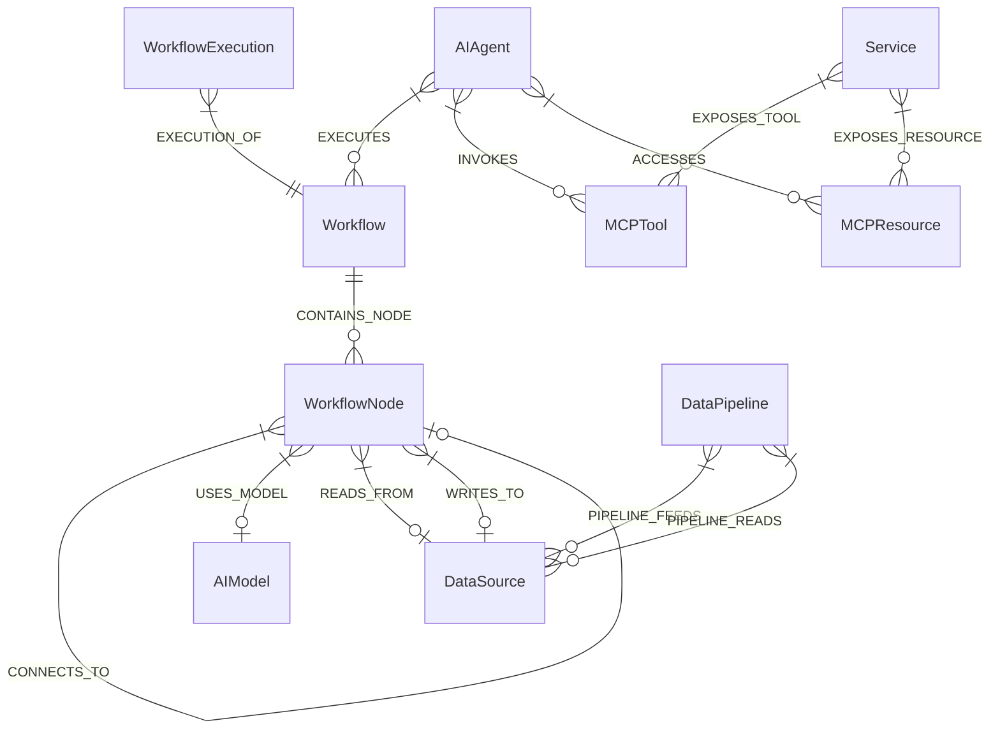
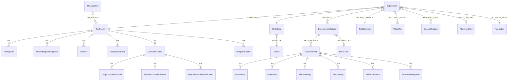
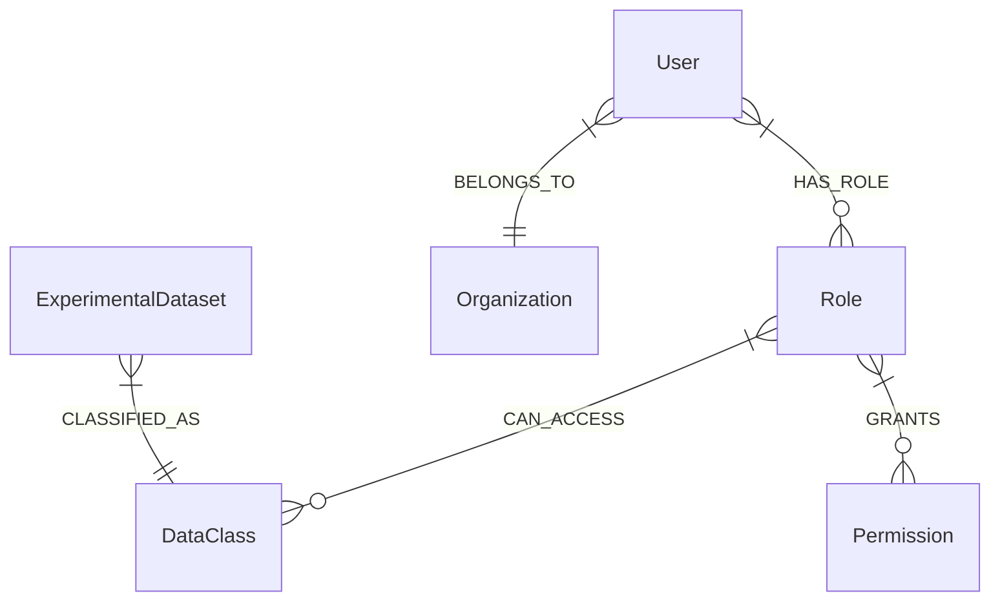
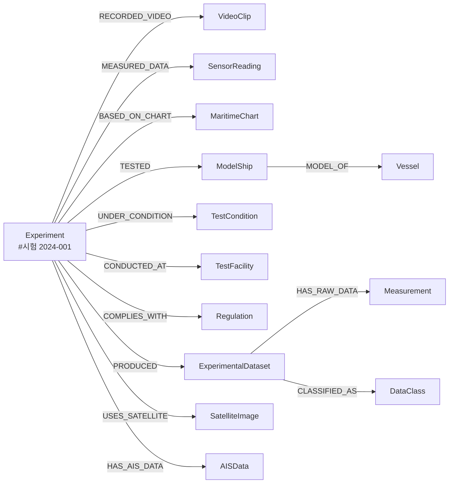

# DES-001: 지식그래프 모델 설계서

## KRISO 대화형 해사서비스 플랫폼 - 해사 도메인 온톨로지 및 지식그래프 스키마 설계

| 항목 | 내용 |
|------|------|
| **문서번호** | DES-001 |
| **버전** | 1.0 |
| **작성일** | 2026-02-09 |
| **대상 납품물** | #3 해사 도메인 온톨로지 설계서, #4 지식그래프 스키마 설계서 |
| **단계** | 1차년도 (설계 + PoC) |
| **상태** | Draft |

---

## 목차

1. [개요](#1-개요)
2. [온톨로지 설계 철학](#2-온톨로지-설계-철학)
3. [엔티티(ObjectType) 모델](#3-엔티티objecttype-모델)
4. [관계(LinkType) 모델](#4-관계linktype-모델)
5. [KRISO 시험시설별 데이터 모델](#5-kriso-시험시설별-데이터-모델)
6. [제약조건 및 인덱스 설계](#6-제약조건-및-인덱스-설계)
7. [스키마 진화 전략](#7-스키마-진화-전략)
8. [S-100 매핑 테이블](#8-s-100-매핑-테이블)
9. [구현 참조](#9-구현-참조)

---

## 1. 개요

### 1.1 설계 목적

본 문서는 KRISO(한국해양과학기술원 부설 선박해양플랜트연구소) 대화형 해사서비스 플랫폼의 핵심 인프라인 **해사 도메인 지식그래프(Knowledge Graph)**의 모델을 정의한다. 1차년도 납품물 중 **#3 해사 도메인 온톨로지 설계서**와 **#4 지식그래프 스키마 설계서**를 통합하여 단일 문서로 제공한다.

### 1.2 범위

본 설계는 **1차년도 PoC(Proof of Concept) 단계**에 해당하며, 다음을 포함한다:

- 해사 도메인 온톨로지 정의 (126개 엔티티, 83개 관계, 29개 속성 정의)
- Property Graph 기반 스키마 설계 (Neo4j 5.26 Community Edition)
- IHO S-100 표준 매핑 전략
- KRISO 시험시설 8종 데이터 모델
- 2차년도 확장을 위한 마이그레이션 전략

> **1차년도 범위 제한:** 본 설계는 메타데이터 관계 모델링에 집중하며, 멀티모달 RAG(Retrieval-Augmented Generation) 파이프라인의 전체 구현은 2차년도 범위이다. 다만 향후 확장을 위한 임베딩 벡터 노드 및 인덱스 설계는 포함한다.

### 1.3 설계 원칙

| 원칙 | 설명 |
|------|------|
| **메타데이터 우선** | 바이너리 데이터(영상, 센서 원시 데이터)는 외부 저장소에 두고, 그래프에는 메타데이터와 관계만 저장 |
| **표준 준수** | IHO S-100 Feature Catalogue, ISO 19100 시리즈 준수 |
| **점진적 확장** | PoC에서 시작하여 운영 환경으로 점진적 확장 가능한 구조 |
| **다국어 지원** | 한국어/영어 이중 속성 (name/nameEn) 패턴 적용 |
| **RBAC 내장** | 접근 제어를 그래프 레벨에서 지원 (User-Role-DataClass) |

### 1.4 기술 스택

| 구성요소 | 기술 | 버전 | 비고 |
|----------|------|------|------|
| 그래프 DB | Neo4j Community Edition | 5.26 | PoC용 무료 에디션 |
| 온톨로지 코어 | Python (Palantir Foundry 패턴) | 3.9+ | `kg/ontology/core.py` |
| 쿼리 빌더 | CypherBuilder (Fluent API) | - | `kg/cypher_builder.py` |
| 쿼리 생성기 | QueryGenerator (Multi-language) | - | `kg/query_generator.py` |
| QA 엔진 | LangChain + Ollama (qwen2.5:7b) | - | 자연어 질의 |

---

## 2. 온톨로지 설계 철학

### 2.1 Palantir Foundry-style 온톨로지

본 온톨로지는 Palantir Foundry의 Ontology SDK 패턴을 Python으로 포팅한 구조를 따른다. 핵심 개념은 다음 세 가지이다:

| 개념 | 설명 | Neo4j 매핑 |
|------|------|-----------|
| **ObjectType** | 도메인 엔티티 유형 정의 | Node Label |
| **LinkType** | 엔티티 간 관계 유형 정의 | Relationship Type |
| **PropertyDefinition** | 속성의 타입, 제약조건, 메타데이터 | Node/Relationship Property |



### 2.2 하이브리드 설계 접근법

온톨로지 설계는 **Top-down(표준 기반)**과 **Bottom-up(데이터 기반)** 하이브리드 접근법을 채택한다.

```
Top-down (표준 기반)                    Bottom-up (데이터 기반)
  IHO S-100 Feature Catalogue             KRISO 시험 데이터 분석
  ISO 19100 Geographic Information        AIS/VTS 실데이터 스키마
  IMO 해사 협약 (SOLAS, MARPOL, COLREG)  해양안전심판원 사고보고서
  IEC 61162 (NMEA)                        기상청 해양기상 API
         |                                       |
         v                                       v
    +--------------------------------------------------+
    |       해사 도메인 온톨로지 (126 ObjectTypes)         |
    |       83 LinkTypes, 29 PropertyDefinitions         |
    +--------------------------------------------------+
```

**Top-down 경로:**
- IHO S-100 Feature Catalogue에서 Feature Type, Feature Association, Attribute를 추출
- ISO 19110 (Feature Cataloguing) 구조를 Property Graph 노드/관계로 변환
- 국제 해사 협약의 규제 체계를 Regulation 계층 구조로 모델링

**Bottom-up 경로:**
- KRISO 시험시설 8종의 실험 데이터 구조 분석 후 Experiment/TestFacility 모델 도출
- AIS 데이터 필드(MMSI, IMO, 위치, 속도 등)에서 Vessel 속성 정의
- 해양사고 보고서 구조에서 Incident/Document 모델 도출

### 2.3 IHO S-100 Feature Catalogue 매핑 전략

S-100 Universal Hydrographic Data Model의 Feature-Attribute-Association 구조를 Property Graph로 매핑하는 전략은 다음과 같다:

| S-100 개념 | Property Graph 매핑 | 예시 |
|------------|---------------------|------|
| Feature Type | Node Label | `Vessel`, `Port`, `SeaArea` |
| Feature Instance | Node | `(:Vessel {mmsi: 440123001})` |
| Simple Attribute | Node Property | `v.name`, `v.grossTonnage` |
| Complex Attribute | 별도 Node + 관계 | `(:TestCondition)` |
| Spatial Attribute | POINT Property | `v.currentLocation` |
| Feature Association | Relationship | `-[:DOCKED_AT]->` |
| Information Type | Node Label (Information 그룹) | `Document`, `Regulation` |
| Role (Association) | Relationship Property | `{role: 'PRIMARY'}` |

### 2.4 ISO 19100 시리즈 준수 사항

| 표준 | 적용 내용 |
|------|----------|
| **ISO 19109** (Application Schema) | ObjectType/LinkType 구조가 GFM(General Feature Model) 준수 |
| **ISO 19110** (Feature Cataloguing) | ENTITY_LABELS 딕셔너리가 Feature Catalogue 역할 수행 |
| **ISO 19115** (Metadata) | Document 노드의 속성이 메타데이터 스키마 반영 |
| **ISO 19136** (GML) | GeoPoint, POINT 타입이 GML geometry 매핑 |
| **ISO 19157** (Data Quality) | Observation의 confidence 속성으로 품질 정보 표현 |

### 2.5 온톨로지-스키마 분리 전략

본 플랫폼의 지식그래프는 **온톨로지 계층(Conceptual Layer)**과 **스키마 계층(Physical Layer)**을 명시적으로 분리하여 설계한다. 두 계층 사이에 **매핑 계층(Mapping Layer)**을 두어 변환 책임을 격리한다.

#### 2.5.1 분리 설계 원칙

| 계층 | 역할 | DB 의존성 | 구현 위치 |
|------|------|-----------|-----------|
| **온톨로지 계층 (Conceptual Layer)** | 도메인 개념 모델 정의. ObjectType, LinkType, PropertyDefinition으로 해사 도메인의 엔티티, 관계, 속성을 DB 독립적으로 기술 | 없음 | `kg/ontology/` 모듈 |
| **매핑 계층 (Mapping Layer)** | 온톨로지 정의를 특정 DB의 물리 스키마(DDL)로 변환. 온톨로지 ↔ 스키마 간 양방향 추적성 보장 | 변환 대상 DB에 종속 | `kg/ontology/maritime_loader.py` |
| **스키마 계층 (Physical Layer)** | Neo4j 5.26 CE에 최적화된 물리적 구현. 노드 레이블, 관계 타입, 제약조건, 인덱스를 Cypher DDL로 정의 | Neo4j 종속 | `kg/schema/` 모듈 |

#### 2.5.2 분리의 근거

1. **ISO 19109 Application Schema 준수**: ISO 19109는 Conceptual Schema(개념 스키마)와 Application Schema(적용 스키마)를 구분한다. 본 설계의 온톨로지 계층이 Conceptual Schema, 스키마 계층이 Application Schema에 대응하며, 이 분리를 통해 국제 표준과의 구조적 정합성을 확보한다.

2. **다중 DB 포팅 가능성**: 1차년도는 Neo4j Community Edition을 사용하나, 2차년도 이후 Apache AGE, Memgraph 등으로의 전환을 고려한다(REQ-003 참조). 온톨로지가 DB에 독립적이므로, 매핑 계층만 교체하면 동일 온톨로지를 다른 그래프 DB에 적용할 수 있다.

3. **S-100 표준 추적성**: IHO S-100 Feature Catalogue의 Feature Type은 온톨로지 계층의 ObjectType에 매핑되고, 이것이 다시 Neo4j Node Label로 변환된다. 3계층 분리를 통해 `S-100 Feature → ObjectType → Neo4j Label`의 추적 경로가 명확해진다.

4. **온톨로지 진화 시 스키마 영향도 제어**: 온톨로지에 새 ObjectType이 추가되거나 PropertyDefinition이 변경될 때, 매핑 계층이 변경 영향을 흡수하여 스키마 계층의 수정 범위를 최소화한다. 이는 섹션 7(스키마 진화 전략)과 연계된다.

5. **테스트 용이성**: 온톨로지 계층의 단위 테스트(126개 엔티티 정의 검증, 관계 무결성 검증 등)는 Neo4j 인스턴스 없이 수행 가능하다. 이를 통해 CI/CD 파이프라인에서 DB 의존 없는 빠른 검증이 가능하다.

#### 2.5.3 계층간 매핑 규칙

온톨로지의 각 구성요소가 스키마 계층으로 변환되는 규칙은 다음과 같다:

| 온톨로지 (Conceptual) | 매핑 방향 | 스키마 (Physical) | 예시 |
|----------------------|:---------:|-------------------|------|
| ObjectType | → | Node Label | `Vessel`, `Port`, `Experiment` |
| LinkType | → | Relationship Type | `DOCKED_AT`, `ON_VOYAGE` |
| PropertyDefinition | → | Node/Rel Property | `mmsi`, `name`, `vesselType` |
| PropertyType.GEO_POINT | → | `point()` + Spatial Index | `currentLocation` |
| PropertyType.VECTOR | → | Vector Index (1536d) | `embedding` |
| PropertyType.DATETIME | → | DATETIME + Range Index | `createdAt`, `startTime` |
| Cardinality.ONE | → | 단일 속성 | `mmsi: INTEGER` |
| Cardinality.MANY | → | Array Property 또는 별도 관계 | `tags[]`, `aliases[]` |
| abstract ObjectType | → | 매핑 제외 (인스턴스 없음) | `PhysicalEntity` (추상) |
| ObjectType.interfaces | → | 다중 Label 적용 | `(:Vessel:PhysicalEntity)` |

#### 2.5.4 구현 모듈 매핑

| 계층 | 모듈 경로 | 역할 | 주요 산출물 |
|------|----------|------|-----------|
| 온톨로지 | `kg/ontology/core.py` | Ontology, ObjectType, LinkType, PropertyDefinition 클래스 정의 | 도메인 독립 프레임워크 |
| 온톨로지 | `kg/ontology/maritime_ontology.py` | 해사 도메인 인스턴스: 126 엔티티, 83 관계, 29 속성 정의 | `ENTITY_LABELS`, `RELATIONSHIPS`, `PROPERTY_DEFINITIONS` |
| 매핑 | `kg/ontology/maritime_loader.py` | 온톨로지 → Cypher DDL 생성, 스키마 검증, 온톨로지 로딩 | `generate_constraints()`, `generate_indexes()` |
| 스키마 | `kg/schema/constraints.cypher` | 24개 UNIQUE 제약조건 (Cypher DDL) | `CREATE CONSTRAINT ...` |
| 스키마 | `kg/schema/indexes.cypher` | 44개 인덱스: 벡터, 공간, 풀텍스트, 범위, RBAC | `CREATE INDEX ...` |
| 스키마 | `kg/schema/init_schema.py` | 물리 스키마를 Neo4j에 적용하는 실행기 | `apply_schema()` |
| 스키마 | `kg/schema/load_sample_data.py` | 온톨로지 정의에 부합하는 샘플 데이터 적재 | 1,336줄 |

#### 2.5.5 3계층 아키텍처 다이어그램



> **설계 포인트:** 2차년도에 그래프 DB를 전환하더라도(예: Neo4j → Apache AGE), **온톨로지 계층은 변경 없이 유지**되며, 매핑 계층의 DDL 생성 로직만 교체하면 된다. 이는 REQ-003(그래프 DB 기술 비교 분석)에서 도출된 핵심 요구사항이다.

---

## 3. 엔티티(ObjectType) 모델

### 3.1 엔티티 그룹 개요

총 **126개 엔티티 라벨**을 **11개 그룹**으로 분류한다.

| # | 그룹 | 엔티티 수 | 설명 |
|---|------|----------|------|
| 1 | PhysicalEntity (물리) | 27 | 선박, 항구, 수로, 화물, 센서 등 물리적 객체 |
| 2 | SpatialEntity (공간) | 5 | 해역, EEZ, 영해, 연안, 지리 좌표 |
| 3 | TemporalEntity (시간) | 16 | 항차, 사건, 기상, 활동 등 시간 기반 이벤트 |
| 4 | InformationEntity (정보) | 19 | 규정, 문서, 데이터소스, 서비스 |
| 5 | Observation (관측) | 6 | SAR, 광학, CCTV, AIS, 레이더, 기상 관측 |
| 6 | Agent (행위자) | 8 | 조직, 기관, 기업, 개인 |
| 7 | PlatformResource (플랫폼) | 8 | 워크플로우, AI 모델, 파이프라인, MCP |
| 8 | MultimodalData (멀티모달 데이터) | 6 | AIS, 위성영상, 레이더, 센서, 해도, 영상 |
| 9 | MultimodalRepresentation (멀티모달 표현) | 4 | 시각/궤적/텍스트/융합 임베딩 벡터 |
| 10 | KRISO (시험연구) | 23 | 시험, 시설, 모형선, 측정, 조건 |
| 11 | RBAC (접근제어) | 4 | 사용자, 역할, 데이터등급, 권한 |

### 3.2 PhysicalEntity 그룹 (27개)

물리적으로 존재하는 해사 도메인 객체를 정의한다.

#### 3.2.1 엔티티 목록

| 엔티티 | 한글명 | 설명 | 상위 타입 |
|--------|--------|------|----------|
| `Vessel` | 선박 | 해상에서 운항하는 모든 수상 선박 | - |
| `CargoShip` | 화물선 | 화물 운송 전용 선박 | Vessel |
| `Tanker` | 탱커 | 액체 화물(유류, 화학, LNG) 운송 선박 | Vessel |
| `FishingVessel` | 어선 | 상업적/전통적 어업용 선박 | Vessel |
| `PassengerShip` | 여객선 | 여객 운송 선박 (페리, 크루즈) | Vessel |
| `NavalVessel` | 군함 | 군사 또는 해경 선박 | Vessel |
| `AutonomousVessel` | 자율운항선박 | 무인 또는 원격 운항 선박 (MASS) | Vessel |
| `Port` | 항구 | 선박 접안/하역 시설 | - |
| `TradePort` | 무역항 | 상업 화물 처리 주요 항구 | Port |
| `CoastalPort` | 연안항 | 연안 교통 서비스 소형 항구 | Port |
| `FishingPort` | 어항 | 어선 전용 항구 | Port |
| `PortFacility` | 항만시설 | 항구 내 인프라 (크레인, 창고 등) | - |
| `Berth` | 선석 | 항구 내 지정 접안 위치 | - |
| `Anchorage` | 정박지 | 항구 외부 지정 투묘 구역 | - |
| `Terminal` | 터미널 | 항구 내 전문 화물 처리 구역 | - |
| `Waterway` | 수로 | 항행 가능 수역 (해협, 운하, 하천) | - |
| `TSS` | 통항분리대 | IMO 지정 Traffic Separation Scheme | - |
| `Channel` | 항로 | 수로 내 표지된 항행 수로 | - |
| `Cargo` | 화물 | 선박 운송 화물 | - |
| `DangerousGoods` | 위험물 | IMDG Code 분류 위험 화물 | Cargo |
| `BulkCargo` | 산적화물 | 비포장 산적 상품 (곡물, 석탄, 광석) | Cargo |
| `ContainerCargo` | 컨테이너화물 | ISO 컨테이너 운송 화물 | Cargo |
| `Sensor` | 센서 | 관측 데이터 생성 장치 | - |
| `AISTransceiver` | AIS 송수신기 | Automatic Identification System 트랜스폰더 | Sensor |
| `Radar` | 레이더 | 선박/물체 탐지용 레이더 센서 | Sensor |
| `CCTVCamera` | CCTV 카메라 | 폐쇄회로 텔레비전 카메라 | Sensor |
| `WeatherStation` | 기상관측소 | 기상 관측 스테이션 | Sensor |

#### 3.2.2 핵심 속성 테이블 - Vessel

| 속성명 | 타입 | 필수 | PK | Indexed | 설명 |
|--------|------|------|-----|---------|------|
| `mmsi` | INTEGER | Y | Y | Y | Maritime Mobile Service Identity |
| `imo` | INTEGER | N | N | Y | IMO 선박 식별번호 |
| `name` | STRING | Y | N | Y | 선박명 (한글) |
| `callSign` | STRING | N | N | N | 호출부호 |
| `vesselType` | STRING | N | N | Y | 선종 (ContainerShip, Tanker 등) |
| `flag` | STRING | N | N | N | 선적국 (ISO 3166-1 alpha-2) |
| `grossTonnage` | FLOAT | N | N | N | 총톤수 (GT) |
| `deadweight` | FLOAT | N | N | N | 재화중량톤수 (DWT) |
| `length` | FLOAT | N | N | N | 전장 (m) |
| `beam` | FLOAT | N | N | N | 선폭 (m) |
| `draft` | FLOAT | N | N | N | 흘수 (m) |
| `yearBuilt` | INTEGER | N | N | N | 건조년도 |
| `currentStatus` | STRING | N | N | Y | 현재 상태 (UNDERWAY, AT_BERTH 등) |
| `currentLocation` | POINT | N | N | Y (Spatial) | 현재 위치 (lat/lon) |
| `speed` | FLOAT | N | N | N | 현재 속력 (knots) |
| `course` | FLOAT | N | N | N | 대지침로 (degrees) |
| `heading` | FLOAT | N | N | N | 선수방위 (degrees) |
| `destination` | STRING | N | N | N | 목적지 |
| `eta` | DATETIME | N | N | N | 도착 예정 시각 |
| `lastUpdated` | DATETIME | N | N | N | 마지막 갱신 시각 |

#### 3.2.3 핵심 속성 테이블 - Port

| 속성명 | 타입 | 필수 | PK | Indexed | 설명 |
|--------|------|------|-----|---------|------|
| `unlocode` | STRING | Y | Y | Y | UN/LOCODE (예: KRPUS) |
| `name` | STRING | Y | N | Y (Fulltext) | 항구명 (한글) |
| `nameEn` | STRING | N | N | Y (Fulltext) | 항구명 (영문) |
| `country` | STRING | N | N | N | 국가 코드 |
| `location` | POINT | N | N | Y (Spatial) | 위치 좌표 |
| `portType` | STRING | N | N | N | 항구 유형 (TradePort 등) |
| `maxDraft` | FLOAT | N | N | N | 최대 허용 흘수 (m) |
| `berthCount` | INTEGER | N | N | N | 선석 수 |
| `anchorageCount` | INTEGER | N | N | N | 정박지 수 |
| `timezone` | STRING | N | N | N | 시간대 (Asia/Seoul) |
| `operatingHours` | STRING | N | N | N | 운영 시간 |

#### 3.2.4 PhysicalEntity ER 다이어그램

```mermaid
erDiagram
    Vessel ||--o{ CargoShip : "is-a"
    Vessel ||--o{ Tanker : "is-a"
    Vessel ||--o{ FishingVessel : "is-a"
    Vessel ||--o{ PassengerShip : "is-a"
    Vessel ||--o{ NavalVessel : "is-a"
    Vessel ||--o{ AutonomousVessel : "is-a"

    Port ||--o{ TradePort : "is-a"
    Port ||--o{ CoastalPort : "is-a"
    Port ||--o{ FishingPort : "is-a"
    Port ||--o{ PortFacility : "HAS_FACILITY"
    Port ||--o{ Berth : "contains"
    Port ||--o{ Anchorage : "contains"
    Port ||--o{ Terminal : "contains"

    Cargo ||--o{ DangerousGoods : "is-a"
    Cargo ||--o{ BulkCargo : "is-a"
    Cargo ||--o{ ContainerCargo : "is-a"

    Sensor ||--o{ AISTransceiver : "is-a"
    Sensor ||--o{ Radar : "is-a"
    Sensor ||--o{ CCTVCamera : "is-a"
    Sensor ||--o{ WeatherStation : "is-a"

    Vessel }|--|| Berth : "DOCKED_AT"
    Vessel }|--|| Anchorage : "ANCHORED_AT"
    Vessel }|--o{ Cargo : "CARRIES"
    Port }|--|| Waterway : "CONNECTED_VIA"
    Waterway ||--o{ TSS : "contains"
    Waterway ||--o{ Channel : "contains"
```



### 3.3 SpatialEntity 그룹 (5개)

지리 공간 정보를 표현하는 엔티티이다.

| 엔티티 | 한글명 | 설명 |
|--------|--------|------|
| `SeaArea` | 해역 | 명명 또는 규제된 해양 구역 |
| `EEZ` | 배타적 경제수역 | 기선으로부터 200해리 이내 수역 |
| `TerritorialSea` | 영해 | 기선으로부터 12해리 이내 수역 |
| `CoastalRegion` | 연안지역 | 연안 행정/지리 구역 |
| `GeoPoint` | 지리좌표 | 단일 위경도 좌표 (lat/lon) |



### 3.4 TemporalEntity 그룹 (16개)

시간 축을 가진 이벤트 및 상태를 표현한다.

| 엔티티 | 한글명 | 설명 | 상위 타입 |
|--------|--------|------|----------|
| `Voyage` | 항차 | 출발지에서 목적지까지의 완전한 항해 | - |
| `PortCall` | 입항 | 특정 항구에 대한 선박 방문 | - |
| `TrackSegment` | 항적구간 | AIS 항적의 연속적 구간 | - |
| `Incident` | 사건 | 해상 사건/이벤트 | - |
| `Collision` | 충돌 | 선박 간 또는 물체와의 충돌 사건 | Incident |
| `Grounding` | 좌초 | 선박 좌초 사건 | Incident |
| `Pollution` | 오염 | 해양 오염 사건 (유류 유출 등) | Incident |
| `Distress` | 조난 | SAR 대응 필요 긴급 상황 | Incident |
| `IllegalFishing` | 불법어업 | IUU 어업 탐지 사건 | Incident |
| `WeatherCondition` | 기상상태 | 관측/예보된 해역 기상 상태 | - |
| `Activity` | 활동 | 선박의 이산 운영 활동 | - |
| `Loading` | 적하 | 항구에서의 화물 적재 활동 | Activity |
| `Unloading` | 양하 | 항구에서의 화물 양하 활동 | Activity |
| `Bunkering` | 급유 | 연료 보급 활동 | Activity |
| `Anchoring` | 투묘 | 정박지 투묘 활동 | Activity |
| `Loitering` | 배회 | AIS에서 감지된 비정상 배회 행동 | Activity |

#### 핵심 속성 테이블 - Incident

| 속성명 | 타입 | 필수 | PK | 설명 |
|--------|------|------|-----|------|
| `incidentId` | STRING | Y | Y | 사건 고유 식별자 |
| `incidentType` | STRING | N | N | 사건 유형 (Collision, Grounding 등) |
| `date` | DATETIME | N | N | 발생 일시 |
| `location` | POINT | N | N | 발생 위치 |
| `severity` | STRING | N | N | 심각도 (LOW, MODERATE, HIGH, CRITICAL) |
| `description` | STRING | N | N | 사건 설명 |
| `casualties` | INTEGER | N | N | 인명 피해 수 |
| `pollutionAmount` | FLOAT | N | N | 오염 발생량 |
| `resolved` | BOOLEAN | N | N | 해결 여부 |
| `resolvedDate` | DATETIME | N | N | 해결 일시 |

#### 핵심 속성 테이블 - WeatherCondition

| 속성명 | 타입 | 필수 | 설명 |
|--------|------|------|------|
| `timestamp` | DATETIME | Y | 관측/예보 시각 |
| `windSpeed` | FLOAT | N | 풍속 (m/s) |
| `windDirection` | FLOAT | N | 풍향 (degrees) |
| `waveHeight` | FLOAT | N | 파고 (m) |
| `wavePeriod` | FLOAT | N | 파주기 (s) |
| `visibility` | FLOAT | N | 시정 (km) |
| `seaState` | INTEGER | N | 해상상태 (Douglas Scale 0-9) |
| `temperature` | FLOAT | N | 기온 (C) |
| `humidity` | FLOAT | N | 습도 (%) |
| `pressure` | FLOAT | N | 기압 (hPa) |
| `precipitation` | FLOAT | N | 강수량 (mm) |
| `riskLevel` | STRING | N | 위험 수준 (LOW, MODERATE, HIGH) |
| `forecast` | BOOLEAN | N | 예보 여부 (true: 예보, false: 관측) |



### 3.5 InformationEntity 그룹 (19개)

규정, 문서, 데이터소스, 서비스 등 정보 객체를 정의한다.

| 엔티티 | 한글명 | 설명 | 상위 타입 |
|--------|--------|------|----------|
| `Regulation` | 규정 | 해사 규정, 협약, 규칙 | - |
| `COLREG` | 국제해상충돌예방규칙 | 해상 충돌 예방 규칙 | Regulation |
| `SOLAS` | 해상인명안전협약 | 해상 인명 안전 국제 협약 | Regulation |
| `MARPOL` | 해양오염방지협약 | 선박 기인 오염 방지 국제 협약 | Regulation |
| `IMDGCode` | 국제해상위험물규칙 | 위험물 해상 운송 규칙 | Regulation |
| `Document` | 문서 | 보고서, 논문, 고시, 화물목록 등 | - |
| `AccidentReport` | 사고보고서 | 해양사고 공식 보고서 | Document |
| `InspectionReport` | 검사보고서 | PSC/FSC 검사 보고서 | Document |
| `NavigationalWarning` | 항행경보 | NAVTEX/EGC 안전 항행 경보 | Document |
| `CargoManifest` | 화물목록 | 화물 적하목록/선하증권 | Document |
| `DataSource` | 데이터소스 | 외부 데이터 제공자/피드 | - |
| `APIEndpoint` | API 엔드포인트 | REST/gRPC 데이터 수집 API | DataSource |
| `StreamSource` | 스트림소스 | 실시간 스트리밍 데이터소스 (Kafka, MQTT) | DataSource |
| `FileSource` | 파일소스 | 배치 파일 기반 데이터소스 | DataSource |
| `Service` | 서비스 | 플랫폼 마이크로서비스/분석 서비스 | - |
| `QueryService` | 쿼리서비스 | 자연어-Cypher 변환 쿼리 서비스 | Service |
| `AnalysisService` | 분석서비스 | 분석 연산 수행 서비스 | Service |
| `AlertService` | 알림서비스 | 경보/알림 생성 서비스 | Service |
| `PredictionService` | 예측서비스 | 예측 출력 생성 서비스 (ETA, 위험도) | Service |

#### 핵심 속성 테이블 - Document

| 속성명 | 타입 | 필수 | 설명 |
|--------|------|------|------|
| `docId` | STRING | Y (PK) | 문서 고유 식별자 |
| `title` | STRING | Y | 문서 제목 |
| `content` | STRING | N | 본문 내용 |
| `summary` | STRING | N | 요약 |
| `docType` | STRING | N | 문서 유형 |
| `language` | STRING | N | 언어 코드 (ko, en) |
| `issueDate` | DATE | N | 발행일 |
| `source` | STRING | N | 출처 |
| `textEmbedding` | LIST\<FLOAT\> | N | 텍스트 임베딩 벡터 (768차원) |

### 3.6 Observation 그룹 (6개)

다양한 관측 모달리티별 관측 기록을 정의한다.

| 엔티티 | 한글명 | 관측 모달리티 |
|--------|--------|-------------|
| `SARObservation` | SAR 관측 | 합성개구레이더 위성 관측 |
| `OpticalObservation` | 광학 관측 | 광학 위성 관측 |
| `CCTVObservation` | CCTV 관측 | CCTV 영상 기반 관측 |
| `AISObservation` | AIS 관측 | 단일 AIS 위치 보고 |
| `RadarObservation` | 레이더 관측 | 레이더 반사파 기반 관측 |
| `WeatherObservation` | 기상 관측 | 단일 기상 관측 기록 |

#### 공통 속성 (Observation)

| 속성명 | 타입 | 설명 |
|--------|------|------|
| `observationId` | STRING | 관측 고유 ID |
| `timestamp` | DATETIME | 관측 시각 |
| `location` | POINT | 관측 위치 |
| `source` | STRING | 데이터 출처 |
| `modalityType` | STRING | 관측 모달리티 |
| `confidence` | FLOAT | 신뢰도 (0.0-1.0) |
| `visualEmbedding` | LIST\<FLOAT\> | 시각 임베딩 벡터 (512차원) |
| `fusedEmbedding` | LIST\<FLOAT\> | 융합 임베딩 벡터 (1024차원) |
| `rawDataPath` | STRING | 원시 데이터 저장 경로 |

### 3.7 Agent 그룹 (8개)

조직, 기관, 개인 등 행위 주체를 정의한다.

| 엔티티 | 한글명 | 설명 | 상위 타입 |
|--------|--------|------|----------|
| `Organization` | 조직 | 법인 (기업, 정부기관, 연구소) | - |
| `GovernmentAgency` | 정부기관 | 정부 부처/기관 | Organization |
| `ShippingCompany` | 해운사 | 상업 해운/물류 기업 | Organization |
| `ResearchInstitute` | 연구기관 | 연구소/대학교 | Organization |
| `ClassificationSociety` | 선급 | 선박 검사 기관 (KR, DNV, LR 등) | Organization |
| `Person` | 개인 | 개인 인물 | - |
| `CrewMember` | 선원 | 선박 승조원 | Person |
| `Inspector` | 검사관 | 검사 수행 인원 | Person |

### 3.8 PlatformResource 그룹 (8개)

플랫폼 운영을 위한 기술 리소스를 정의한다.

| 엔티티 | 한글명 | 설명 |
|--------|--------|------|
| `Workflow` | 워크플로우 | 자동화된 데이터 처리/분석 워크플로우 정의 |
| `WorkflowNode` | 워크플로우 노드 | 워크플로우 내 개별 처리 단계 |
| `WorkflowExecution` | 워크플로우 실행 | 워크플로우 단일 실행 인스턴스 |
| `AIModel` | AI 모델 | 추론에 사용되는 ML/AI 모델 |
| `DataPipeline` | 데이터 파이프라인 | 예약된 데이터 수집/변환 파이프라인 |
| `AIAgent` | AI 에이전트 | MCP 기반 자율 태스크 오케스트레이션 에이전트 |
| `MCPTool` | MCP 도구 | Model Context Protocol을 통해 노출된 도구 |
| `MCPResource` | MCP 리소스 | MCP를 통해 노출된 리소스 (스키마, 데이터 뷰) |

#### 핵심 속성 테이블 - AIAgent

| 속성명 | 타입 | 설명 |
|--------|------|------|
| `agentId` | STRING | 에이전트 고유 ID |
| `name` | STRING | 에이전트 명칭 |
| `role` | STRING | 역할 (coordinator, executor, analyst) |
| `description` | STRING | 설명 |
| `capabilities` | LIST\<STRING\> | 가능 기능 목록 |
| `mcpEndpoint` | STRING | MCP 엔드포인트 URL |
| `status` | STRING | 상태 (ACTIVE, INACTIVE) |



### 3.9 MultimodalData 그룹 (6개)

다양한 모달리티의 데이터 배치/파일을 표현한다.

| 엔티티 | 한글명 | 데이터 형식 | 저장 위치 |
|--------|--------|-----------|----------|
| `AISData` | AIS 데이터 | 시계열 위치 보고 배치 | Object Storage |
| `SatelliteImage` | 위성영상 | 광학/SAR 래스터 데이터 | Object Storage |
| `RadarImage` | 레이더영상 | 육상/선박 레이더 이미지 | Object Storage |
| `SensorReading` | 센서측정값 | 시계열 센서 측정 (IoT, 기상) | Time-series DB |
| `MaritimeChart` | 해도 | ENC(전자해도) 또는 해도 데이터 | Object Storage |
| `VideoClip` | 영상클립 | CCTV/드론 영상 | Video Storage |

#### 핵심 속성 테이블 - SatelliteImage

| 속성명 | 타입 | 설명 |
|--------|------|------|
| `imageId` | STRING | 영상 고유 ID |
| `captureTime` | DATETIME | 촬영 시각 |
| `satellite` | STRING | 위성명 |
| `sensorType` | STRING | 센서 유형 (SAR, Optical) |
| `resolution` | FLOAT | 해상도 (m) |
| `cloudCover` | FLOAT | 운량 (%) |
| `bounds` | STRING | 영역 경계 (WKT/GeoJSON) |
| `format` | STRING | 파일 형식 (GeoTIFF, JP2 등) |
| `storagePath` | STRING | 저장 경로 |
| `visualEmbedding` | LIST\<FLOAT\> | 시각 임베딩 벡터 |

### 3.10 MultimodalRepresentation 그룹 (4개)

임베딩 벡터 표현을 위한 노드를 정의한다. 2차년도 멀티모달 RAG 확장의 기반이 된다.

| 엔티티 | 한글명 | 벡터 차원 | 인코더 |
|--------|--------|----------|--------|
| `VisualEmbedding` | 시각 임베딩 | 512 | Image Encoder (CLIP 등) |
| `TrajectoryEmbedding` | 궤적 임베딩 | 256 | Trajectory Encoder |
| `TextEmbedding` | 텍스트 임베딩 | 768 | Text Encoder (BGE 등) |
| `FusedEmbedding` | 융합 임베딩 | 1024 | Multi-modal Fusion |

### 3.11 KRISO 그룹 (23개)

KRISO 시험연구 도메인 전용 엔티티를 정의한다.

| 엔티티 | 한글명 | 설명 | 상위 타입 |
|--------|--------|------|----------|
| `Experiment` | 시험 | KRISO 실험 캠페인 | - |
| `TestFacility` | 시험시설 | KRISO 물리적 시험 시설 | - |
| `TowingTank` | 예인수조 | 저항/추진 시험용 예인수조 | TestFacility |
| `OceanEngineeringBasin` | 해양공학수조 | 내항성능 시험용 수조 | TestFacility |
| `IceTank` | 빙해수조 | 빙해역 선박 시험용 수조 | TestFacility |
| `DeepOceanBasin` | 심해공학수조 | 심해 공학 시험용 수조 | TestFacility |
| `WaveEnergyTestSite` | 파력발전실증시설 | 해상 파력 에너지 변환 시험장 | TestFacility |
| `HyperbaricChamber` | 고압챔버 | 고압 환경 시험 챔버 | TestFacility |
| `CavitationTunnel` | 캐비테이션터널 | 프로펠러/선체 캐비테이션 시험 터널 | TestFacility |
| `LargeCavitationTunnel` | 대형 캐비테이션터널 | 대형 캐비테이션 시험 터널 | CavitationTunnel |
| `MediumCavitationTunnel` | 중형 캐비테이션터널 | 중형 캐비테이션 시험 터널 | CavitationTunnel |
| `HighSpeedCavitationTunnel` | 고속 캐비테이션터널 | 고속 캐비테이션 시험 터널 | CavitationTunnel |
| `BridgeSimulator` | 선박운항시뮬레이터 | Full Mission Bridge Simulator | TestFacility |
| `ExperimentalDataset` | 실험 데이터셋 | KRISO 시험 산출 데이터셋 | - |
| `TestCondition` | 시험조건 | 시험 중 환경/운영 조건 | - |
| `ModelShip` | 모형선 | KRISO 시험용 축척 모형선 | - |
| `Measurement` | 측정 | 시험의 단일 측정 레코드 | - |
| `Resistance` | 저항 측정 | 저항력(drag force) 측정 | Measurement |
| `Propulsion` | 추진 측정 | 추진 성능 측정 | Measurement |
| `Maneuvering` | 조종 측정 | 조종성능 시험 측정 | Measurement |
| `Seakeeping` | 내항 측정 | 내항성능 측정 | Measurement |
| `IcePerformance` | 빙중 성능 측정 | 빙중 저항/성능 측정 | Measurement |
| `StructuralResponse` | 구조응답 측정 | 구조 하중/응답 측정 | Measurement |

#### 핵심 속성 테이블 - Experiment

| 속성명 | 타입 | 필수 | PK | 설명 |
|--------|------|------|-----|------|
| `experimentId` | STRING | Y | Y | 시험 고유 식별자 (예: EXP-2024-001) |
| `title` | STRING | Y | N | 시험 제목 |
| `objective` | STRING | N | N | 시험 목적 |
| `date` | DATE | N | N | 시험 일자 |
| `duration` | FLOAT | N | N | 시험 소요 시간 (hours) |
| `status` | STRING | N | N | 상태 (PLANNED, IN_PROGRESS, COMPLETED) |
| `principalInvestigator` | STRING | N | N | 책임 연구원 |
| `projectCode` | STRING | N | N | 프로젝트 코드 |

#### 핵심 속성 테이블 - TestFacility

| 속성명 | 타입 | 필수 | PK | 설명 |
|--------|------|------|-----|------|
| `facilityId` | STRING | Y | Y | 시설 고유 식별자 (예: TF-LTT) |
| `name` | STRING | Y | N | 시설명 (한글) |
| `nameEn` | STRING | N | N | 시설명 (영문) |
| `facilityType` | STRING | N | N | 시설 유형 |
| `length` | FLOAT | N | N | 길이 (m) |
| `width` | FLOAT | N | N | 폭 (m) |
| `depth` | FLOAT | N | N | 깊이 (m) |
| `maxSpeed` | FLOAT | N | N | 최대 속도 (m/s) |
| `waveCapability` | STRING | N | N | 조파 능력 |
| `location` | STRING | N | N | 위치 (대전 유성구) |

#### KRISO 그룹 ER 다이어그램



### 3.12 RBAC 그룹 (4개)

접근 제어를 위한 역할 기반 접근 제어(Role-Based Access Control) 모델이다.

| 엔티티 | 한글명 | 설명 |
|--------|--------|------|
| `User` | 사용자 | 플랫폼 사용자 계정 |
| `Role` | 역할 | 접근 제어 역할 (admin, researcher, developer, public) |
| `DataClass` | 데이터등급 | 데이터 분류 수준 (접근 제어용) |
| `Permission` | 권한 | 리소스에 대한 특정 접근 권한 |



---

## 4. 관계(LinkType) 모델

### 4.1 관계 유형 개요

총 **83개 관계 유형**을 **11개 카테고리**로 분류한다.

| # | 카테고리 | 관계 수 | 설명 |
|---|----------|---------|------|
| 1 | Physical (물리) | 6 | 위치, 접안, 투묘, 시설, 접근, 연결 |
| 2 | Operational (운항) | 6 | 항차, 출발/도착, 구성, 적재, 활동 |
| 3 | Observational (관측) | 8 | 생성, 묘사, 관측위치, 임베딩, 저장, 탐지, 식별, 추적 |
| 4 | Cross-modal (크로스모달) | 2 | 모달리티 간 매칭, 동일 엔티티 확인 |
| 5 | Environmental (환경) | 4 | 기상 영향, 원인, 발생위치, 관련 |
| 6 | Regulatory (규제) | 5 | 적용, 집행, 위반, 기술, 발행 |
| 7 | Service/Lineage (서비스/리니지) | 8 | 데이터 사용, 입출력, 제공, 구성, 피드, 생성, 파생 |
| 8 | KRISO (시험연구) | 6 | 수행, 시험, 산출, 조건, 모형, 원시데이터 |
| 9 | KRISO Experiment Data (시험데이터) | 6 | 영상촬영, 센서측정, 해도기반, 규정준수, 위성, AIS |
| 10 | Platform (플랫폼) | 14 | 워크플로우, AI모델, MCP, 파이프라인 |
| 11 | Multimodal Data (멀티모달) | 13 | AIS, 위성, 레이더, 센서, 해도, 영상, 임베딩 |
| 12 | RBAC (접근제어) | 5 | 역할, 접근, 권한, 소속, 등급 |

### 4.2 Physical 관계 (6개)

| 관계 타입 | 출발 노드 | 도착 노드 | 카디널리티 | 속성 | 설명 |
|-----------|----------|----------|-----------|------|------|
| `LOCATED_AT` | Vessel | SeaArea | M:1 | timestamp, source | 선박의 현재/최근 위치 |
| `DOCKED_AT` | Vessel | Berth | M:1 | since, until | 선박의 선석 접안 |
| `ANCHORED_AT` | Vessel | Anchorage | M:1 | since, until | 선박의 정박지 투묘 |
| `HAS_FACILITY` | Port | PortFacility | 1:M | - | 항구의 시설 보유 |
| `CONNECTED_VIA` | Port | Waterway | M:M | - | 항구의 수로 연결 |
| `CONNECTS` | Waterway | SeaArea | M:M | - | 수로의 해역 연결 |

### 4.3 Operational 관계 (6개)

| 관계 타입 | 출발 노드 | 도착 노드 | 속성 | 설명 |
|-----------|----------|----------|------|------|
| `ON_VOYAGE` | Vessel | Voyage | - | 선박의 항차 수행 |
| `FROM_PORT` | Voyage | Port | departureTime | 항차 출발항 |
| `TO_PORT` | Voyage | Port | eta, ata | 항차 도착항 |
| `CONSISTS_OF` | Voyage | TrackSegment | order | 항차의 항적구간 구성 |
| `CARRIES` | Vessel | Cargo | quantity, unit | 선박의 화물 적재 |
| `PERFORMS` | Vessel | Activity | startTime, endTime | 선박의 활동 수행 |

### 4.4 Observational 관계 (8개)

| 관계 타입 | 출발 노드 | 도착 노드 | 속성 | 설명 |
|-----------|----------|----------|------|------|
| `PRODUCES` | Sensor | Observation | timestamp | 센서의 관측 생성 |
| `DEPICTS` | Observation | Vessel | confidence | 관측의 선박 포착 |
| `OBSERVED_AT` | Observation | GeoPoint | timestamp | 관측 위치 |
| `HAS_EMBEDDING` | Observation | VisualEmbedding | model, version | 임베딩 벡터 연결 |
| `STORED_AT` | Observation | DataSource | path, format | 원시데이터 저장 위치 |
| `DETECTED` | Observation | Vessel | confidence, algorithm | 자동 탐지 결과 |
| `IDENTIFIED` | Observation | Vessel | confidence, method | 선박 식별 결과 |
| `TRACKED` | Observation | TrackSegment | - | 항적구간 기여 |

### 4.5 Cross-modal 관계 (2개)

| 관계 타입 | 출발 노드 | 도착 노드 | 속성 | 설명 |
|-----------|----------|----------|------|------|
| `MATCHED_WITH` | Observation | Observation | similarity, method | 크로스 모달리티 매칭 |
| `SAME_ENTITY` | Observation | Observation | confidence | 동일 엔티티 확인 |

### 4.6 Environmental 관계 (4개)

| 관계 타입 | 출발 노드 | 도착 노드 | 속성 | 설명 |
|-----------|----------|----------|------|------|
| `AFFECTS` | WeatherCondition | SeaArea | severity | 기상 영향 해역 |
| `CAUSED_BY` | Incident | WeatherCondition | - | 사건의 기상 원인 |
| `OCCURRED_AT` | Incident | GeoPoint | timestamp | 사건 발생 위치 |
| `INVOLVES` | Incident | Vessel | role | 사건 관련 선박 |

### 4.7 Regulatory 관계 (5개)

| 관계 타입 | 출발 노드 | 도착 노드 | 속성 | 설명 |
|-----------|----------|----------|------|------|
| `APPLIES_TO` | Regulation | Vessel | scope | 규정 적용 대상 |
| `ENFORCED_BY` | Regulation | Organization | - | 규정 집행 기관 |
| `VIOLATED` | Incident | Regulation | severity | 사건의 규정 위반 |
| `DESCRIBES` | Document | Incident | - | 문서의 사건 기술 |
| `ISSUED_BY` | Document | Organization | issueDate | 문서 발행 기관 |

### 4.8 Service/Lineage 관계 (8개)

| 관계 타입 | 출발 노드 | 도착 노드 | 속성 | 설명 |
|-----------|----------|----------|------|------|
| `USES_DATA` | Service | DataSource | - | 서비스의 데이터 소비 |
| `REQUIRES_INPUT` | Service | DataSource | format | 서비스의 입력 요구 |
| `PRODUCES_OUTPUT` | Service | DataSource | format | 서비스의 출력 생산 |
| `PROVIDED_BY` | DataSource | Organization | - | 데이터소스 제공 기관 |
| `COMPOSED_IN` | Service | Service | - | 서비스 간 구성 |
| `FEEDS` | Service | Service | - | 서비스 간 데이터 전달 |
| `GENERATES` | Service | Document | - | 서비스의 문서 생성 |
| `DERIVED_FROM` | DataSource | DataSource | transformation | 데이터소스 파생 관계 |

### 4.9 KRISO 관계 (12개)

#### 기본 KRISO 관계 (6개)

| 관계 타입 | 출발 노드 | 도착 노드 | 속성 | 설명 |
|-----------|----------|----------|------|------|
| `CONDUCTED_AT` | Experiment | TestFacility | - | 시험 수행 시설 |
| `TESTED` | Experiment | ModelShip | - | 시험 대상 모형선 |
| `PRODUCED` | Experiment | ExperimentalDataset | - | 시험 산출 데이터셋 |
| `UNDER_CONDITION` | Experiment | TestCondition | - | 시험 조건 |
| `MODEL_OF` | ModelShip | Vessel | scale | 모형선의 실선 대응 |
| `HAS_RAW_DATA` | ExperimentalDataset | Measurement | - | 데이터셋의 측정 데이터 |

#### 시험 데이터 관계 (Section 7 패턴) (6개)

이 패턴은 KRISO 시험 데이터의 멀티모달 연결을 위해 설계되었다.

| 관계 타입 | 출발 노드 | 도착 노드 | 속성 | 설명 |
|-----------|----------|----------|------|------|
| `RECORDED_VIDEO` | Experiment | VideoClip | cameraId, angle | 시험 영상 촬영 |
| `MEASURED_DATA` | Experiment | SensorReading | sensorType, metric | 시험 센서 측정 |
| `BASED_ON_CHART` | Experiment | MaritimeChart | - | 시험 참조 해도 |
| `COMPLIES_WITH` | Experiment | Regulation | standard, version | 시험 규정 준수 |
| `USES_SATELLITE` | Experiment | SatelliteImage | - | 시험 위성영상 활용 |
| `HAS_AIS_DATA` | Experiment | AISData | - | 시험 AIS 데이터 활용 |

#### 시험 데이터 관계 패턴 다이어그램



### 4.10 Platform 관계 (14개)

| 관계 타입 | 출발 노드 | 도착 노드 | 속성 | 설명 |
|-----------|----------|----------|------|------|
| `CONTAINS_NODE` | Workflow | WorkflowNode | order | 워크플로우 노드 포함 |
| `CONNECTS_TO` | WorkflowNode | WorkflowNode | - | 노드 간 데이터 흐름 |
| `USES_MODEL` | WorkflowNode | AIModel | purpose | AI 모델 사용 |
| `READS_FROM` | WorkflowNode | DataSource | format | 데이터 읽기 |
| `WRITES_TO` | WorkflowNode | DataSource | format | 데이터 쓰기 |
| `EXECUTION_OF` | WorkflowExecution | Workflow | startTime, endTime, status | 실행 인스턴스 |
| `EXECUTES` | AIAgent | Workflow | trigger | 에이전트 워크플로우 실행 |
| `MANAGES` | AIAgent | DataSource | - | 에이전트 데이터소스 관리 |
| `EXPOSES_TOOL` | Service | MCPTool | - | MCP 도구 노출 |
| `EXPOSES_RESOURCE` | Service | MCPResource | - | MCP 리소스 노출 |
| `INVOKES` | AIAgent | MCPTool | timestamp, parameters | MCP 도구 호출 |
| `ACCESSES` | AIAgent | MCPResource | - | MCP 리소스 접근 |
| `PIPELINE_FEEDS` | DataPipeline | DataSource | schedule | 파이프라인 데이터 공급 |
| `PIPELINE_READS` | DataPipeline | DataSource | - | 파이프라인 데이터 읽기 |

### 4.11 Multimodal Data 관계 (13개)

| 관계 타입 | 출발 노드 | 도착 노드 | 속성 | 설명 |
|-----------|----------|----------|------|------|
| `AIS_TRACK_OF` | AISData | Vessel | - | AIS 데이터 소속 선박 |
| `OBSERVED_IN_AREA` | AISData | SeaArea | - | AIS 관측 해역 |
| `CAPTURED_OVER` | SatelliteImage | SeaArea | - | 위성영상 촬영 해역 |
| `SAT_DEPICTS` | SatelliteImage | Port | - | 위성영상 항구 촬영 |
| `SAT_DETECTED` | SatelliteImage | Vessel | confidence, bbox | 위성영상 선박 탐지 |
| `RADAR_COVERS` | RadarImage | SeaArea | - | 레이더영상 해역 커버리지 |
| `READING_FROM_SENSOR` | SensorReading | Sensor | - | 센서측정 소속 센서 |
| `READING_AT` | SensorReading | GeoPoint | - | 센서측정 위치 |
| `CHART_COVERS` | MaritimeChart | SeaArea | - | 해도 커버리지 해역 |
| `VIDEO_FROM` | VideoClip | Sensor | - | 영상 소속 센서 |
| `VIDEO_DEPICTS` | VideoClip | Vessel | confidence, frameRange | 영상 선박 촬영 |
| `FUSED_FROM` | FusedEmbedding | AISData | - | 융합 임베딩 AIS 소스 |
| `FUSED_FROM_IMAGE` | FusedEmbedding | SatelliteImage | - | 융합 임베딩 위성 소스 |

### 4.12 RBAC 관계 (5개)

| 관계 타입 | 출발 노드 | 도착 노드 | 속성 | 설명 |
|-----------|----------|----------|------|------|
| `HAS_ROLE` | User | Role | assignedAt | 사용자 역할 할당 |
| `CAN_ACCESS` | Role | DataClass | accessLevel | 역할의 데이터등급 접근 |
| `GRANTS` | Role | Permission | - | 역할의 권한 부여 |
| `BELONGS_TO` | User | Organization | - | 사용자 소속 조직 |
| `CLASSIFIED_AS` | ExperimentalDataset | DataClass | - | 데이터셋 보안 등급 |

### 4.13 관계 속성 종합 테이블

관계에 부여되는 속성(Property)의 종합 목록이다.

| 속성명 | 타입 | 사용 관계 | 설명 |
|--------|------|----------|------|
| `timestamp` | DATETIME | LOCATED_AT, PRODUCES, OBSERVED_AT, OCCURRED_AT, INVOKES | 시점 기록 |
| `since` | DATETIME | DOCKED_AT, ANCHORED_AT | 시작 시점 |
| `until` | DATETIME | DOCKED_AT, ANCHORED_AT | 종료 시점 |
| `source` | STRING | LOCATED_AT | 데이터 출처 |
| `order` | INTEGER | CONSISTS_OF, CONTAINS_NODE | 순서 번호 |
| `departureTime` | DATETIME | FROM_PORT | 출발 시각 |
| `eta` | DATETIME | TO_PORT | 도착 예정 시각 |
| `ata` | DATETIME | TO_PORT | 실제 도착 시각 |
| `quantity` | STRING | CARRIES | 화물 수량 |
| `unit` | STRING | CARRIES | 수량 단위 |
| `startTime` | DATETIME | PERFORMS, EXECUTION_OF | 시작 시각 |
| `endTime` | DATETIME | PERFORMS, EXECUTION_OF | 종료 시각 |
| `confidence` | FLOAT | DEPICTS, DETECTED, IDENTIFIED, SAME_ENTITY, SAT_DETECTED, VIDEO_DEPICTS | 신뢰도 |
| `algorithm` | STRING | DETECTED | 탐지 알고리즘 |
| `method` | STRING | IDENTIFIED, MATCHED_WITH | 식별/매칭 방법 |
| `model` | STRING | HAS_EMBEDDING | 인코더 모델명 |
| `version` | STRING | HAS_EMBEDDING | 모델 버전 |
| `path` | STRING | STORED_AT | 저장 경로 |
| `format` | STRING | STORED_AT, REQUIRES_INPUT, PRODUCES_OUTPUT, READS_FROM, WRITES_TO | 데이터 형식 |
| `similarity` | FLOAT | MATCHED_WITH | 유사도 점수 |
| `severity` | STRING | AFFECTS, VIOLATED | 심각도 |
| `role` | STRING | INVOLVES | 사건 내 역할 |
| `scope` | STRING | APPLIES_TO | 적용 범위 |
| `issueDate` | DATE | ISSUED_BY | 발행일 |
| `transformation` | STRING | DERIVED_FROM | 변환 내용 |
| `scale` | FLOAT | MODEL_OF | 축척비 |
| `cameraId` | STRING | RECORDED_VIDEO | 카메라 식별자 |
| `angle` | STRING | RECORDED_VIDEO | 촬영 각도 |
| `sensorType` | STRING | MEASURED_DATA | 센서 유형 |
| `metric` | STRING | MEASURED_DATA | 측정 지표 |
| `standard` | STRING | COMPLIES_WITH | 준수 표준명 |
| `purpose` | STRING | USES_MODEL | 모델 사용 목적 |
| `trigger` | STRING | EXECUTES | 실행 트리거 |
| `parameters` | STRING | INVOKES | 호출 파라미터 |
| `schedule` | STRING | PIPELINE_FEEDS | 실행 스케줄 |
| `status` | STRING | EXECUTION_OF | 실행 상태 |
| `bbox` | STRING | SAT_DETECTED | 탐지 바운딩 박스 |
| `frameRange` | STRING | VIDEO_DEPICTS | 영상 프레임 범위 |
| `assignedAt` | DATETIME | HAS_ROLE | 역할 할당 시점 |
| `accessLevel` | STRING | CAN_ACCESS | 접근 수준 (READ, WRITE, ADMIN) |

---

## 5. KRISO 시험시설별 데이터 모델

### 5.1 시험시설 8종 개요

| # | 시설ID | 시설명(한) | 시설명(영) | 시설 유형 | 규격 (L x W x D, m) |
|---|--------|-----------|-----------|----------|-------------------|
| 1 | TF-LTT | 대형 예인수조 | Large Towing Tank | TowingTank | 200 x 16 x 7 |
| 2 | TF-OEB | 해양공학수조 | Ocean Engineering Basin | OceanEngineeringBasin | 56 x 30 x 4.5 |
| 3 | TF-ICE | 빙해수조 | Ice Tank | IceTank | 42 x 32 x 2.5 |
| 4 | TF-DOB | 심해공학수조 | Deep Ocean Basin | DeepOceanBasin | 100 x 50 x 15 |
| 5 | TF-WET | 파력발전 해상실증시설 | Wave Energy Test Site | WaveEnergyTestSite | 해상 시설 |
| 6 | TF-HPC | 고압챔버 | Hyperbaric Chamber | HyperbaricChamber | - |
| 7 | TF-CT-* | 캐비테이션터널 (3종) | Cavitation Tunnel | CavitationTunnel | 3개 서브타입 |
| 8 | TF-BS | 선박운항시뮬레이터 | Bridge Simulator | BridgeSimulator | Full Mission |

### 5.2 시설별 관계 패턴 매트릭스

각 시설 유형이 생성/사용하는 데이터 관계 패턴:

| 관계 패턴 | TowingTank | OceanBasin | IceTank | DeepOcean | WaveEnergy | Hyperbaric | Cavitation | BridgeSim |
|-----------|:---:|:---:|:---:|:---:|:---:|:---:|:---:|:---:|
| CONDUCTED_AT | O | O | O | O | O | O | O | O |
| TESTED (ModelShip) | O | O | O | O | - | - | O | - |
| UNDER_CONDITION | O | O | O | O | O | O | O | O |
| PRODUCED (Dataset) | O | O | O | O | O | O | O | O |
| RECORDED_VIDEO | O | O | O | O | O | O | O | O |
| MEASURED_DATA | O | O | O | O | O | O | O | O |
| BASED_ON_CHART | - | O | - | O | O | - | - | O |
| COMPLIES_WITH | O | O | O | O | O | O | O | O |
| USES_SATELLITE | - | O | - | O | O | - | - | - |
| HAS_AIS_DATA | - | - | - | - | O | - | - | O |

### 5.3 시설별 전용 측정 유형

| 시설 | 주요 Measurement 서브타입 | 핵심 측정 지표 |
|------|------------------------|--------------|
| TowingTank | Resistance, Propulsion | 저항력(Rt), 마찰저항(Rf), 추력(T), 토크(Q) |
| OceanEngineeringBasin | Seakeeping, StructuralResponse | 종동요(Pitch), 횡동요(Roll), 상하가속도, 구조하중 |
| IceTank | IcePerformance, Resistance | 빙중저항, 빙하중, 쇄빙능력, 빙편 크기 |
| DeepOceanBasin | Seakeeping, StructuralResponse | 동적위치유지(DPS), 계류하중, 라이저 응답 |
| WaveEnergyTestSite | StructuralResponse | 발전출력, 계류하중, 구조응답 |
| HyperbaricChamber | StructuralResponse | 내압, 변형율, 피로수명 |
| CavitationTunnel | Propulsion | 캐비테이션 수, 추력, 소음, 진동 |
| BridgeSimulator | Maneuvering | 선회경, 타각응답, 정지거리, 조종 시나리오 |

### 5.4 시설별 TestCondition 속성 활용

| TestCondition 속성 | TowingTank | OceanBasin | IceTank | DeepOcean | WaveEnergy | Hyperbaric | Cavitation | BridgeSim |
|-------------------|:---:|:---:|:---:|:---:|:---:|:---:|:---:|:---:|
| speed | O | O | O | - | - | - | O | O |
| waveHeight | - | O | - | O | O | - | - | O |
| wavePeriod | - | O | - | O | O | - | - | O |
| waveDirection | - | O | - | O | O | - | - | O |
| windSpeed | - | O | - | O | O | - | - | O |
| currentSpeed | - | O | - | O | O | - | - | O |
| waterDepth | O | O | - | O | O | - | - | - |
| temperature | - | - | O | - | - | O | - | - |
| iceThickness | - | - | O | - | - | - | - | - |

### 5.5 CavitationTunnel 서브타입 속성

캐비테이션 터널은 3개 서브타입으로 세분화된다.

| 속성 | LargeCavitationTunnel | MediumCavitationTunnel | HighSpeedCavitationTunnel |
|------|:---:|:---:|:---:|
| `facilityId` | STRING | STRING | STRING |
| `name` / `nameEn` | STRING / STRING | STRING / STRING | STRING / STRING |
| `length` | FLOAT | FLOAT | FLOAT |
| `width` | FLOAT | FLOAT | FLOAT |
| `depth` | FLOAT | FLOAT | FLOAT |
| `maxSpeed` | FLOAT | FLOAT | FLOAT |
| `pressureRange` | STRING | STRING | STRING |
| `waterVolume` | FLOAT | FLOAT | FLOAT |

### 5.6 BridgeSimulator 전용 속성

| 속성 | 타입 | 설명 |
|------|------|------|
| `simulatorType` | STRING | 시뮬레이터 종류 (Full Mission, Part Task) |
| `shipModels` | LIST\<STRING\> | 탑재 선박 모델 목록 |
| `visualChannels` | INTEGER | 시각 채널 수 |
| `bridgeType` | STRING | 브리지 타입 |

---

## 6. 제약조건 및 인덱스 설계

### 6.1 UNIQUE 제약조건

기본키 역할을 하는 속성에 대해 고유성 제약조건을 설정한다.

```cypher
-- Vessel: MMSI, IMO 고유성
CREATE CONSTRAINT vessel_mmsi IF NOT EXISTS
  FOR (v:Vessel) REQUIRE v.mmsi IS UNIQUE;
CREATE CONSTRAINT vessel_imo IF NOT EXISTS
  FOR (v:Vessel) REQUIRE v.imo IS UNIQUE;

-- Port: UN/LOCODE 고유성
CREATE CONSTRAINT port_unlocode IF NOT EXISTS
  FOR (p:Port) REQUIRE p.unlocode IS UNIQUE;

-- Regulation: 규정 코드 고유성
CREATE CONSTRAINT regulation_code IF NOT EXISTS
  FOR (r:Regulation) REQUIRE r.code IS UNIQUE;

-- Organization: 조직 ID 고유성
CREATE CONSTRAINT organization_id IF NOT EXISTS
  FOR (o:Organization) REQUIRE o.orgId IS UNIQUE;

-- Document: 문서 ID 고유성
CREATE CONSTRAINT document_id IF NOT EXISTS
  FOR (d:Document) REQUIRE d.docId IS UNIQUE;

-- DataSource: 데이터소스 ID 고유성
CREATE CONSTRAINT datasource_id IF NOT EXISTS
  FOR (ds:DataSource) REQUIRE ds.sourceId IS UNIQUE;

-- Service: 서비스 ID 고유성
CREATE CONSTRAINT service_id IF NOT EXISTS
  FOR (s:Service) REQUIRE s.serviceId IS UNIQUE;

-- Experiment: 시험 ID 고유성
CREATE CONSTRAINT experiment_id IF NOT EXISTS
  FOR (e:Experiment) REQUIRE e.experimentId IS UNIQUE;

-- TestFacility: 시설 ID 고유성
CREATE CONSTRAINT test_facility_id IF NOT EXISTS
  FOR (f:TestFacility) REQUIRE f.facilityId IS UNIQUE;

-- Incident: 사건 ID 고유성
CREATE CONSTRAINT incident_id IF NOT EXISTS
  FOR (i:Incident) REQUIRE i.incidentId IS UNIQUE;

-- Sensor: 센서 ID 고유성
CREATE CONSTRAINT sensor_id IF NOT EXISTS
  FOR (s:Sensor) REQUIRE s.sensorId IS UNIQUE;
```

### 6.2 인덱스 전략

#### 6.2.1 벡터 인덱스 (Vector Index)

멀티모달 임베딩 기반 유사도 검색을 위한 벡터 인덱스이다.

| 인덱스명 | 대상 라벨 | 속성 | 차원 | 유사도 함수 |
|----------|----------|------|------|-----------|
| `visual_embedding` | Observation | visualEmbedding | 512 | cosine |
| `text_embedding` | Document | textEmbedding | 768 | cosine |
| `trajectory_embedding` | TrackSegment | trajectoryEmbedding | 256 | cosine |
| `fused_embedding` | Observation | fusedEmbedding | 1024 | cosine |

```cypher
CREATE VECTOR INDEX visual_embedding IF NOT EXISTS
  FOR (n:Observation) ON (n.visualEmbedding)
  OPTIONS {indexConfig: {
    `vector.dimensions`: 512,
    `vector.similarity_function`: 'cosine'
  }};

CREATE VECTOR INDEX text_embedding IF NOT EXISTS
  FOR (n:Document) ON (n.textEmbedding)
  OPTIONS {indexConfig: {
    `vector.dimensions`: 768,
    `vector.similarity_function`: 'cosine'
  }};

CREATE VECTOR INDEX trajectory_embedding IF NOT EXISTS
  FOR (n:TrackSegment) ON (n.trajectoryEmbedding)
  OPTIONS {indexConfig: {
    `vector.dimensions`: 256,
    `vector.similarity_function`: 'cosine'
  }};

CREATE VECTOR INDEX fused_embedding IF NOT EXISTS
  FOR (n:Observation) ON (n.fusedEmbedding)
  OPTIONS {indexConfig: {
    `vector.dimensions`: 1024,
    `vector.similarity_function`: 'cosine'
  }};
```

#### 6.2.2 공간 인덱스 (Point Index)

위치 기반 검색을 위한 공간 인덱스이다.

| 인덱스명 | 대상 라벨 | 속성 | 용도 |
|----------|----------|------|------|
| `vessel_location` | Vessel | currentLocation | 선박 위치 기반 검색 |
| `observation_location` | Observation | location | 관측 위치 기반 검색 |
| `incident_location` | Incident | location | 사건 위치 기반 검색 |
| `port_location` | Port | location | 항구 근접 검색 |
| `geopoint_coords` | GeoPoint | coords | 좌표 기반 검색 |

```cypher
CREATE POINT INDEX vessel_location IF NOT EXISTS
  FOR (v:Vessel) ON (v.currentLocation);
CREATE POINT INDEX observation_location IF NOT EXISTS
  FOR (o:Observation) ON (o.location);
CREATE POINT INDEX incident_location IF NOT EXISTS
  FOR (i:Incident) ON (i.location);
CREATE POINT INDEX port_location IF NOT EXISTS
  FOR (p:Port) ON (p.location);
CREATE POINT INDEX geopoint_coords IF NOT EXISTS
  FOR (g:GeoPoint) ON (g.coords);
```

#### 6.2.3 전문 검색 인덱스 (Fulltext Index)

자연어 검색을 위한 전문 검색 인덱스이다.

| 인덱스명 | 대상 라벨 | 대상 속성 | 용도 |
|----------|----------|----------|------|
| `document_search` | Document | title, content, summary | 문서 전문 검색 |
| `regulation_search` | Regulation | title, description, code | 규정 검색 |
| `vessel_search` | Vessel | name, callSign | 선박명 검색 |
| `port_search` | Port | name, nameEn | 항구명 검색 |
| `experiment_search` | Experiment | title, objective | 시험 검색 |

```cypher
CREATE FULLTEXT INDEX document_search IF NOT EXISTS
  FOR (d:Document) ON EACH [d.title, d.content, d.summary];
CREATE FULLTEXT INDEX regulation_search IF NOT EXISTS
  FOR (r:Regulation) ON EACH [r.title, r.description, r.code];
CREATE FULLTEXT INDEX vessel_search IF NOT EXISTS
  FOR (v:Vessel) ON EACH [v.name, v.callSign];
CREATE FULLTEXT INDEX port_search IF NOT EXISTS
  FOR (p:Port) ON EACH [p.name, p.nameEn];
CREATE FULLTEXT INDEX experiment_search IF NOT EXISTS
  FOR (e:Experiment) ON EACH [e.title, e.objective];
```

#### 6.2.4 범위 인덱스 (Range Index)

빈번히 조회되는 속성에 대한 B-tree 범위 인덱스이다.

| 인덱스명 | 대상 라벨 | 속성 | 용도 |
|----------|----------|------|------|
| `vessel_type` | Vessel | vesselType | 선종별 필터링 |
| `vessel_status` | Vessel | currentStatus | 상태별 필터링 |
| `incident_type` | Incident | incidentType | 사건유형별 필터링 |
| `incident_date` | Incident | date | 기간별 사건 조회 |
| `observation_timestamp` | Observation | timestamp | 관측 시간 범위 조회 |
| `track_anomaly` | TrackSegment | anomaly | 이상 항적 필터링 |
| `weather_risk` | WeatherCondition | riskLevel | 위험 수준 필터링 |
| `experiment_date` | Experiment | date | 시험 기간별 조회 |

### 6.3 Neo4j Community Edition 제한사항

| 제한사항 | Community Edition | Enterprise Edition | PoC 대응 |
|----------|------------------|-------------------|---------|
| 데이터베이스 수 | 1개 | 무제한 | 단일 DB로 운영, 라벨로 구분 |
| 클러스터링 | 불가 | Causal Cluster | PoC 단계 단일 인스턴스 |
| Role-based security | 기본만 | 전체 | RBAC 그래프 레벨 구현으로 보완 |
| Property existence constraint | 불가 | 가능 | 애플리케이션 레벨 검증 |
| Node key constraint | 불가 | 가능 | UNIQUE constraint로 대체 |
| Hot backup | 불가 | 가능 | 오프라인 백업 스크립트 |
| Sharding | 불가 | Fabric | PoC 규모에서 불필요 |

> **PoC 대응 전략:** Community Edition의 제한사항은 1차년도 PoC 규모에서는 실질적 영향이 없다. 2차년도 운영 환경 전환 시 Enterprise Edition 또는 Apache AGE로의 마이그레이션을 고려한다.

---

## 7. 스키마 진화 전략

### 7.1 온톨로지 버전 관리

온톨로지의 변경 이력을 추적하기 위한 버전 관리 정책이다.

| 변경 유형 | 버전 증분 | 예시 |
|----------|----------|------|
| 속성 추가 (하위 호환) | MINOR (1.0 -> 1.1) | Vessel에 fuelType 속성 추가 |
| 새 엔티티/관계 추가 | MINOR (1.1 -> 1.2) | AutonomousVessel 엔티티 추가 |
| 속성 타입 변경 (비호환) | MAJOR (1.x -> 2.0) | speed: STRING -> FLOAT |
| 엔티티/관계 삭제 | MAJOR (1.x -> 2.0) | 사용하지 않는 엔티티 제거 |
| 속성 Rename | MAJOR (1.x -> 2.0) | vesselType -> shipType |

```python
# 온톨로지 버전 메타데이터 (그래프 내 저장)
# (:OntologyMeta {version: "1.0", updatedAt: datetime(), changelog: "..."})
```

### 7.2 2차년도 확장 계획

| 영역 | 1차년도 (PoC) | 2차년도 (확장) |
|------|--------------|--------------|
| **엔티티 수** | 126개 | 150-200개 (예상) |
| **관계 수** | 83개 | 100-120개 (예상) |
| **데이터 규모** | 수백~수천 노드 | 수십만 노드 |
| **임베딩** | 인덱스 정의만 | 실제 벡터 데이터 |
| **RAG** | 미구현 | 멀티모달 RAG 파이프라인 |
| **RBAC** | 스키마만 | Keycloak 연동 |
| **실시간** | 배치 기반 | Kafka 스트림 수집 |

#### 2차년도 마이그레이션 절차

```
1. 스키마 마이그레이션 스크립트 작성
   - ADD PROPERTY: SET 문으로 기본값 할당
   - ADD LABEL: SET 문으로 라벨 추가
   - ADD CONSTRAINT/INDEX: CREATE IF NOT EXISTS

2. 데이터 마이그레이션
   - MATCH + SET 패턴으로 기존 데이터 변환
   - 백업 후 마이그레이션 실행

3. 검증
   - 온톨로지 validate() 수행
   - 제약조건/인덱스 확인
   - 샘플 쿼리 테스트
```

### 7.3 Apache AGE 마이그레이션 고려사항

2차년도 이후 비용 최적화를 위해 Neo4j에서 Apache AGE(PostgreSQL 확장)로의 마이그레이션을 고려할 수 있다.

| 항목 | Neo4j | Apache AGE | 비고 |
|------|-------|-----------|------|
| 라이선스 | SSPL / GPLv3 | Apache 2.0 | AGE가 더 자유로움 |
| Property Graph | LPG (Labeled) | LPG (Labeled) | 동일 모델 |
| 쿼리 언어 | Cypher | openCypher + SQL | AGE는 SQL 혼합 가능 |
| Vector Index | 5.x 내장 | pgvector 확장 필요 | 양쪽 모두 가능 |
| Spatial Index | POINT 내장 | PostGIS 확장 | PostGIS가 더 강력 |
| Fulltext Search | 내장 | pg_trgm / tsvector | PostgreSQL 생태계 활용 |
| 성능 (탐색) | 우수 | 중간 | 그래프 순회는 Neo4j 우위 |
| 성능 (분석) | 중간 | 우수 | 집계/분석은 PostgreSQL 우위 |
| 운영 비용 | 높음 (Enterprise) | 낮음 (PostgreSQL 기반) | - |

#### AGE 마이그레이션 전략

```
1. Cypher 쿼리 호환성 검증
   - CypherBuilder 출력을 openCypher 문법으로 검증
   - AGE 미지원 Cypher 기능 식별 (APOC 등)

2. 스키마 변환
   - Neo4j Constraint -> AGE/SQL Constraint
   - VECTOR INDEX -> pgvector index
   - POINT INDEX -> PostGIS index
   - FULLTEXT INDEX -> tsvector/GIN index

3. 데이터 이전
   - Neo4j EXPORT -> CSV/JSON
   - AGE LOAD 스크립트 작성
```

---

## 8. S-100 매핑 테이블

### 8.1 S-100 Feature Type 매핑

IHO S-100 Universal Hydrographic Data Model의 Feature Type을 Property Graph Node Label로 매핑한다.

| S-100 Product | S-100 Feature Type | Property Graph Label | 비고 |
|---------------|-------------------|---------------------|------|
| **S-101 (ENC)** | DepthArea | SeaArea | 수심 구역 |
| S-101 | AnchorageArea | Anchorage | 정박지 |
| S-101 | BerthPlace | Berth | 선석 |
| S-101 | FairwayArea | Channel | 항로 |
| S-101 | HarbourFacility | PortFacility | 항만 시설 |
| S-101 | NavigationalSystemOfMarks | TSS | 항행보조시설 |
| S-101 | PilotBoardingPlace | Port (property) | 도선 승선 위치 |
| S-101 | TrafficSeparationScheme | TSS | 통항분리대 |
| S-101 | VesselTrafficServiceArea | SeaArea | VTS 구역 |
| **S-104 (Water Level)** | WaterLevelTimeSeries | SensorReading | 조위 시계열 |
| S-104 | TidalHighLow | SensorReading | 조석 고저 |
| S-104 | WaterLevelTrend | WeatherCondition (ext) | 수위 추세 |
| **S-111 (Surface Currents)** | SurfaceCurrent | WeatherCondition (ext) | 표면 해류 |
| S-111 | SurfaceCurrentTimeSeries | SensorReading | 해류 시계열 |
| **S-127 (Traffic Mgmt)** | VesselTrafficService | Service | VTS 서비스 |
| S-127 | RouteingMeasure | TSS | 항행 조치 |
| S-127 | TrafficSeparationZone | SeaArea | 분리대 구역 |
| S-127 | PrecautionaryArea | SeaArea | 주의 구역 |
| **S-411 (Sea Ice)** | IceArea | SeaArea | 빙 구역 |
| S-411 | IceBerg | GeoPoint (ext) | 빙산 위치 |
| S-411 | SeaIceConcentration | WeatherCondition (ext) | 해빙 밀집도 |

### 8.2 S-100 Feature Association 매핑

| S-100 Association | 방향 | Property Graph Relationship | 비고 |
|-------------------|------|---------------------------|------|
| hasPart | Parent -> Child | CONSISTS_OF / CONTAINS_NODE | 구성 관계 |
| isPartOf | Child -> Parent | (역방향 참조) | 역방향 |
| isAssociatedWith | Bidirectional | CONNECTED_VIA | 연관 관계 |
| limits | Area -> Area | CONNECTS | 경계 관계 |
| isBoundBy | Feature -> Area | LOCATED_AT / CAPTURED_OVER | 공간 포함 |
| monitors | Service -> Area | USES_DATA | 모니터링 |

### 8.3 S-100 Attribute 매핑 패턴

| S-100 Attribute Type | Property Graph 매핑 | 예시 |
|---------------------|---------------------|------|
| Simple Attribute (단순) | Node Property | `v.name = "HMM Algeciras"` |
| Enumerated Attribute (열거) | STRING + enum_values | `vesselType IN ["Tanker", "CargoShip"]` |
| Complex Attribute (복합) | 별도 노드 + 관계 | `(:TestCondition {speed: 5.0, waveHeight: 1.2})` |
| Spatial Attribute (공간) | POINT Property | `v.currentLocation = point({lat, lon})` |
| Temporal Attribute (시간) | DATETIME Property | `v.lastUpdated = datetime()` |
| Quality Attribute (품질) | FLOAT Property | `obs.confidence = 0.95` |

### 8.4 S-101 ENC 상세 매핑

S-101 Electronic Navigational Chart의 주요 Feature를 상세 매핑한다.

| S-101 Feature (GI Registry) | Label | 핵심 속성 매핑 | 비고 |
|------------------------------|-------|--------------|------|
| Vessel (VSLSPL) | Vessel | mmsi, imo, name, vesselType | AIS 연동 |
| Harbour (HRBFAC) | Port | unlocode, name, location | UN/LOCODE |
| Fairway (FAIRWY) | Channel | name, minDepth, maxWidth | 항로 |
| Restricted Area (RESARE) | SeaArea | name, seaAreaType | 규제 구역 |
| Depth Contour (DEPCNT) | GeoPoint | depth (FLOAT) | 등심선 |
| Buoy (BOYCAR/BOYLAT) | Sensor | sensorType, location | 부표 |
| Light (LIGHTS) | PortFacility | name, range | 등대 |
| Current Station | SensorReading | metric: "current" | 해류 관측소 |

### 8.5 S-411 Sea Ice 상세 매핑 (KRISO 빙해수조 연계)

빙해수조(IceTank) 시험과 S-411 Sea Ice 표준의 연계 매핑이다.

| S-411 Feature | Label | 연계 관계 | KRISO 시험 연결 |
|---------------|-------|----------|---------------|
| Sea Ice Concentration | WeatherCondition (ext) | AFFECTS -> SeaArea | TestCondition.iceThickness |
| Ice Berg | GeoPoint (ext) | LOCATED_AT -> SeaArea | - |
| Ice Edge | SeaArea boundary | CONNECTS | IceTank 시험 조건 |
| Ice Thickness | TestCondition | UNDER_CONDITION | IcePerformance 측정 |

---

## 9. 구현 참조

### 9.1 Python 코드 패스

| 모듈 | 파일 경로 | 역할 |
|------|----------|------|
| 온톨로지 코어 | `kg/ontology/core.py` | Ontology, ObjectType, LinkType 정의 클래스 |
| 해사 온톨로지 | `kg/ontology/maritime_ontology.py` | 126개 엔티티, 83개 관계, 29개 속성 정의 |
| 온톨로지 로더 | `kg/ontology/maritime_loader.py` | 레거시 -> Ontology 코어 변환 및 Cypher 생성 |
| Cypher 빌더 | `kg/cypher_builder.py` | Fluent API 기반 Cypher 쿼리 빌더 |
| 쿼리 생성기 | `kg/query_generator.py` | Cypher/SQL/MongoDB 다중 언어 쿼리 생성 |
| 스키마 초기화 | `kg/schema/init_schema.py` | 제약조건/인덱스 Neo4j 적용 |
| 제약조건 정의 | `kg/schema/constraints.cypher` | UNIQUE 제약조건 12개 |
| 인덱스 정의 | `kg/schema/indexes.cypher` | Vector(4), Spatial(5), Fulltext(5), Range(8) 인덱스 |
| 샘플 데이터 | `kg/schema/load_sample_data.py` | 한국 해사 도메인 샘플 데이터 로더 |
| 사용 예제 | `examples/kg_usage.py` | CypherBuilder/QueryGenerator 사용 예제 |

### 9.2 온톨로지 로딩 및 검증

```python
from kg.ontology.maritime_loader import load_maritime_ontology

# 온톨로지 로딩
ontology = load_maritime_ontology()

# 검증
is_valid, errors = ontology.validate()
print(f"ObjectTypes: {len(ontology.get_all_object_types())}")  # 126
print(f"LinkTypes: {len(ontology.get_all_link_types())}")      # 83
print(f"Valid: {is_valid}")

# 스키마 요약 (LLM 프롬프트용)
print(ontology.get_schema_summary())
```

### 9.3 CypherBuilder 사용 예시

```python
from kg.cypher_builder import CypherBuilder, QueryOptions, QueryFilter

# 예시 1: 부산항 근처 선박 검색
query, params = CypherBuilder.nearby_entities(
    entity_type="Vessel",
    center_lat=35.1028,
    center_lon=129.0403,
    radius_km=50,
    limit=10,
)
# MATCH (v:Vessel)
# WHERE point.distance(v.location, point({latitude: $lat, longitude: $lon})) < $radius
# WITH v, point.distance(v.location, point({latitude: $lat, longitude: $lon})) AS distance
# RETURN v, round(distance / 1000.0, 2) AS distance_km
# ORDER BY distance
# LIMIT 10

# 예시 2: KRISO 시험 데이터 조회
query, params = (
    CypherBuilder()
    .match("(exp:Experiment)-[:CONDUCTED_AT]->(tf:TestFacility)")
    .match("(exp)-[:TESTED]->(ms:ModelShip)")
    .where("tf.facilityId = $facilityId", {"facilityId": "TF-LTT"})
    .return_("exp, tf, ms")
    .build()
)

# 예시 3: QueryOptions 기반 구조화된 쿼리
query, params = CypherBuilder.from_query_options(
    QueryOptions(
        type="Vessel",
        filter={
            "vesselType": QueryFilter(equals="ContainerShip"),
            "length": QueryFilter(gte=200),
        },
        order_by={"grossTonnage": "desc"},
        limit=10,
        properties=["name", "mmsi", "grossTonnage"],
    )
).build()
```

### 9.4 QueryGenerator 사용 예시

```python
from kg.query_generator import (
    QueryGenerator, StructuredQuery, QueryIntent,
    ExtractedFilter, Pagination, SortSpec, QueryIntentType,
)

generator = QueryGenerator()

# 구조화된 쿼리로 Cypher/SQL/MongoDB 동시 생성
structured = StructuredQuery(
    intent=QueryIntent(intent=QueryIntentType.FIND, confidence=0.95),
    object_types=["Experiment"],
    properties=["experimentId", "title", "date", "status"],
    filters=[
        ExtractedFilter(field="status", operator="equals", value="COMPLETED"),
    ],
    sorting=[SortSpec(field="date", direction="DESC")],
    pagination=Pagination(limit=20),
)

# Cypher 생성
cypher_result = generator.generate_cypher(structured)
print(cypher_result.query)
# MATCH (e:Experiment)
# WHERE e.status = $p1
# RETURN e.experimentId AS experimentId, e.title AS title, ...
# ORDER BY e.date DESC
# LIMIT 20

# SQL 생성
sql_result = generator.generate_sql(structured)
print(sql_result.query)

# MongoDB 생성
mongo_result = generator.generate_mongodb(structured)
print(mongo_result.query)
```

### 9.5 Cypher 제약조건/인덱스 생성 스크립트 (자동 생성)

`maritime_loader.py`의 `export_ontology_to_cypher()` 함수를 사용하여 온톨로지로부터 Cypher 스크립트를 자동 생성할 수 있다.

```python
from kg.ontology.maritime_loader import load_maritime_ontology, export_ontology_to_cypher

ontology = load_maritime_ontology()
cypher_statements = export_ontology_to_cypher(ontology)
print(cypher_statements)

# 출력 예시:
# CREATE CONSTRAINT IF NOT EXISTS FOR (n:Vessel) REQUIRE n.mmsi IS UNIQUE;
# CREATE CONSTRAINT IF NOT EXISTS FOR (n:Port) REQUIRE n.unlocode IS UNIQUE;
# CREATE CONSTRAINT IF NOT EXISTS FOR (n:Experiment) REQUIRE n.experimentId IS UNIQUE;
# CREATE INDEX IF NOT EXISTS FOR (n:Vessel) ON (n.imo);
# CREATE INDEX IF NOT EXISTS FOR (n:Vessel) ON (n.name);
# CREATE INDEX IF NOT EXISTS FOR (n:Port) ON (n.name);
# ...
```

### 9.6 샘플 데이터 그래프 구조

PoC 샘플 데이터가 생성하는 그래프의 구조이다:

```
[Organization: KRISO] --HAS_FACILITY--> [TestFacility: TF-LTT]
                                              ^
[Experiment: EXP-2024-001] --CONDUCTED_AT-----+
     |
     +--TESTED--> [ModelShip: KVLCC2] --MODEL_OF--> [Vessel: 한라(Tanker)]
     |
     +--PRODUCED--> [ExperimentalDataset]
     +--UNDER_CONDITION--> [TestCondition]

[Vessel: HMM 알헤시라스] --ON_VOYAGE--> [Voyage: VOY-HMM-2024-001]
     |                                       |
     +--LOCATED_AT--> [SeaArea: 대한해협]       +--FROM_PORT--> [Port: 부산항]
     |                                       +--TO_PORT--> [Port: 인천항]
     +--OWNED_BY--> [Organization: HMM]      +--CONSISTS_OF--> [TrackSegment]

[Incident: INC-2024-0042] --INVOLVES--> [Vessel: HMM 알헤시라스]
     |
     +--VIOLATED--> [Regulation: COLREG-1972] --ENFORCED_BY--> [Organization: 해양수산부]
     |
     +--DESCRIBES<-- [Document: 부산항 충돌사고 보고서] --ISSUED_BY--> [Organization: 해양경찰청]

[WeatherCondition: WX-SOUTH-SEA-NOW] --AFFECTS--> [SeaArea: 남해]

[Sensor: AIS-BUSAN] <--HAS_FACILITY-- [Port: 부산항]
[Sensor: CCTV-BUSAN] <--HAS_FACILITY-- [Port: 부산항]
```

---

## 부록 A: 지원 PropertyType 목록

| PropertyType | Neo4j 타입 | Python 타입 | 설명 |
|-------------|-----------|------------|------|
| `STRING` | String | str | 문자열 |
| `INTEGER` | Integer | int | 정수 |
| `FLOAT` | Float | float | 부동소수점 |
| `BOOLEAN` | Boolean | bool | 불리언 |
| `DATE` | Date | date | 날짜 (연-월-일) |
| `DATETIME` | DateTime | datetime | 일시 (타임존 포함) |
| `POINT` | Point | dict (lat/lon) | 2D 지리 좌표 |
| `LIST<STRING>` | List of String | list[str] | 문자열 리스트 |
| `LIST<FLOAT>` | List of Float | list[float] | 부동소수점 리스트 (벡터) |
| `LIST<INTEGER>` | List of Integer | list[int] | 정수 리스트 |

## 부록 B: Cardinality 정의

| Cardinality | 설명 | 예시 |
|-------------|------|------|
| `ONE_TO_ONE` | 1:1 관계 | Vessel -[MODEL_OF]-> Vessel (1개 모형 = 1개 실선) |
| `ONE_TO_MANY` | 1:N 관계 | Port -[HAS_FACILITY]-> PortFacility |
| `MANY_TO_ONE` | N:1 관계 | Vessel -[DOCKED_AT]-> Berth |
| `MANY_TO_MANY` | M:N 관계 | Vessel -[LOCATED_AT]-> SeaArea (시간별 변경) |

## 부록 C: 네이밍 규칙 요약

| 대상 | 규칙 | 예시 |
|------|------|------|
| Node Label | PascalCase | `Vessel`, `TestFacility`, `OceanEngineeringBasin` |
| Relationship Type | SCREAMING_SNAKE_CASE | `DOCKED_AT`, `ON_VOYAGE`, `CONDUCTED_AT` |
| Property Name | camelCase | `vesselType`, `currentLocation`, `experimentId` |
| Parameter | $paramName | `$type`, `$facilityId`, `$mmsi` |
| Index Name | snake_case | `vessel_location`, `text_embedding` |
| Constraint Name | snake_case | `vessel_mmsi`, `port_unlocode` |

---

*본 문서는 KRISO 대화형 해사서비스 플랫폼 1차년도 납품물 #3(해사 도메인 온톨로지 설계서) 및 #4(지식그래프 스키마 설계서)에 해당합니다.*
