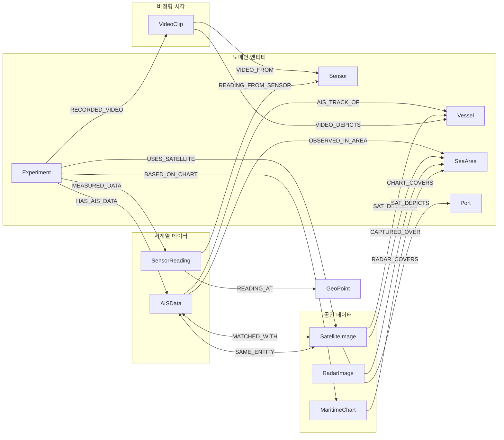
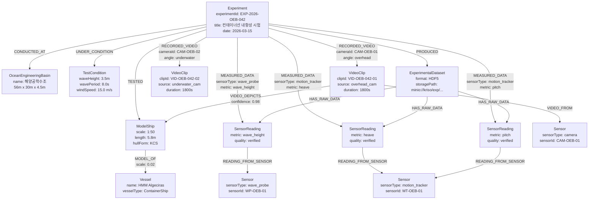
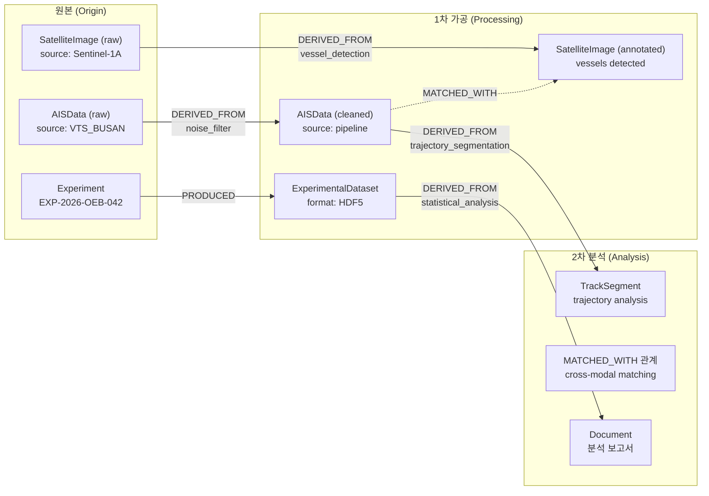

# DES-002: 멀티모달 데이터 통합 설계서

| 항목 | 내용 |
|------|------|
| **과업명** | KRISO 대화형 해사서비스 플랫폼 KG 모델 설계 연구 |
| **문서 ID** | DES-002 |
| **버전** | 1.0 |
| **작성일** | 2026-02-09 |
| **분류** | 설계 문서 (해사 도메인 온톨로지 설계서 - 납품물 #3 해당) |
| **상태** | 1차년도 설계 완료 |

---

## 목차

1. [개요](#1-개요)
2. [멀티모달 데이터 유형 분류](#2-멀티모달-데이터-유형-분류)
3. [데이터 간 관계 모델](#3-데이터-간-관계-모델)
4. [KRISO 시험 데이터 통합 패턴](#4-kriso-시험-데이터-통합-패턴)
5. [메타데이터 스키마](#5-메타데이터-스키마)
6. [임베딩 연계 설계 (2차년도 대비)](#6-임베딩-연계-설계-2차년도-대비)
7. [데이터 리니지 추적](#7-데이터-리니지-추적)
8. [스토리지 전략](#8-스토리지-전략)
9. [PoC 구현 범위](#9-poc-구현-범위)

---

## 1. 개요

### 1.1 설계 목적

본 문서는 KRISO 대화형 해사서비스 플랫폼의 **멀티모달 데이터 통합 설계**를 정의한다.

핵심 설계 원칙은 다음과 같다:

> **멀티모달 데이터 자체를 RAG하거나 AI 분석하는 것이 아니라, 멀티모달 데이터 간의 '관계'를 지식그래프로 구조화하는 것이 목표이다.**

해사 도메인에서는 AIS 궤적, 위성영상, 레이더 이미지, 센서 계측값, 전자해도, 영상 클립 등 이질적인(heterogeneous) 데이터가 동일한 물리적 현상(선박 운항, 해양 환경, 실험 수행 등)을 서로 다른 모달리티(modality)로 기록한다. 이들 데이터 사이의 관계를 명시적으로 그래프화하면, 단일 모달리티만으로는 불가능한 **크로스모달 탐색**(cross-modal exploration)이 가능해진다.

예시:
- "이 위성영상에 탐지된 선박의 AIS 궤적은?" -- SatelliteImage ↔ AISData 관계 탐색
- "예인수조 시험 중 촬영된 영상에서 관찰된 선박 모형은?" -- VideoClip ↔ Experiment ↔ ModelShip 관계 탐색
- "해양공학수조 파랑 시험의 센서 데이터와 동시 촬영 영상은?" -- SensorReading ↔ Experiment ↔ VideoClip 관계 탐색

### 1.2 설계 범위

본 설계서의 범위는 **관계 모델링**에 한정하며, 다음 사항은 범위에서 명시적으로 제외한다:

| 구분 | 범위 내 (In Scope) | 범위 외 (Out of Scope) |
|------|-------------------|----------------------|
| **데이터 모델** | 멀티모달 노드 유형, 관계 유형, 속성 스키마 | 개별 AI 모델의 추론 파이프라인 |
| **관계 정의** | 크로스모달 관계 패턴, 관계 속성 설계 | Vision-Language 모델 학습/파인튜닝 |
| **메타데이터** | 필수/선택 속성, 품질 속성, 공통 메타데이터 | 임베딩 벡터 생성 알고리즘 |
| **스토리지** | 메타데이터 저장 전략, 원본 참조 패턴 | 오브젝트 스토리지 운영 설계 |
| **임베딩 구조** | 임베딩 노드 타입, 연계 관계 구조 설계 | 실제 임베딩 생성 및 벡터 인덱스 운영 (2차년도) |

### 1.3 관련 문서

| 문서 ID | 문서명 | 관계 |
|---------|--------|------|
| PRD | 대화형 해사서비스 플랫폼 제품 요구사항 정의서 | 상위 요구사항 |
| REQ-001 | 해사 KG 동향 조사 | 기술 동향 근거 |
| REQ-004 | IHO S-100 표준 분석 및 온톨로지 매핑 전략 | 표준 매핑 근거 |
| DES-001 | 해사 도메인 온톨로지 설계서 (본체) | 온톨로지 상위 설계 |

### 1.4 용어 정의

| 용어 | 정의 |
|------|------|
| **모달리티 (Modality)** | 데이터의 감각/표현 양식 (영상, 궤적, 시계열, 텍스트 등) |
| **크로스모달 (Cross-modal)** | 서로 다른 모달리티 간의 연결 또는 변환 |
| **메타데이터 그래프 (Metadata Graph)** | 원본 데이터의 속성과 관계만을 노드/엣지로 표현한 그래프 |
| **데이터 리니지 (Data Lineage)** | 데이터의 원본-가공-분석 흐름을 추적하는 체계 |
| **MMKG** | Multimodal Maritime Knowledge Graph. 멀티모달 해사 지식그래프 |
| **PoC** | Proof of Concept. 개념 검증 |

---

## 2. 멀티모달 데이터 유형 분류

### 2.1 6대 멀티모달 데이터 유형

본 플랫폼의 온톨로지는 6개의 멀티모달 데이터 노드 유형을 정의한다. 각 유형은 Neo4j 노드 레이블로 표현되며, 원본 데이터의 메타데이터와 스토리지 참조 경로를 속성으로 보유한다.

| # | 노드 유형 | 한글명 | 모달리티 분류 | 설명 |
|---|-----------|--------|--------------|------|
| 1 | `AISData` | AIS 데이터 배치 | 시계열 (Time-series) | AIS 위치 보고 시계열 데이터 배치. MMSI 기반 선박별 궤적 |
| 2 | `SatelliteImage` | 위성영상 | 공간-영상 (Spatial-Visual) | 광학 또는 SAR 위성 래스터 영상. 해역 커버리지 단위 |
| 3 | `RadarImage` | 레이더 영상 | 공간-영상 (Spatial-Visual) | 해안 또는 선박 탑재 레이더 캡처 영상 |
| 4 | `SensorReading` | 센서 계측값 | 시계열 (Time-series) | IoT, 기상 관측소, 시험 계측 장비의 시계열 측정값 |
| 5 | `MaritimeChart` | 전자해도 | 공간-벡터 (Spatial-Vector) | ENC(Electronic Navigational Chart) 또는 해도 데이터 |
| 6 | `VideoClip` | 영상 클립 | 시각-시간 (Visual-Temporal) | CCTV, 드론, 시험 촬영 카메라의 영상 푸티지 |

### 2.2 모달리티 3분류 체계

6개 데이터 유형을 모달리티 특성에 따라 3개 범주로 분류한다. 이 분류는 크로스모달 관계 설계의 기초가 된다.

#### 2.2.1 시계열 데이터 (Time-series)

시간축을 기준으로 연속적으로 수집되는 수치/위치 데이터이다.

| 데이터 유형 | 시간 해상도 | 주요 차원 | 대표 소스 |
|------------|-----------|----------|----------|
| `AISData` | 1~30초 | 위치(lat/lon), 속도, 침로 | AIS 트랜시버, 해상교통관제 |
| `SensorReading` | 0.01초 ~ 1시간 | 단일 물리량 (힘, 온도, 압력 등) | IoT 센서, 기상관측소, KRISO 계측장비 |

- **특징**: 높은 시간 해상도, 규칙적 샘플링, 대용량 (AIS 일 수백만 레코드)
- **관계 패턴**: 시간 윈도우(temporal window) 기반 매칭

#### 2.2.2 공간 데이터 (Spatial)

지리적 커버리지를 가진 2D 래스터 또는 벡터 데이터이다.

| 데이터 유형 | 공간 해상도 | 주요 차원 | 대표 소스 |
|------------|-----------|----------|----------|
| `SatelliteImage` | 0.5m ~ 100m | 픽셀 밴드 (RGB, SAR) | Sentinel-1/2, PlanetScope, KOMPSAT |
| `RadarImage` | 5m ~ 50m | 반사 강도 (reflectivity) | 해안 레이더, X-band 레이더 |
| `MaritimeChart` | N/A (벡터) | 피처(수심, 항로, 등대 등) | IHO S-101 ENC, 국립해양조사원 |

- **특징**: 공간 범위(bounding box) 보유, 해상도 다양, 비정기적 갱신
- **관계 패턴**: 공간 교차(spatial intersection) 기반 매칭

#### 2.2.3 비정형 시각 데이터 (Unstructured Visual)

연속 프레임으로 구성된 동영상 데이터이다.

| 데이터 유형 | 시간 해상도 | 주요 차원 | 대표 소스 |
|------------|-----------|----------|----------|
| `VideoClip` | 24~60 fps | 프레임(RGB), 오디오 | CCTV, 드론, KRISO 시험 촬영 카메라 |

- **특징**: 대용량 (분당 수십 MB), 비구조화, 프레임 단위 분석 필요
- **관계 패턴**: 시간 구간(time range) + 객체 탐지 기반 매칭

### 2.3 데이터 유형별 예상 볼륨 (KRISO 시험시설 기준)

KRISO 8개 시험시설의 연간 데이터 생산량을 추정한다. 이는 스토리지 설계와 인덱스 전략의 근거가 된다.

| 데이터 유형 | 1건 평균 크기 | 연간 예상 건수 | 연간 예상 용량 | 비고 |
|------------|-------------|-------------|-------------|------|
| `AISData` | 1~10 MB/배치 | 10,000 배치 | 10~100 GB | 실해역 시험 시 AIS 수집 기준 |
| `SatelliteImage` | 100 MB ~ 2 GB | 200~500건 | 100~500 GB | 실해역 시험장 커버리지 |
| `RadarImage` | 10~50 MB | 500~2,000건 | 10~100 GB | 해안 레이더 모니터링 |
| `SensorReading` | 1~100 KB/건 | 1,000,000+ | 10~50 GB | 시험 1건당 수백~수천 센서 채널 |
| `MaritimeChart` | 50~500 MB | 10~50건 | 1~10 GB | ENC 셀 업데이트 주기 |
| `VideoClip` | 100 MB ~ 10 GB | 500~2,000건 | 500 GB ~ 5 TB | 시험 촬영 영상 (다중 카메라) |

**총 예상 연간 데이터량**: 약 1~6 TB (원본 기준, 메타데이터는 Neo4j에 수 GB 이내)

> **설계 핵심**: Neo4j에는 위 원본 데이터가 저장되지 않는다. Neo4j에 저장되는 것은 각 데이터의 **메타데이터 노드** (수십 KB/건)와 **관계 엣지**뿐이다. 원본은 오브젝트 스토리지(MinIO)에 저장하고 `storagePath` 속성으로 참조한다.

---

## 3. 데이터 간 관계 모델

### 3.1 설계 원칙

멀티모달 데이터 간 관계 모델은 다음 원칙에 따라 설계한다:

1. **관계 우선 (Relationship-First)**: 데이터 자체가 아닌 데이터 사이의 관계가 핵심 자산이다
2. **속성 풍부 관계 (Property-Rich Relationships)**: 관계에 confidence, timestamp, method 등 컨텍스트 속성을 부여하여 관계의 품질과 근거를 추적한다
3. **양방향 탐색 (Bidirectional Traversal)**: 어떤 모달리티에서 출발해도 관련 모달리티를 탐색할 수 있어야 한다
4. **시공간 컨텍스트 (Spatiotemporal Context)**: 모든 크로스모달 관계는 시간적/공간적 컨텍스트를 보유한다

### 3.2 크로스모달 관계 패턴

#### 3.2.1 AIS ↔ SatelliteImage (위성-AIS 연계)

AIS 궤적과 위성영상에서 탐지된 선박을 시공간적으로 매칭한다.

| 관계 유형 | 방향 | 설명 | 관계 속성 |
|-----------|------|------|----------|
| `MATCHED_WITH` | AISData ↔ SatelliteImage | 두 모달리티가 동일 시공간 범위를 커버 | `similarity`, `method` |
| `SAME_ENTITY` | AISData ↔ SatelliteImage | 두 모달리티가 동일 선박을 기록 | `confidence` |
| `SAT_DETECTED` | SatelliteImage → Vessel | 위성영상에서 선박 탐지 | `confidence`, `bbox` |
| `AIS_TRACK_OF` | AISData → Vessel | AIS 데이터가 해당 선박의 궤적 | - |

**매칭 알고리즘**:
```
입력: SatelliteImage (촬영 시간 T_sat, 범위 Bbox_sat)
      AISData 배치 (시간 범위 [T_start, T_end])

1. 시간 필터: |T_sat - T_ais| < 5분 인 AIS 레코드 추출
2. 공간 필터: AIS 위치가 Bbox_sat 내에 포함되는 레코드 추출
3. 거리 계산: 위성 탐지 선박 위치와 AIS 위치 간 Haversine 거리
4. 매칭 판정: 거리 < 500m → MATCHED_WITH 관계 생성
5. 식별 보강: MMSI/IMO 매칭 시 → SAME_ENTITY 관계 생성 (confidence: 0.95+)
```

**Cypher 예시** -- AIS와 위성영상의 크로스모달 탐색:
```cypher
// 특정 위성영상에 매칭된 AIS 궤적 조회
MATCH (sat:SatelliteImage {imageId: $imageId})
      -[:MATCHED_WITH {method: 'spatiotemporal'}]->(ais:AISData)
      -[:AIS_TRACK_OF]->(v:Vessel)
RETURN v.name, v.mmsi, ais.startTime, ais.endTime, sat.captureTime
```

#### 3.2.2 Experiment → VideoClip (시험-영상 연계)

KRISO 시험 수행 시 촬영된 영상 클립과 시험을 연결한다.

| 관계 유형 | 방향 | 설명 | 관계 속성 |
|-----------|------|------|----------|
| `RECORDED_VIDEO` | Experiment → VideoClip | 시험 중 촬영된 영상 | `cameraId`, `angle` |
| `VIDEO_DEPICTS` | VideoClip → Vessel | 영상에 나타난 선박(모형) | `confidence`, `frameRange` |
| `VIDEO_FROM` | VideoClip → Sensor | 영상 촬영 카메라 | - |

**관계 속성 상세**:

| 속성명 | 타입 | 설명 | 예시 |
|--------|------|------|------|
| `cameraId` | STRING | 촬영 카메라 식별자 | `"CAM-OEB-01"` |
| `angle` | STRING | 촬영 각도/위치 | `"overhead"`, `"side"`, `"underwater"` |
| `confidence` | FLOAT | 선박 인식 신뢰도 (0.0~1.0) | `0.92` |
| `frameRange` | STRING | 선박이 나타난 프레임 범위 | `"1200-3400"` |

#### 3.2.3 Experiment → SensorReading (시험-센서 연계)

KRISO 시험에서 생산된 센서 계측 데이터와 시험을 연결한다.

| 관계 유형 | 방향 | 설명 | 관계 속성 |
|-----------|------|------|----------|
| `MEASURED_DATA` | Experiment → SensorReading | 시험 중 센서 계측 데이터 | `sensorType`, `metric` |
| `READING_FROM_SENSOR` | SensorReading → Sensor | 계측 데이터의 출처 센서 | - |
| `READING_AT` | SensorReading → GeoPoint | 계측 위치 | - |

**관계 속성 상세**:

| 속성명 | 타입 | 설명 | 예시 |
|--------|------|------|------|
| `sensorType` | STRING | 센서 유형 | `"loadcell"`, `"wave_probe"`, `"pressure_gauge"` |
| `metric` | STRING | 측정 물리량 | `"resistance"`, `"wave_height"`, `"pressure"` |

#### 3.2.4 SatelliteImage → SeaArea (위성-해역 연계)

위성영상이 커버하는 해역과의 공간 관계를 표현한다.

| 관계 유형 | 방향 | 설명 | 관계 속성 |
|-----------|------|------|----------|
| `CAPTURED_OVER` | SatelliteImage → SeaArea | 위성영상이 해역을 촬영 | - |
| `SAT_DEPICTS` | SatelliteImage → Port | 위성영상에 항만이 포함 | - |

#### 3.2.5 VideoClip → Vessel (영상-선박 연계)

영상 클립에서 탐지/식별된 선박과의 관계를 표현한다.

| 관계 유형 | 방향 | 설명 | 관계 속성 |
|-----------|------|------|----------|
| `VIDEO_DEPICTS` | VideoClip → Vessel | 영상에 선박이 나타남 | `confidence`, `frameRange` |
| `VIDEO_FROM` | VideoClip → Sensor | 영상 출처 카메라 | - |

#### 3.2.6 기타 크로스모달 관계

| 관계 유형 | 방향 | 설명 | 관계 속성 |
|-----------|------|------|----------|
| `RADAR_COVERS` | RadarImage → SeaArea | 레이더 영상 커버리지 해역 | - |
| `CHART_COVERS` | MaritimeChart → SeaArea | 해도 커버리지 해역 | - |
| `OBSERVED_IN_AREA` | AISData → SeaArea | AIS 데이터 관측 해역 | - |
| `BASED_ON_CHART` | Experiment → MaritimeChart | 시험의 공간 참조 해도 | - |
| `USES_SATELLITE` | Experiment → SatelliteImage | 시험의 위성영상 활용 | - |
| `HAS_AIS_DATA` | Experiment → AISData | 시험의 AIS 데이터 활용 | - |
| `COMPLIES_WITH` | Experiment → Regulation | 시험의 표준/규정 준수 | `standard`, `version` |

### 3.3 관계 속성(Property) 설계

모든 크로스모달 관계에 공통적으로 적용되는 속성 체계를 정의한다.

#### 3.3.1 공통 관계 속성

| 속성명 | 타입 | 필수 | 설명 |
|--------|------|------|------|
| `confidence` | FLOAT | 선택 | 관계의 신뢰도 (0.0~1.0). 자동 매칭 시 필수 |
| `timestamp` | DATETIME | 선택 | 관계 생성 시점 |
| `method` | STRING | 선택 | 관계 생성 방법 (`"spatiotemporal"`, `"id_match"`, `"embedding_similarity"`, `"manual"`) |
| `source` | STRING | 선택 | 관계 생성 주체 (`"pipeline"`, `"analyst"`, `"experiment_log"`) |

#### 3.3.2 신뢰도(Confidence) 등급 기준

| 등급 | 범위 | 생성 방법 | 설명 |
|------|------|----------|------|
| **확정 (Confirmed)** | 0.95 ~ 1.0 | ID 매칭, 수동 확인 | MMSI/IMO 등 식별자 일치, 전문가 검증 |
| **높음 (High)** | 0.85 ~ 0.94 | 시공간 매칭 + 보조 증거 | 시공간 근접 + 선종/크기 일치 |
| **보통 (Medium)** | 0.70 ~ 0.84 | 시공간 매칭 단독 | 시공간 조건만 충족 |
| **낮음 (Low)** | 0.50 ~ 0.69 | 임베딩 유사도 | 시각적 유사성만으로 추정 |
| **후보 (Candidate)** | < 0.50 | 약한 증거 | 추가 검증 필요 |

#### 3.3.3 관계 생성 방법(Method) 분류

| 방법 코드 | 설명 | 적용 관계 |
|-----------|------|----------|
| `spatiotemporal` | 시간 윈도우 + 공간 거리 기반 자동 매칭 | MATCHED_WITH, SAME_ENTITY |
| `id_match` | MMSI, IMO, experimentId 등 식별자 기반 정확 매칭 | AIS_TRACK_OF, CONDUCTED_AT |
| `embedding_similarity` | 임베딩 벡터 코사인 유사도 기반 매칭 (2차년도) | MATCHED_WITH, SAME_ENTITY |
| `manual` | 전문가 수동 지정 | 모든 관계 유형 |
| `experiment_log` | 시험 로그 파일에서 자동 추출 | RECORDED_VIDEO, MEASURED_DATA |
| `pipeline` | 데이터 파이프라인 자동 생성 | CAPTURED_OVER, RADAR_COVERS |

### 3.4 크로스모달 관계 그래프 개요

멀티모달 데이터 간 관계의 전체 구조를 다음 다이어그램으로 표현한다:



---

## 4. KRISO 시험 데이터 통합 패턴

### 4.1 KRISO 시험시설 개요

KRISO(한국해양과학기술원 부설 선박해양플랜트연구소)는 8개 시험시설을 운영하며, 각 시설은 서로 다른 종류의 멀티모달 데이터를 생산한다.

| # | 시설명 (한글) | 노드 레이블 | 규격 | 주요 용도 |
|---|-------------|------------|------|----------|
| 1 | 예인수조 | `TowingTank` | 200m x 16m x 7m | 선박 저항/추진 시험 |
| 2 | 해양공학수조 | `OceanEngineeringBasin` | 56m x 30m x 4.5m | 해양 구조물 파랑/내항성 시험 |
| 3 | 빙해수조 | `IceTank` | 42m x 32m x 2.5m | 빙해역 선박 성능 시험 |
| 4 | 심해공학수조 | `DeepOceanBasin` | 100m x 50m x 15m | 심해 환경 구조물 시험 |
| 5 | 파력발전 실해역 시험장 | `WaveEnergyTestSite` | 104만 m2 | 파력발전 장치 실해역 성능 시험 |
| 6 | 고압챔버 | `HyperbaricChamber` | 600 bar | 심해 압력 환경 재현 시험 |
| 7 | 캐비테이션터널 | `CavitationTunnel` | 대형/중형/고속 3종 | 프로펠러/선체 캐비테이션 시험 |
| 8 | 선박운항시뮬레이터 | `BridgeSimulator` | Full Mission | 항해 훈련 및 운항 연구 |

> 참고: 캐비테이션터널은 대형(`LargeCavitationTunnel`), 중형(`MediumCavitationTunnel`), 고속(`HighSpeedCavitationTunnel`) 3종으로 세분화된다.

### 4.2 시설별 생산 데이터 유형 매트릭스

8개 시험시설이 생산하는 멀티모달 데이터 유형을 매트릭스로 정리한다. 이 매트릭스는 시설-데이터 간 관계 생성 규칙의 근거가 된다.

| 시설 | AISData | SatelliteImage | RadarImage | SensorReading | MaritimeChart | VideoClip |
|------|:-------:|:--------------:|:----------:|:-------------:|:-------------:|:---------:|
| **예인수조** (TowingTank) | - | - | - | **저항력**, **추진력**, 속도, 트림 | - | **수중/측면 촬영** |
| **해양공학수조** (OceanEngineeringBasin) | - | - | - | **파고**, **풍속**, **유속**, 운동 6자유도 | - | **수상/수중 촬영** |
| **빙해수조** (IceTank) | - | - | - | **빙 저항력**, 빙두께, 속도 | - | **빙 파쇄 촬영** |
| **심해공학수조** (DeepOceanBasin) | - | - | - | **심해 동역학**, 계류 장력, 운동 | - | 수중 촬영 (선택) |
| **파력발전 실해역 시험장** (WaveEnergyTestSite) | 참조 | 참조 | - | **파력 에너지**, 파고, 유속 | 참조 | 현장 촬영 (선택) |
| **고압챔버** (HyperbaricChamber) | - | - | - | **압력**, 온도, 변형률 | - | - |
| **캐비테이션터널** (CavitationTunnel) | - | - | - | **캐비테이션 압력**, 소음, 추력 | - | **고속 촬영** |
| **선박운항시뮬레이터** (BridgeSimulator) | 시뮬레이션 | - | 시뮬레이션 | 시뮬레이션 로그 | 시뮬레이션 | **시뮬레이션 녹화** |

**범례**:
- **굵은 글씨**: 해당 시설의 핵심(primary) 데이터 유형
- 일반 글씨: 보조(secondary) 데이터 유형
- `-`: 미생산
- `참조`: 직접 생산하지 않으나 외부 데이터를 시험에 활용
- `시뮬레이션`: 실측이 아닌 시뮬레이션 환경에서 생성

### 4.3 시설별 센서 계측 상세

각 시설의 `SensorReading` 데이터가 측정하는 물리량(metric)을 상세히 정의한다:

#### 4.3.1 예인수조 (TowingTank)

| 측정 물리량 (metric) | 단위 (unit) | 센서 유형 (sensorType) | 샘플링 레이트 |
|---------------------|------------|----------------------|-------------|
| `resistance` | N (뉴턴) | loadcell | 100 Hz |
| `propulsion_thrust` | N | loadcell | 100 Hz |
| `propulsion_torque` | N*m | torque_meter | 100 Hz |
| `ship_speed` | m/s | carriage_encoder | 100 Hz |
| `trim` | degree | inclinometer | 10 Hz |
| `sinkage` | mm | potentiometer | 10 Hz |

#### 4.3.2 해양공학수조 (OceanEngineeringBasin)

| 측정 물리량 (metric) | 단위 (unit) | 센서 유형 (sensorType) | 샘플링 레이트 |
|---------------------|------------|----------------------|-------------|
| `wave_height` | m | wave_probe | 50 Hz |
| `wind_speed` | m/s | anemometer | 10 Hz |
| `current_speed` | m/s | current_meter | 10 Hz |
| `heave` | m | motion_tracker | 50 Hz |
| `pitch` | degree | motion_tracker | 50 Hz |
| `roll` | degree | motion_tracker | 50 Hz |
| `surge` | m | motion_tracker | 50 Hz |
| `sway` | m | motion_tracker | 50 Hz |
| `yaw` | degree | motion_tracker | 50 Hz |

#### 4.3.3 빙해수조 (IceTank)

| 측정 물리량 (metric) | 단위 (unit) | 센서 유형 (sensorType) | 샘플링 레이트 |
|---------------------|------------|----------------------|-------------|
| `ice_resistance` | N | loadcell | 100 Hz |
| `ice_thickness` | mm | ultrasonic_gauge | 1 Hz |
| `ship_speed` | m/s | carriage_encoder | 100 Hz |
| `ice_temperature` | Celsius | thermocouple | 1 Hz |

#### 4.3.4 캐비테이션터널 (CavitationTunnel)

| 측정 물리량 (metric) | 단위 (unit) | 센서 유형 (sensorType) | 샘플링 레이트 |
|---------------------|------------|----------------------|-------------|
| `cavitation_pressure` | Pa | pressure_transducer | 1,000 Hz |
| `noise_level` | dB | hydrophone | 10,000 Hz |
| `thrust` | N | loadcell | 100 Hz |
| `torque` | N*m | torque_meter | 100 Hz |
| `flow_speed` | m/s | pitot_tube | 10 Hz |
| `rpm` | rev/min | tachometer | 100 Hz |

#### 4.3.5 기타 시설

| 시설 | 핵심 metric | 비고 |
|------|-----------|------|
| 심해공학수조 | `mooring_tension`, `heave`, `surge`, `drift_force` | 6자유도 운동 + 계류 |
| 파력발전 시험장 | `wave_energy`, `power_output`, `wave_height`, `current_speed` | 실해역 환경 데이터 병행 |
| 고압챔버 | `pressure`, `temperature`, `strain` | 정적 시험 위주 |
| 선박운항시뮬레이터 | 시뮬레이션 로그 (선위, 침로, 속력, 타각 등) | 실측이 아닌 시뮬레이션 데이터 |

### 4.4 시험 1건의 전체 그래프 표현

KRISO 시험 1건이 지식그래프에서 어떻게 표현되는지를 해양공학수조 파랑 시험 사례로 설명한다.



### 4.5 시험 데이터 통합 Cypher 쿼리 예시

#### 시험의 모든 센서 데이터와 영상 동시 조회

```cypher
// 시험 EXP-2026-OEB-042의 모든 멀티모달 데이터 조회
MATCH (exp:Experiment {experimentId: 'EXP-2026-OEB-042'})
OPTIONAL MATCH (exp)-[rv:RECORDED_VIDEO]->(vid:VideoClip)
OPTIONAL MATCH (exp)-[md:MEASURED_DATA]->(sr:SensorReading)
                      -[:READING_FROM_SENSOR]->(sensor:Sensor)
RETURN exp.title AS experiment,
       collect(DISTINCT {
           clipId: vid.clipId,
           camera: rv.cameraId,
           angle: rv.angle,
           duration: vid.duration
       }) AS videos,
       collect(DISTINCT {
           metric: md.metric,
           sensorType: md.sensorType,
           sensorId: sensor.sensorId,
           quality: sr.quality
       }) AS sensorData
```

#### 특정 시설에서 수행된 모든 시험과 데이터 유형

```cypher
// 해양공학수조에서 수행된 시험 목록 및 데이터 현황
MATCH (fac:OceanEngineeringBasin)<-[:CONDUCTED_AT]-(exp:Experiment)
OPTIONAL MATCH (exp)-[:RECORDED_VIDEO]->(vid:VideoClip)
OPTIONAL MATCH (exp)-[:MEASURED_DATA]->(sr:SensorReading)
WITH exp,
     count(DISTINCT vid) AS videoCount,
     count(DISTINCT sr) AS sensorCount,
     collect(DISTINCT sr.metric) AS metrics
RETURN exp.experimentId, exp.title, exp.date,
       videoCount, sensorCount, metrics
ORDER BY exp.date DESC
```

### 4.6 온톨로지-스키마 분리 원칙 적용

본 문서에서 정의하는 멀티모달 데이터 타입 및 메타데이터 스키마는 **DES-001(지식그래프 모델 설계서) 섹션 2.5**에 명시된 온톨로지-스키마 분리 원칙을 따른다.

- **온톨로지 계층 (Conceptual)**: `ENTITY_LABELS`의 MultimodalData 그룹 6종은 DB 독립적인 개념 정의로서 `kg/ontology/maritime_ontology.py`에 선언된다. 이 정의는 각 멀티모달 데이터 유형의 도메인 의미, 속성 구조, 관계 제약을 기술하며 특정 그래프 DB에 종속되지 않는다.
- **스키마 계층 (Physical)**: Neo4j 노드 레이블, 속성 제약조건(UNIQUE), 인덱스(공간/벡터/풀텍스트/범위)는 `kg/schema/` 모듈에서 물리적으로 구현된다.
- **매핑 관계**: `kg/ontology/maritime_loader.py`가 온톨로지 정의를 Cypher DDL로 변환하여 두 계층 간 추적성을 보장한다.

아래 표는 6종 멀티모달 데이터 유형에 대한 온톨로지-스키마 매핑을 정리한다:

| # | 온톨로지 ObjectType | Neo4j Node Label | UNIQUE 제약조건 속성 | 주요 인덱스 | 모달리티 |
|---|---------------------|------------------|---------------------|------------|----------|
| 1 | AISData | `:AISData` | `batchId` | Range(startTime), Spatial(bounds) | 시계열 |
| 2 | SatelliteImage | `:SatelliteImage` | `imageId` | Spatial(footprint), Range(capturedAt) | 공간-영상 |
| 3 | RadarImage | `:RadarImage` | `imageId` | Spatial(coverageArea), Range(capturedAt) | 공간-영상 |
| 4 | SensorReading | `:SensorReading` | `readingId` | Range(timestamp), Fulltext(metric) | 시계열 |
| 5 | MaritimeChart | `:MaritimeChart` | `chartId` | Spatial(coverage), Range(editionDate) | 공간-벡터 |
| 6 | VideoClip | `:VideoClip` | `clipId` | Range(startTime, endTime) | 시각-시간 |

> **참고:** 이 분리 구조 덕분에 멀티모달 데이터 유형의 온톨로지 정의(개념 모델)는 Neo4j 인스턴스 없이도 단위 테스트로 검증할 수 있으며, 향후 다른 그래프 DB로 전환 시에도 온톨로지 계층은 변경 없이 유지된다.

---

## 5. 메타데이터 스키마

### 5.1 데이터 유형별 속성 상세

각 멀티모달 데이터 노드의 필수(Required) 및 선택(Optional) 속성을 정의한다. 이 속성 스키마는 `kg/ontology/maritime_ontology.py`의 `PROPERTY_DEFINITIONS`에 구현되어 있다.

#### 5.1.1 AISData (AIS 데이터 배치)

| 속성명 | Neo4j 타입 | 필수 | 설명 | 예시 |
|--------|-----------|------|------|------|
| `batchId` | STRING | **필수** | 배치 고유 식별자 | `"AIS-2026-0315-BUSAN-001"` |
| `mmsi` | INTEGER | **필수** | 선박 MMSI 번호 | `440123456` |
| `startTime` | DATETIME | **필수** | 배치 시작 시간 | `2026-03-15T00:00:00Z` |
| `endTime` | DATETIME | **필수** | 배치 종료 시간 | `2026-03-15T23:59:59Z` |
| `pointCount` | INTEGER | 선택 | 포함된 AIS 포인트 수 | `2840` |
| `bounds` | STRING | 선택 | 공간 범위 (bbox JSON) | `"[128.5,34.8,129.2,35.3]"` |
| `source` | STRING | 선택 | 데이터 소스 | `"VTS_BUSAN"`, `"MarineTraffic"` |
| `storagePath` | STRING | 선택 | 원본 파일 경로 (MinIO) | `"minio://ais/2026/03/15/..."` |

#### 5.1.2 SatelliteImage (위성영상)

| 속성명 | Neo4j 타입 | 필수 | 설명 | 예시 |
|--------|-----------|------|------|------|
| `imageId` | STRING | **필수** | 영상 고유 식별자 | `"S1A-IW-2026-0315-01"` |
| `captureTime` | DATETIME | **필수** | 촬영 시각 | `2026-03-15T02:34:12Z` |
| `satellite` | STRING | **필수** | 위성명 | `"Sentinel-1A"`, `"KOMPSAT-5"` |
| `sensorType` | STRING | **필수** | 센서 유형 | `"SAR"`, `"Optical"`, `"MSI"` |
| `resolution` | FLOAT | **필수** | 공간 해상도 (m) | `10.0` |
| `cloudCover` | FLOAT | 선택 | 운량 (%, 광학 전용) | `15.3` |
| `bounds` | STRING | 선택 | 촬영 범위 (bbox JSON) | `"[128.0,34.5,130.0,36.0]"` |
| `format` | STRING | 선택 | 파일 포맷 | `"GeoTIFF"`, `"SAFE"` |
| `storagePath` | STRING | 선택 | 원본 파일 경로 | `"minio://satellite/2026/..."` |
| `visualEmbedding` | LIST\<FLOAT\> | 선택 | 시각 임베딩 벡터 (2차년도) | `[0.12, -0.34, ...]` |

#### 5.1.3 RadarImage (레이더 영상)

| 속성명 | Neo4j 타입 | 필수 | 설명 | 예시 |
|--------|-----------|------|------|------|
| `imageId` | STRING | **필수** | 영상 고유 식별자 | `"RAD-BUSAN-2026-0315-001"` |
| `captureTime` | DATETIME | **필수** | 촬영 시각 | `2026-03-15T08:15:00Z` |
| `radarType` | STRING | **필수** | 레이더 유형 | `"X-band"`, `"S-band"` |
| `range` | FLOAT | 선택 | 탐지 범위 (km) | `48.0` |
| `resolution` | FLOAT | 선택 | 해상도 (m) | `15.0` |
| `storagePath` | STRING | 선택 | 원본 파일 경로 | `"minio://radar/2026/..."` |

#### 5.1.4 SensorReading (센서 계측값)

| 속성명 | Neo4j 타입 | 필수 | 설명 | 예시 |
|--------|-----------|------|------|------|
| `readingId` | STRING | **필수** | 계측 고유 식별자 | `"SR-OEB-042-WP01-001"` |
| `sensorId` | STRING | **필수** | 센서 식별자 | `"WP-OEB-01"` |
| `metric` | STRING | **필수** | 측정 물리량 | `"wave_height"`, `"resistance"` |
| `value` | FLOAT | **필수** | 측정값 | `3.52` |
| `unit` | STRING | **필수** | 단위 | `"m"`, `"N"`, `"Pa"` |
| `timestamp` | DATETIME | **필수** | 측정 시각 | `2026-03-15T10:23:45.123Z` |
| `quality` | STRING | 선택 | 데이터 품질 등급 | `"verified"`, `"raw"`, `"suspect"` |

> **주의**: KRISO 시험의 SensorReading은 고빈도 시계열이므로, 개별 측정값을 모두 Neo4j 노드로 생성하지 않는다. 대신 **집계 대표값**(평균, 최대, 최소)을 Neo4j 노드로 생성하고, 원본 시계열 데이터는 `storagePath`를 통해 TimescaleDB 또는 HDF5 파일로 참조한다.

#### 5.1.5 MaritimeChart (전자해도)

| 속성명 | Neo4j 타입 | 필수 | 설명 | 예시 |
|--------|-----------|------|------|------|
| `chartId` | STRING | **필수** | 해도 고유 식별자 | `"KR4B1130"` |
| `chartType` | STRING | **필수** | 해도 유형 | `"ENC"`, `"RNC"`, `"paper"` |
| `scale` | INTEGER | **필수** | 축척 | `45000` |
| `edition` | STRING | 선택 | 판본 | `"Ed. 12"` |
| `region` | STRING | 선택 | 커버리지 해역명 | `"부산항 접근수역"` |
| `datum` | STRING | 선택 | 측지 기준 | `"WGS84"` |
| `updatedAt` | DATETIME | 선택 | 최종 갱신일 | `2026-01-15T00:00:00Z` |
| `storagePath` | STRING | 선택 | 원본 파일 경로 | `"minio://charts/KR4B1130/..."` |

#### 5.1.6 VideoClip (영상 클립)

| 속성명 | Neo4j 타입 | 필수 | 설명 | 예시 |
|--------|-----------|------|------|------|
| `clipId` | STRING | **필수** | 영상 고유 식별자 | `"VID-OEB-042-01"` |
| `source` | STRING | **필수** | 촬영 소스/카메라 | `"overhead_cam"`, `"CCTV-B01"` |
| `startTime` | DATETIME | **필수** | 영상 시작 시각 | `2026-03-15T10:00:00Z` |
| `endTime` | DATETIME | **필수** | 영상 종료 시각 | `2026-03-15T10:30:00Z` |
| `duration` | FLOAT | 선택 | 영상 길이 (초) | `1800.0` |
| `resolution` | STRING | 선택 | 영상 해상도 | `"1920x1080"`, `"4K"` |
| `fps` | FLOAT | 선택 | 프레임 레이트 | `30.0`, `1000.0` (고속촬영) |
| `storagePath` | STRING | 선택 | 원본 파일 경로 | `"minio://video/2026/..."` |
| `visualEmbedding` | LIST\<FLOAT\> | 선택 | 시각 임베딩 벡터 (2차년도) | `[0.08, -0.21, ...]` |

### 5.2 공통 메타데이터 속성

모든 멀티모달 데이터 노드에 공통적으로 적용되는 메타데이터 속성이다:

| 속성명 | Neo4j 타입 | 용도 | 설명 |
|--------|-----------|------|------|
| `storagePath` | STRING | 원본 참조 | 오브젝트 스토리지(MinIO) 내 원본 파일 경로. URI 형식: `minio://{bucket}/{path}` |
| `format` | STRING | 파일 형식 | 원본 데이터 포맷 (`"GeoTIFF"`, `"HDF5"`, `"MP4"`, `"CSV"`, `"SAFE"`) |
| `timestamp` / `captureTime` | DATETIME | 시간 기준 | 데이터 생성/촬영 시점. 크로스모달 시간 매칭의 기준 |
| `bounds` | STRING | 공간 범위 | Bounding box JSON 문자열. 크로스모달 공간 매칭의 기준 |
| `source` | STRING | 출처 추적 | 데이터 제공 기관/시스템 식별자 |

### 5.3 데이터 품질 속성

데이터 노드 및 관계의 품질을 평가하는 속성 체계이다:

| 속성명 | 적용 대상 | 타입 | 값 범위 | 설명 |
|--------|----------|------|---------|------|
| `quality` | SensorReading | STRING | `"verified"`, `"raw"`, `"suspect"`, `"rejected"` | 계측 데이터 품질 등급 |
| `confidence` | 관계 (MATCHED_WITH, SAME_ENTITY 등) | FLOAT | 0.0 ~ 1.0 | 관계 매칭 신뢰도 |
| `cloudCover` | SatelliteImage | FLOAT | 0.0 ~ 100.0 | 운량 (광학 위성영상 품질 지표) |
| `resolution` | SatelliteImage, RadarImage | FLOAT | > 0.0 (m) | 공간 해상도 (낮을수록 고품질) |

**품질 등급 체계 (SensorReading)**:

| 등급 | 코드 | 설명 | 처리 기준 |
|------|------|------|----------|
| 검증됨 | `verified` | 전문가 검증 또는 자동 QC 통과 | 분석에 직접 사용 가능 |
| 원시 | `raw` | 수집 직후 상태, 미검증 | 분석 전 QC 절차 필요 |
| 의심 | `suspect` | 자동 QC에서 이상 탐지 | 전문가 검토 후 사용 |
| 기각 | `rejected` | QC 불합격, 명백한 오류 | 분석에서 제외, 리니지 보존 |

---

## 6. 임베딩 연계 설계 (2차년도 대비)

### 6.1 설계 배경

임베딩(Embedding)은 멀티모달 데이터를 동일한 벡터 공간(vector space)에 투영하여 의미적 유사도(semantic similarity) 기반 검색과 매칭을 가능하게 하는 기술이다. 1차년도에는 임베딩 노드 타입과 연계 관계의 **구조만 설계**하고, 실제 임베딩 벡터 생성 및 인덱스 운영은 2차년도에 구현한다.

### 6.2 임베딩 노드 타입 4종

온톨로지에 정의된 4개 임베딩 노드 타입과 그 역할:

| # | 노드 유형 | 설명 | 벡터 차원 (예상) | 생성 모델 (예정) |
|---|-----------|------|-----------------|-----------------|
| 1 | `VisualEmbedding` | 이미지(위성, CCTV 프레임, 레이더)에서 추출한 시각 특징 벡터 | 512 (CLIP) / 1024 (ImageBind) | CLIP ViT-L/14, ImageBind |
| 2 | `TrajectoryEmbedding` | AIS 궤적 시퀀스에서 추출한 궤적 특징 벡터 | 128~256 | Trj2Vec, Trajectory Transformer |
| 3 | `TextEmbedding` | 문서, 보고서, 규정 텍스트에서 추출한 텍스트 특징 벡터 | 768 (multilingual) | multilingual-e5-large, BGE-M3 |
| 4 | `FusedEmbedding` | 두 개 이상의 모달리티 임베딩을 융합한 통합 벡터 | 1024 | ImageBind (late fusion) |

### 6.3 임베딩 연계 관계

#### 6.3.1 HAS_EMBEDDING 관계

데이터 노드에서 해당 데이터의 임베딩 노드로의 연결이다:

```
(SatelliteImage)-[:HAS_EMBEDDING {model: "CLIP-ViT-L/14", version: "2.0"}]->(VisualEmbedding)
(VideoClip)-[:HAS_EMBEDDING {model: "CLIP-ViT-L/14", version: "2.0"}]->(VisualEmbedding)
(AISData)-[:HAS_EMBEDDING {model: "Trj2Vec", version: "1.0"}]->(TrajectoryEmbedding)
(Document)-[:HAS_EMBEDDING {model: "multilingual-e5-large", version: "1.0"}]->(TextEmbedding)
```

**HAS_EMBEDDING 관계 속성**:

| 속성명 | 타입 | 설명 |
|--------|------|------|
| `model` | STRING | 임베딩 생성 모델명 |
| `version` | STRING | 모델 버전 |

#### 6.3.2 FUSED_FROM 관계

`FusedEmbedding` 노드가 어떤 원본 데이터로부터 융합되었는지를 추적한다:

```
(FusedEmbedding)-[:FUSED_FROM]->(AISData)
(FusedEmbedding)-[:FUSED_FROM_IMAGE]->(SatelliteImage)
```

**융합 시나리오 예시**:
```
AISData (궤적) + SatelliteImage (영상) → FusedEmbedding
  - 동일 선박의 궤적 패턴과 시각적 특징을 결합
  - 크로스모달 유사도 검색에 활용
```

### 6.4 벡터 인덱스 설계 (2차년도 구현 예정)

Neo4j 5.x의 내장 벡터 인덱스(HNSW)를 활용하는 방안과 외부 벡터 DB 연계 방안을 비교한다:

| 항목 | Neo4j 내장 벡터 인덱스 | 외부 벡터 DB (Milvus/Qdrant) |
|------|---------------------|---------------------------|
| **장점** | 그래프 쿼리와 벡터 검색 통합, 단일 DB 운영 | 대규모 벡터 전용 최적화, 높은 QPS |
| **단점** | 대규모(100M+) 벡터 시 성능 제한 | 그래프 조인 시 추가 네트워크 홉 |
| **적합 규모** | 수십만 건 이하 | 수백만 건 이상 |
| **권장 시나리오** | 1차~2차년도 PoC/파일럿 | 3차년도 이후 운영 확장 시 |

**1차년도 결정**: Neo4j 내장 벡터 인덱스 채택. KRISO 데이터 규모(연간 수십만 건)에서 충분한 성능 예상.

**예상 벡터 인덱스 생성 Cypher** (2차년도 구현 시):
```cypher
-- 시각 임베딩 벡터 인덱스
CREATE VECTOR INDEX visual_embedding_index FOR (ve:VisualEmbedding) ON ve.vector
OPTIONS {indexConfig: {
    `vector.dimensions`: 512,
    `vector.similarity_function`: 'cosine'
}}

-- 궤적 임베딩 벡터 인덱스
CREATE VECTOR INDEX trajectory_embedding_index FOR (te:TrajectoryEmbedding) ON te.vector
OPTIONS {indexConfig: {
    `vector.dimensions`: 256,
    `vector.similarity_function`: 'cosine'
}}

-- 텍스트 임베딩 벡터 인덱스
CREATE VECTOR INDEX text_embedding_index FOR (txe:TextEmbedding) ON txe.vector
OPTIONS {indexConfig: {
    `vector.dimensions`: 768,
    `vector.similarity_function`: 'cosine'
}}

-- 융합 임베딩 벡터 인덱스
CREATE VECTOR INDEX fused_embedding_index FOR (fe:FusedEmbedding) ON fe.vector
OPTIONS {indexConfig: {
    `vector.dimensions`: 1024,
    `vector.similarity_function`: 'cosine'
}}
```

### 6.5 임베딩 기반 크로스모달 검색 시나리오 (2차년도)

임베딩이 구현되면 가능해지는 크로스모달 검색 시나리오 예시:

| # | 시나리오 | 입력 모달리티 | 출력 모달리티 | 활용 임베딩 |
|---|---------|-------------|-------------|-----------|
| 1 | "이 위성영상과 유사한 선박이 나타난 다른 영상은?" | SatelliteImage | SatelliteImage, VideoClip | VisualEmbedding |
| 2 | "이 AIS 궤적과 유사한 패턴의 다른 선박 궤적은?" | AISData | AISData | TrajectoryEmbedding |
| 3 | "이 사고 보고서와 관련된 위성영상과 AIS 데이터는?" | Document (text) | SatelliteImage, AISData | FusedEmbedding |
| 4 | "이 궤적 + 영상을 종합한 유사 상황은?" | AIS + Satellite | FusedEmbedding 기반 | FusedEmbedding |

**크로스모달 유사도 검색 Cypher 예시** (2차년도):
```cypher
// 입력 위성영상과 시각적으로 유사한 CCTV 영상 검색
MATCH (input:SatelliteImage {imageId: $inputImageId})
      -[:HAS_EMBEDDING]->(inputEmb:VisualEmbedding)
CALL db.index.vector.queryNodes(
    'visual_embedding_index', 10, inputEmb.vector
) YIELD node AS similarEmb, score
MATCH (similarEmb)<-[:HAS_EMBEDDING]-(vid:VideoClip)
WHERE score > 0.85
RETURN vid.clipId, vid.source, vid.startTime, score
ORDER BY score DESC
```

---

## 7. 데이터 리니지(Lineage) 추적

### 7.1 리니지 추적 목적

데이터 리니지는 멀티모달 데이터의 **원본 → 가공 → 분석 결과** 흐름을 그래프 관계로 추적하는 체계이다. KRISO 연구 환경에서 리니지 추적이 필요한 이유는 다음과 같다:

1. **재현성 (Reproducibility)**: 분석 결과가 어떤 원본 데이터와 처리 과정을 거쳤는지 역추적
2. **품질 관리 (Quality Control)**: 원본 데이터 오류 발견 시 파생된 모든 결과물 식별
3. **감사 추적 (Audit Trail)**: 연구 과제 납품물의 데이터 근거 추적
4. **영향 분석 (Impact Analysis)**: 데이터 스키마/파이프라인 변경 시 영향 범위 파악

### 7.2 리니지 관계 유형

#### 7.2.1 DERIVED_FROM 관계

가공/분석 결과가 원본 데이터로부터 파생되었음을 표현한다:

```
(가공데이터)-[:DERIVED_FROM {transformation: "...", timestamp: ...}]->(원본데이터)
```

| 속성명 | 타입 | 설명 | 예시 |
|--------|------|------|------|
| `transformation` | STRING | 적용된 변환/처리 방법 | `"noise_filter"`, `"resampling"`, `"anomaly_detection"` |
| `timestamp` | DATETIME | 파생 시점 | `2026-03-15T14:30:00Z` |
| `pipelineId` | STRING | 처리 파이프라인 식별자 | `"PIPE-AIS-CLEAN-v2"` |
| `parameters` | STRING | 처리 파라미터 (JSON) | `'{"window": 5, "threshold": 0.95}'` |

**리니지 예시 -- AIS 데이터 처리 흐름**:
```
(CleanedAIS:AISData {source: "pipeline"})
  -[:DERIVED_FROM {transformation: "noise_filter", parameters: '{"window": 5}'}]->
(RawAIS:AISData {source: "VTS_BUSAN"})
```

#### 7.2.2 PRODUCED 관계

실험이 데이터셋을 생산했음을 표현한다:

```
(Experiment)-[:PRODUCED]->(ExperimentalDataset)
```

이 관계는 시험 데이터의 최초 생성 시점(origin)을 기록한다.

#### 7.2.3 리니지 그래프 패턴

원본 데이터에서 최종 분석 결과까지의 전형적인 리니지 체인:



### 7.3 시간적 리니지 (Temporal Lineage)

데이터의 시간적 변화 이력을 추적하는 체계이다:

| 패턴 | 설명 | 적용 사례 |
|------|------|----------|
| **버전 체인** | 동일 엔티티의 시간에 따른 상태 변화 | 해도 업데이트, 선박 정보 갱신 |
| **스냅샷 연결** | 특정 시점의 데이터 상태 보존 | 사고 시점의 AIS 스냅샷 |
| **윈도우 집계** | 시계열 데이터의 구간별 집계 결과 | AIS 24시간 배치 → 1시간 배치 |

**버전 체인 Cypher 예시**:
```cypher
// 해도 업데이트 리니지
MATCH chain = (latest:MaritimeChart {chartId: 'KR4B1130'})
              -[:DERIVED_FROM*]->(original:MaritimeChart)
WHERE NOT (original)-[:DERIVED_FROM]->()
RETURN [n IN nodes(chain) | {
    chartId: n.chartId,
    edition: n.edition,
    updatedAt: n.updatedAt
}] AS versionHistory
```

### 7.4 리니지 쿼리 패턴

#### 순방향 리니지 (Forward Lineage): 원본에서 파생물 추적

```cypher
// 원본 AIS 데이터에서 파생된 모든 데이터 추적
MATCH (origin:AISData {batchId: $batchId})
MATCH path = (origin)<-[:DERIVED_FROM*1..5]-(derived)
RETURN origin.batchId AS origin,
       [n IN nodes(path) | labels(n)[0] + ': ' + coalesce(n.batchId, n.readingId, n.clipId, 'N/A')] AS lineageChain,
       length(path) AS depth
```

#### 역방향 리니지 (Backward Lineage): 결과에서 원본 역추적

```cypher
// 분석 보고서의 데이터 근거 역추적
MATCH (report:Document {docId: $reportId})
MATCH path = (report)-[:DERIVED_FROM*1..5]->(source)
WHERE NOT (source)-[:DERIVED_FROM]->()
RETURN source, length(path) AS depth,
       [r IN relationships(path) | r.transformation] AS transformations
```

---

## 8. 스토리지 전략

### 8.1 스토리지 아키텍처 개요

멀티모달 데이터의 스토리지는 **데이터 특성에 따라 분산 저장**하되, **Neo4j가 메타데이터 허브** 역할을 수행하는 구조이다.

```
+------------------------------------------------------------------+
|                    Neo4j (메타데이터 허브)                          |
|  - 노드: 멀티모달 데이터 메타데이터 (속성 + storagePath)              |
|  - 관계: 크로스모달 관계, 리니지 관계                                |
|  - 인덱스: 벡터(HNSW), 공간(Point), 전문검색(Fulltext)              |
+------------------------------------------------------------------+
        |                    |                    |
        v                    v                    v
+----------------+  +------------------+  +------------------+
| MinIO          |  | TimescaleDB      |  | 파일시스템        |
| (오브젝트)      |  | (시계열)          |  | (로컬/NAS)       |
|                |  |                  |  |                  |
| - 위성영상      |  | - AIS 궤적        |  | - HDF5 실험 데이터 |
| - 레이더 영상   |  | - 센서 시계열      |  | - 임시 처리 파일   |
| - 영상 클립     |  | - 기상 관측        |  |                  |
| - 전자해도      |  |                  |  |                  |
| - PDF 문서     |  |                  |  |                  |
+----------------+  +------------------+  +------------------+
```

### 8.2 스토리지 역할 분담

| 스토리지 | 저장 대상 | 데이터 특성 | 접근 패턴 |
|---------|----------|-----------|----------|
| **Neo4j** | 메타데이터 노드, 관계, 벡터 인덱스, 공간 인덱스 | 수 GB (메타데이터) | 그래프 탐색, 벡터 유사도, 공간 쿼리 |
| **MinIO** | 원본 바이너리 파일 (영상, 이미지, 문서, 해도) | 수 TB (원본 파일) | 키-기반 단건 조회, 대용량 읽기/쓰기 |
| **TimescaleDB** | 고빈도 시계열 데이터 (AIS 개별 포인트, 센서 raw 데이터) | 수십 GB ~ 수백 GB | 시간 범위 쿼리, 집계, 다운샘플링 |

### 8.3 Neo4j에 저장되는 것과 저장되지 않는 것

이 구분은 설계의 핵심 원칙이므로 명확히 한다:

#### Neo4j에 저장하는 것 (메타데이터 그래프)

| 항목 | 예시 |
|------|------|
| 데이터 노드의 메타데이터 속성 | `imageId`, `captureTime`, `satellite`, `resolution`, `bounds` |
| 데이터 간 관계 (엣지) | `MATCHED_WITH`, `RECORDED_VIDEO`, `DERIVED_FROM` |
| 관계 속성 | `confidence`, `method`, `timestamp` |
| 원본 참조 경로 | `storagePath: "minio://satellite/2026/..."` |
| 임베딩 벡터 (2차년도) | `vector: [0.12, -0.34, ...]` on VisualEmbedding 노드 |
| 공간 좌표 | `location: point({latitude: 35.1, longitude: 129.0})` |

#### Neo4j에 저장하지 않는 것 (원본 데이터)

| 항목 | 저장 위치 | 이유 |
|------|----------|------|
| 위성영상 래스터 (GeoTIFF, 수백 MB) | MinIO | 대용량 바이너리, 그래프 탐색 불필요 |
| 영상 클립 (MP4, 수 GB) | MinIO | 대용량 바이너리, 스트리밍 전용 접근 |
| AIS 개별 포인트 (초 단위 수백만 건) | TimescaleDB | 시계열 전용 쿼리 최적화 필요 |
| 센서 raw 시계열 (kHz 단위) | TimescaleDB 또는 HDF5 (MinIO) | 고빈도 시계열, 그래프 노드화 비효율 |
| 전자해도 원본 (S-101 셀) | MinIO | 전용 렌더링 엔진 필요 |

### 8.4 storagePath 참조 규칙

모든 멀티모달 데이터 노드의 `storagePath` 속성은 다음 URI 규칙을 따른다:

```
minio://{bucket}/{year}/{month}/{day}/{dataType}/{id}/{filename}
```

| Bucket | 용도 | 예시 경로 |
|--------|------|----------|
| `satellite` | 위성영상 원본 | `minio://satellite/2026/03/15/SAR/S1A-IW-001/image.tiff` |
| `radar` | 레이더 영상 원본 | `minio://radar/2026/03/15/X-band/RAD-001/capture.png` |
| `video` | 영상 클립 원본 | `minio://video/2026/03/15/CCTV/VID-001/clip.mp4` |
| `charts` | 전자해도 원본 | `minio://charts/KR4B1130/ed12/data.000` |
| `ais` | AIS 배치 파일 | `minio://ais/2026/03/15/batch/AIS-001.parquet` |
| `kriso-exp` | KRISO 실험 데이터 | `minio://kriso-exp/2026/OEB/042/dataset.h5` |
| `documents` | 문서 PDF 원본 | `minio://documents/reports/2026/report-001.pdf` |

### 8.5 대용량 시계열 데이터 연계

KRISO 시험 센서 데이터는 kHz 단위 고빈도 시계열로, 개별 측정값을 Neo4j 노드로 생성하면 수억 개의 노드가 필요해진다. 이를 해결하기 위해 2계층 저장 전략을 적용한다:

#### 계층 1: Neo4j (집계 대표값)

```cypher
// 센서 채널별 1건의 SensorReading 노드 (집계값)
CREATE (sr:SensorReading {
    readingId: 'SR-OEB-042-WP01-AGG',
    sensorId: 'WP-OEB-01',
    metric: 'wave_height',
    value: 3.52,           // 평균값
    unit: 'm',
    timestamp: datetime('2026-03-15T10:00:00Z'),
    quality: 'verified',
    // TimescaleDB 참조 정보
    timeseriesTable: 'sensor_readings_2026q1',
    timeseriesQuery: 'SELECT * FROM sensor_readings WHERE sensor_id = ''WP-OEB-01'' AND time BETWEEN ''2026-03-15T10:00:00Z'' AND ''2026-03-15T10:30:00Z'''
})
```

#### 계층 2: TimescaleDB (원본 시계열)

```sql
-- TimescaleDB 하이퍼테이블
CREATE TABLE sensor_readings (
    time        TIMESTAMPTZ NOT NULL,
    sensor_id   TEXT NOT NULL,
    metric      TEXT NOT NULL,
    value       DOUBLE PRECISION,
    unit        TEXT,
    quality     TEXT DEFAULT 'raw'
);

SELECT create_hypertable('sensor_readings', 'time');

-- 파티션: 분기별 자동 파티셔닝
-- 인덱스: (sensor_id, time) 복합 인덱스
CREATE INDEX idx_sensor_time ON sensor_readings (sensor_id, time DESC);
```

---

## 9. PoC 구현 범위

### 9.1 1차년도 PoC 범위 정의

1차년도는 **설계 + 개념 검증(PoC)** 범위로서, 전체 멀티모달 통합 파이프라인의 핵심 패턴을 3개 시설 기준 샘플 데이터로 검증한다.

| 항목 | PoC 범위 (1차년도) | 확장 범위 (2차년도) | 완성 범위 (3차년도) |
|------|-------------------|-------------------|-------------------|
| **시설** | 3개 (예인수조, 해양공학수조, 캐비테이션터널) | 6개 (+ 빙해수조, 심해공학수조, 선박운항시뮬레이터) | 8개 전체 |
| **데이터 유형** | SensorReading, VideoClip | + AISData, SatelliteImage | 6개 전체 |
| **관계 유형** | CONDUCTED_AT, MEASURED_DATA, RECORDED_VIDEO, READING_FROM_SENSOR | + MATCHED_WITH, SAME_ENTITY, HAS_EMBEDDING | 전체 크로스모달 관계 |
| **임베딩** | 구조 설계만 (노드 타입, 관계 정의) | VisualEmbedding, TrajectoryEmbedding 생성 | FusedEmbedding 포함 전체 |
| **리니지** | PRODUCED, DERIVED_FROM 기본 구조 | 자동 리니지 추적 파이프라인 | 전체 리니지 + 감사 추적 |
| **스토리지** | Neo4j + 로컬 파일 참조 | + MinIO, TimescaleDB | 전체 분산 스토리지 |

### 9.2 PoC 샘플 데이터 시나리오

3개 시설에서 각 1건의 시험을 샘플로 생성하여 전체 데이터 흐름을 검증한다:

#### 시나리오 1: 예인수조 저항 시험

| 항목 | 내용 |
|------|------|
| **시험 ID** | EXP-POC-TT-001 |
| **시설** | TowingTank (예인수조) |
| **목적** | KCS 컨테이너선 모형 저항 시험 |
| **생산 데이터** | SensorReading 6채널 (저항, 속도, 트림 등), VideoClip 2건 (측면, 수중) |
| **노드 수** | ~15개 (Experiment 1 + TestCondition 3 + ModelShip 1 + SensorReading 6 + VideoClip 2 + Sensor 2) |
| **관계 수** | ~20개 |

#### 시나리오 2: 해양공학수조 내항성 시험

| 항목 | 내용 |
|------|------|
| **시험 ID** | EXP-POC-OEB-001 |
| **시설** | OceanEngineeringBasin (해양공학수조) |
| **목적** | KVLCC2 탱커 모형 파랑중 운동 시험 |
| **생산 데이터** | SensorReading 9채널 (파고, 6자유도 운동 등), VideoClip 2건 (수상, 수중) |
| **노드 수** | ~20개 |
| **관계 수** | ~25개 |

#### 시나리오 3: 캐비테이션터널 프로펠러 시험

| 항목 | 내용 |
|------|------|
| **시험 ID** | EXP-POC-CT-001 |
| **시설** | CavitationTunnel (캐비테이션터널) |
| **목적** | 벌크선 프로펠러 캐비테이션 관찰 |
| **생산 데이터** | SensorReading 6채널 (압력, 소음, 추력 등), VideoClip 1건 (고속 촬영) |
| **노드 수** | ~13개 |
| **관계 수** | ~18개 |

### 9.3 PoC Cypher 쿼리 예시 (크로스모달 탐색)

PoC에서 검증할 핵심 크로스모달 탐색 쿼리 목록:

#### 쿼리 1: 시설별 시험 현황 대시보드

```cypher
// 모든 시험시설의 시험 현황 및 데이터 볼륨 조회
MATCH (fac:TestFacility)<-[:CONDUCTED_AT]-(exp:Experiment)
OPTIONAL MATCH (exp)-[:RECORDED_VIDEO]->(vid:VideoClip)
OPTIONAL MATCH (exp)-[:MEASURED_DATA]->(sr:SensorReading)
WITH fac.name AS facility,
     count(DISTINCT exp) AS experiments,
     count(DISTINCT vid) AS videos,
     count(DISTINCT sr) AS sensorChannels
RETURN facility, experiments, videos, sensorChannels
ORDER BY experiments DESC
```

#### 쿼리 2: 특정 측정 물리량과 관련된 모든 시험 및 영상

```cypher
// '저항력(resistance)' 측정이 포함된 시험과 해당 시험 영상
MATCH (sr:SensorReading {metric: 'resistance'})
      <-[:MEASURED_DATA]-(exp:Experiment)
      -[:RECORDED_VIDEO]->(vid:VideoClip)
MATCH (exp)-[:TESTED]->(model:ModelShip)
RETURN exp.experimentId, exp.title,
       model.hullForm, model.scale,
       vid.clipId, vid.source, vid.duration,
       sr.value AS avgResistance, sr.unit
```

#### 쿼리 3: 모형선에서 실선까지 역추적

```cypher
// 모형선 시험 데이터에서 실선 정보까지 그래프 탐색
MATCH (sr:SensorReading)<-[:MEASURED_DATA]-(exp:Experiment)
      -[:TESTED]->(model:ModelShip)
      -[:MODEL_OF]->(vessel:Vessel)
MATCH (exp)-[:CONDUCTED_AT]->(fac:TestFacility)
MATCH (exp)-[:UNDER_CONDITION]->(cond:TestCondition)
RETURN vessel.name AS realVessel,
       model.scale AS modelScale,
       fac.name AS facility,
       exp.title AS experiment,
       cond.waveHeight, cond.windSpeed,
       collect({metric: sr.metric, value: sr.value, unit: sr.unit}) AS measurements
```

#### 쿼리 4: 시험 조건별 데이터 비교

```cypher
// 동일 모형선, 다른 파고 조건의 시험 결과 비교
MATCH (model:ModelShip {modelId: $modelId})
      <-[:TESTED]-(exp:Experiment)
      -[:UNDER_CONDITION]->(cond:TestCondition)
MATCH (exp)-[:MEASURED_DATA]->(sr:SensorReading {metric: 'resistance'})
RETURN exp.experimentId,
       cond.waveHeight AS waveHeight_m,
       cond.wavePeriod AS wavePeriod_s,
       sr.value AS resistance_N
ORDER BY cond.waveHeight
```

#### 쿼리 5: 데이터 리니지 역추적

```cypher
// 특정 센서 데이터의 리니지 전체 추적
MATCH (sr:SensorReading {readingId: $readingId})
MATCH path = (sr)<-[:HAS_RAW_DATA]-(ds:ExperimentalDataset)
              <-[:PRODUCED]-(exp:Experiment)
              -[:CONDUCTED_AT]->(fac:TestFacility)
RETURN fac.name AS facility,
       exp.experimentId, exp.title, exp.date,
       ds.format, ds.storagePath,
       sr.metric, sr.value, sr.unit, sr.quality
```

### 9.4 PoC 예상 그래프 규모

| 항목 | PoC 규모 | 향후 운영 규모 (예상) |
|------|---------|-------------------|
| **노드 수** | ~50개 | 수십만 ~ 수백만 |
| **관계 수** | ~65개 | 수백만 ~ 수천만 |
| **데이터 용량 (Neo4j)** | < 1 MB | 수 GB |
| **원본 파일 (MinIO)** | 샘플 파일 수 GB | 수 TB |
| **쿼리 응답 시간 (목표)** | < 100ms | < 500ms |

### 9.5 기대 효과

#### 9.5.1 1차년도 PoC 기대 효과

| 효과 | 설명 |
|------|------|
| **크로스모달 탐색 가능성 검증** | 센서 데이터 → 시험 → 영상 → 모형선 → 실선으로 이어지는 그래프 탐색 경로 실증 |
| **메타데이터 그래프 설계 검증** | 관계 모델이 실제 KRISO 시험 데이터에 적합한지 확인 |
| **자연어 질의 가능성 확인** | "이 시험의 센서 데이터와 영상을 보여줘" 같은 자연어 → Cypher 변환 검증 |
| **스토리지 전략 타당성 확인** | Neo4j 메타데이터 + 외부 원본 참조 패턴의 실용성 검증 |

#### 9.5.2 플랫폼 완성 시 기대 효과

| 효과 | 정량 목표 | 설명 |
|------|----------|------|
| **데이터 탐색 시간 단축** | 기존 대비 80% 단축 | 파일 시스템 탐색 → 그래프 탐색으로 전환 |
| **크로스모달 분석 지원** | 6개 모달리티 통합 | 단일 쿼리로 이종 데이터 관계 탐색 |
| **데이터 재사용성 향상** | 데이터 활용률 3배 향상 | 리니지 추적으로 기존 데이터 재발견 |
| **연구 재현성 보장** | 100% 추적 가능 | 분석 결과에서 원본 데이터까지 역추적 |

---

## 부록 A: 멀티모달 관계 유형 전체 목록

본 설계서에서 정의한 멀티모달 데이터 관련 관계 유형의 전체 목록이다. 관계 유형은 `kg/ontology/maritime_ontology.py`의 `RELATIONSHIP_TYPES`에 구현되어 있다.

| # | 관계 유형 | 시작 노드 | 종료 노드 | 카테고리 | 관계 속성 |
|---|-----------|----------|----------|---------|----------|
| 1 | `AIS_TRACK_OF` | AISData | Vessel | 모달리티-엔티티 | - |
| 2 | `OBSERVED_IN_AREA` | AISData | SeaArea | 모달리티-공간 | - |
| 3 | `CAPTURED_OVER` | SatelliteImage | SeaArea | 모달리티-공간 | - |
| 4 | `SAT_DEPICTS` | SatelliteImage | Port | 모달리티-엔티티 | - |
| 5 | `SAT_DETECTED` | SatelliteImage | Vessel | 모달리티-엔티티 | `confidence`, `bbox` |
| 6 | `RADAR_COVERS` | RadarImage | SeaArea | 모달리티-공간 | - |
| 7 | `READING_FROM_SENSOR` | SensorReading | Sensor | 모달리티-장비 | - |
| 8 | `READING_AT` | SensorReading | GeoPoint | 모달리티-공간 | - |
| 9 | `CHART_COVERS` | MaritimeChart | SeaArea | 모달리티-공간 | - |
| 10 | `VIDEO_FROM` | VideoClip | Sensor | 모달리티-장비 | - |
| 11 | `VIDEO_DEPICTS` | VideoClip | Vessel | 모달리티-엔티티 | `confidence`, `frameRange` |
| 12 | `MATCHED_WITH` | Observation | Observation | 크로스모달 | `similarity`, `method` |
| 13 | `SAME_ENTITY` | Observation | Observation | 크로스모달 | `confidence` |
| 14 | `HAS_EMBEDDING` | Observation | VisualEmbedding | 임베딩 연계 | `model`, `version` |
| 15 | `FUSED_FROM` | FusedEmbedding | AISData | 임베딩 연계 | - |
| 16 | `FUSED_FROM_IMAGE` | FusedEmbedding | SatelliteImage | 임베딩 연계 | - |
| 17 | `RECORDED_VIDEO` | Experiment | VideoClip | KRISO 시험 | `cameraId`, `angle` |
| 18 | `MEASURED_DATA` | Experiment | SensorReading | KRISO 시험 | `sensorType`, `metric` |
| 19 | `BASED_ON_CHART` | Experiment | MaritimeChart | KRISO 시험 | - |
| 20 | `USES_SATELLITE` | Experiment | SatelliteImage | KRISO 시험 | - |
| 21 | `HAS_AIS_DATA` | Experiment | AISData | KRISO 시험 | - |
| 22 | `DERIVED_FROM` | DataSource | DataSource | 리니지 | `transformation` |
| 23 | `PRODUCED` | Experiment | ExperimentalDataset | 리니지 | - |

---

## 부록 B: 온톨로지 구현 매핑

본 설계서의 노드 유형 및 속성은 다음 소스 코드에 구현되어 있다:

| 설계 요소 | 소스 코드 위치 | 구현 형태 |
|----------|-------------|----------|
| 멀티모달 노드 레이블 | `kg/ontology/maritime_ontology.py` > `ENTITY_LABELS` | Python dict (MultimodalData group) |
| 임베딩 노드 레이블 | `kg/ontology/maritime_ontology.py` > `ENTITY_LABELS` | Python dict (MultimodalRepresentation group) |
| 노드 속성 스키마 | `kg/ontology/maritime_ontology.py` > `PROPERTY_DEFINITIONS` | Python dict (AISData, SatelliteImage 등) |
| 관계 유형 정의 | `kg/ontology/maritime_ontology.py` > `RELATIONSHIP_TYPES` | Python list (Multimodal Data, Cross-modal 섹션) |
| KRISO 시설 레이블 | `kg/ontology/maritime_ontology.py` > `ENTITY_LABELS` | Python dict (KRISO group) |
| Ontology 코어 클래스 | `kg/ontology/core.py` > `Ontology`, `ObjectType`, `LinkType` | Python dataclass + class |
| 온톨로지 로더 | `kg/ontology/maritime_loader.py` > `load_maritime_ontology()` | Python function |
| CypherBuilder | `kg/cypher_builder.py` | Python class (쿼리 생성용) |

---

## 부록 C: 변경 이력

| 버전 | 일자 | 변경 내용 | 작성자 |
|------|------|----------|--------|
| 1.0 | 2026-02-09 | 초판 작성 (1차년도 설계) | - |
