# DES-003: ETL 파이프라인 설계서

| 항목 | 내용 |
|------|------|
| **과업명** | KRISO 대화형 해사서비스 플랫폼 ETL 파이프라인 설계 |
| **문서 ID** | DES-003 |
| **버전** | 1.2 |
| **작성일** | 2026-02-09 |
| **분류** | 2차년도 구축 상세 설계서 (납품물 #7) |
| **상위 문서** | PRD v1.0, DES-001 온톨로지 설계서 |

---

## 목차

1. [개요](#1-개요)
2. [데이터 소스 현황](#2-데이터-소스-현황)
3. [ETL 아키텍처](#3-etl-아키텍처)
4. [Extract 단계](#4-extract-단계)
5. [Transform 단계](#5-transform-단계)
6. [Load 단계](#6-load-단계)
7. [데이터 리니지 관리](#7-데이터-리니지-관리)
8. [스케줄링 및 모니터링](#8-스케줄링-및-모니터링)
9. [PoC 구현 계획](#9-poc-구현-계획)
10. [2차년도 확장 계획](#10-2차년도-확장-계획)
11. [1차년도 PoC 선행 구현 성과](#11-1차년도-poc-선행-구현-성과)
12. [n10s/OWL/S-100 확장 전략](#12-n10sowls-100-확장-전략)
13. [GraphRAG 운영화 계획](#13-graphrag-운영화-계획)
14. [Kubernetes 인프라 마이그레이션](#14-kubernetes-인프라-마이그레이션)
15. [보안 및 접근제어 운영화](#15-보안-및-접근제어-운영화)
16. [품질 관리 체계 고도화](#16-품질-관리-체계-고도화)

---

## 1. 개요

### 1.1 문서 목적

본 문서는 KRISO 대화형 해사서비스 플랫폼의 **ETL(Extract-Transform-Load) 파이프라인**에 대한 상세 설계를 기술한다. 해사 도메인의 다양한 데이터 소스로부터 데이터를 수집하고, 온톨로지 기반으로 정규화/변환하여 Neo4j 지식그래프에 적재하는 전 과정을 정의한다.

ETL 파이프라인은 플랫폼의 데이터 기반 서비스(자연어 질의, 워크플로우 자동화, AI 분석)의 품질을 결정하는 핵심 인프라이다. 데이터의 정확성, 일관성, 적시성을 보장하기 위한 설계 원칙과 구현 방안을 상세히 기술한다.

### 1.2 범위 구분

| 구분 | 범위 | 비고 |
|------|------|------|
| **1차년도 PoC** | 4종 크롤러 구현 완료, 샘플 데이터 적재, 기본 Transform 로직 | 현재 구현 상태 |
| **2차년도 본격 구축** | KRISO 시험시설 데이터 연동, 실시간 스트리밍, 대용량 배치 처리, 리니지 관리 | 본 설계서 대상 |
| **3차년도 고도화** | AIS 실시간 파이프라인, 위성영상 자동 처리, ML 기반 관계 추출 | 향후 확장 |

### 1.3 설계 원칙

| 원칙 | 설명 |
|------|------|
| **멱등성(Idempotency)** | 모든 적재 작업은 `MERGE` 패턴을 사용하여 동일 데이터의 중복 적재 시에도 일관된 결과를 보장한다 |
| **추적성(Traceability)** | 모든 데이터의 출처(source), 수집 시각(crawledAt), 파이프라인 실행 이력을 기록한다 |
| **탄력성(Resilience)** | 네트워크 오류, 소스 서버 장애 시 자동 재시도(exponential backoff) 및 부분 실패 허용 |
| **확장성(Scalability)** | 신규 데이터 소스 추가 시 `BaseCrawler` 상속으로 최소 코드 변경 |
| **스케줄링(Scheduling)** | Activepieces 워크플로우 기반 정기 실행 및 트리거 기반 비정기 실행 지원 |

### 1.4 용어 정의

| 용어 | 정의 |
|------|------|
| **ETL** | Extract-Transform-Load. 데이터 수집, 변환, 적재의 3단계 파이프라인 |
| **KG** | Knowledge Graph. Neo4j 기반 지식그래프 |
| **MERGE** | Neo4j Cypher의 MERGE 문. 노드/관계가 존재하면 갱신, 없으면 생성하는 멱등 연산 |
| **BaseCrawler** | 프로젝트의 크롤러 기본 클래스. HTTP 세션 관리, Rate Limiting, 재시도 제공 |
| **RelationExtractor** | 키워드 기반 관계 추출기. 텍스트에서 엔티티 언급과 관계를 추출 |
| **DataPipeline** | 온톨로지 상의 파이프라인 노드 타입. 스케줄, 소스/타겟 타입, 실행 상태 추적 |

---

## 2. 데이터 소스 현황

### 2.1 내부 소스: KRISO 시험시설 (8종)

KRISO는 대전 유성구에 위치한 8종의 핵심 시험시설을 운영하며, 각 시설에서 다양한 형태의 실험 데이터를 생산한다.

| 시설 ID | 시설명 | 영문명 | 주요 데이터 포맷 | 예상 볼륨 (연간) |
|---------|--------|--------|-----------------|-----------------|
| `TF-LTT` | 대형 예인수조 | Large Towing Tank | CSV (시계열), HDF5 (고속계측) | ~500 GB |
| `TF-OEB` | 해양공학수조 | Ocean Engineering Basin | CSV, MP4 (영상), MAT | ~300 GB |
| `TF-ICE` | 빙해수조 | Ice Tank | CSV, HDF5, MP4 | ~200 GB |
| `TF-DOB` | 심해공학수조 | Deep Ocean Basin | CSV, HDF5, TDMS | ~400 GB |
| `TF-WET` | 파력발전 해상실증 시설 | Wave Energy Test Site | CSV, NetCDF | ~100 GB |
| `TF-HPC` | 고압챔버 | Hyperbaric Chamber | CSV, DICOM | ~50 GB |
| `TF-CVT` | 캐비테이션터널 (대/중/고속) | Cavitation Tunnel | CSV, HDF5, MP4 (고속촬영) | ~350 GB |
| `TF-BRS` | 선박운항시뮬레이터 | Bridge Simulator | CSV (항적), MP4 (화면녹화), JSON (시나리오) | ~200 GB |

#### 2.1.1 시설별 데이터 상세

**대형 예인수조 (TF-LTT)**

```
주요 시험: 저항 시험, 자항 시험, 프로펠러 단독시험
데이터 구조:
  ├── resistance_test/
  │   ├── {test_id}_force.csv          # 힘 계측 (저항, 트림, 침하)
  │   ├── {test_id}_speed.csv          # 대차 속도 시계열
  │   └── {test_id}_wave.csv           # 파고 계측 (해당 시)
  ├── propulsion_test/
  │   ├── {test_id}_thrust.csv         # 추력/토크 계측
  │   └── {test_id}_rpm.csv            # 프로펠러 회전수
  └── metadata/
      ├── model_spec.json              # 모형선 제원
      └── condition.json               # 시험 조건
```

- 채널 수: 8~32 채널
- 샘플링 주파수: 100~1000 Hz
- 단일 시험 데이터: 50~500 MB

**해양공학수조 (TF-OEB)**

```
주요 시험: 내항성능 시험, 계류 시험, 부유체 운동 시험
데이터 구조:
  ├── motion/
  │   ├── {test_id}_6dof.csv           # 6자유도 운동 (heave, pitch, roll...)
  │   └── {test_id}_mooring.csv        # 계류력 계측
  ├── wave/
  │   ├── {test_id}_wave_probe.csv     # 파고 계측
  │   └── {test_id}_wave_spec.csv      # 파랑 스펙트럼
  └── video/
      └── {test_id}_cam{N}.mp4         # 다시점 영상 (2~4대)
```

- 채널 수: 16~64 채널
- 영상: 1080p @ 30fps, 시험당 2~4시간
- 단일 시험 데이터: 200 MB~5 GB

**빙해수조 (TF-ICE)**

```
주요 시험: 빙중 저항 시험, 빙중 조종 시험
데이터 구조:
  ├── ice_resistance/
  │   ├── {test_id}_force.csv          # 빙하중 계측
  │   └── {test_id}_ice_property.csv   # 빙 물성 데이터
  ├── video/
  │   ├── {test_id}_top.mp4            # 상부 촬영
  │   └── {test_id}_underwater.mp4     # 수중 촬영
  └── photo/
      └── {test_id}_ice_pattern.jpg    # 빙 파쇄 패턴
```

- 빙 물성: 두께, 강도, 밀도 등 별도 기록
- 단일 시험 데이터: 100 MB~2 GB

### 2.2 외부 소스 (1차년도 크롤러 구현 완료)

1차년도에 4종의 크롤러를 구현하여 외부 데이터 소스와의 연동을 검증하였다.

| 크롤러 | 클래스명 | 소스 | 수집 방식 | 적재 노드 타입 | 상태 |
|--------|---------|------|----------|---------------|------|
| KRISO 논문 | `KRISOPapersCrawler` | ScholarWorks@KRISO (DSpace) | HTML 파싱 (Dublin Core meta) | `Document` | 구현 완료 |
| KRISO 시험시설 | `KRISOFacilitiesCrawler` | KRISO 홈페이지 | HTML 파싱 (CMS 페이지) | `TestFacility` | 구현 완료 |
| 해양기상 | `KMAMarineCrawler` | 기상청 (data.kma.go.kr) | REST API | `WeatherCondition` | 구현 완료 (샘플) |
| 해양사고 | `MaritimeAccidentsCrawler` | KMST 해양안전심판원 | 웹 스크래핑 | `Incident` | 구현 완료 (샘플) |

#### 2.2.1 KRISO ScholarWorks 크롤러 상세

```python
# 크롤러 실행 예시
python -m kg.crawlers.kriso_papers --limit 100 --delay 1.0

# 수집 필드
{
    "docId": "SW-KRISO-{handle_id}",
    "title": str,              # citation_title / DC.title
    "authors": list[str],      # citation_author / DC.creator
    "abstract": str,           # DC.description
    "issueDate": str,          # citation_date / DC.date
    "keywords": list[str],     # citation_keywords / DC.subject
    "doi": str,                # citation_doi
    "journal": str,            # citation_journal_title
    "sourceUrl": str           # 원본 URL
}
```

- 전체 규모: ~11,200건
- 적재 방식: `MERGE (d:Document {docId: rec.docId})` 패턴
- 배치 크기: 100건/트랜잭션
- 관계 생성: `(Document)-[:ISSUED_BY]->(Organization {orgId: 'ORG-KRISO'})`

#### 2.2.2 KMA 해양기상 크롤러 상세

```python
# 크롤러 실행 예시
python -m kg.crawlers.kma_marine --limit 50

# 수집 필드 (10개 한국 해역)
{
    "weatherId": "WX-{area}-{timestamp}",
    "windSpeed": float,        # m/s
    "windDirection": float,    # degrees
    "waveHeight": float,       # m
    "wavePeriod": float,       # s
    "visibility": float,       # km
    "seaState": int,           # Douglas Scale (0-9)
    "temperature": float,      # Celsius
    "riskLevel": str           # LOW / MODERATE / HIGH
}
```

- 대상 해역: 동해 중부/남부, 서해 중부/남부, 남해 동부/서부, 제주, 울릉도, 이어도 (10개)
- 적재 방식: `MERGE (wc:WeatherCondition {weatherId: rec.weatherId})`
- 관계 생성:
  - `(WeatherCondition)-[:AFFECTS]->(SeaArea)` -- 해역 영향
  - `(WeatherCondition)-[:OBSERVED_AT]->(GeoPoint)` -- 관측 위치

#### 2.2.3 해양사고 크롤러 상세

```python
# 크롤러 실행 예시
python -m kg.crawlers.maritime_accidents --limit 20

# 수집 필드
{
    "incidentId": "INC-{date}-{seq}",
    "incidentType": str,       # Collision, Grounding, Fire, Capsizing, ...
    "severity": str,           # MINOR / MODERATE / MAJOR / CRITICAL
    "casualties": int,
    "involvedVessels": list[str],
    "investigatingOrg": str    # 해양안전심판원, 해양경찰청, ...
}
```

- 사고 유형: 충돌(Collision), 좌초(Grounding), 화재(Fire), 전복(Capsizing), 침몰(Sinking), 기관고장(MachineFailure), 추락(PersonOverboard), 유류유출(Pollution)
- 적재 방식: `MERGE (inc:Incident {incidentId: rec.incidentId})`
- 관계 생성:
  - `(Incident)-[:OCCURRED_AT]->(GeoPoint)` -- 발생 위치
  - `(Incident)-[:OCCURRED_IN]->(SeaArea)` -- 발생 해역
  - `(Incident)-[:INVESTIGATED_BY]->(Organization)` -- 조사 기관
  - `(Incident)-[:INVOLVES]->(Vessel)` -- 관련 선박

### 2.3 추가 대상 소스 (2차년도)

| 데이터 소스 | 제공 기관 | 데이터 형태 | 수집 방식 | 예상 볼륨 | 우선순위 |
|------------|----------|-----------|----------|----------|---------|
| **AIS 실시간 데이터** | 해양교통안전공단 | NMEA 메시지 스트림 | Kafka Consumer | ~2 GB/일 | 높음 |
| **위성영상 (SAR/Optical)** | Copernicus (Sentinel-1/2) | GeoTIFF, SAFE | STAC API (pystac) | ~10 GB/장면 | 중간 |
| **전자해도 (S-101 ENC)** | 국립해양조사원 | S-101 (GML 기반) | 파일 다운로드/API | ~5 GB/전국 | 중간 |
| **조석/해류 데이터** | 국립해양조사원 | CSV, JSON | REST API | ~100 MB/일 | 낮음 |
| **해양 환경 관측** | 국립해양조사원 | NetCDF, CSV | API/FTP | ~500 MB/일 | 낮음 |
| **VTS 레이더 데이터** | 해양교통안전공단 | 독자 포맷 | 전용 인터페이스 | ~5 GB/일 | 낮음 |

---

## 3. ETL 아키텍처

### 3.1 전체 파이프라인 아키텍처

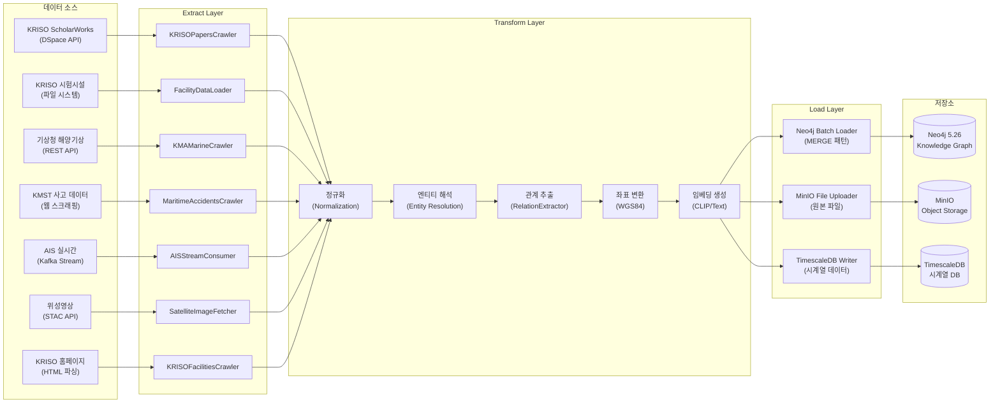

### 3.2 배치 처리 vs 실시간 스트리밍

파이프라인은 데이터 특성에 따라 **배치 처리**와 **실시간 스트리밍** 두 가지 모드로 운영한다.

| 구분 | 배치 처리 (Batch) | 실시간 스트리밍 (Streaming) |
|------|------------------|--------------------------|
| **대상 데이터** | 논문, 시험 데이터, 사고 보고서, 위성영상, 시설 정보 | AIS, 기상 관측, VTS 레이더 |
| **처리 주기** | 시간별/일별/주별 스케줄 | 실시간 (ms~s 단위) |
| **기술 스택** | Activepieces + Python 크롤러 | Apache Kafka + Flink/Python Consumer |
| **적재 방식** | 트랜잭션 배치 (100~500건/배치) | 마이크로배치 (10~50건/초) |
| **오류 처리** | 재시도 후 Dead Letter Queue | 파티션별 오프셋 관리, 재처리 |
| **모니터링** | 실행 이력 로그, 성공/실패 카운트 | Lag 모니터링, 처리량 메트릭 |

### 3.3 Activepieces 워크플로우 통합

배치 처리 파이프라인은 Activepieces 0.78.0 워크플로우 엔진과 통합하여 스케줄링, 모니터링, 오류 알림을 관리한다.

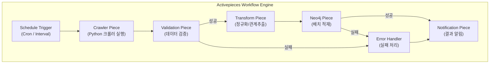

#### Activepieces 해사 전용 Piece 목록

| Piece 명 | 기능 | 입력 | 출력 |
|----------|------|------|------|
| `kriso-papers-crawler` | KRISO 논문 크롤링 | limit, start_id, end_id | Document 레코드 배열 |
| `kriso-facilities-crawler` | KRISO 시설 크롤링 | delay | TestFacility 레코드 배열 |
| `kma-marine-crawler` | 해양기상 수집 | limit, areas | WeatherCondition 레코드 배열 |
| `maritime-accidents-crawler` | 해양사고 수집 | limit | Incident 레코드 배열 |
| `neo4j-batch-loader` | Neo4j 배치 적재 | records, query_template | 적재 건수 |
| `relation-extractor` | 관계 추출 | text, source_id | ExtractedRelation 배열 |
| `data-validator` | 데이터 검증 | records, schema | 유효/무효 레코드 |
| `file-uploader` | MinIO 파일 업로드 | file_path, bucket | 파일 URI |

---

## 4. Extract 단계

### 4.1 크롤러 아키텍처

모든 크롤러는 `BaseCrawler` 추상 클래스를 상속하여 일관된 HTTP 통신, Rate Limiting, 재시도 로직을 공유한다.

```
BaseCrawler (abc.ABC)
├── delay: float = 1.0              # 요청 간 최소 대기 시간
├── max_retries: int = 3            # 최대 재시도 횟수
├── session: requests.Session       # HTTP 세션 (쿠키, 헤더 유지)
│
├── fetch(url) -> Response | None   # HTTP GET + Rate Limiting + 재시도
├── _rate_limit() -> None           # 요청 간격 제어
│
└── save_to_neo4j(records) -> int   # Neo4j 적재 (추상 메서드)
```

#### BaseCrawler 에러 처리 전략

| HTTP 상태 코드 | 처리 방식 | 재시도 |
|---------------|----------|--------|
| 200 OK | 정상 처리, Response 반환 | - |
| 404 Not Found | `None` 반환, 다음 항목으로 진행 | X |
| 429 Too Many Requests | `Retry-After` 헤더 값만큼 대기 후 재시도 | O |
| 500~599 Server Error | Exponential backoff (2^attempt초) 대기 후 재시도 | O |
| Connection Error | Exponential backoff 대기 후 재시도 | O |
| 최대 재시도 초과 | 에러 로그 기록, `None` 반환 | - |

### 4.2 크롤러별 입력/출력 스키마

#### 4.2.1 KRISOPapersCrawler

```
입력 파라미터:
  - start_id: int (기본값: 1)
  - end_id: int (기본값: 11200)
  - limit: int | None (기본값: 50)
  - delay: float (기본값: 1.0)

출력 스키마 (Document 레코드):
  {
    "docId": "SW-KRISO-{id}",        # STRING, PK
    "title": str,                     # STRING, REQUIRED
    "authors": list[str],             # LIST<STRING>
    "abstract": str | None,           # STRING
    "issueDate": str | None,          # DATE (ISO 8601)
    "keywords": list[str],            # LIST<STRING>
    "doi": str | None,                # STRING
    "journal": str | None,            # STRING
    "docType": str | None,            # STRING
    "language": str | None,           # STRING
    "publisher": str | None,          # STRING
    "sourceUrl": str                  # STRING
  }

파싱 소스: HTML <meta> 태그
  - citation_title, DC.title
  - citation_author, DC.creator
  - citation_keywords, DC.subject
  - DC.description, DCTERMS.abstract
  - citation_date, DC.date, DCTERMS.issued
```

#### 4.2.2 KRISOFacilitiesCrawler

```
입력 파라미터:
  - delay: float (기본값: 1.0)
  - 대상 URL: 6개 시설 페이지 (FACILITY_URLS 딕셔너리)

출력 스키마 (TestFacility 레코드):
  {
    "facilityId": "TF-{code}",       # STRING, PK
    "title": str | None,              # STRING
    "description": str | None,        # STRING (최대 20 단락)
    "specs": dict[str, str] | None,   # MAP (테이블 파싱 결과)
    "sourceUrl": str                  # STRING
  }

파싱 소스: HTML 본문
  - h3.sub_title, h2 (제목)
  - .cont_area, .sub_content, #contents (본문)
  - table tr > th + td (사양 테이블)
```

#### 4.2.3 KMAMarineCrawler

```
입력 파라미터:
  - limit: int (기본값: 10)
  - delay: float (기본값: 0.5)

출력 스키마 (WeatherCondition 레코드):
  {
    "weatherId": "WX-{area}-{datetime}",  # STRING, PK
    "areaName": str,                       # STRING (한국어)
    "areaNameEn": str,                     # STRING (영문)
    "lat": float,                          # FLOAT (WGS84)
    "lon": float,                          # FLOAT (WGS84)
    "timestamp": str,                      # DATETIME (ISO 8601)
    "windSpeed": float,                    # FLOAT (m/s)
    "windDirection": float,                # FLOAT (degrees)
    "waveHeight": float,                   # FLOAT (m)
    "wavePeriod": float,                   # FLOAT (s)
    "visibility": float,                   # FLOAT (km)
    "seaState": int,                       # INTEGER (Douglas Scale)
    "temperature": float,                  # FLOAT (Celsius)
    "humidity": float,                     # FLOAT (%)
    "pressure": float,                     # FLOAT (hPa)
    "precipitation": float,               # FLOAT (mm)
    "riskLevel": "LOW"|"MODERATE"|"HIGH",  # STRING
    "forecast": bool,                      # BOOLEAN
    "source": str                          # STRING
  }
```

#### 4.2.4 MaritimeAccidentsCrawler

```
입력 파라미터:
  - limit: int (기본값: 10)
  - delay: float (기본값: 0.5)

출력 스키마 (Incident 레코드):
  {
    "incidentId": "INC-{date}-{seq}",      # STRING, PK
    "incidentType": str,                    # STRING (Collision, Grounding, ...)
    "date": str,                            # DATETIME (ISO 8601)
    "lat": float,                           # FLOAT
    "lon": float,                           # FLOAT
    "areaName": str,                        # STRING
    "severity": str,                        # STRING (MINOR~CRITICAL)
    "description": str,                     # STRING
    "casualties": int,                      # INTEGER
    "pollutionAmount": float,               # FLOAT (tonnes)
    "resolved": bool,                       # BOOLEAN
    "resolvedDate": str | None,             # DATETIME
    "involvedVessels": list[str],           # LIST<STRING>
    "investigatingOrg": str,                # STRING
    "source": str                           # STRING
  }
```

### 4.3 크롤링 스케줄

| 크롤러 | 주기 | 시간대 | Rate Limit | 비고 |
|--------|------|--------|-----------|------|
| KRISO 논문 | 주 1회 | 토요일 02:00 | 1 req/s | KRISO 서버 부하 고려 |
| KRISO 시설 | 월 1회 | 1일 03:00 | 1 req/s | 시설 정보 변경 빈도 낮음 |
| 해양기상 | 매 3시간 | 00/03/06/.../21:00 | 2 req/s | 기상청 API 제한 준수 |
| 해양사고 | 일 1회 | 매일 04:00 | 1 req/s | 전일 발생 사고 수집 |
| AIS 데이터 | 실시간 | 24/7 상시 | N/A (스트림) | 2차년도 구현 |
| 위성영상 | 일 1회 | 매일 06:00 | STAC API 제한 | 2차년도 구현 |

### 4.4 2차년도 신규 크롤러 설계

#### 4.4.1 KRISO 시험 데이터 로더 (FacilityDataLoader)

```python
class FacilityDataLoader(BaseCrawler):
    """KRISO 시험시설 실험 데이터 로더.

    파일 시스템 기반으로 실험 데이터 파일(CSV, HDF5, MAT)을
    읽어 메타데이터를 추출하고 Neo4j에 적재한다.
    원본 파일은 MinIO에 업로드한다.
    """

    def scan_directory(self, base_path: str) -> list[ExperimentRecord]:
        """실험 데이터 디렉토리를 스캔하여 실험 레코드 목록을 반환."""
        ...

    def parse_metadata(self, file_path: str) -> dict[str, Any]:
        """CSV/HDF5 파일 헤더에서 메타데이터를 추출."""
        ...

    def upload_to_minio(self, file_path: str, bucket: str) -> str:
        """원본 파일을 MinIO에 업로드하고 URI를 반환."""
        ...

    def save_to_neo4j(self, records: list[dict]) -> int:
        """Experiment, ExperimentalDataset, Measurement 노드를 생성."""
        ...
```

출력 스키마:
```
Experiment 노드:
  - experimentId: STRING (PK)
  - title: STRING
  - objective: STRING
  - date: DATE
  - duration: FLOAT (hours)
  - status: STRING
  - principalInvestigator: STRING
  - projectCode: STRING

ExperimentalDataset 노드:
  - datasetId: STRING (PK)
  - format: STRING (CSV, HDF5, MAT, ...)
  - fileSize: INTEGER (bytes)
  - channelCount: INTEGER
  - samplingRate: FLOAT (Hz)
  - storagePath: STRING (MinIO URI)

관계:
  (Experiment)-[:CONDUCTED_AT]->(TestFacility)
  (Experiment)-[:TESTED]->(ModelShip)
  (Experiment)-[:PRODUCED]->(ExperimentalDataset)
  (Experiment)-[:UNDER_CONDITION]->(TestCondition)
  (Experiment)-[:RECORDED_VIDEO]->(VideoClip)
  (Experiment)-[:MEASURED_DATA]->(SensorReading)
```

#### 4.4.2 AIS 스트림 컨슈머 (AISStreamConsumer)

```python
class AISStreamConsumer:
    """AIS 실시간 데이터 Kafka Consumer.

    NMEA 메시지를 디코딩하여 Neo4j의 Vessel 위치를 갱신하고
    TrackSegment를 생성한다. TimescaleDB에 원본 시계열 저장.
    """

    def __init__(self, kafka_config: dict, neo4j_config: dict):
        ...

    def decode_nmea(self, raw_message: bytes) -> AISPosition:
        """NMEA 0183/2000 메시지를 디코딩."""
        ...

    def update_vessel_position(self, position: AISPosition) -> None:
        """Neo4j Vessel 노드의 currentLocation, speed, course 갱신."""
        ...

    def append_track_segment(self, mmsi: int, positions: list) -> None:
        """궤적 세그먼트를 생성/확장."""
        ...
```

---

## 5. Transform 단계

### 5.1 정규화(Normalization) 규칙

모든 수집 데이터는 온톨로지에 정의된 속성 타입과 포맷에 맞게 정규화한다.

#### 5.1.1 날짜/시간 정규화

| 입력 포맷 | 출력 포맷 | 예시 |
|----------|----------|------|
| `YYYY`, `YYYY년` | ISO 8601 Date | `2024` -> `2024-01-01` |
| `YYYY-MM`, `YYYY.MM` | ISO 8601 Date | `2024-06` -> `2024-06-01` |
| `YYYY-MM-DD`, `YYYY.MM.DD` | ISO 8601 Date | `2024-06-15` -> `2024-06-15` |
| `YYYY-MM-DD HH:mm:ss` | ISO 8601 DateTime | `2024-06-15 14:30:00` -> `2024-06-15T14:30:00+09:00` |
| 한국어 날짜 (`2024년 6월 15일`) | ISO 8601 Date | -> `2024-06-15` |
| Unix Timestamp | ISO 8601 DateTime | `1718445000` -> `2024-06-15T14:30:00+09:00` |

- 시간대: 명시적 시간대가 없는 경우 한국 표준시(KST, UTC+9) 적용
- Neo4j 저장: `datetime()` 함수 사용 (ISO 8601 문자열 -> Neo4j Temporal)

#### 5.1.2 좌표 정규화

| 입력 형식 | 변환 로직 | 출력 |
|----------|----------|------|
| WGS84 (DD) | 그대로 사용 | `point({latitude: 35.10, longitude: 129.04})` |
| WGS84 (DMS) | DMS -> DD 변환 | 35d06'00"N -> 35.1000 |
| UTM (52N) | pyproj CRS 변환 | `EPSG:32652` -> `EPSG:4326` |
| 한국 좌표계 (KLIS) | pyproj CRS 변환 | `EPSG:5186` -> `EPSG:4326` |

```python
# 좌표 변환 예시
from pyproj import Transformer

transformer = Transformer.from_crs("EPSG:5186", "EPSG:4326", always_xy=True)
lon, lat = transformer.transform(x_klis, y_klis)

# Neo4j Point 생성
cypher = "SET n.location = point({latitude: $lat, longitude: $lon})"
```

- 모든 좌표는 Neo4j 저장 시 WGS84 (`EPSG:4326`) 기준
- Neo4j Point 인덱스: `CREATE POINT INDEX ... ON (n.location)` 사전 생성 필수

#### 5.1.3 텍스트 정규화

| 규칙 | 적용 대상 | 처리 |
|------|----------|------|
| HTML 태그 제거 | 크롤링 본문 | BeautifulSoup `get_text(strip=True)` |
| 유니코드 정규화 | 모든 텍스트 | `unicodedata.normalize('NFC', text)` |
| 공백 정규화 | 모든 텍스트 | 연속 공백을 단일 공백으로 |
| 인코딩 통일 | 모든 텍스트 | UTF-8 |
| 길이 제한 | 제목: 500자, 본문: 50,000자 | 초과 시 잘라내기 + 로그 경고 |

#### 5.1.4 식별자 정규화

| 엔티티 | 식별자 패턴 | 예시 |
|--------|-----------|------|
| Document (논문) | `SW-KRISO-{handle_id}` | `SW-KRISO-1234` |
| WeatherCondition | `WX-{AreaEn}-{YYYYMMDDHHmm}` | `WX-CentralEastSea-202412011200` |
| Incident | `INC-{YYYYMMDD}-{seq:03d}` | `INC-20241201-001` |
| Experiment | `EXP-{YYYY}-{seq:03d}` | `EXP-2024-001` |
| TestFacility | `TF-{code}` | `TF-LTT` |
| ModelShip | `MODEL-{hull}-{scale}` | `MODEL-KVLCC2-058` |
| Vessel (AIS) | MMSI (9자리 정수) | `440123001` |
| Port | UN/LOCODE (5자리) | `KRPUS` |

### 5.2 엔티티 해석(Entity Resolution) 및 중복 제거

#### 5.2.1 동일 엔티티 판별 기준

| 엔티티 타입 | Primary Key | 보조 매칭 기준 | 전략 |
|------------|------------|---------------|------|
| Vessel | `mmsi` | IMO 번호, 선명+선적국 | MERGE on mmsi |
| Port | `unlocode` | 항만명(한/영) | MERGE on unlocode |
| Document | `docId` | DOI, 제목+저자+연도 | MERGE on docId, DOI 보조 검증 |
| Incident | `incidentId` | 발생일+위치+유형 | MERGE on incidentId |
| Organization | `orgId` | 기관명(한/영) | MERGE on orgId |
| TestFacility | `facilityId` | 시설명 | MERGE on facilityId |
| Person (저자) | `name` + `affiliation` | ORCID (있는 경우) | 향후 NER 기반 고도화 |

#### 5.2.2 중복 제거 로직

```python
def deduplicate_records(records: list[dict], key_field: str) -> list[dict]:
    """동일 키 필드를 가진 레코드 중 최신 것만 유지.

    Args:
        records: 입력 레코드 배열
        key_field: 중복 판별 기준 필드명

    Returns:
        중복 제거된 레코드 배열
    """
    seen: dict[str, dict] = {}
    for rec in records:
        key = rec[key_field]
        if key not in seen:
            seen[key] = rec
        else:
            # 더 최신의 레코드로 교체
            existing = seen[key]
            if rec.get("crawledAt", "") > existing.get("crawledAt", ""):
                seen[key] = rec
    return list(seen.values())
```

Neo4j 수준 중복 방지:
- 유니크 제약조건: `CREATE CONSTRAINT ... REQUIRE n.{pk} IS UNIQUE`
- MERGE 패턴: 기존 노드가 있으면 `ON MATCH SET`으로 속성 갱신

### 5.3 관계 추출(Relation Extraction)

#### 5.3.1 현재 구현: 키워드 기반 추출 (RelationExtractor)

`kg/crawlers/relation_extractor.py`에 구현된 키워드 기반 관계 추출기는 6종의 엔티티 언급을 텍스트에서 탐지한다.

| 추출 메서드 | 대상 엔티티 | 관계 타입 | 키워드 수 | 신뢰도 |
|------------|-----------|----------|----------|--------|
| `extract_vessel_types()` | VesselType | `ABOUT_VESSEL_TYPE` | 11개 (한/영) | 0.70 |
| `extract_ports()` | Port | `MENTIONS_PORT` | 11개 (한/영) | 0.80 |
| `extract_sea_areas()` | SeaArea | `MENTIONS_AREA` | 9개 (한/영) | 0.75 |
| `extract_topics()` | Topic | `ABOUT_TOPIC` | 23개 (한/영) | 0.65 |
| `extract_regulations()` | Regulation | `REFERENCES_REGULATION` | 8개 (한/영) | 0.85 |
| `extract_facilities()` | TestFacility | `USES_FACILITY` | 6개 (한/영) | 0.80 |

```python
# 사용 예시
extractor = RelationExtractor()
relations = extractor.extract_all(
    source_id="SW-KRISO-1234",
    text="본 연구에서는 대형 예인수조에서 KVLCC2 컨테이너선의 저항 시험을 수행하였다...",
    keywords=["CFD", "저항", "추진"]
)

# 결과 예시
[
    ExtractedRelation(
        source_id="SW-KRISO-1234",
        target_type="TestFacility",
        target_name="TF-LTT",
        relation_type="USES_FACILITY",
        confidence=0.8,
        context="대형 예인수조에서 KVLCC2 컨테이너선"
    ),
    ExtractedRelation(
        source_id="SW-KRISO-1234",
        target_type="VesselType",
        target_name="ContainerShip",
        relation_type="ABOUT_VESSEL_TYPE",
        confidence=0.7,
        context="KVLCC2 컨테이너선의 저항 시험을"
    ),
    ...
]
```

#### 5.3.2 관계 추출 패턴별 로직

**논문 -> 저자/키워드/시설 관계**

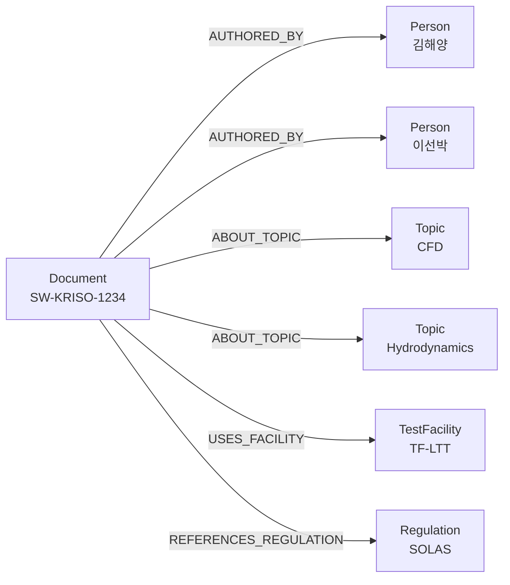

**사고 -> 선박/위치/기상 관계**

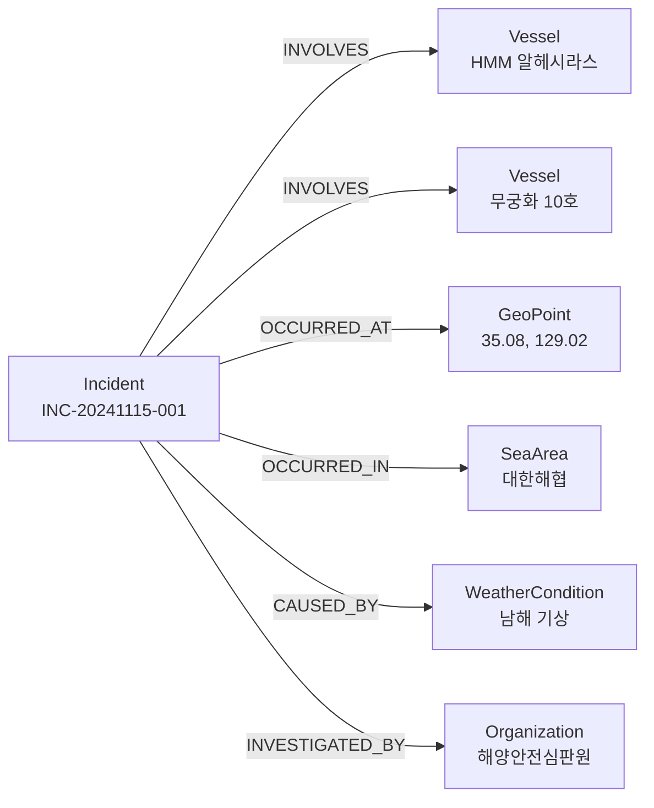

**시험 -> 시설/모델/조건 관계**

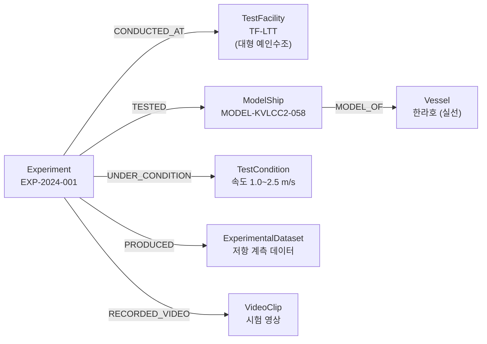

#### 5.3.3 2차년도 고도화: NER/RE 기반 관계 추출

| 단계 | 현재 (1차년도) | 2차년도 목표 |
|------|-------------|------------|
| 엔티티 인식 | 키워드 매칭 | NER 모델 (spaCy + 해사 도메인 학습) |
| 관계 추출 | 공출현(co-occurrence) 기반 | RE 모델 (문맥 기반 관계 분류) |
| 신뢰도 | 고정값 (0.65~0.85) | 모델 confidence score |
| 다국어 | 한국어 + 영어 키워드 | 다국어 NER (한/영/일) |

---

## 6. Load 단계

### 6.1 Neo4j 적재 전략

#### 6.1.1 MERGE vs CREATE 패턴

| 패턴 | 사용 시나리오 | Cypher 예시 |
|------|-------------|-------------|
| **MERGE** (기본) | 기존 노드가 있을 수 있는 경우 (크롤링 데이터) | `MERGE (d:Document {docId: $id}) SET d.title = $title` |
| **CREATE** | 반드시 새 노드를 생성해야 하는 경우 (실행 로그) | `CREATE (we:WorkflowExecution {...})` |
| **MERGE + ON CREATE/ON MATCH** | 생성과 갱신 시 다른 속성을 설정해야 하는 경우 | `MERGE (v:Vessel {mmsi: $mmsi}) ON CREATE SET v.createdAt = datetime() ON MATCH SET v.updatedAt = datetime()` |

모든 배치 적재 작업은 기본적으로 **MERGE** 패턴을 사용하여 멱등성을 보장한다.

#### 6.1.2 배치 크기 최적화

| 엔티티 타입 | 권장 배치 크기 | 트랜잭션 타임아웃 | 근거 |
|------------|--------------|-----------------|------|
| Document (논문) | 100건 | 30초 | 속성 수 많음, 관계 생성 포함 |
| WeatherCondition | 200건 | 30초 | 속성 수 중간, GeoPoint MERGE 포함 |
| Incident (사고) | 50건 | 60초 | 복수 관계 생성 (INVOLVES, OCCURRED_AT, ...) |
| Vessel (AIS 갱신) | 500건 | 15초 | 속성 갱신만 (SET) |
| Experiment | 10건 | 120초 | 다수 관계 생성, 복잡한 구조 |
| AIS Position (벌크) | 1,000건 | 30초 | 단순 속성, 대량 INSERT |

```python
# 배치 적재 패턴 (현재 구현)
def save_to_neo4j(self, records: list[dict]) -> int:
    driver = get_driver()
    try:
        with driver.session(database=NEO4J_DATABASE) as session:
            total = 0
            batch_size = 100
            for i in range(0, len(records), batch_size):
                batch = records[i : i + batch_size]
                result = session.run(query, records=batch)
                cnt = result.single()["cnt"]
                total += cnt
    finally:
        driver.close()
    return total
```

#### 6.1.3 트랜잭션 관리

```python
# 명시적 트랜잭션 관리 (2차년도 권장 패턴)
def save_batch_with_retry(
    session,
    query: str,
    records: list[dict],
    max_retries: int = 3
) -> int:
    """배치 적재 with 자동 재시도.

    TransientError 발생 시 지수 백오프로 재시도.
    DeadlockDetected 발생 시 배치 크기를 절반으로 줄여 재시도.
    """
    for attempt in range(max_retries):
        try:
            result = session.execute_write(
                lambda tx: tx.run(query, records=records).single()["cnt"]
            )
            return result
        except neo4j.exceptions.TransientError:
            time.sleep(2 ** attempt)
        except neo4j.exceptions.DeadlockDetected:
            # 배치 크기 축소
            mid = len(records) // 2
            cnt1 = save_batch_with_retry(session, query, records[:mid])
            cnt2 = save_batch_with_retry(session, query, records[mid:])
            return cnt1 + cnt2
    raise RuntimeError(f"배치 적재 실패 (최대 재시도 {max_retries}회 초과)")
```

### 6.2 Cypher LOAD CSV 활용

대량 데이터의 초기 적재 시 Neo4j의 `LOAD CSV` 기능을 활용하여 성능을 최적화한다.

```cypher
// 예시: KRISO 시험 데이터 CSV 벌크 적재
LOAD CSV WITH HEADERS FROM 'file:///experiments_2024.csv' AS row
MERGE (exp:Experiment {experimentId: row.experimentId})
SET exp.title                 = row.title,
    exp.objective             = row.objective,
    exp.date                  = date(row.date),
    exp.duration              = toFloat(row.duration),
    exp.status                = row.status,
    exp.principalInvestigator = row.principalInvestigator,
    exp.projectCode           = row.projectCode,
    exp.crawledAt             = datetime()
WITH exp, row
MATCH (tf:TestFacility {facilityId: row.facilityId})
MERGE (exp)-[:CONDUCTED_AT]->(tf);
```

**LOAD CSV 사용 가이드라인:**

| 항목 | 권장값 | 비고 |
|------|--------|------|
| 행 수 | 10,000건 이하/파일 | 초과 시 분할 |
| 파일 위치 | `neo4j/import/` 디렉토리 | Docker 볼륨 매핑 필요 |
| 인코딩 | UTF-8 (BOM 없음) | 한국어 데이터 주의 |
| PERIODIC COMMIT | `USING PERIODIC COMMIT 1000` | Neo4j 4.x (5.x에서는 `CALL {}` 서브쿼리) |
| 인덱스 | 적재 전 제약조건/인덱스 생성 필수 | 성능 10~100배 차이 |

### 6.3 Python neo4j Driver 배치 적재

```python
# 2차년도 표준 적재 패턴
from neo4j import GraphDatabase

class Neo4jBatchLoader:
    """Neo4j 배치 적재기.

    Features:
        - 자동 배치 분할
        - Deadlock 자동 재시도
        - 적재 통계 수집
        - 리니지 기록
    """

    def __init__(self, uri: str, auth: tuple, database: str = "neo4j"):
        self.driver = GraphDatabase.driver(uri, auth=auth)
        self.database = database
        self.stats = {"total": 0, "success": 0, "failed": 0}

    def load_batch(
        self,
        query: str,
        records: list[dict],
        batch_size: int = 100,
        pipeline_id: str | None = None,
    ) -> int:
        """레코드를 배치로 분할하여 적재.

        Args:
            query: UNWIND $records AS rec ... 형태의 Cypher 쿼리
            records: 적재할 레코드 배열
            batch_size: 배치 크기
            pipeline_id: 리니지 추적용 파이프라인 ID

        Returns:
            성공적으로 적재된 레코드 수
        """
        total = 0
        with self.driver.session(database=self.database) as session:
            for i in range(0, len(records), batch_size):
                batch = records[i : i + batch_size]
                try:
                    result = session.execute_write(
                        lambda tx: tx.run(query, records=batch).single()["cnt"]
                    )
                    total += result
                    self.stats["success"] += result
                except Exception as e:
                    self.stats["failed"] += len(batch)
                    logger.error("배치 적재 실패 [%d..%d]: %s", i, i+len(batch)-1, e)

        # 리니지 기록
        if pipeline_id:
            self._record_lineage(pipeline_id, total)

        self.stats["total"] += total
        return total

    def close(self) -> None:
        self.driver.close()
```

### 6.4 제약조건/인덱스 선행 생성

적재 성능과 데이터 무결성을 보장하기 위해 다음 제약조건과 인덱스를 사전에 생성한다.

#### 6.4.1 유니크 제약조건 (12종)

```cypher
-- 현재 구현 완료 (kg/schema/constraints.cypher)
CREATE CONSTRAINT vessel_mmsi IF NOT EXISTS
  FOR (v:Vessel) REQUIRE v.mmsi IS UNIQUE;
CREATE CONSTRAINT vessel_imo IF NOT EXISTS
  FOR (v:Vessel) REQUIRE v.imo IS UNIQUE;
CREATE CONSTRAINT port_unlocode IF NOT EXISTS
  FOR (p:Port) REQUIRE p.unlocode IS UNIQUE;
CREATE CONSTRAINT regulation_code IF NOT EXISTS
  FOR (r:Regulation) REQUIRE r.code IS UNIQUE;
CREATE CONSTRAINT organization_id IF NOT EXISTS
  FOR (o:Organization) REQUIRE o.orgId IS UNIQUE;
CREATE CONSTRAINT document_id IF NOT EXISTS
  FOR (d:Document) REQUIRE d.docId IS UNIQUE;
CREATE CONSTRAINT datasource_id IF NOT EXISTS
  FOR (ds:DataSource) REQUIRE ds.sourceId IS UNIQUE;
CREATE CONSTRAINT service_id IF NOT EXISTS
  FOR (s:Service) REQUIRE s.serviceId IS UNIQUE;
CREATE CONSTRAINT experiment_id IF NOT EXISTS
  FOR (e:Experiment) REQUIRE e.experimentId IS UNIQUE;
CREATE CONSTRAINT test_facility_id IF NOT EXISTS
  FOR (f:TestFacility) REQUIRE f.facilityId IS UNIQUE;
CREATE CONSTRAINT incident_id IF NOT EXISTS
  FOR (i:Incident) REQUIRE i.incidentId IS UNIQUE;
CREATE CONSTRAINT sensor_id IF NOT EXISTS
  FOR (s:Sensor) REQUIRE s.sensorId IS UNIQUE;
```

#### 6.4.2 인덱스 (17종)

```cypher
-- 벡터 인덱스 (멀티모달 임베딩)
CREATE VECTOR INDEX visual_embedding IF NOT EXISTS
  FOR (n:Observation) ON (n.visualEmbedding)
  OPTIONS {indexConfig: {`vector.dimensions`: 512, `vector.similarity_function`: 'cosine'}};

CREATE VECTOR INDEX text_embedding IF NOT EXISTS
  FOR (n:Document) ON (n.textEmbedding)
  OPTIONS {indexConfig: {`vector.dimensions`: 768, `vector.similarity_function`: 'cosine'}};

-- 공간 인덱스
CREATE POINT INDEX vessel_location IF NOT EXISTS
  FOR (v:Vessel) ON (v.currentLocation);
CREATE POINT INDEX incident_location IF NOT EXISTS
  FOR (i:Incident) ON (i.location);
CREATE POINT INDEX port_location IF NOT EXISTS
  FOR (p:Port) ON (p.location);

-- 전문 검색 인덱스
CREATE FULLTEXT INDEX document_search IF NOT EXISTS
  FOR (d:Document) ON EACH [d.title, d.content, d.summary];
CREATE FULLTEXT INDEX vessel_search IF NOT EXISTS
  FOR (v:Vessel) ON EACH [v.name, v.callSign];

-- 범위 인덱스 (자주 쿼리되는 속성)
CREATE INDEX vessel_type IF NOT EXISTS FOR (v:Vessel) ON (v.vesselType);
CREATE INDEX incident_type IF NOT EXISTS FOR (i:Incident) ON (i.incidentType);
CREATE INDEX incident_date IF NOT EXISTS FOR (i:Incident) ON (i.date);
CREATE INDEX weather_risk IF NOT EXISTS FOR (w:WeatherCondition) ON (w.riskLevel);
CREATE INDEX experiment_date IF NOT EXISTS FOR (e:Experiment) ON (e.date);
```

---

## 7. 데이터 리니지(Lineage) 관리

### 7.1 리니지 그래프 모델

데이터 리니지는 "데이터가 어디서 왔고, 어떤 변환을 거쳐, 어디에 저장되었는가"를 추적하는 메타데이터 그래프이다. 온톨로지에 정의된 `DataPipeline`, `DataSource`, `WorkflowExecution` 노드 타입을 활용한다.

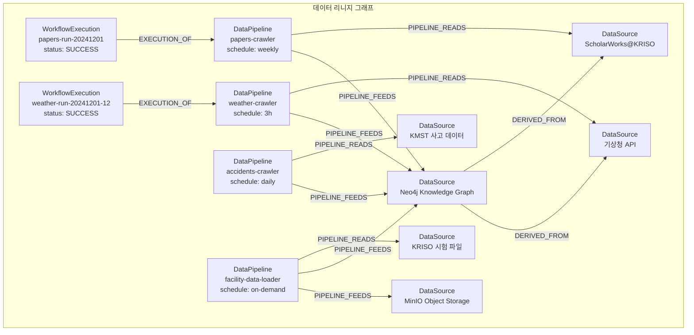

### 7.2 리니지 노드 속성 정의

#### DataPipeline 노드

```cypher
MERGE (dp:DataPipeline {pipelineId: 'PL-PAPERS-CRAWLER'})
SET dp.name             = 'KRISO 논문 크롤러 파이프라인',
    dp.schedule         = '0 2 * * 6',           -- Cron: 매주 토 02:00
    dp.sourceType       = 'DSpace HTML',
    dp.targetType       = 'Neo4j Document',
    dp.lastRunAt        = datetime(),
    dp.status           = 'ACTIVE',
    dp.recordsProcessed = 11200,
    dp.description      = 'ScholarWorks@KRISO 논문 메타데이터 크롤링 및 Neo4j 적재',
    dp.version          = '1.0'
```

#### WorkflowExecution 노드

```cypher
CREATE (we:WorkflowExecution {
    executionId:      'EXEC-PL-PAPERS-20241201-020000',
    startTime:        datetime('2024-12-01T02:00:00+09:00'),
    endTime:          datetime('2024-12-01T02:45:30+09:00'),
    status:           'SUCCESS',       -- SUCCESS | FAILED | PARTIAL | RUNNING
    recordsRead:      500,
    recordsWritten:   487,
    recordsSkipped:   13,
    errorCount:       0,
    errorMessages:    [],
    triggerType:      'SCHEDULED',     -- SCHEDULED | MANUAL | EVENT
    executionTimeMs:  2730000,
    memoryUsedMb:     256
})
WITH we
MATCH (dp:DataPipeline {pipelineId: 'PL-PAPERS-CRAWLER'})
MERGE (we)-[:EXECUTION_OF]->(dp)
SET dp.lastRunAt = we.startTime,
    dp.recordsProcessed = dp.recordsProcessed + we.recordsWritten
```

### 7.3 실행 이력 추적

모든 파이프라인 실행은 다음 정보를 기록한다:

| 필드 | 타입 | 설명 |
|------|------|------|
| `executionId` | STRING | 실행 고유 ID (PK) |
| `startTime` | DATETIME | 실행 시작 시각 |
| `endTime` | DATETIME | 실행 종료 시각 |
| `status` | STRING | 실행 상태 (SUCCESS, FAILED, PARTIAL, RUNNING) |
| `recordsRead` | INTEGER | 소스에서 읽은 레코드 수 |
| `recordsWritten` | INTEGER | 타겟에 기록한 레코드 수 |
| `recordsSkipped` | INTEGER | 건너뛴 레코드 수 (중복, 무효 등) |
| `errorCount` | INTEGER | 발생한 에러 수 |
| `errorMessages` | LIST\<STRING\> | 에러 메시지 목록 |
| `triggerType` | STRING | 트리거 유형 (SCHEDULED, MANUAL, EVENT) |
| `executionTimeMs` | INTEGER | 총 실행 시간 (밀리초) |

#### 리니지 조회 쿼리 예시

```cypher
// 특정 Document 노드의 전체 리니지 추적
MATCH path = (d:Document {docId: 'SW-KRISO-1234'})
  <-[:PIPELINE_FEEDS]-(dp:DataPipeline)
  -[:PIPELINE_READS]->(ds:DataSource)
OPTIONAL MATCH (we:WorkflowExecution)-[:EXECUTION_OF]->(dp)
RETURN d, dp, ds, we
ORDER BY we.startTime DESC
LIMIT 10;

// 특정 DataPipeline의 최근 실행 이력
MATCH (dp:DataPipeline {pipelineId: 'PL-PAPERS-CRAWLER'})
  <-[:EXECUTION_OF]-(we:WorkflowExecution)
RETURN we.executionId, we.startTime, we.status,
       we.recordsRead, we.recordsWritten, we.errorCount
ORDER BY we.startTime DESC
LIMIT 20;

// 실패한 파이프라인 실행 조회
MATCH (we:WorkflowExecution {status: 'FAILED'})
  -[:EXECUTION_OF]->(dp:DataPipeline)
RETURN dp.name, we.executionId, we.startTime,
       we.errorCount, we.errorMessages
ORDER BY we.startTime DESC;
```

### 7.4 감사 로그 설계

데이터 변경 이력을 감사(Audit) 목적으로 기록한다. Neo4j에 직접 저장하지 않고, 별도의 로그 파일 및 Elasticsearch에 저장하여 검색 성능을 확보한다.

```json
// 감사 로그 포맷 (JSON Lines)
{
    "timestamp": "2024-12-01T02:30:15.123+09:00",
    "eventType": "DATA_LOADED",
    "pipelineId": "PL-PAPERS-CRAWLER",
    "executionId": "EXEC-PL-PAPERS-20241201-020000",
    "entityType": "Document",
    "entityId": "SW-KRISO-1234",
    "operation": "MERGE",
    "changedFields": ["title", "abstract", "keywords"],
    "userId": "system:crawler",
    "sourceIp": "10.0.1.50",
    "details": {
        "previousTitle": null,
        "newTitle": "KVLCC2 저항 성능 시험 결과 분석"
    }
}
```

감사 로그 보존 정책:

| 로그 유형 | 보존 기간 | 저장소 |
|----------|----------|--------|
| 데이터 변경 로그 | 3년 | Elasticsearch + S3 아카이브 |
| 파이프라인 실행 로그 | 1년 | 로컬 파일 + Elasticsearch |
| 접근 로그 | 1년 | Keycloak Audit Log |
| 에러 로그 | 6개월 | Elasticsearch |

---

## 8. 스케줄링 및 모니터링

### 8.1 Activepieces 기반 스케줄링

배치 파이프라인의 스케줄링은 Activepieces 워크플로우 엔진을 통해 관리한다.

#### 8.1.1 워크플로우 정의

| 워크플로우 ID | 이름 | 스케줄 (Cron) | 설명 |
|-------------|------|-------------|------|
| `WF-ETL-PAPERS` | 논문 크롤링 | `0 2 * * 6` | 매주 토 02:00 |
| `WF-ETL-FACILITIES` | 시설 크롤링 | `0 3 1 * *` | 매월 1일 03:00 |
| `WF-ETL-WEATHER` | 기상 수집 | `0 */3 * * *` | 매 3시간 |
| `WF-ETL-ACCIDENTS` | 사고 수집 | `0 4 * * *` | 매일 04:00 |
| `WF-ETL-FACILITY-DATA` | 시험 데이터 | 수동 트리거 | 실험 완료 시 |
| `WF-ETL-RELATION` | 관계 추출 | `0 5 * * 1` | 매주 월 05:00 (배치) |

#### 8.1.2 워크플로우 실행 흐름

```
[Schedule Trigger]
    |
    v
[Pre-check: Neo4j 연결 확인]
    |
    v
[Extract: 크롤러 실행]
    |
    v
[Validate: 레코드 스키마 검증]
    |-- 유효 --> [Transform: 정규화 + 관계 추출]
    |               |
    |               v
    |           [Load: Neo4j 배치 적재]
    |               |
    |               v
    |           [Post-check: 적재 결과 검증]
    |               |
    |               v
    |           [Record Lineage: 실행 이력 기록]
    |               |
    |               v
    |           [Notify: 성공 알림]
    |
    |-- 무효 --> [Log: 무효 레코드 기록]
                    |
                    v
                [Alert: 데이터 품질 경고]
```

### 8.2 파이프라인 실행 모니터링

#### 8.2.1 Grafana 대시보드 구성

| 패널 | 메트릭 | 데이터 소스 |
|------|--------|-----------|
| **파이프라인 실행 현황** | 실행 횟수, 성공/실패율 | Neo4j (WorkflowExecution 쿼리) |
| **데이터 적재 추이** | 일별/주별 노드 증가 수 | Neo4j (노드 카운트 시계열) |
| **크롤러 성능** | 요청 수, 응답 시간, 에러율 | Prometheus (Python 메트릭) |
| **Neo4j 상태** | 노드/관계 수, 트랜잭션 처리량, 메모리 | Neo4j Prometheus Exporter |
| **데이터 품질** | 누락 필드율, 중복율, 무효 레코드율 | Custom Prometheus 메트릭 |
| **MinIO 저장소** | 버킷별 용량, 업로드 수 | MinIO Prometheus Exporter |

#### 8.2.2 Prometheus 메트릭 정의

```python
# 크롤러 메트릭 (prometheus_client)
from prometheus_client import Counter, Histogram, Gauge

# 크롤링 메트릭
crawler_requests_total = Counter(
    'crawler_requests_total',
    'Total number of HTTP requests',
    ['crawler', 'status']
)
crawler_records_collected = Counter(
    'crawler_records_collected',
    'Total records collected',
    ['crawler']
)
crawler_duration_seconds = Histogram(
    'crawler_duration_seconds',
    'Crawler execution duration',
    ['crawler']
)

# 적재 메트릭
neo4j_records_loaded = Counter(
    'neo4j_records_loaded',
    'Records loaded to Neo4j',
    ['entity_type', 'pipeline']
)
neo4j_load_errors = Counter(
    'neo4j_load_errors',
    'Neo4j load errors',
    ['entity_type', 'error_type']
)
neo4j_batch_duration = Histogram(
    'neo4j_batch_duration_seconds',
    'Batch load duration',
    ['entity_type']
)

# 데이터 품질 메트릭
data_quality_missing_fields = Counter(
    'data_quality_missing_fields',
    'Missing required fields',
    ['entity_type', 'field']
)
data_quality_duplicates = Counter(
    'data_quality_duplicates',
    'Duplicate records detected',
    ['entity_type']
)
```

### 8.3 실패 알림 및 복구 절차

#### 8.3.1 알림 체계

| 심각도 | 조건 | 알림 채널 | 대응 |
|--------|------|----------|------|
| **CRITICAL** | 전체 파이프라인 실패 (Neo4j 연결 불가) | Slack + 이메일 + SMS | 즉시 대응 (15분 이내) |
| **HIGH** | 크롤러 연속 3회 실패 | Slack + 이메일 | 업무 시간 내 대응 |
| **MEDIUM** | 적재 성공률 90% 미만 | Slack | 차기 실행 전 확인 |
| **LOW** | 데이터 품질 경고 (누락 필드 > 5%) | Slack | 주간 리뷰 |

#### 8.3.2 자동 복구 절차

```
[파이프라인 실패 감지]
    |
    v
[실패 원인 분류]
    |
    |-- [네트워크 오류] --> 5분 후 자동 재시도 (최대 3회)
    |
    |-- [소스 서버 다운] --> 30분 후 자동 재시도, 1시간 후 알림
    |
    |-- [Neo4j 오류] --> Neo4j 상태 확인 -> 정상이면 재시도
    |                                     -> 비정상이면 CRITICAL 알림
    |
    |-- [데이터 오류] --> Dead Letter Queue에 저장
    |                     수동 검토 후 재처리 또는 폐기
    |
    |-- [스키마 변경] --> 알림 + 수동 대응 필요
```

#### 8.3.3 Dead Letter Queue (DLQ)

파이프라인에서 처리할 수 없는 레코드는 DLQ에 저장하여 수동 검토 후 재처리한다.

```python
# DLQ 저장 형식
{
    "dlq_id": "DLQ-20241201-001",
    "pipeline_id": "PL-PAPERS-CRAWLER",
    "execution_id": "EXEC-PL-PAPERS-20241201-020000",
    "timestamp": "2024-12-01T02:30:15+09:00",
    "error_type": "VALIDATION_ERROR",
    "error_message": "Missing required field: title",
    "record": { ... },  # 원본 레코드
    "retry_count": 0,
    "status": "PENDING"  # PENDING | RETRIED | DISCARDED
}
```

DLQ 저장소: MinIO `dlq/` 버킷 (JSON Lines 파일)

---

## 9. PoC 구현 계획

### 9.1 1차년도 PoC 범위

1차년도에는 ETL 파이프라인의 기본 구조를 검증하고 4개 크롤러를 구현하였다.

| 구현 항목 | 상태 | 파일 |
|----------|------|------|
| BaseCrawler (HTTP, Rate Limit, Retry) | 완료 | `kg/crawlers/base.py` |
| KRISOPapersCrawler | 완료 | `kg/crawlers/kriso_papers.py` |
| KRISOFacilitiesCrawler | 완료 | `kg/crawlers/kriso_facilities.py` |
| KMAMarineCrawler | 완료 | `kg/crawlers/kma_marine.py` |
| MaritimeAccidentsCrawler | 완료 | `kg/crawlers/maritime_accidents.py` |
| RelationExtractor (6종 키워드) | 완료 | `kg/crawlers/relation_extractor.py` |
| run_crawlers (통합 실행) | 완료 | `kg/crawlers/run_crawlers.py` |
| 스키마 초기화 (제약조건 12개, 인덱스 17개) | 완료 | `kg/schema/init_schema.py` |
| 샘플 데이터 로더 | 완료 | `kg/schema/load_sample_data.py` |
| 온톨로지 정의 (103 엔티티, 45 관계) | 완료 | `kg/ontology/maritime_ontology.py` |

### 9.2 샘플 데이터 적재 시나리오 (3종)

#### 시나리오 1: KRISO 논문 크롤링 + 관계 추출

```bash
# 1단계: 논문 크롤링 (50건)
PYTHONPATH=. python -m kg.crawlers.kriso_papers --limit 50 --delay 1.0

# 2단계: 관계 추출 (크롤링된 논문에 대해)
PYTHONPATH=. python -c "
from kg.crawlers.relation_extractor import RelationExtractor
from kg.config import get_driver, NEO4J_DATABASE

extractor = RelationExtractor()
driver = get_driver()

with driver.session(database=NEO4J_DATABASE) as session:
    # Document 노드에서 텍스트 추출
    result = session.run('''
        MATCH (d:Document)
        WHERE d.source = 'scholarworks_crawl'
        RETURN d.docId AS docId, d.title AS title,
               d.content AS content, d.keywords AS keywords
        LIMIT 50
    ''')
    for record in result:
        relations = extractor.extract_all(
            source_id=record['docId'],
            text=(record['title'] or '') + ' ' + (record['content'] or ''),
            keywords=record['keywords']
        )
        print(f'{record[\"docId\"]}: {len(relations)} relations extracted')
"
```

**검증 쿼리:**
```cypher
// 적재된 논문 수 확인
MATCH (d:Document {source: 'scholarworks_crawl'})
RETURN count(d) AS paper_count;

// KRISO 발행 논문 관계 확인
MATCH (d:Document)-[:ISSUED_BY]->(org:Organization {orgId: 'ORG-KRISO'})
RETURN count(d) AS kriso_papers;

// 논문별 키워드 분포
MATCH (d:Document)
WHERE d.keywords IS NOT NULL
UNWIND d.keywords AS kw
RETURN kw, count(*) AS cnt
ORDER BY cnt DESC LIMIT 20;
```

#### 시나리오 2: 해양기상 수집 + SeaArea 연결

```bash
# 기상 데이터 수집 (10개 해역)
PYTHONPATH=. python -m kg.crawlers.kma_marine --limit 30
```

**검증 쿼리:**
```cypher
// 해역별 최신 기상 현황
MATCH (wc:WeatherCondition)-[:AFFECTS]->(sa:SeaArea)
RETURN sa.name AS area,
       wc.windSpeed AS wind,
       wc.waveHeight AS wave,
       wc.riskLevel AS risk,
       wc.timestamp AS time
ORDER BY wc.timestamp DESC;

// 위험도 HIGH인 해역 조회
MATCH (wc:WeatherCondition {riskLevel: 'HIGH'})-[:AFFECTS]->(sa:SeaArea)
RETURN sa.name, wc.windSpeed, wc.waveHeight, wc.timestamp;

// 관측 위치 공간 쿼리 (부산항 반경 100km)
MATCH (wc:WeatherCondition)-[:OBSERVED_AT]->(gp:GeoPoint)
WHERE point.distance(
    point({latitude: gp.lat, longitude: gp.lon}),
    point({latitude: 35.10, longitude: 129.04})
) < 100000
RETURN gp.name, wc.riskLevel, wc.windSpeed, wc.waveHeight;
```

#### 시나리오 3: 해양사고 적재 + 다중 관계 검증

```bash
# 사고 데이터 수집 (20건)
PYTHONPATH=. python -m kg.crawlers.maritime_accidents --limit 20
```

**검증 쿼리:**
```cypher
// 사고 유형별 통계
MATCH (inc:Incident)
RETURN inc.incidentType AS type,
       count(*) AS cnt,
       avg(inc.casualties) AS avg_casualties
ORDER BY cnt DESC;

// 특정 사고의 전체 관계 그래프
MATCH path = (inc:Incident {incidentId: 'INC-20241115-001'})-[*1..2]-()
RETURN path;

// 선박별 사고 이력
MATCH (v:Vessel)<-[:INVOLVES]-(inc:Incident)
RETURN v.name, count(inc) AS incident_count,
       collect(inc.incidentType) AS types
ORDER BY incident_count DESC;

// 해역별 사고 분포
MATCH (inc:Incident)-[:OCCURRED_IN]->(sa:SeaArea)
RETURN sa.name, count(inc) AS cnt,
       collect(DISTINCT inc.incidentType) AS types
ORDER BY cnt DESC;
```

### 9.3 통합 테스트 절차

```bash
# 1. 스키마 초기화
python -m kg.schema.init_schema

# 2. 샘플 데이터 적재
python -m kg.schema.load_sample_data

# 3. 크롤러 통합 실행 (dry-run 모드)
python -m kg.crawlers.run_crawlers --dry-run

# 4. 크롤러 통합 실행 (실제 적재)
python -m kg.crawlers.run_crawlers --limit 50

# 5. 적재 결과 검증
PYTHONPATH=. python -c "
from kg.config import get_driver, NEO4J_DATABASE
driver = get_driver()
with driver.session(database=NEO4J_DATABASE) as session:
    result = session.run('''
        MATCH (n)
        RETURN labels(n)[0] AS label, count(*) AS count
        ORDER BY count DESC
    ''')
    print('Node counts:')
    for r in result:
        print(f'  {r[\"label\"]:25s} {r[\"count\"]:6d}')

    result = session.run('''
        MATCH ()-[r]->()
        RETURN type(r) AS type, count(*) AS count
        ORDER BY count DESC
    ''')
    print('\\nRelationship counts:')
    for r in result:
        print(f'  {r[\"type\"]:25s} {r[\"count\"]:6d}')
driver.close()
"
```

---

## 10. 2차년도 확장 계획

### 10.1 실시간 AIS 스트리밍 파이프라인

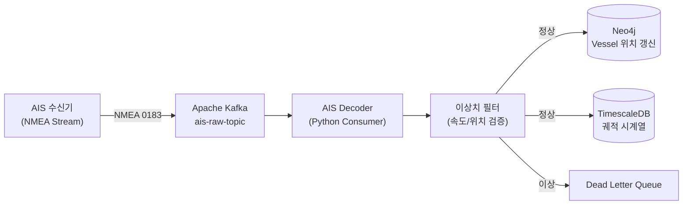

**처리 용량 요구사항:**

| 항목 | 값 | 비고 |
|------|---|------|
| 예상 수신량 | ~50,000 msg/분 | 한국 해역 AIS |
| 처리 지연 | < 5초 | 위치 갱신까지 |
| 저장 보존 | 원본: 1년 / 집계: 5년 | TimescaleDB 보존 정책 |
| Kafka 파티션 | 12개 (MMSI 해시 기반) | 병렬 처리 |

**AIS 디코딩 스키마:**

```python
@dataclass
class AISPosition:
    mmsi: int                    # 9자리 MMSI
    timestamp: datetime          # 수신 시각
    latitude: float              # WGS84
    longitude: float             # WGS84
    sog: float                   # Speed Over Ground (knots)
    cog: float                   # Course Over Ground (degrees)
    heading: float               # True Heading (degrees)
    nav_status: int              # 항행 상태 코드 (0-15)
    message_type: int            # AIS 메시지 유형 (1, 2, 3, 5, 18, 24)
    rot: float | None            # Rate of Turn (deg/min)
```

### 10.2 대용량 배치 처리

1차년도의 Python driver 기반 적재 방식은 수만 건 수준에서는 충분하나, 수백만 건 이상의 대량 데이터를 처리하기 위해서는 다음 도구를 도입한다.

#### 10.2.1 APOC 프로시저 활용

```cypher
// APOC periodic.iterate를 활용한 대량 병렬 처리
CALL apoc.periodic.iterate(
    "MATCH (d:Document) WHERE d.textEmbedding IS NULL RETURN d",
    "SET d.textEmbedding = gds.alpha.ml.oneHotEncoding(['feature1', 'feature2'])",
    {batchSize: 1000, parallel: true, concurrency: 4}
)
YIELD batches, total, errorMessages
RETURN batches, total, errorMessages;

// APOC LOAD JSON으로 API 응답 직접 적재
CALL apoc.load.json('https://data.kma.go.kr/api/marine/weather?key=...')
YIELD value
MERGE (wc:WeatherCondition {weatherId: value.id})
SET wc += value.properties;
```

#### 10.2.2 neo4j-admin import (초기 벌크 로드)

```bash
# CSV 파일 준비 (노드)
# experiments_header.csv: experimentId:ID,title,date:date,status
# experiments_data.csv: EXP-2024-001,"KVLCC2 저항시험",2024-06-15,COMPLETED

# CSV 파일 준비 (관계)
# conducted_at_header.csv: :START_ID,:END_ID,:TYPE
# conducted_at_data.csv: EXP-2024-001,TF-LTT,CONDUCTED_AT

neo4j-admin database import full \
    --nodes=Experiment=experiments_header.csv,experiments_data.csv \
    --nodes=TestFacility=facilities_header.csv,facilities_data.csv \
    --relationships=conducted_at_header.csv,conducted_at_data.csv \
    --overwrite-destination \
    neo4j
```

- 적용 시나리오: 초기 마이그레이션, 연간 전체 AIS 데이터 벌크 적재
- 제한사항: 데이터베이스 오프라인 필요, 기존 데이터 덮어쓰기

### 10.3 워크플로우 오케스트레이션 도구 확장 검토

| 도구 | 특성 | 적용 시나리오 | 도입 시기 |
|------|------|-------------|----------|
| **Activepieces** (현재) | 시각적 편집기, TypeScript, Piece SDK | 정기 크롤링, 단순 ETL | 1차년도 (현재) |
| **Apache Airflow** | DAG 기반, Python 네이티브, 대규모 파이프라인 | 복잡한 의존 관계, ML 파이프라인 | 2차년도 후반 검토 |
| **Prefect** | Python 네이티브, 동적 워크플로우, 클라우드 지원 | 데이터 과학 워크플로우 | 3차년도 검토 |
| **Dagster** | 자산(Asset) 중심, 타입 시스템, 리니지 내장 | 데이터 엔지니어링 표준화 | 3차년도 검토 |

**Airflow 도입 시 고려사항:**

```python
# Airflow DAG 예시: KRISO 논문 크롤링 파이프라인
from airflow import DAG
from airflow.operators.python import PythonOperator
from datetime import datetime, timedelta

default_args = {
    'owner': 'kriso-platform',
    'retries': 3,
    'retry_delay': timedelta(minutes=5),
}

with DAG(
    'etl_kriso_papers',
    default_args=default_args,
    schedule_interval='0 2 * * 6',  # 매주 토요일 02:00
    start_date=datetime(2026, 1, 1),
    catchup=False,
    tags=['etl', 'kriso', 'papers'],
) as dag:

    extract = PythonOperator(
        task_id='extract_papers',
        python_callable=crawl_papers,
        op_kwargs={'limit': 100, 'delay': 1.0},
    )

    transform = PythonOperator(
        task_id='transform_papers',
        python_callable=transform_and_extract_relations,
    )

    load = PythonOperator(
        task_id='load_to_neo4j',
        python_callable=load_papers_to_neo4j,
        op_kwargs={'batch_size': 100},
    )

    verify = PythonOperator(
        task_id='verify_load',
        python_callable=verify_paper_count,
    )

    extract >> transform >> load >> verify
```

### 10.4 자동화 파이프라인 구축: 데이터 변경 → KG 자동 재구축

1차년도에서는 ETL 프레임워크의 핵심 컴포넌트(검증/변환/적재)를 구현했으나, 실제 자동화 트리거와 영속화 계층이 부족하다. 본 섹션에서는 데이터 변경 감지부터 KG 자동 업데이트까지의 end-to-end 자동화 파이프라인을 설계한다.

#### 10.4.1 현황 분석 (1차년도 Gap)

**구현 완료 항목:**

| 컴포넌트 | 위치 | 기능 |
|---------|------|------|
| ETLPipeline | `kg/etl/pipeline.py` | 검증/변환/적재 오케스트레이터 |
| ETLMode | `kg/etl/models.py` | FULL/INCREMENTAL 모드 지원 |
| OntologyValidator | `kg/etl/validator.py` | 온톨로지 인식 검증기 |
| Transforms | `kg/etl/transforms.py` | DateTime/Text/Identifier 정규화 |
| Neo4jBatchLoader | `kg/etl/loader.py` | MERGE 멱등 적재 |
| LineageRecorder | `kg/lineage/recorder.py` | W3C PROV-O 리니지 기록 (인메모리) |
| Dead Letter Queue | `kg/etl/dlq.py` | 실패 레코드 수집 (인메모리) |
| 4종 크롤러 | `kg/crawlers/` | 논문/시설/기상/사고 데이터 수집 |

**미구현 Gap:**

| 항목 | 현재 상태 | 영향 |
|-----|---------|------|
| ETL 트리거 메커니즘 | 없음 (수동 실행만) | 데이터 변경 시 자동 반영 불가 |
| ETL CLI/API 진입점 | 없음 | 외부 시스템 연동 불가 |
| Activepieces 워크플로우 | Docker 서비스만 존재, 워크플로우 0건 | 정기 크롤링 수동 실행 필요 |
| 리니지 영속화 | 인메모리 전용 | 재시작 시 이력 소실 |
| DLQ 영속화 | 인메모리 전용 | 실패 레코드 재처리 불가 |
| File Watcher | 없음 | 시험 데이터 파일 업로드 시 수동 적재 |
| Webhook Endpoint | 없음 | 외부 시스템 Push 알림 불가 |

#### 10.4.2 자동화 아키텍처 설계

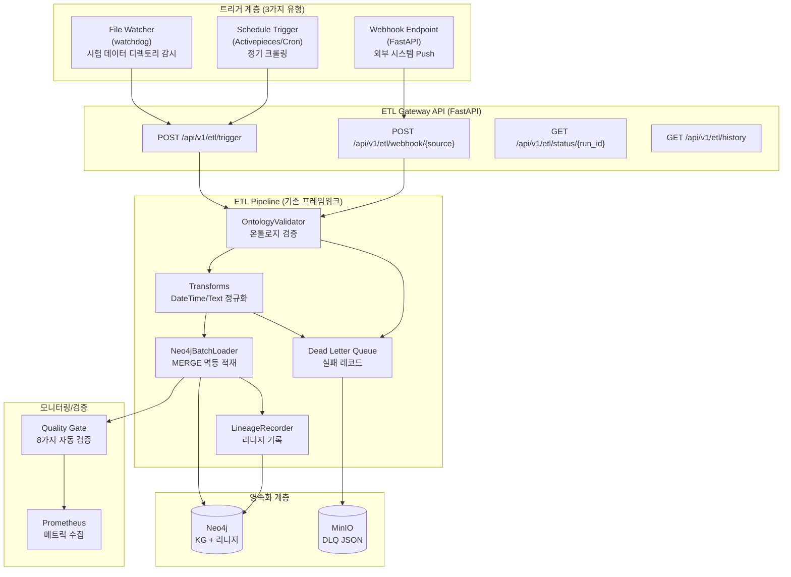

**전체 자동화 플로우:**

1. **트리거 계층**: 데이터 변경 감지 (File Watcher/Webhook/Schedule)
2. **ETL Gateway API**: 통일된 REST API 진입점
3. **ETL Pipeline**: 기존 검증/변환/적재 프레임워크 실행
4. **영속화 계층**: Neo4j (KG + 리니지) + MinIO (DLQ)
5. **모니터링**: Quality Gate 자동 실행 + Prometheus 메트릭

#### 10.4.3 트리거 계층 상세 설계

**Type 1: File Watcher (watchdog 라이브러리)**

KRISO 시험시설 데이터 디렉토리(NFS 마운트)를 감시하여 파일 생성/수정 시 자동으로 ETL 파이프라인 트리거.

**감시 대상:**

| 디렉토리 | 파일 패턴 | 시설 |
|---------|---------|------|
| `/mnt/kriso/towing-tank/` | `*.csv`, `*.hdf5` | 선형시험수조 |
| `/mnt/kriso/ocean-basin/` | `*.tdms`, `*.json` | 해양공학수조 |
| `/mnt/kriso/ice-tank/` | `*.csv`, `*.nc` | 빙해수조 |

**구현 예시:**

```python
# kg/automation/file_watcher.py

from watchdog.observers import Observer
from watchdog.events import FileSystemEventHandler
from pathlib import Path
import time
import requests
import logging

logger = logging.getLogger(__name__)

class ETLFileHandler(FileSystemEventHandler):
    """시험 데이터 파일 변경 감지 → ETL 트리거."""

    WATCH_PATTERNS = {'.csv', '.hdf5', '.json', '.tdms', '.nc'}
    DEBOUNCE_SECONDS = 30  # 중복 이벤트 방지

    def __init__(self, etl_api_url: str):
        self.etl_api_url = etl_api_url
        self._last_triggered: dict[str, float] = {}

    def on_created(self, event):
        """파일 생성 이벤트."""
        if event.is_directory:
            return
        ext = Path(event.src_path).suffix.lower()
        if ext in self.WATCH_PATTERNS:
            self._trigger_etl(event.src_path, 'FILE_CREATED')

    def on_modified(self, event):
        """파일 수정 이벤트."""
        if event.is_directory:
            return
        ext = Path(event.src_path).suffix.lower()
        if ext in self.WATCH_PATTERNS:
            self._trigger_etl(event.src_path, 'FILE_MODIFIED')

    def _trigger_etl(self, file_path: str, event_type: str):
        """ETL API 호출 (디바운싱 포함)."""
        now = time.time()
        if file_path in self._last_triggered:
            if now - self._last_triggered[file_path] < self.DEBOUNCE_SECONDS:
                logger.debug(f"Debounced: {file_path}")
                return

        self._last_triggered[file_path] = now
        facility_id = self._detect_facility(file_path)

        payload = {
            'source': 'file_watcher',
            'file_path': file_path,
            'event_type': event_type,
            'facility_id': facility_id,
            'mode': 'INCREMENTAL',
        }

        try:
            resp = requests.post(f'{self.etl_api_url}/api/v1/etl/trigger', json=payload)
            resp.raise_for_status()
            logger.info(f"ETL triggered for {file_path}: {resp.json()}")
        except requests.RequestException as e:
            logger.error(f"Failed to trigger ETL for {file_path}: {e}")

    def _detect_facility(self, file_path: str) -> str | None:
        """파일 경로에서 시설 ID 추출."""
        path_parts = Path(file_path).parts
        facility_map = {
            'towing-tank': 'TF-LTT',
            'ocean-basin': 'TF-OEB',
            'ice-tank': 'TF-ICE',
        }
        for part in path_parts:
            if part in facility_map:
                return facility_map[part]
        return None


def run_file_watcher():
    """File Watcher 서비스 실행 (systemd/supervisor로 데몬화)."""
    watch_dirs = [
        '/mnt/kriso/towing-tank',
        '/mnt/kriso/ocean-basin',
        '/mnt/kriso/ice-tank',
    ]
    etl_api_url = 'http://localhost:8000'

    observer = Observer()
    handler = ETLFileHandler(etl_api_url)

    for watch_dir in watch_dirs:
        if Path(watch_dir).exists():
            observer.schedule(handler, watch_dir, recursive=True)
            logger.info(f"Watching: {watch_dir}")

    observer.start()
    try:
        while True:
            time.sleep(1)
    except KeyboardInterrupt:
        observer.stop()
    observer.join()
```

**systemd 서비스 파일 (`/etc/systemd/system/kriso-etl-watcher.service`):**

```ini
[Unit]
Description=KRISO ETL File Watcher
After=network.target

[Service]
Type=simple
User=maritime
WorkingDirectory=/opt/maritime-platform
Environment="PYTHONPATH=/opt/maritime-platform"
ExecStart=/opt/maritime-platform/.venv/bin/python -m kg.automation.file_watcher
Restart=always
RestartSec=10

[Install]
WantedBy=multi-user.target
```

**Type 2: Webhook Endpoint (FastAPI)**

외부 시스템(예: KRISO 데이터 레지스트리)이 HTTP POST로 데이터 변경 알림을 Push.

**보안 요구사항:**

- HMAC-SHA256 서명 검증
- IP 화이트리스트 (KRISO 내부망만 허용)
- Rate Limiting (동일 소스 분당 60회)

**구현 예시:**

```python
# kg/api/routers/etl.py

from fastapi import APIRouter, HTTPException, Header, Request
import hmac
import hashlib
from kg.etl.pipeline import ETLPipeline
from kg.etl.models import ETLMode

router = APIRouter(prefix="/api/v1/etl", tags=["ETL"])

WEBHOOK_SECRET = "kriso-platform-webhook-secret-2026"  # 환경변수로 관리

@router.post("/webhook/{source}")
async def receive_webhook(
    source: str,
    request: Request,
    x_signature: str = Header(None),
):
    """외부 시스템 웹훅 수신 (HMAC 서명 검증)."""
    body = await request.body()

    # HMAC 서명 검증
    expected_sig = hmac.new(
        WEBHOOK_SECRET.encode(),
        body,
        hashlib.sha256
    ).hexdigest()

    if not hmac.compare_digest(x_signature or "", expected_sig):
        raise HTTPException(status_code=403, detail="Invalid signature")

    payload = await request.json()

    # ETL 트리거 (백그라운드 태스크로 실행)
    run_id = trigger_etl_async(
        source=source,
        mode=ETLMode.INCREMENTAL,
        payload=payload,
    )

    return {
        "status": "accepted",
        "run_id": run_id,
        "message": f"ETL triggered for source: {source}",
    }
```

**Type 3: Schedule Trigger (Activepieces)**

기존 8.1.1 워크플로우 정의를 실제 Activepieces JSON으로 구체화.

**Activepieces 워크플로우 정의 예시 (KRISO 논문 크롤링):**

```json
{
  "displayName": "KRISO 논문 주간 크롤링",
  "trigger": {
    "type": "SCHEDULE",
    "settings": {
      "cronExpression": "0 2 * * 6",
      "timezone": "Asia/Seoul"
    }
  },
  "actions": [
    {
      "name": "crawl_papers",
      "type": "CODE",
      "settings": {
        "sourceCode": {
          "code": "const axios = require('axios');\nconst response = await axios.post('http://localhost:8000/api/v1/etl/trigger', {\n  source: 'activepieces',\n  crawler: 'kriso_papers',\n  mode: 'INCREMENTAL',\n  limit: 100\n});\nreturn response.data;",
          "packageJson": "{\"dependencies\": {\"axios\": \"^1.6.0\"}}"
        }
      }
    },
    {
      "name": "check_status",
      "type": "CODE",
      "settings": {
        "sourceCode": {
          "code": "const runId = priorStepOutput['crawl_papers'].run_id;\nconst axios = require('axios');\nlet status = 'RUNNING';\nwhile (status === 'RUNNING') {\n  const resp = await axios.get(`http://localhost:8000/api/v1/etl/status/${runId}`);\n  status = resp.data.status;\n  if (status === 'RUNNING') await new Promise(r => setTimeout(r, 5000));\n}\nreturn {status, runId};",
          "packageJson": "{\"dependencies\": {\"axios\": \"^1.6.0\"}}"
        }
      }
    }
  ]
}
```

**Activepieces 워크플로우 등록 스크립트:**

```bash
# scripts/register_activepieces_workflows.sh

ACTIVEPIECES_API="http://localhost:8080/api/v1"
WORKFLOW_DIR="./activepieces/workflows"

for workflow_file in $WORKFLOW_DIR/*.json; do
  echo "Registering workflow: $workflow_file"
  curl -X POST "$ACTIVEPIECES_API/flows" \
    -H "Content-Type: application/json" \
    -d @"$workflow_file"
done
```

#### 10.4.4 ETL Gateway API 설계

FastAPI 기반 통일된 ETL 진입점.

**엔드포인트 목록:**

| 메서드 | 경로 | 설명 |
|--------|------|------|
| POST | `/api/v1/etl/trigger` | ETL 수동/자동 트리거 |
| POST | `/api/v1/etl/webhook/{source}` | 외부 웹훅 수신 |
| GET | `/api/v1/etl/status/{run_id}` | ETL 실행 상태 조회 |
| GET | `/api/v1/etl/history` | ETL 실행 이력 조회 (90일) |
| POST | `/api/v1/etl/retry/{run_id}` | 실패한 ETL 재시도 |

**ETLTriggerRequest 모델:**

```python
# kg/api/models.py

from pydantic import BaseModel, Field
from kg.etl.models import ETLMode
from typing import Literal

class ETLTriggerRequest(BaseModel):
    source: str = Field(..., description="트리거 소스 (file_watcher/webhook/schedule/manual)")
    mode: ETLMode = ETLMode.INCREMENTAL
    entity_types: list[str] | None = Field(None, description="특정 엔티티만 처리")
    file_path: str | None = Field(None, description="File Watcher 전용")
    facility_id: str | None = Field(None, description="KRISO 시설 ID")
    crawler: str | None = Field(None, description="크롤러 이름 (kriso_papers/kma_marine/...)")
    force_full: bool = Field(False, description="증분 무시하고 전체 재구축")

class ETLStatusResponse(BaseModel):
    run_id: str
    status: Literal["PENDING", "RUNNING", "COMPLETED", "FAILED"]
    started_at: str
    completed_at: str | None
    records_processed: int
    records_failed: int
    error_message: str | None
```

**구현 예시:**

```python
# kg/api/routers/etl.py

from fastapi import APIRouter, BackgroundTasks, HTTPException
from kg.api.models import ETLTriggerRequest, ETLStatusResponse
from kg.etl.pipeline import ETLPipeline
from kg.etl.models import ETLMode, RecordEnvelope
import uuid
from datetime import datetime

router = APIRouter(prefix="/api/v1/etl", tags=["ETL"])

# 인메모리 실행 상태 추적 (2차년도: Redis로 대체)
etl_runs: dict[str, dict] = {}

@router.post("/trigger")
async def trigger_etl(request: ETLTriggerRequest, background_tasks: BackgroundTasks):
    """ETL 파이프라인 트리거 (백그라운드 실행)."""
    run_id = f"ETL-{uuid.uuid4().hex[:8]}"

    etl_runs[run_id] = {
        "status": "PENDING",
        "started_at": datetime.utcnow().isoformat(),
        "completed_at": None,
        "records_processed": 0,
        "records_failed": 0,
        "error_message": None,
    }

    # 백그라운드 태스크로 ETL 실행
    background_tasks.add_task(
        run_etl_pipeline,
        run_id=run_id,
        request=request,
    )

    return {
        "status": "accepted",
        "run_id": run_id,
        "message": "ETL pipeline scheduled",
    }

@router.get("/status/{run_id}", response_model=ETLStatusResponse)
async def get_etl_status(run_id: str):
    """ETL 실행 상태 조회."""
    if run_id not in etl_runs:
        raise HTTPException(status_code=404, detail="Run ID not found")
    return ETLStatusResponse(run_id=run_id, **etl_runs[run_id])

@router.get("/history")
async def get_etl_history(limit: int = 20):
    """ETL 실행 이력 조회 (최근 N건)."""
    history = sorted(
        etl_runs.items(),
        key=lambda x: x[1]['started_at'],
        reverse=True
    )[:limit]
    return [{"run_id": k, **v} for k, v in history]


async def run_etl_pipeline(run_id: str, request: ETLTriggerRequest):
    """ETL 파이프라인 실행 (백그라운드 함수)."""
    etl_runs[run_id]["status"] = "RUNNING"

    try:
        # 1. 데이터 소스 결정 (크롤러/파일)
        if request.crawler:
            records = await fetch_from_crawler(request.crawler)
        elif request.file_path:
            records = await load_from_file(request.file_path)
        else:
            raise ValueError("Either 'crawler' or 'file_path' must be provided")

        # 2. ETL 파이프라인 실행
        pipeline = ETLPipeline(
            ontology=get_maritime_ontology(),
            session=get_neo4j_session(),
        )

        result = pipeline.run(
            records=records,
            mode=request.mode,
            entity_types=request.entity_types,
        )

        # 3. 상태 업데이트
        etl_runs[run_id].update({
            "status": "COMPLETED",
            "completed_at": datetime.utcnow().isoformat(),
            "records_processed": result.successful_count,
            "records_failed": result.failed_count,
        })

    except Exception as e:
        etl_runs[run_id].update({
            "status": "FAILED",
            "completed_at": datetime.utcnow().isoformat(),
            "error_message": str(e),
        })
```

#### 10.4.5 리니지 영속화 설계

현재 인메모리 `LineageRecorder` → Neo4j 자동 영속화.

**PersistentLineageRecorder 구현:**

```python
# kg/lineage/persistent_recorder.py

from kg.lineage.recorder import LineageRecorder
from kg.lineage.queries import LINEAGE_QUERIES
from neo4j import Session

class PersistentLineageRecorder(LineageRecorder):
    """인메모리 리니지를 Neo4j에 자동 영속화."""

    def __init__(self, session: Session):
        super().__init__()
        self._session = session

    def flush(self):
        """인메모리 이벤트를 Neo4j에 배치 저장."""
        if not self.events:
            return

        # 배치로 PipelineExecution 노드 생성
        for event in self.events:
            self._session.run(
                LINEAGE_QUERIES['create_pipeline_execution'],
                {
                    'execution_id': event.execution_id,
                    'pipeline_name': event.pipeline_name,
                    'started_at': event.started_at.isoformat(),
                    'completed_at': event.completed_at.isoformat() if event.completed_at else None,
                    'status': event.status,
                    'records_processed': event.records_processed,
                }
            )

            # DERIVED_FROM 관계 생성
            for source_id in event.source_entity_ids:
                self._session.run(
                    LINEAGE_QUERIES['link_derived_from'],
                    {
                        'entity_id': event.target_entity_id,
                        'source_id': source_id,
                        'execution_id': event.execution_id,
                    }
                )

        self.events.clear()
```

**ETLPipeline에서 자동 호출:**

```python
# kg/etl/pipeline.py (기존 코드 수정)

class ETLPipeline:
    def run(self, records, mode=ETLMode.INCREMENTAL, entity_types=None):
        # ... 기존 검증/변환/적재 로직 ...

        # 리니지 영속화 (새로 추가)
        if isinstance(self.lineage_recorder, PersistentLineageRecorder):
            self.lineage_recorder.flush()

        return result
```

**리니지 보존 정책 (90일 이후 자동 삭제):**

```cypher
// Neo4j 스케줄러 (APOC)
CALL apoc.periodic.repeat(
  'cleanup-old-lineage',
  'MATCH (pe:PipelineExecution) WHERE pe.completedAt < datetime() - duration({days: 90}) DETACH DELETE pe',
  86400  // 24시간마다 실행
);
```

#### 10.4.6 DLQ 영속화 설계

현재 인메모리 DLQ → MinIO(파일) + Neo4j(메타데이터) 이중 저장.

**PersistentDLQ 구현:**

```python
# kg/etl/persistent_dlq.py

from kg.etl.dlq import DeadLetterQueue
from minio import Minio
from pathlib import Path
import json
from datetime import datetime

class PersistentDLQ(DeadLetterQueue):
    """실패 레코드를 MinIO + Neo4j에 영속화."""

    def __init__(self, minio_client: Minio, bucket: str, session):
        super().__init__()
        self.minio = minio_client
        self.bucket = bucket
        self._session = session

    def add(self, record, error_type, error_message):
        """실패 레코드 추가 (즉시 영속화)."""
        super().add(record, error_type, error_message)

        # MinIO에 JSON Lines 형식으로 저장
        dlq_entry = self.failed_records[-1]
        object_name = f"dlq/{dlq_entry['dlq_id']}.json"

        self.minio.put_object(
            bucket_name=self.bucket,
            object_name=object_name,
            data=json.dumps(dlq_entry).encode(),
            length=-1,
            part_size=10*1024*1024,
        )

        # Neo4j에 DLQEntry 노드 생성
        self._session.run("""
            CREATE (d:DLQEntry {
                dlqId: $dlq_id,
                recordId: $record_id,
                errorType: $error_type,
                errorMessage: $error_message,
                failedAt: datetime($failed_at),
                retryCount: 0,
                status: 'PENDING'
            })
        """, {
            'dlq_id': dlq_entry['dlq_id'],
            'record_id': dlq_entry.get('record_id'),
            'error_type': error_type,
            'error_message': error_message,
            'failed_at': dlq_entry['failed_at'],
        })

    def retry(self, dlq_id: str):
        """DLQ 레코드 재처리."""
        # MinIO에서 원본 레코드 가져오기
        object_name = f"dlq/{dlq_id}.json"
        response = self.minio.get_object(self.bucket, object_name)
        dlq_entry = json.loads(response.read())

        # 재처리 시도
        try:
            # ETL 파이프라인 재실행
            pipeline = ETLPipeline(...)
            pipeline.run([dlq_entry['record']], mode=ETLMode.INCREMENTAL)

            # 성공 시 DLQEntry 상태 업데이트
            self._session.run("""
                MATCH (d:DLQEntry {dlqId: $dlq_id})
                SET d.status = 'RESOLVED', d.resolvedAt = datetime()
            """, {'dlq_id': dlq_id})

        except Exception as e:
            # 실패 시 재시도 카운트 증가
            self._session.run("""
                MATCH (d:DLQEntry {dlqId: $dlq_id})
                SET d.retryCount = d.retryCount + 1, d.lastError = $error
            """, {'dlq_id': dlq_id, 'error': str(e)})
```

**DLQ 재처리 CLI:**

```bash
# 특정 DLQ 레코드 재처리
python -m kg.etl.dlq retry --id DLQ-abc123

# 모든 PENDING 상태 DLQ 재처리
python -m kg.etl.dlq retry-all --status PENDING
```

#### 10.4.7 전체 자동화 시퀀스 다이어그램

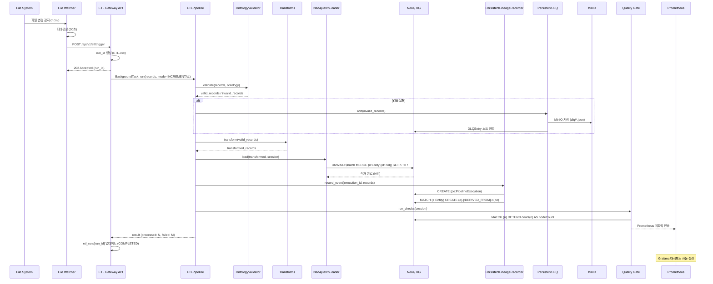

**주요 흐름:**

1. File Watcher가 파일 변경 감지 → 30초 디바운싱
2. ETL Gateway API 호출 (`run_id` 생성)
3. 백그라운드 태스크로 ETL 파이프라인 실행
4. 검증 실패 레코드 → DLQ (MinIO + Neo4j)
5. 정상 레코드 → 변환 → Neo4j 적재
6. 리니지 자동 기록 (PipelineExecution 노드)
7. Quality Gate 자동 실행 → Prometheus 메트릭
8. API 상태 업데이트 (COMPLETED/FAILED)

#### 10.4.8 구현 우선순위 및 일정

| 우선순위 | 항목 | 예상 기간 | 의존성 | 산출물 |
|---------|------|----------|--------|--------|
| **P0** | ETL CLI 진입점 (`python -m kg.etl.run`) | 1주 | 없음 | CLI 도구 |
| **P0** | ETL Gateway API (FastAPI 라우터) | 2주 | ETL CLI | REST API 서버 |
| **P1** | 리니지 Neo4j 영속화 | 1주 | 없음 | PersistentLineageRecorder |
| **P1** | DLQ MinIO 영속화 | 1주 | MinIO 인프라 | PersistentDLQ |
| **P1** | Activepieces 워크플로우 정의 (6종) | 2주 | ETL API | JSON 워크플로우 파일 |
| **P2** | File Watcher 서비스 (systemd) | 2주 | ETL API | watchdog 데몬 |
| **P2** | Webhook 서명 검증 | 1주 | ETL API | HMAC 인증 미들웨어 |
| **P3** | Quality Gate CI/CD 통합 | 1주 | ETL 실행 | GitHub Actions |
| **P3** | Prometheus 메트릭 수집 | 1주 | ETL API | prometheus_client |

**총 예상 기간:** 8-10주 (2개월)

### 10.5 2차년도 구현 로드맵

| 분기 | 마일스톤 | 주요 작업 |
|------|---------|----------|
| **Q1** | ETL 인프라 구축 | Kafka 클러스터 구축, TimescaleDB 도입, MinIO 설정 |
| **Q1** | **ETL 자동화 파이프라인** | **ETL CLI/API 구축, File Watcher, Activepieces 워크플로우 정의, 리니지/DLQ 영속화** |
| **Q1** | KRISO 시험 데이터 로더 | FacilityDataLoader 구현, 3종 시험 데이터 적재 검증 |
| **Q2** | AIS 스트리밍 파이프라인 | Kafka Consumer 구현, Vessel 위치 실시간 갱신 |
| **Q2** | 리니지 관리 체계 | DataPipeline/WorkflowExecution 노드 자동 기록 |
| **Q3** | 대용량 배치 처리 | APOC 기반 병렬 처리, neo4j-admin import 자동화 |
| **Q3** | 위성영상 파이프라인 | STAC API 연동, GeoTIFF -> MinIO + Neo4j 메타데이터 |
| **Q4** | 모니터링 고도화 | Grafana 대시보드, Prometheus 메트릭, 알림 체계 |
| **Q4** | 통합 테스트 및 최적화 | 전 파이프라인 통합 테스트, 성능 튜닝, 문서화 |

### 10.6 성능 목표

| 지표 | 1차년도 (현재) | 2차년도 목표 | 비고 |
|------|-------------|------------|------|
| 논문 적재 속도 | ~100건/분 | ~500건/분 | 배치 최적화 |
| 기상 데이터 갱신 | 3시간 주기 | 10분 주기 | 실시간 API 전환 |
| AIS 위치 갱신 | N/A | < 5초 지연 | Kafka 스트리밍 |
| KG 노드 수 | ~100건 (샘플) | ~50,000건 | 본격 적재 |
| KG 관계 수 | ~50건 (샘플) | ~200,000건 | 관계 추출 고도화 |
| 파이프라인 가용률 | N/A | 99.5% | 모니터링/알림 |
| 데이터 적재 성공률 | N/A | > 99% | 재시도/DLQ |

---

## 11. 1차년도 PoC 선행 구현 성과

1차년도 PoC 기간 중 2차년도 본 구축에 직접 활용 가능한 핵심 모듈을 선행 구현하였다. 이 모듈들은 2차년도에 프로덕션 수준으로 고도화하여 즉시 투입 가능하다.

### 11.1 선행 구현 모듈 총괄

| 모듈 | 위치 | 구현 내용 | 테스트 | 2차년도 활용 |
|------|------|-----------|--------|-------------|
| **n10s OWL 통합** | `kg/n10s/` | OWL 2 Turtle 생성기(564줄), n10s 임포트 파이프라인(373줄), 그래프 설정(248줄) | 35개 | S-100 OWL 매핑 기반 |
| **GraphRAG 5종 Retriever** | `poc/graphrag_retrievers.py` | Vector, VectorCypher, Text2Cypher, Hybrid, ToolsRetriever | 27개 | API 서빙 레이어 |
| **임베딩 모듈** | `kg/embeddings/` | Ollama nomic-embed-text(768차원), 배치 생성기 | 22개 | 대규모 임베딩 파이프라인 |
| **Entity Resolution** | `kg/entity_resolution/` | 3단계 해석기, 퍼지 매칭 | 68개 | 실데이터 중복 제거 |
| **평가 프레임워크** | `kg/evaluation/` | 30개 질문 데이터셋, CypherAccuracy/QueryRelevancy 메트릭 | 62개 | 품질 모니터링 |
| **환각 감지기** | `kg/hallucination_detector.py` | 온톨로지 기반 응답 검증 | 50개 | 프로덕션 안전장치 |
| **Cypher 검증/교정** | `kg/cypher_validator.py`, `cypher_corrector.py` | 6가지 검증 + FailureType 분류, 규칙 기반 교정 | 67개 | 자연어 쿼리 품질 |
| **품질 게이트** | `kg/quality_gate.py` | 8가지 자동 검증, CI/CD 통합 | 48개 | ETL 품질 게이트 |
| **RBAC** | `kg/rbac/` | 5역할 5등급 접근제어, API 인증 미들웨어 | 77개 | K8S OIDC 연동 |
| **데이터 리니지** | `kg/lineage/` | W3C PROV-O 레코더, RBAC 연동 정책 | 62개 | Neo4j 영속화 |

### 11.2 선행 구현 통계

| 항목 | 수치 |
|------|------|
| Python 소스 코드 | 15,500+줄 |
| 단위 테스트 | 1,095개 (전체 통과) |
| 통합 테스트 | 30개 (Neo4j 검증 완료) |
| 벤치마크 | 10개 |
| 전체 테스트 | 1,140개 |
| 온톨로지 엔티티 | 127종 |
| 온톨로지 관계 | 83종 |
| OWL 트리플 | 1,433개 |
| 평가 질문 | 30개 |
| 설계 문서 | 15개 |

### 11.3 2차년도 재사용 전략

```
┌─────────────────────────────────────────────────────┐
│ 1차년도 PoC 자산 (검증 완료)                           │
│                                                     │
│  kg/n10s/    ──→  S-100 OWL 파이프라인 확장            │
│  kg/embeddings/ ──→  대규모 임베딩 파이프라인 운영화     │
│  poc/graphrag_*  ──→  API 서빙 + 캐싱 레이어           │
│  kg/entity_resolution/ ──→  실데이터 중복 제거 운영     │
│  kg/evaluation/  ──→  상시 품질 모니터링 대시보드        │
│  kg/rbac/        ──→  K8S OIDC + Keycloak 연동        │
│  kg/lineage/     ──→  Neo4j 영속화 + Grafana 시각화    │
│  kg/etl/         ──→  Airflow DAG 전환                │
│                                                     │
└─────────────────────────────────────────────────────┘
```

---

## 12. n10s/OWL/S-100 확장 전략

### 12.1 현황

1차년도에 다음을 완료하였다:

| 구현 항목 | 상세 |
|-----------|------|
| OWL 2 Turtle 생성기 | Python 온톨로지(127 클래스, 83 ObjectProperty, 255 DatatypeProperty) → OWL/Turtle 자동 변환 |
| maritime.ttl | 1,845줄, 1,433 트리플의 완전한 해사 온톨로지 |
| n10s 임포트 파이프라인 | 5단계: graphconfig → constraint → namespace(8개) → 임포트 → 검증 |
| S-100 분석 보고서 | REQ-004 (1,157줄), 6개 Product Specification 매핑 테이블 |

### 12.2 2차년도 S-100 OWL 통합 로드맵

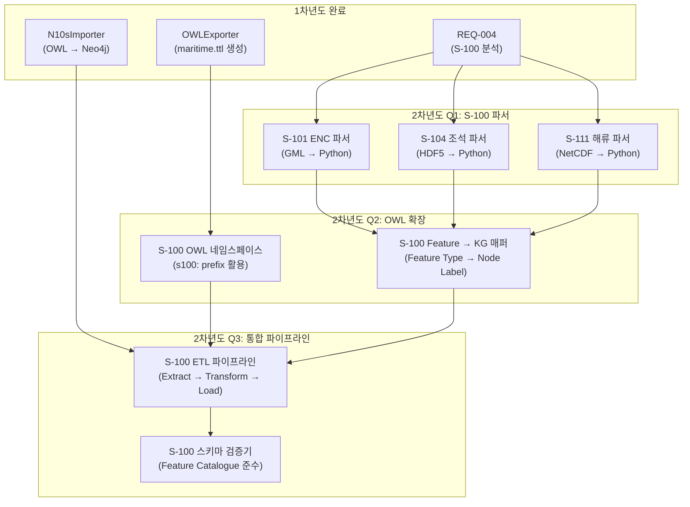

### 12.3 S-100 Product Specification 구현 우선순위

| 우선순위 | PS | 명칭 | 데이터 포맷 | Neo4j 매핑 | 구현 분기 |
|---------|-----|------|-----------|-----------|----------|
| **P0** | S-101 | 전자해도 (ENC) | GML (ISO 8211) | `MaritimeChart`, `NavigationAid`, `Depth` | Q1 |
| **P1** | S-104 | 수위/조석 | HDF5 | `TidalStation`, `WaterLevel` | Q1 |
| **P1** | S-111 | 표면 해류 | NetCDF (CF) | `CurrentStation`, `CurrentVector` | Q2 |
| **P2** | S-124 | 항행경보 | GML | `NavigationalWarning`, `WarningArea` | Q2 |
| **P2** | S-421 | 항로 교환 | GML | `Route`, `Waypoint` | Q3 |
| **P3** | S-100 FC | Feature Catalogue | XML | OWL 클래스 자동 생성 | Q3 |

### 12.4 OWL 네임스페이스 확장 계획

```turtle
# 1차년도 구현 완료 (8개)
@prefix maritime: <https://kg.kriso.re.kr/maritime#> .
@prefix s100:     <https://registry.iho.int/s100#> .
@prefix owl:      <http://www.w3.org/2002/07/owl#> .
@prefix rdfs:     <http://www.w3.org/2000/01/rdf-schema#> .
@prefix xsd:      <http://www.w3.org/2001/XMLSchema#> .
@prefix dc:       <http://purl.org/dc/elements/1.1/> .
@prefix dcterms:  <http://purl.org/dc/terms/> .
@prefix geo:      <http://www.opengis.net/ont/geosparql#> .

# 2차년도 추가 예정 (5개)
@prefix s101:     <https://registry.iho.int/s101#> .
@prefix s104:     <https://registry.iho.int/s104#> .
@prefix s111:     <https://registry.iho.int/s111#> .
@prefix s124:     <https://registry.iho.int/s124#> .
@prefix prov:     <http://www.w3.org/ns/prov#> .
```

---

## 13. GraphRAG 운영화 계획

### 13.1 1차년도 PoC 현황

| Retriever | 방식 | PoC 상태 |
|-----------|------|---------|
| VectorRetriever | 의미 유사도 검색 (768차원 nomic-embed-text) | PoC 구현 완료 |
| VectorCypherRetriever | 벡터 + 그래프 탐색 결합 | PoC 구현 완료 |
| Text2CypherRetriever | 한국어 자연어 → Cypher 변환 | PoC 구현 완료 |
| HybridRetriever | 전문검색 + 벡터 결합 | PoC 구현 완료 |
| ToolsRetriever | LLM이 전략 자동 선택 (Agentic) | PoC 구현 완료 |

### 13.2 2차년도 프로덕션 아키텍처

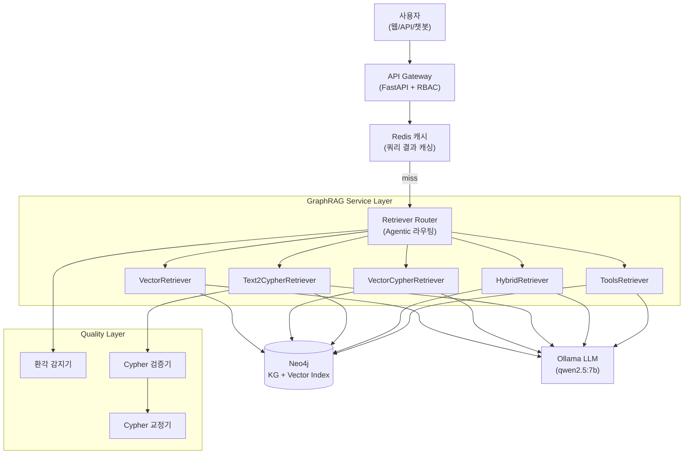

### 13.3 운영화 주요 작업

| 분기 | 작업 | 상세 |
|------|------|------|
| **Q1** | API 서빙 레이어 | FastAPI `/api/v1/graphrag/query` 엔드포인트, 비동기 처리 |
| **Q1** | Redis 쿼리 캐싱 | 동일 질문 캐시 (TTL 5분), 임베딩 벡터 캐시 |
| **Q2** | LLM 업그레이드 검토 | qwen2.5:7b → 14b/32b 또는 대안 모델 벤치마크 |
| **Q2** | 대규모 임베딩 파이프라인 | 전체 Document/Paper 노드 임베딩 (배치 처리, APOC 연동) |
| **Q3** | 평가 자동화 | 30개 평가 질문 일일 자동 실행, Accuracy 추이 대시보드 |
| **Q3** | 다국어 지원 | 영어/일본어 쿼리 지원 (다국어 임베딩 모델) |
| **Q4** | Agentic 고도화 | 다중 라운드 대화, 맥락 유지, 사용자 피드백 반영 |

### 13.4 성능 목표

| 지표 | 1차년도 (PoC) | 2차년도 목표 |
|------|-------------|------------|
| 쿼리 응답 시간 | ~5초 | < 2초 (캐시 hit < 100ms) |
| 임베딩 노드 수 | ~10개 (샘플) | ~50,000개 |
| 동시 사용자 | 1명 (CLI) | 50명 (API) |
| Cypher 정확도 | 수동 평가 | > 80% (자동 평가) |
| 환각 감지율 | PoC 검증 | > 95% |

---

## 14. Kubernetes 인프라 마이그레이션

### 14.1 현황: Docker Compose → Kubernetes

1차년도에는 개발/PoC 편의를 위해 Docker Compose를 사용하였다. KRISO 과업지시서에 명시된 K8S 기반 디지털서비스 플랫폼 연동 요건에 따라, 2차년도에는 Kubernetes로 전면 마이그레이션한다.

### 14.2 K8S 아키텍처

```
┌────────────────────────────────────────────────────────────┐
│ Kubernetes Cluster (KRISO K8S 연동)                        │
│                                                            │
│  ┌─────────── Namespace: maritime-platform ───────────┐    │
│  │                                                    │    │
│  │  ┌──────────────┐  ┌──────────────┐               │    │
│  │  │ Neo4j        │  │ Ollama       │               │    │
│  │  │ StatefulSet  │  │ Deployment   │               │    │
│  │  │ (5.26+n10s)  │  │ (GPU node)   │               │    │
│  │  └──────────────┘  └──────────────┘               │    │
│  │                                                    │    │
│  │  ┌──────────────┐  ┌──────────────┐               │    │
│  │  │ API Gateway  │  │ GraphRAG     │               │    │
│  │  │ Deployment   │  │ Deployment   │               │    │
│  │  │ (FastAPI)    │  │ (Worker)     │               │    │
│  │  └──────────────┘  └──────────────┘               │    │
│  │                                                    │    │
│  │  ┌──────────────┐  ┌──────────────┐               │    │
│  │  │ Redis        │  │ Kafka        │               │    │
│  │  │ StatefulSet  │  │ StatefulSet  │               │    │
│  │  └──────────────┘  └──────────────┘               │    │
│  │                                                    │    │
│  │  ┌──────────────┐  ┌──────────────┐               │    │
│  │  │ Keycloak     │  │ Grafana +    │               │    │
│  │  │ (OIDC SSO)   │  │ Prometheus   │               │    │
│  │  └──────────────┘  └──────────────┘               │    │
│  └────────────────────────────────────────────────────┘    │
│                                                            │
│  Ingress Controller (NGINX/Traefik)                        │
│  Persistent Volumes (Ceph/NFS)                             │
│  cert-manager (TLS 자동 관리)                              │
└────────────────────────────────────────────────────────────┘
```

### 14.3 Helm Chart 구조

```
helm/maritime-platform/
├── Chart.yaml
├── values.yaml              # 환경별 설정 (dev/staging/prod)
├── templates/
│   ├── neo4j-statefulset.yaml
│   ├── neo4j-service.yaml
│   ├── neo4j-configmap.yaml  # n10s 플러그인 설정 포함
│   ├── api-deployment.yaml
│   ├── api-service.yaml
│   ├── graphrag-deployment.yaml
│   ├── ollama-deployment.yaml
│   ├── redis-statefulset.yaml
│   ├── kafka-statefulset.yaml
│   ├── keycloak-deployment.yaml
│   ├── monitoring/
│   │   ├── prometheus-config.yaml
│   │   └── grafana-dashboards.yaml
│   ├── ingress.yaml
│   └── secrets.yaml          # SealedSecrets 또는 External Secrets
└── environments/
    ├── values-dev.yaml
    ├── values-staging.yaml
    └── values-prod.yaml
```

### 14.4 마이그레이션 일정

| 분기 | 작업 | 산출물 |
|------|------|--------|
| **Q1** | Helm Chart 초안 작성, CI/CD 파이프라인 (GitHub Actions → K8S 배포) | Helm Chart v0.1, ArgoCD 설정 |
| **Q1** | Neo4j StatefulSet + n10s 플러그인 K8S 배포 검증 | neo4j-statefulset.yaml |
| **Q2** | API Gateway + GraphRAG Worker K8S 배포 | Deployment 매니페스트 |
| **Q2** | Keycloak OIDC 연동 (기존 RBAC → SSO 전환) | Keycloak realm 설정 |
| **Q3** | Kafka + Redis K8S 배포, AIS 스트리밍 통합 | StatefulSet 매니페스트 |
| **Q4** | 모니터링 스택 (Prometheus + Grafana), 부하 테스트 | 대시보드, HPA 설정 |

### 14.5 리소스 요구사항

| 컴포넌트 | CPU (Request/Limit) | Memory (Request/Limit) | Storage | 비고 |
|---------|---------------------|----------------------|---------|------|
| Neo4j | 2/4 cores | 4Gi/8Gi | 100Gi PV (SSD) | StatefulSet, n10s 플러그인 |
| Ollama (LLM) | 2/4 cores | 8Gi/16Gi | 50Gi | GPU 노드 권장 (NVIDIA T4+) |
| API Gateway | 0.5/2 cores | 512Mi/2Gi | - | HPA: min 2, max 8 |
| GraphRAG Worker | 1/2 cores | 2Gi/4Gi | - | HPA: min 1, max 4 |
| Redis | 0.5/1 core | 1Gi/2Gi | 10Gi PV | StatefulSet |
| Kafka | 1/2 cores | 2Gi/4Gi | 50Gi PV | 3 broker StatefulSet |
| Keycloak | 0.5/1 core | 512Mi/1Gi | - | PostgreSQL 백엔드 공유 |
| Prometheus + Grafana | 0.5/1 core | 1Gi/2Gi | 20Gi PV | 모니터링 |
| **총 합계** | **8/17 cores** | **19.5Gi/39.5Gi** | **230Gi** | |

---

## 15. 보안 및 접근제어 운영화

### 15.1 1차년도 RBAC 현황

| 구현 항목 | 상세 |
|-----------|------|
| 5단계 역할 체계 | 관리자, 내부 연구원, 외부 연구자, 민간 개발자, 일반 사용자 |
| 5등급 데이터 분류 | 극비, 기밀, 내부, 제한, 공개 |
| API 인증 미들웨어 | Bearer Token 기반 (kg/api/middleware/) |
| 접근제어 정책 엔진 | 576줄, CAN_ACCESS 관계 기반 |
| 테스트 | 77개 (RBAC 56 + 인증 미들웨어 21) |

### 15.2 2차년도 보안 고도화

| 분기 | 작업 | 상세 |
|------|------|------|
| **Q1** | Keycloak SSO 연동 | OIDC Provider 설정, KRISO LDAP/AD 연동 |
| **Q1** | JWT 토큰 체계 전환 | Bearer Token → JWT (RS256), Refresh Token |
| **Q2** | RBAC → ABAC 확장 | 속성 기반 접근제어 (부서, 프로젝트, 데이터 민감도) |
| **Q2** | API Rate Limiting | 사용자/역할별 요청 제한 (Redis 기반) |
| **Q3** | 감사 로그 | 모든 KG 접근/변경 이력 기록 (리니지와 통합) |
| **Q3** | 네트워크 정책 | K8S NetworkPolicy로 서비스 간 통신 제어 |
| **Q4** | 보안 감사 | OWASP Top 10 점검, 취약점 스캔 자동화 |

---

## 16. 품질 관리 체계 고도화

### 16.1 1차년도 품질 도구 현황

| 도구 | 위치 | 기능 | 테스트 |
|------|------|------|--------|
| 품질 게이트 | `kg/quality_gate.py` | 8가지 자동 검증 (스키마 준수, 고아 노드, 필수 속성 등) | 48개 |
| 환각 감지기 | `kg/hallucination_detector.py` | 온톨로지 기반 LLM 응답 검증 | 50개 |
| Cypher 검증기 | `kg/cypher_validator.py` | 6가지 구문/의미 검증, FailureType 분류 | 46개 |
| Cypher 교정기 | `kg/cypher_corrector.py` | 규칙 기반 자동 교정 (레이블, 속성, 관계 타입) | 21개 |
| 평가 프레임워크 | `kg/evaluation/` | 30개 질문, CypherAccuracy, QueryRelevancy | 62개 |
| Entity Resolution | `kg/entity_resolution/` | 3단계 해석기 (정확/퍼지/규칙) | 68개 |

### 16.2 2차년도 품질 고도화

| 분기 | 작업 | 상세 |
|------|------|------|
| **Q1** | CI/CD 품질 게이트 통합 | GitHub Actions에서 ETL 후 자동 품질 검증 실행 |
| **Q1** | 품질 대시보드 | Grafana 대시보드: 노드/관계 수 추이, 고아 노드 비율, 스키마 준수율 |
| **Q2** | 평가 자동화 | 30개 질문 일일 자동 실행, Accuracy 추이 차트 |
| **Q2** | NER/RE 모델 도입 | spaCy 해사 도메인 학습 → 관계 추출 정확도 향상 |
| **Q3** | A/B 테스트 프레임워크 | Retriever 전략별 성능 비교 자동화 |
| **Q4** | SLA 모니터링 | 쿼리 응답 시간 P95, 가용률, 에러율 알림 |

---

## 부록

### A. 참고 구현 파일 경로

| 파일 | 설명 |
|------|------|
| `kg/crawlers/base.py` | BaseCrawler 추상 클래스 (HTTP, Rate Limiting, Retry) |
| `kg/crawlers/kriso_papers.py` | KRISO ScholarWorks 논문 크롤러 |
| `kg/crawlers/kriso_facilities.py` | KRISO 시험시설 크롤러 |
| `kg/crawlers/kma_marine.py` | KMA 해양기상 크롤러 |
| `kg/crawlers/maritime_accidents.py` | 해양사고 크롤러 |
| `kg/crawlers/relation_extractor.py` | 키워드 기반 관계 추출기 |
| `kg/crawlers/run_crawlers.py` | 크롤러 통합 실행기 |
| `kg/schema/init_schema.py` | Neo4j 스키마 초기화 (제약조건/인덱스) |
| `kg/schema/constraints.cypher` | 유니크 제약조건 정의 (24종) |
| `kg/schema/indexes.cypher` | 인덱스 정의 (44종: Vector 4, Point 5, Fulltext 7, Range 28) |
| `kg/schema/load_sample_data.py` | 샘플 데이터 로더 (7종 Organization, 5 Port, 5 Vessel, ...) |
| `kg/ontology/maritime_ontology.py` | 해사 온톨로지 정의 (127 엔티티, 83 관계, 29 속성) |
| `kg/ontology/maritime.ttl` | OWL 2 Turtle 온톨로지 (1,845줄, 1,433 트리플) |
| `kg/ontology/core.py` | Ontology Core 클래스 (ObjectType, LinkType, Function) |
| `kg/n10s/config.py` | n10s 그래프 설정 + 8개 네임스페이스 관리 |
| `kg/n10s/importer.py` | OWL → Neo4j n10s 임포트 파이프라인 (373줄) |
| `kg/n10s/owl_exporter.py` | Python 온톨로지 → OWL/Turtle 변환기 (564줄) |
| `kg/embeddings/ollama_embedder.py` | Ollama nomic-embed-text 768차원 임베딩 |
| `kg/embeddings/generator.py` | 배치 임베딩 생성기 |
| `poc/graphrag_retrievers.py` | 5종 GraphRAG Retriever |
| `poc/graphrag_demo.py` | Agentic GraphRAG 통합 데모 |
| `kg/config.py` | Neo4j 연결 설정 |
| `kg/cypher_builder.py` | Fluent Cypher 쿼리 빌더 |
| `kg/query_generator.py` | 자연어 -> Cypher 쿼리 생성기 |

### B. Neo4j 온톨로지 노드/관계 현황

| 분류 | 노드 타입 수 | 주요 엔티티 |
|------|------------|-----------|
| PhysicalEntity | 24종 | Vessel, Port, Cargo, Sensor, ... |
| SpatialEntity | 5종 | SeaArea, EEZ, GeoPoint, ... |
| TemporalEntity | 13종 | Voyage, Incident, WeatherCondition, ... |
| InformationEntity | 13종 | Document, Regulation, DataSource, Service, ... |
| ObservationEntity | 6종 | AISObservation, SARObservation, ... |
| AgentEntity | 7종 | Organization, Person, CrewMember, ... |
| PlatformResource | 8종 | Workflow, DataPipeline, AIAgent, ... |
| MultimodalData | 6종 | AISData, SatelliteImage, VideoClip, ... |
| MultimodalRepresentation | 5종 | TextEmbedding, VisualEmbedding, ... |
| KRISOEntity | 14종 | Experiment, TestFacility, ModelShip, ... |
| RBAC | 4종 | User, Role, DataClass, Permission |
| **합계** | **127종** | (11 슈퍼클래스 포함) |

| 항목 | 수량 |
|------|------|
| **관계 타입** | **83종** (LOCATED_AT, DOCKED_AT, ON_VOYAGE, CONDUCTED_AT, ...) |
| **속성 정의** | **29종** (vesselType, currentLocation, experimentDate, ...) |
| **OWL 트리플** | **1,433개** (maritime.ttl) |
| **n10s 네임스페이스** | **8개** (maritime, s100, owl, rdfs, xsd, dc, dcterms, geo) |

### C. 환경 변수

```bash
# Neo4j 연결
NEO4J_URI=bolt://localhost:7687
NEO4J_USER=neo4j
NEO4J_PASSWORD=your_password_here
NEO4J_DATABASE=neo4j

# MinIO (2차년도)
MINIO_ENDPOINT=http://localhost:9000
MINIO_ACCESS_KEY=minioadmin
MINIO_SECRET_KEY=minioadmin
MINIO_BUCKET=maritime-data

# Kafka (2차년도)
KAFKA_BOOTSTRAP_SERVERS=localhost:9092
KAFKA_AIS_TOPIC=ais-raw
KAFKA_GROUP_ID=maritime-etl

# TimescaleDB (2차년도)
TSDB_URI=postgresql://localhost:5432/maritime_ts
TSDB_USER=maritime
TSDB_PASSWORD=your_password_here

# Keycloak (2차년도)
KEYCLOAK_URL=http://keycloak:8080
KEYCLOAK_REALM=maritime
KEYCLOAK_CLIENT_ID=maritime-api
KEYCLOAK_CLIENT_SECRET=<generated>

# Ollama (1차년도 구현, 2차년도 운영화)
OLLAMA_BASE_URL=http://localhost:11434
OLLAMA_LLM_MODEL=qwen2.5:7b
OLLAMA_EMBED_MODEL=nomic-embed-text
```

---

> **문서 이력**
>
> | 버전 | 일자 | 작성자 | 변경 내용 |
> |------|------|--------|----------|
> | 1.0 | 2026-02-09 | 플랫폼 개발팀 | 초안 작성 |
> | 1.1 | 2026-02-16 | 플랫폼 개발팀 | 10.4 자동화 파이프라인 구축 섹션 추가, 1차년도 Gap 분석 반영 |
> | 1.2 | 2026-02-21 | 플랫폼 개발팀 | 2차년도 상세 설계 보강: §11 PoC 선행 구현 성과, §12 n10s/OWL/S-100 확장, §13 GraphRAG 운영화, §14 K8S 인프라, §15 보안 고도화, §16 품질 관리. 부록 현행화 (127 엔티티, 83 관계, 1,433 OWL 트리플) |
