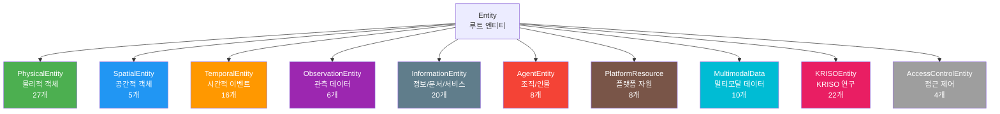
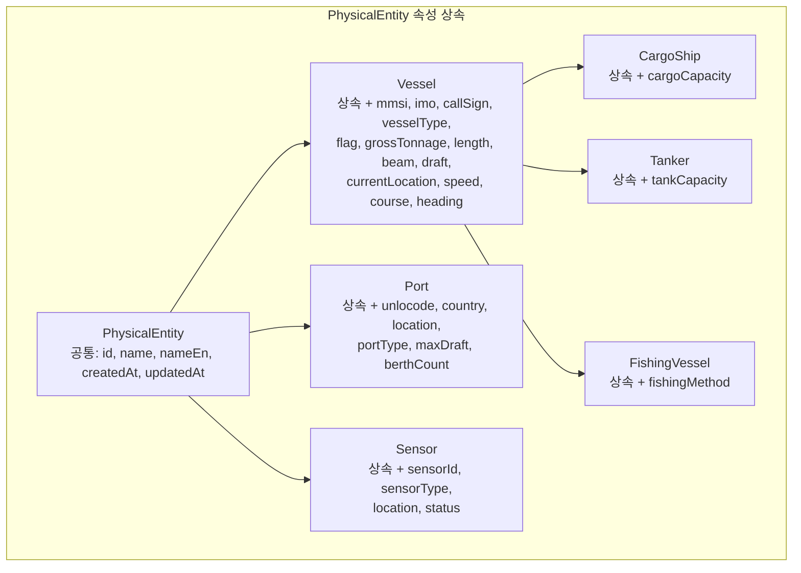
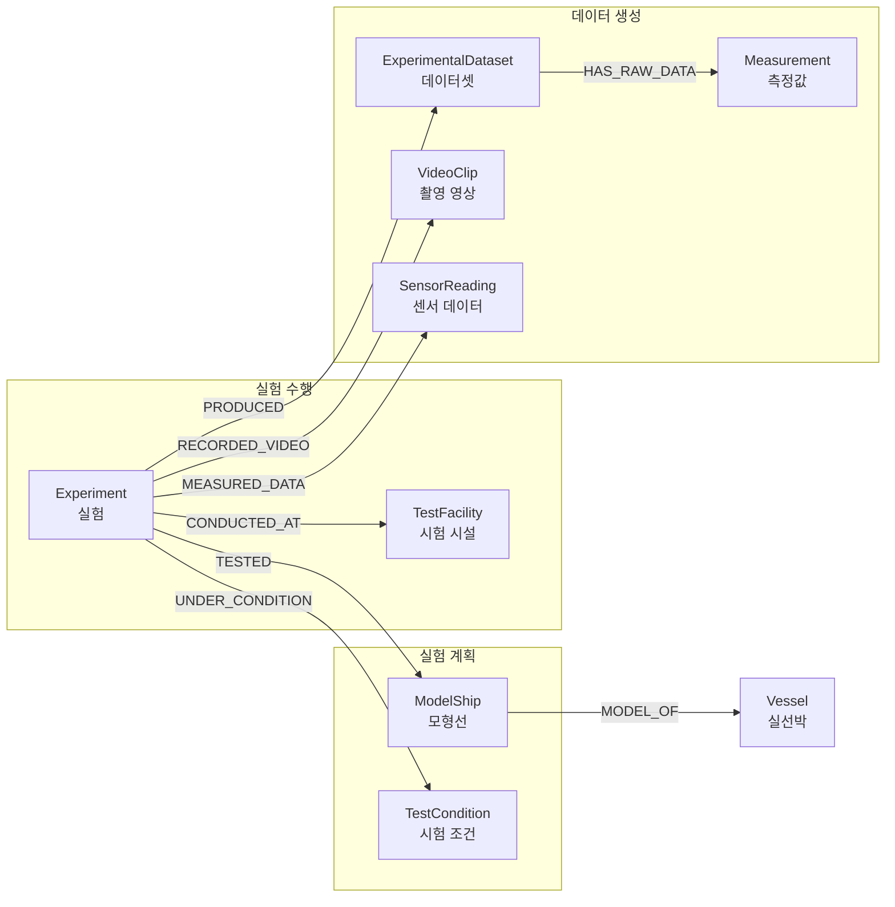
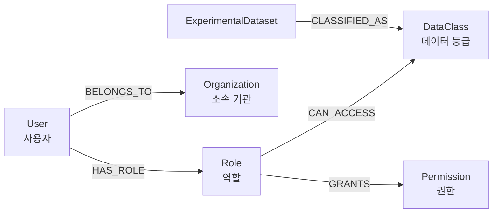
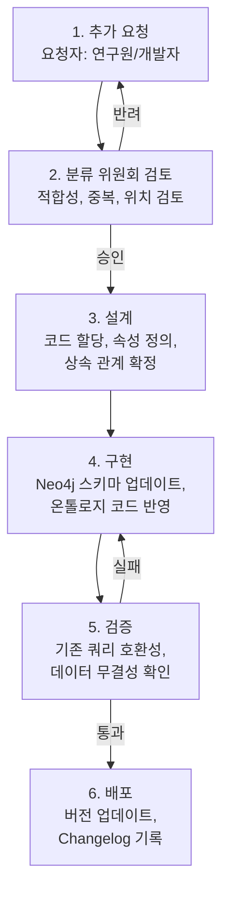

# DES-005: 해사 도메인 분류체계(Taxonomy) 설계서

| 항목 | 내용 |
|------|------|
| **과업명** | KRISO 대화형 해사서비스 플랫폼 KG 모델 설계 연구 |
| **문서 ID** | DES-005 |
| **버전** | 1.0 |
| **작성일** | 2026-02-09 |
| **분류** | 온톨로지 설계서 (납품물 #3 일부) |
| **관련 문서** | REQ-004 (IHO S-100 표준 분석), PRD v1.0 |

---

## 목차

1. [개요](#1-개요)
2. [분류 체계 설계 원칙](#2-분류-체계-설계-원칙)
3. [최상위 분류 (Top-Level Taxonomy)](#3-최상위-분류-top-level-taxonomy)
4. [그룹별 상세 분류](#4-그룹별-상세-분류)
5. [코드 체계 (Code System)](#5-코드-체계-code-system)
6. [Neo4j 구현 전략](#6-neo4j-구현-전략)
7. [S-100 분류 체계 매핑](#7-s-100-분류-체계-매핑)
8. [분류 체계 거버넌스](#8-분류-체계-거버넌스)
9. [데이터 리니지 관리 연계](#9-데이터-리니지-관리-연계)
10. [참고문헌](#10-참고문헌)

---

## 1. 개요

### 1.1 분류체계(Taxonomy)의 정의

분류체계(Taxonomy)는 도메인 내 개체(Entity)를 **계층적으로 조직화**하는 체계이다. 온톨로지(Ontology)가 개체 간의 속성, 관계, 제약조건을 포함하는 포괄적인 지식 표현 체계라면, 분류체계는 온톨로지의 **is-a(상위-하위) 계층 구조**에 집중하는 하위 구조이다.

| 개념 | 범위 | 예시 |
|------|------|------|
| **분류체계 (Taxonomy)** | 계층적 분류 (is-a 관계) | Vessel > CargoShip > ContainerShip |
| **온톨로지 (Ontology)** | 분류 + 속성 + 관계 + 제약 | Vessel has mmsi, DOCKED_AT Berth |
| **지식그래프 (Knowledge Graph)** | 온톨로지 + 인스턴스 데이터 | 특정 선박 "한진부산" 노드 |

본 문서에서 정의하는 분류체계는 KRISO 해사 지식그래프의 **126개 엔티티 레이블**을 10개 최상위 그룹 아래 계층적으로 분류하며, 각 레이블의 상속 관계와 분류 기준을 명시한다.

### 1.2 설계 목적

본 분류체계 설계의 목적은 다음과 같다.

1. **체계적 엔티티 관리**: 126개 엔티티를 논리적으로 조직화하여 스키마의 일관성 확보
2. **속성 상속 설계**: 상위 타입의 공통 속성을 하위 타입이 자동으로 상속받는 구조 정립
3. **Neo4j 다중 레이블 전략**: Property Graph의 다중 레이블(Multi-label) 기능을 활용한 효율적 분류 계층 구현
4. **S-100 표준 호환**: IHO S-100 Feature Catalogue의 분류 체계와 상호 매핑 가능한 구조 확보
5. **확장 가능성 보장**: 2차년도 이후 신규 엔티티 추가를 수용하는 코드 체계 및 거버넌스 확립

### 1.3 분류 범위

```
전체 엔티티: 126개 레이블
최상위 그룹: 10개
하위 계층:   최대 3단계 (Group > Type > Subtype)
관계 타입:   45개 (분류 외, 별도 관계 설계서에서 정의)
```

---

## 2. 분류 체계 설계 원칙

### 2.1 표준 준수 원칙

본 분류체계는 다음 국제 표준을 준수한다.

| 표준 | 적용 영역 | 준수 내용 |
|------|-----------|-----------|
| **ISO 11179** | Metadata Registry | 메타데이터 요소의 명명 규칙, 정의 규칙, 식별자 체계 |
| **ISO 19109** | GFM (General Feature Model) | Feature Type의 분류 및 상속 구조 |
| **IHO S-100** | Feature Catalogue | 해사 Feature Type의 분류 체계 호환 |
| **W3C SKOS** | 분류 체계 표현 | broader/narrower 관계를 통한 계층 표현 |

#### ISO 11179 명명 규칙 적용

ISO 11179에 따라 모든 엔티티 레이블은 다음 규칙을 따른다.

| 규칙 | 내용 | 예시 |
|------|------|------|
| **유일성 (Uniqueness)** | 동일 스코프 내 중복 이름 불가 | `Vessel`과 `Ship`은 공존 불가 |
| **의미 명확성 (Semantic clarity)** | 이름만으로 의미를 파악 가능 | `CargoShip` (O) vs `CS01` (X) |
| **용어 일관성 (Consistency)** | 동일 개념에 동일 용어 사용 | Port/Harbour 혼용 금지 |
| **복합어 규칙 (Compound naming)** | PascalCase, 수식어+핵심어 | `DangerousGoods`, `FishingVessel` |

### 2.2 단일 상속 원칙

분류체계의 is-a 계층은 **단일 상속(Single Inheritance)**을 기본 원칙으로 한다. 이는 분류의 모호성을 방지하고, 각 엔티티의 상위 분류 경로가 유일하도록 보장한다.

```
원칙: 각 엔티티는 정확히 하나의 부모 타입(parent type)만 가진다.
보완: Neo4j의 다중 레이블(Multi-label) 기능으로 다면 분류를 지원한다.
```

**단일 상속 예시:**

```
PhysicalEntity
└── Vessel                  (parent: PhysicalEntity)
    ├── CargoShip            (parent: Vessel)
    ├── Tanker               (parent: Vessel)
    ├── FishingVessel        (parent: Vessel)
    ├── PassengerShip        (parent: Vessel)
    ├── NavalVessel          (parent: Vessel)
    └── AutonomousVessel     (parent: Vessel)
```

**다중 레이블 보완 예시:**

```cypher
-- 자율운항 화물선은 단일 상속으로는 CargoShip 또는 AutonomousVessel 중 하나만 선택
-- Neo4j 다중 레이블로 두 분류를 동시에 표현
CREATE (v:Vessel:CargoShip:AutonomousVessel:PhysicalEntity {
    name: "MASS-Container-01",
    vesselType: "AutonomousCargoShip"
})
```

### 2.3 분류 기준의 일관성

각 계층에서의 분류 기준(Classification Criterion)을 명시하고, 동일 계층에서는 동일한 분류 기준을 적용한다.

| 계층 | 분류 기준 | 설명 |
|------|-----------|------|
| **Level 0** | 존재론적 범주 (Ontological Category) | 물리적/공간적/시간적/정보적 등 |
| **Level 1** | 기능적 역할 (Functional Role) | 선박/항만/수로/화물/센서 등 |
| **Level 2** | 운용 특성 (Operational Characteristic) | 화물선/유조선/어선 등 |

### 2.4 확장 가능한 코드 체계

모든 엔티티에 체계적인 분류 코드를 부여하여, 신규 엔티티 추가 시에도 코드 체계가 유지되도록 한다. 코드 설계는 [5장](#5-코드-체계-code-system)에서 상세히 기술한다.

### 2.5 다국어 지원

모든 엔티티 레이블은 **영어(기본)**와 **한국어(보조)**로 이중 명명한다.

| 영어 레이블 | 한국어 명칭 | 비고 |
|------------|-----------|------|
| `Vessel` | 선박 | Neo4j 레이블은 영어 사용 |
| `CargoShip` | 화물선 | 다국어 레이블은 속성으로 저장 |
| `Port` | 항만 | |
| `Experiment` | 실험 | KRISO 도메인 |

```cypher
-- 다국어 레이블 저장 패턴
CREATE (v:Vessel:CargoShip:PhysicalEntity {
    name: "한진부산",
    nameEn: "Hanjin Busan",
    labelKo: "화물선",
    labelEn: "Cargo Ship"
})
```

---

## 3. 최상위 분류 (Top-Level Taxonomy)

### 3.1 최상위 분류 구조

KRISO 해사 지식그래프의 126개 엔티티는 10개 최상위 그룹으로 분류된다. 이 분류는 존재론적 범주(Ontological Category)에 기반한다.

```
Entity (루트)
├── PhysicalEntity          물리적 객체        (27개)
├── SpatialEntity           공간적 객체         (5개)
├── TemporalEntity          시간적 이벤트       (16개)
├── ObservationEntity       관측 데이터         (6개)
├── InformationEntity       정보/문서/서비스    (20개)
├── AgentEntity             조직/인물           (8개)
├── PlatformResource        플랫폼 자원         (8개)
├── MultimodalData          멀티모달 데이터     (10개)
├── KRISOEntity             KRISO 연구         (22개)
└── AccessControlEntity     접근 제어           (4개)
                                          합계: 126개
```

### 3.2 최상위 분류 설계 근거

| 그룹 | 존재론적 근거 | S-100 대응 | 비고 |
|------|-------------|-----------|------|
| **PhysicalEntity** | 물리적 실체가 있는 객체 | Feature Type (Physical) | 선박, 항만, 센서 등 |
| **SpatialEntity** | 공간적 범위를 가진 영역 | Feature Type (Area) | 해역, EEZ 등 |
| **TemporalEntity** | 시간 범위를 가진 사건/활동 | - | 항차, 사고, 활동 등 |
| **ObservationEntity** | 센서에 의한 관측 기록 | Observation (SSN/SOSA 패턴) | AIS, SAR, CCTV 관측 |
| **InformationEntity** | 비물리적 정보 객체 | Information Type (S-100) | 규정, 문서, 서비스 등 |
| **AgentEntity** | 행위 주체 (조직/인물) | - | 해운사, 선원, 검사관 |
| **PlatformResource** | 플랫폼 운영 자원 | - | 워크플로우, AI 모델 등 |
| **MultimodalData** | 멀티모달 원천 데이터 | - | AIS 데이터, 위성영상 등 |
| **KRISOEntity** | KRISO 고유 연구 객체 | - | 실험, 시설, 모형선 등 |
| **AccessControlEntity** | 접근 제어 메타데이터 | - | 사용자, 역할, 권한 |

### 3.3 최상위 분류 다이어그램



---

## 4. 그룹별 상세 분류

### 4.1 PhysicalEntity (물리적 객체) - 27개

물리적으로 실체가 있는 객체를 분류한다. 해사 도메인에서 가장 핵심적인 그룹으로, 선박, 항만 인프라, 수로, 화물, 센서를 포함한다.

#### 4.1.1 분류 계층도

```
PhysicalEntity (물리적 객체)
├── Vessel (선박)
│   ├── CargoShip (화물선)
│   ├── Tanker (유조선/탱커)
│   ├── FishingVessel (어선)
│   ├── PassengerShip (여객선)
│   ├── NavalVessel (군함/경비함)
│   └── AutonomousVessel (자율운항선박, MASS)
├── Port (항만)
│   ├── TradePort (무역항)
│   ├── CoastalPort (연안항)
│   └── FishingPort (어항)
├── PortInfrastructure (항만 인프라) [분류 그룹]
│   ├── PortFacility (항만 시설)
│   ├── Berth (선석)
│   ├── Anchorage (투묘지)
│   └── Terminal (터미널)
├── Waterway (수로)
│   ├── TSS (통항분리대)
│   └── Channel (항로)
├── Cargo (화물)
│   ├── DangerousGoods (위험물)
│   ├── BulkCargo (산적화물)
│   └── ContainerCargo (컨테이너화물)
└── Sensor (센서)
    ├── AISTransceiver (AIS 송수신기)
    ├── Radar (레이더)
    ├── CCTVCamera (CCTV 카메라)
    └── WeatherStation (기상관측소)
```

#### 4.1.2 분류 기준

| 분류 수준 | 기준 | 설명 |
|-----------|------|------|
| Level 1 (Vessel, Port, ...) | **기능적 역할** | 해사 운영에서의 역할로 구분 |
| Level 2 (CargoShip, TradePort, ...) | **운용 특성** | 용도, 적재 화물, 운항 형태 등 |

#### 4.1.3 Vessel 하위 분류 상세

| 엔티티 | 한국어 | 분류 기준 | 속성 상속 | 고유 속성 예시 |
|--------|--------|-----------|-----------|---------------|
| **CargoShip** | 화물선 | 화물 운송 목적 | Vessel 전체 속성 | `cargoCapacity`, `containerTEU` |
| **Tanker** | 유조선 | 액체 화물 운송 | Vessel 전체 속성 | `tankCapacity`, `cargoGrade` |
| **FishingVessel** | 어선 | 어업 활동 목적 | Vessel 전체 속성 | `fishingMethod`, `catchArea` |
| **PassengerShip** | 여객선 | 여객 운송 목적 | Vessel 전체 속성 | `passengerCapacity`, `routeType` |
| **NavalVessel** | 군함/경비함 | 군사/경비 목적 | Vessel 전체 속성 | `navalClass`, `armament` |
| **AutonomousVessel** | 자율운항선박 | 무인/원격 운항 | Vessel 전체 속성 | `autonomyLevel`, `remoteControlCenter` |

**IMO MASS 자율등급 (AutonomousVessel):**

| 자율 등급 | 설명 | `autonomyLevel` 값 |
|-----------|------|---------------------|
| Degree 1 | 선원 탑승, 일부 자동화 | `ASSISTED` |
| Degree 2 | 원격 제어, 선원 탑승 | `REMOTE_CREWED` |
| Degree 3 | 원격 제어, 무인 | `REMOTE_UNCREWED` |
| Degree 4 | 완전 자율 | `FULLY_AUTONOMOUS` |

#### 4.1.4 Port 하위 분류 상세

| 엔티티 | 한국어 | 분류 기준 | 한국 기준법 |
|--------|--------|-----------|------------|
| **TradePort** | 무역항 | 국제 무역 화물 처리 | 항만법 제2조 |
| **CoastalPort** | 연안항 | 연안 화물 및 여객 | 항만법 제2조 |
| **FishingPort** | 어항 | 어선 입출항 및 어획물 양하 | 어촌어항법 제2조 |

#### 4.1.5 Sensor 하위 분류 상세

| 엔티티 | 한국어 | 관측 모달리티 | 출력 데이터 |
|--------|--------|-------------|------------|
| **AISTransceiver** | AIS 송수신기 | RF 신호 | 위치, 속도, 선박 식별 |
| **Radar** | 레이더 | 전파 반사 | 타겟 탐지, 거리/방위 |
| **CCTVCamera** | CCTV 카메라 | 가시광선 | 영상 프레임 |
| **WeatherStation** | 기상관측소 | 복합 센서 | 풍속, 기압, 습도 등 |

#### 4.1.6 속성 상속 관계



---

### 4.2 SpatialEntity (공간적 객체) - 5개

공간적 범위를 가진 해양 영역 및 지리적 지점을 분류한다.

#### 4.2.1 분류 계층도

```
SpatialEntity (공간적 객체)
├── SeaArea (해역)
│   ├── EEZ (배타적 경제수역)
│   └── TerritorialSea (영해)
├── CoastalRegion (연안 지역)
└── GeoPoint (지리적 좌표)
```

#### 4.2.2 분류 기준

| 분류 수준 | 기준 | 설명 |
|-----------|------|------|
| Level 1 | **공간 차원** | 면적(Area) vs 선형(Region) vs 점(Point) |
| Level 2 | **법적 지위** | UNCLOS 기반 해양 관할권 구분 |

#### 4.2.3 상세 설명

| 엔티티 | 한국어 | 공간 유형 | 법적 근거 | S-100 대응 |
|--------|--------|-----------|-----------|-----------|
| **SeaArea** | 해역 | Polygon | 일반 | S-101 Area |
| **EEZ** | 배타적 경제수역 | Polygon | UNCLOS 제5부 (200해리) | S-101 RestrictedArea |
| **TerritorialSea** | 영해 | Polygon | UNCLOS 제2부 (12해리) | S-101 RestrictedArea |
| **CoastalRegion** | 연안 지역 | Polygon | 행정구역 | - |
| **GeoPoint** | 지리적 좌표 | Point | - | S-100 GM_Point |

**UNCLOS 해양 관할권 계층:**

```
기선 (Baseline)
├── 내수 (Internal Waters)           ← 기선 이내
├── TerritorialSea (영해)            ← 12 NM
├── 접속수역 (Contiguous Zone)       ← 24 NM
├── EEZ (배타적 경제수역)             ← 200 NM
└── 공해 (High Seas)                 ← 200 NM 이원
```

---

### 4.3 TemporalEntity (시간적 이벤트) - 16개

시간 범위를 가진 사건, 활동, 상태를 분류한다. 해사 운영의 시간 축을 표현하는 핵심 그룹이다.

#### 4.3.1 분류 계층도

```
TemporalEntity (시간적 이벤트)
├── OperationalEvent (운항 이벤트) [분류 그룹]
│   ├── Voyage (항차)
│   ├── PortCall (입출항)
│   └── TrackSegment (항적 구간)
├── Incident (해양 사고)
│   ├── Collision (충돌)
│   ├── Grounding (좌초)
│   ├── Pollution (오염)
│   ├── Distress (조난)
│   └── IllegalFishing (불법어업)
├── Activity (선박 활동)
│   ├── Loading (하역-적재)
│   ├── Unloading (하역-양하)
│   ├── Bunkering (급유)
│   ├── Anchoring (투묘)
│   └── Loitering (배회)
└── WeatherCondition (기상 상태)
```

#### 4.3.2 분류 기준

| 분류 수준 | 기준 | 설명 |
|-----------|------|------|
| Level 1 | **사건의 성격** | 정상 운항 / 비정상 사건 / 활동 / 환경 |
| Level 2 | **사고 유형 또는 활동 유형** | IMO 사고 분류 또는 항만 운영 활동 분류 |

#### 4.3.3 Incident 하위 분류 상세

| 엔티티 | 한국어 | IMO 사고 유형 코드 | 심각도 등급 |
|--------|--------|-------------------|------------|
| **Collision** | 충돌 | COLL | Critical / Major / Minor |
| **Grounding** | 좌초 | GRND | Critical / Major |
| **Pollution** | 오염 | POLL | Critical / Major / Minor |
| **Distress** | 조난 | DIST | Critical |
| **IllegalFishing** | 불법어업 (IUU) | IUU | Major / Minor |

**속성 상속:** 모든 Incident 하위 타입은 `Incident`의 속성(`incidentId`, `date`, `location`, `severity`, `description`, `casualties`, `resolved` 등)을 상속받는다.

#### 4.3.4 Activity 하위 분류 상세

| 엔티티 | 한국어 | 활동 장소 | 탐지 방법 |
|--------|--------|-----------|-----------|
| **Loading** | 적재 | 항내 (Berth/Terminal) | 항만 시스템, AIS 정박 |
| **Unloading** | 양하 | 항내 (Berth/Terminal) | 항만 시스템, AIS 정박 |
| **Bunkering** | 급유 | 항내/앵커리지 | AIS 패턴, 보고 |
| **Anchoring** | 투묘 | 투묘지 | AIS 속도=0, 위치 일정 |
| **Loitering** | 배회 | 해상 | AIS 이상 패턴 탐지 |

#### 4.3.5 시간 속성 패턴

모든 TemporalEntity는 OWL-Time 패턴에 따라 시간 속성을 포함한다.

| 패턴 | 속성 | 타입 | 예시 |
|------|------|------|------|
| **시점 (Instant)** | `timestamp` | DATETIME | 사고 발생 시각 |
| **구간 (Interval)** | `startTime`, `endTime` | DATETIME | 항차 시작~종료 |
| **기간 (Duration)** | `duration` | FLOAT (hours) | 투묘 기간 |

---

### 4.4 ObservationEntity (관측 데이터) - 6개

센서에 의해 생성된 관측 기록을 분류한다. W3C SSN/SOSA 온톨로지의 `sosa:Observation` 패턴을 따른다.

#### 4.4.1 분류 계층도

```
ObservationEntity (관측 데이터)
├── SARObservation (SAR 위성 관측)
├── OpticalObservation (광학 위성 관측)
├── CCTVObservation (CCTV 관측)
├── AISObservation (AIS 위치 보고)
├── RadarObservation (레이더 관측)
└── WeatherObservation (기상 관측)
```

#### 4.4.2 분류 기준

| 분류 기준 | 설명 |
|-----------|------|
| **관측 모달리티 (Modality)** | 센서의 물리적 관측 방식으로 구분 |

| 엔티티 | 한국어 | 모달리티 | 공간 해상도 | 시간 해상도 | SSN/SOSA 매핑 |
|--------|--------|---------|------------|------------|--------------|
| **SARObservation** | SAR 관측 | 합성개구레이더 | 1~10m | 수일 | `sosa:Observation` |
| **OpticalObservation** | 광학 관측 | 가시광/적외선 | 0.5~10m | 수일 | `sosa:Observation` |
| **CCTVObservation** | CCTV 관측 | 가시광선 | - | 연속 | `sosa:Observation` |
| **AISObservation** | AIS 관측 | RF 수신 | - | 2~10초 | `sosa:Observation` |
| **RadarObservation** | 레이더 관측 | 전파 반사 | 수m | 수초 | `sosa:Observation` |
| **WeatherObservation** | 기상 관측 | 복합 센서 | 관측소 단위 | 1시간 | `sosa:Observation` |

#### 4.4.3 속성 상속

모든 ObservationEntity는 공통 `Observation` 속성을 상속받는다.

```
Observation (공통 속성)
├── observationId: STRING (PK)
├── timestamp: DATETIME
├── location: POINT
├── source: STRING
├── modalityType: STRING
├── confidence: FLOAT
├── rawDataPath: STRING
├── visualEmbedding: LIST<FLOAT>
└── fusedEmbedding: LIST<FLOAT>
```

---

### 4.5 InformationEntity (정보/문서/서비스) - 20개

비물리적 정보 객체를 분류한다. 규정, 문서, 데이터소스, 서비스의 4개 하위 분류를 포함한다.

#### 4.5.1 분류 계층도

```
InformationEntity (정보/문서/서비스)
├── Regulation (규정)
│   ├── COLREG (국제해상충돌예방규칙)
│   ├── SOLAS (해상인명안전협약)
│   ├── MARPOL (해양오염방지협약)
│   └── IMDGCode (위험물운송규칙)
├── Document (문서)
│   ├── AccidentReport (사고보고서)
│   ├── InspectionReport (검사보고서)
│   ├── NavigationalWarning (항행경보)
│   └── CargoManifest (화물적하목록)
├── DataSource (데이터 소스)
│   ├── APIEndpoint (API 엔드포인트)
│   ├── StreamSource (스트리밍 소스)
│   └── FileSource (파일 소스)
└── Service (서비스)
    ├── QueryService (쿼리 서비스)
    ├── AnalysisService (분석 서비스)
    ├── AlertService (알림 서비스)
    └── PredictionService (예측 서비스)
```

#### 4.5.2 분류 기준

| 분류 수준 | 기준 | 설명 |
|-----------|------|------|
| Level 1 | **정보의 성격** | 법률적 규범 / 비정형 문서 / 데이터 소스 / 연산 서비스 |
| Level 2 | **용도 및 형식** | 구체적 문서 유형 또는 서비스 기능 |

#### 4.5.3 Regulation 하위 분류 상세

| 엔티티 | 한국어 | IMO 약어 | 적용 범위 |
|--------|--------|---------|-----------|
| **COLREG** | 국제해상충돌예방규칙 | COLREGs | 모든 선박의 항행 규칙 |
| **SOLAS** | 해상인명안전협약 | SOLAS | 선박 안전 장비 및 운항 |
| **MARPOL** | 해양오염방지협약 | MARPOL | 해양 오염 방지 (Annex I~VI) |
| **IMDGCode** | 위험물운송규칙 | IMDG | 위험물 해상 운송 |

#### 4.5.4 Service 하위 분류 상세

| 엔티티 | 한국어 | 기능 | 입력 | 출력 |
|--------|--------|------|------|------|
| **QueryService** | 쿼리 서비스 | 자연어 → Cypher 변환 | 자연어 질의 | Cypher 쿼리 결과 |
| **AnalysisService** | 분석 서비스 | 데이터 분석 연산 | KG 서브그래프 | 분석 결과 |
| **AlertService** | 알림 서비스 | 조건 기반 알림 생성 | 이벤트 스트림 | 알림 메시지 |
| **PredictionService** | 예측 서비스 | ML 기반 예측 | 시계열 데이터 | ETA, 리스크 점수 |

---

### 4.6 AgentEntity (조직/인물) - 8개

행위 주체(Agent)를 분류한다. W3C PROV-O의 `prov:Agent` 개념에 대응한다.

#### 4.6.1 분류 계층도

```
AgentEntity (조직/인물)
├── Organization (조직)
│   ├── GovernmentAgency (정부기관)
│   ├── ShippingCompany (해운회사)
│   ├── ResearchInstitute (연구기관)
│   └── ClassificationSociety (선급)
└── Person (개인)
    ├── CrewMember (선원)
    └── Inspector (검사관)
```

#### 4.6.2 분류 기준

| 분류 수준 | 기준 | 설명 |
|-----------|------|------|
| Level 1 | **행위 주체 유형** | 조직(법인) vs 개인(자연인) |
| Level 2 | **기능적 역할** | 조직의 성격 또는 개인의 직무 |

#### 4.6.3 Organization 하위 분류 상세

| 엔티티 | 한국어 | 예시 |
|--------|--------|------|
| **GovernmentAgency** | 정부기관 | 해양수산부, 해양경찰청, KHOA |
| **ShippingCompany** | 해운회사 | HMM, SM상선, 팬오션 |
| **ResearchInstitute** | 연구기관 | KRISO, KIOST, KMOU |
| **ClassificationSociety** | 선급 | KR, DNV, LR, BV, ABS |

---

### 4.7 PlatformResource (플랫폼 자원) - 8개

대화형 해사서비스 플랫폼의 운영 자원을 분류한다. 워크플로우, AI 모델, MCP 도구 등 플랫폼 내부 자원이다.

#### 4.7.1 분류 계층도

```
PlatformResource (플랫폼 자원)
├── WorkflowResource (워크플로우 자원) [분류 그룹]
│   ├── Workflow (워크플로우 정의)
│   ├── WorkflowNode (워크플로우 노드)
│   └── WorkflowExecution (워크플로우 실행)
├── AIModel (AI 모델)
├── DataPipeline (데이터 파이프라인)
├── AIAgent (AI 에이전트)
├── MCPTool (MCP 도구)
└── MCPResource (MCP 리소스)
```

#### 4.7.2 분류 기준

| 분류 기준 | 설명 |
|-----------|------|
| **자원의 기능적 역할** | 워크플로우 실행 / AI 추론 / 데이터 처리 / MCP 인터페이스 |

#### 4.7.3 MCP (Model Context Protocol) 관련 엔티티

| 엔티티 | 한국어 | 역할 | 예시 |
|--------|--------|------|------|
| **AIAgent** | AI 에이전트 | MCP 클라이언트 역할, 도구 호출 | 해사 QA 에이전트 |
| **MCPTool** | MCP 도구 | MCP 프로토콜로 노출된 도구 | `query_vessels`, `get_weather` |
| **MCPResource** | MCP 리소스 | MCP 프로토콜로 노출된 리소스 | 스키마 뷰, 데이터 뷰 |

---

### 4.8 MultimodalData (멀티모달 데이터) - 10개

다양한 모달리티의 원천 데이터와 벡터 임베딩을 분류한다.

#### 4.8.1 분류 계층도

```
MultimodalData (멀티모달 데이터)
├── RawData (원천 데이터) [분류 그룹]
│   ├── AISData (AIS 데이터 배치)
│   ├── SatelliteImage (위성 영상)
│   ├── RadarImage (레이더 영상)
│   ├── SensorReading (센서 측정값)
│   ├── MaritimeChart (해도)
│   └── VideoClip (비디오 클립)
└── EmbeddingVector (임베딩 벡터) [분류 그룹]
    ├── VisualEmbedding (시각 임베딩)
    ├── TrajectoryEmbedding (궤적 임베딩)
    ├── TextEmbedding (텍스트 임베딩)
    └── FusedEmbedding (융합 임베딩)
```

#### 4.8.2 분류 기준

| 분류 수준 | 기준 | 설명 |
|-----------|------|------|
| Level 1 | **데이터 형태** | 원천 데이터 vs 벡터 임베딩 |
| Level 2 | **모달리티** | AIS/위성/레이더/센서/해도/비디오 |

#### 4.8.3 RawData 상세

| 엔티티 | 한국어 | 모달리티 | 저장 형식 | 크기 특성 |
|--------|--------|---------|-----------|-----------|
| **AISData** | AIS 데이터 | 위치 시계열 | CSV/Parquet | 선박당 일 수천 건 |
| **SatelliteImage** | 위성 영상 | 광학/SAR | GeoTIFF/HDF5 | 장면당 수 GB |
| **RadarImage** | 레이더 영상 | 전파 영상 | TIFF | 프레임당 수 MB |
| **SensorReading** | 센서 측정값 | 수치 시계열 | JSON/CSV | 관측소당 시간 1건 |
| **MaritimeChart** | 해도 | 벡터 지도 | S-101 GML/HDF5 | 해도당 수 MB |
| **VideoClip** | 비디오 클립 | 동영상 | MP4/H.264 | 분당 수십 MB |

#### 4.8.4 EmbeddingVector 상세

| 엔티티 | 한국어 | 입력 모달리티 | 차원 | 용도 |
|--------|--------|-------------|------|------|
| **VisualEmbedding** | 시각 임베딩 | 영상/이미지 | 512~2048 | 선박 식별, 유사 영상 검색 |
| **TrajectoryEmbedding** | 궤적 임베딩 | AIS 궤적 | 128~512 | 이상 항적 탐지, 패턴 분류 |
| **TextEmbedding** | 텍스트 임베딩 | 문서/보고서 | 768~1536 | 문서 검색, QA |
| **FusedEmbedding** | 융합 임베딩 | 복합 모달리티 | 256~1024 | 크로스모달 매칭 |

---

### 4.9 KRISOEntity (KRISO 연구) - 22개

한국선박해양플랜트연구소(KRISO) 고유의 실험, 시설, 측정 관련 엔티티를 분류한다. 본 그룹은 타 해사 KG와 차별화되는 KRISO 플랫폼의 고유 요소이다.

#### 4.9.1 분류 계층도

```
KRISOEntity (KRISO 연구)
├── Experiment (실험)
├── TestFacility (시험 시설)
│   ├── TowingTank (예인수조)
│   ├── OceanEngineeringBasin (해양공학수조)
│   ├── IceTank (빙해수조)
│   ├── DeepOceanBasin (심해공학수조)
│   ├── WaveEnergyTestSite (파력발전 시험장)
│   ├── HyperbaricChamber (고압 챔버)
│   └── CavitationTunnel (캐비테이션 터널)
│       ├── LargeCavitationTunnel (대형 캐비테이션터널)
│       ├── MediumCavitationTunnel (중형 캐비테이션터널)
│       └── HighSpeedCavitationTunnel (고속 캐비테이션터널)
├── BridgeSimulator (선박운항시뮬레이터)
├── ExperimentalDataset (실험 데이터셋)
├── TestCondition (시험 조건)
├── ModelShip (모형선)
└── Measurement (측정값)
    ├── Resistance (저항 측정)
    ├── Propulsion (추진 측정)
    ├── Maneuvering (조종 측정)
    ├── Seakeeping (내항성능 측정)
    ├── IcePerformance (빙중성능 측정)
    └── StructuralResponse (구조응답 측정)
```

#### 4.9.2 분류 기준

| 분류 수준 | 기준 | 설명 |
|-----------|------|------|
| Level 1 | **연구 활동 역할** | 실험/시설/데이터/조건/모형/측정 |
| Level 2 (TestFacility) | **시설 유형** | 물리적 시험 환경 |
| Level 2 (Measurement) | **측정 물리량** | 저항/추진/조종/내항/빙중/구조 |

#### 4.9.3 TestFacility 하위 분류 상세

| 엔티티 | 한국어 | 주요 시험 | 규모 |
|--------|--------|-----------|------|
| **TowingTank** | 예인수조 | 저항/추진 시험 | L200m x W16m x D7m |
| **OceanEngineeringBasin** | 해양공학수조 | 내항성능, 파랑 중 거동 | L56m x W30m x D4.5m |
| **IceTank** | 빙해수조 | 빙중 저항, 쇄빙 성능 | L42m x W32m x D2.5m |
| **DeepOceanBasin** | 심해공학수조 | 심해 구조물 거동 | L50m x W30m x D15m |
| **WaveEnergyTestSite** | 파력발전 시험장 | 파력발전기 실해역 시험 | 실해역 |
| **HyperbaricChamber** | 고압 챔버 | 심해 장비 내압 시험 | 가압 능력에 따름 |
| **CavitationTunnel** | 캐비테이션 터널 | 프로펠러 캐비테이션 시험 | 복수 규모 |
| **BridgeSimulator** | 선박운항시뮬레이터 | 항행 시뮬레이션, 훈련 | Full Mission 급 |

**CavitationTunnel 세부 분류:**

| 엔티티 | 한국어 | 시험 영역 단면 | 최대 유속 |
|--------|--------|---------------|-----------|
| **LargeCavitationTunnel** | 대형 캐비테이션터널 | 대형 프로펠러 모형 | ~15 m/s |
| **MediumCavitationTunnel** | 중형 캐비테이션터널 | 중형 프로펠러 모형 | ~12 m/s |
| **HighSpeedCavitationTunnel** | 고속 캐비테이션터널 | 고속 유동 현상 | ~20+ m/s |

#### 4.9.4 Measurement 하위 분류 상세

| 엔티티 | 한국어 | 측정 물리량 | 관련 시설 |
|--------|--------|-----------|-----------|
| **Resistance** | 저항 측정 | 총저항, 마찰저항, 잔여저항 | TowingTank |
| **Propulsion** | 추진 측정 | 추력, 토크, 효율, RPM | TowingTank, CavitationTunnel |
| **Maneuvering** | 조종 측정 | 선회경, 회두각속도, Z-test | TowingTank, BridgeSimulator |
| **Seakeeping** | 내항성능 측정 | 운동응답(RAO), 상대수위, 가속도 | OceanEngineeringBasin |
| **IcePerformance** | 빙중성능 측정 | 빙저항, 쇄빙패턴, 빙하중 | IceTank |
| **StructuralResponse** | 구조응답 측정 | 응력, 변형, 피로하중 | DeepOceanBasin |

#### 4.9.5 KRISO 실험 데이터 플로우



---

### 4.10 AccessControlEntity (접근 제어) - 4개

플랫폼의 RBAC(Role-Based Access Control) 메타데이터를 분류한다.

#### 4.10.1 분류 계층도

```
AccessControlEntity (접근 제어)
├── User (사용자)
├── Role (역할)
├── DataClass (데이터 등급)
└── Permission (권한)
```

#### 4.10.2 분류 기준

| 분류 기준 | 설명 |
|-----------|------|
| **RBAC 구성요소** | 주체(Subject) / 역할(Role) / 객체 등급(Object Class) / 권한(Permission) |

#### 4.10.3 RBAC 모델



#### 4.10.4 역할 및 데이터 등급 체계

**역할 체계:**

| Role | 한국어 | Level | 설명 |
|------|--------|-------|------|
| `admin` | 관리자 | 100 | 전체 시스템 관리 |
| `researcher` | 연구원 | 80 | KRISO 내부 연구 데이터 접근 |
| `developer` | 개발자 | 60 | 플랫폼 개발 및 API 접근 |
| `analyst` | 분석가 | 40 | 공개 데이터 분석 |
| `public` | 일반 사용자 | 20 | 공개 데이터 조회 |

**데이터 등급 체계:**

| DataClass | 한국어 | Level | 접근 가능 역할 |
|-----------|--------|-------|---------------|
| `confidential` | 대외비 | 100 | admin |
| `internal` | 내부 | 80 | admin, researcher |
| `restricted` | 제한 | 60 | admin, researcher, developer |
| `open` | 공개 | 20 | 전체 |

---

## 5. 코드 체계 (Code System)

### 5.1 분류 코드 설계

모든 엔티티에 체계적인 분류 코드를 부여하여 식별, 검색, 관리의 효율성을 확보한다.

#### 5.1.1 코드 구조

```
[그룹코드]-[타입코드]-[순번]

  그룹코드: 3자리 영문 대문자 (최상위 그룹 식별)
  타입코드: 3자리 영문 대문자 (Level 1 타입 식별)
  순번:     3자리 숫자         (동일 타입 내 순번)
```

**예시:**
```
PHY-VES-001  →  PhysicalEntity - Vessel (기본)
PHY-VES-002  →  PhysicalEntity - Vessel - CargoShip
PHY-VES-003  →  PhysicalEntity - Vessel - Tanker
TEM-INC-001  →  TemporalEntity - Incident (기본)
TEM-INC-002  →  TemporalEntity - Incident - Collision
KRI-FAC-001  →  KRISOEntity - TestFacility (기본)
KRI-FAC-002  →  KRISOEntity - TestFacility - TowingTank
```

#### 5.1.2 그룹 코드 할당표

| 코드 | 그룹 | 영문명 | 할당 범위 |
|------|------|--------|-----------|
| **PHY** | 물리적 객체 | PhysicalEntity | PHY-xxx-001~999 |
| **SPA** | 공간적 객체 | SpatialEntity | SPA-xxx-001~999 |
| **TEM** | 시간적 이벤트 | TemporalEntity | TEM-xxx-001~999 |
| **OBS** | 관측 데이터 | ObservationEntity | OBS-xxx-001~999 |
| **INF** | 정보/문서 | InformationEntity | INF-xxx-001~999 |
| **AGT** | 조직/인물 | AgentEntity | AGT-xxx-001~999 |
| **PLT** | 플랫폼 자원 | PlatformResource | PLT-xxx-001~999 |
| **MUL** | 멀티모달 | MultimodalData | MUL-xxx-001~999 |
| **KRI** | KRISO 연구 | KRISOEntity | KRI-xxx-001~999 |
| **ACC** | 접근 제어 | AccessControlEntity | ACC-xxx-001~999 |

#### 5.1.3 타입 코드 할당표

**PHY (PhysicalEntity):**

| 타입 코드 | Level 1 타입 | 순번 할당 |
|-----------|-------------|-----------|
| VES | Vessel | 001=Vessel, 002=CargoShip, 003=Tanker, 004=FishingVessel, 005=PassengerShip, 006=NavalVessel, 007=AutonomousVessel |
| PRT | Port | 001=Port, 002=TradePort, 003=CoastalPort, 004=FishingPort |
| INF | PortInfrastructure | 001=PortFacility, 002=Berth, 003=Anchorage, 004=Terminal |
| WAT | Waterway | 001=Waterway, 002=TSS, 003=Channel |
| CRG | Cargo | 001=Cargo, 002=DangerousGoods, 003=BulkCargo, 004=ContainerCargo |
| SEN | Sensor | 001=Sensor, 002=AISTransceiver, 003=Radar, 004=CCTVCamera, 005=WeatherStation |

**TEM (TemporalEntity):**

| 타입 코드 | Level 1 타입 | 순번 할당 |
|-----------|-------------|-----------|
| OPE | OperationalEvent | 001=Voyage, 002=PortCall, 003=TrackSegment |
| INC | Incident | 001=Incident, 002=Collision, 003=Grounding, 004=Pollution, 005=Distress, 006=IllegalFishing |
| ACT | Activity | 001=Activity, 002=Loading, 003=Unloading, 004=Bunkering, 005=Anchoring, 006=Loitering |
| WEA | Weather | 001=WeatherCondition |

**KRI (KRISOEntity):**

| 타입 코드 | Level 1 타입 | 순번 할당 |
|-----------|-------------|-----------|
| EXP | Experiment | 001=Experiment |
| FAC | TestFacility | 001=TestFacility, 002=TowingTank, 003=OceanEngineeringBasin, 004=IceTank, 005=DeepOceanBasin, 006=WaveEnergyTestSite, 007=HyperbaricChamber, 008=CavitationTunnel, 009=LargeCavitationTunnel, 010=MediumCavitationTunnel, 011=HighSpeedCavitationTunnel, 012=BridgeSimulator |
| DAT | ExperimentalData | 001=ExperimentalDataset, 002=TestCondition |
| MOD | Model | 001=ModelShip |
| MEA | Measurement | 001=Measurement, 002=Resistance, 003=Propulsion, 004=Maneuvering, 005=Seakeeping, 006=IcePerformance, 007=StructuralResponse |

### 5.2 S-100 코드 연계

각 엔티티의 분류 코드와 IHO S-100 Feature Code를 상호 매핑한다.

| 분류 코드 | 엔티티 | S-100 Feature Code | S-100 PS | 비고 |
|-----------|--------|-------------------|----------|------|
| PHY-INF-003 | Anchorage | ACHARE | S-101 | 직접 매핑 |
| PHY-INF-002 | Berth | - | S-101 | BerthingArea |
| PHY-WAT-002 | TSS | TSSRON | S-101 | 직접 매핑 |
| PHY-WAT-001 | Waterway | FAIRWY | S-101 | Fairway |
| SPA-xxx-001 | SeaArea | DEPARE | S-101 | 수심 영역 |
| SPA-xxx-002 | EEZ | RESARE | S-101 | 제한 구역 |

### 5.3 다국어 레이블 매핑

코드 체계에 다국어 레이블을 연동하여 한국어/영어 환경 모두에서 사용 가능하도록 한다.

| 분류 코드 | 영어 레이블 | 한국어 레이블 | 영어 설명 | 한국어 설명 |
|-----------|------------|-------------|-----------|------------|
| PHY-VES-001 | Vessel | 선박 | Any watercraft or ship | 해상에서 운항하는 모든 선박 |
| PHY-VES-002 | CargoShip | 화물선 | Vessel for transporting goods | 화물 운송 목적의 선박 |
| PHY-VES-003 | Tanker | 유조선 | Vessel for liquid cargo | 액체 화물(유류, 화학물질, LNG) 운송 선박 |
| PHY-PRT-001 | Port | 항만 | Harbour facility | 선박 접안 및 화물 하역 시설 |
| TEM-INC-001 | Incident | 해양사고 | Maritime incident or event | 해상에서 발생한 사고 또는 이벤트 |
| KRI-FAC-002 | TowingTank | 예인수조 | Towing tank facility | 저항/추진 시험용 예인수조 시설 |

---

## 6. Neo4j 구현 전략

### 6.1 다중 레이블(Multi-label)을 활용한 분류 계층 표현

Neo4j Property Graph에서 분류 계층을 표현하는 핵심 전략은 **다중 레이블(Multi-label)**이다. 하나의 노드에 여러 레이블을 부여하여 is-a 계층의 모든 조상 타입을 표현한다.

#### 6.1.1 레이블 부여 규칙

```
규칙: 노드에는 자신의 레이블과 모든 조상 레이블을 부여한다.
```

**적용 예시:**

```cypher
-- CargoShip 노드: CargoShip + Vessel + PhysicalEntity
CREATE (v:CargoShip:Vessel:PhysicalEntity {
    mmsi: 440123456,
    name: "한진부산",
    vesselType: "ContainerShip",
    taxonomyCode: "PHY-VES-002"
})

-- Collision 노드: Collision + Incident + TemporalEntity
CREATE (i:Collision:Incident:TemporalEntity {
    incidentId: "INC-2026-0042",
    date: datetime("2026-01-15T09:30:00Z"),
    severity: "Major",
    taxonomyCode: "TEM-INC-002"
})

-- TowingTank 노드: TowingTank + TestFacility + KRISOEntity
CREATE (f:TowingTank:TestFacility:KRISOEntity {
    facilityId: "KRISO-TT-001",
    name: "대형 예인수조",
    length: 200.0,
    width: 16.0,
    depth: 7.0,
    taxonomyCode: "KRI-FAC-002"
})

-- LargeCavitationTunnel: 3단계 계층
CREATE (f:LargeCavitationTunnel:CavitationTunnel:TestFacility:KRISOEntity {
    facilityId: "KRISO-LCT-001",
    name: "대형 캐비테이션터널",
    taxonomyCode: "KRI-FAC-009"
})
```

#### 6.1.2 레이블 기반 쿼리 패턴

다중 레이블의 가장 큰 이점은 계층적 쿼리가 자연스럽게 지원된다는 점이다.

```cypher
-- 1. 모든 선박 조회 (CargoShip, Tanker, ... 모두 포함)
MATCH (v:Vessel) RETURN v.name, labels(v)

-- 2. 화물선만 조회
MATCH (v:CargoShip) RETURN v.name

-- 3. 모든 물리적 객체 조회 (Vessel, Port, Sensor, ... 모두 포함)
MATCH (n:PhysicalEntity) RETURN n.name, labels(n)

-- 4. KRISO 시설 중 캐비테이션 터널만 조회
MATCH (f:CavitationTunnel) RETURN f.name, f.maxSpeed

-- 5. 모든 사고 유형 조회 (Collision, Grounding, ... 모두 포함)
MATCH (i:Incident) RETURN i.incidentId, i.severity, labels(i)

-- 6. 특정 레이블 조합으로 필터링
MATCH (v:Vessel:AutonomousVessel) RETURN v.name, v.autonomyLevel
```

### 6.2 SUBTYPE_OF 관계 사용 옵션

다중 레이블 외에, 명시적인 `SUBTYPE_OF` 관계를 사용하여 분류 계층을 관계로도 표현할 수 있다. 이는 분류 계층 자체를 질의하거나 탐색해야 하는 메타 레벨 작업에 유용하다.

#### 6.2.1 메타 스키마 노드 생성

```cypher
-- 분류 타입 메타 노드 생성
CREATE (phy:TaxonomyType {
    code: "PHY",
    name: "PhysicalEntity",
    nameKo: "물리적 객체",
    level: 0
})
CREATE (ves:TaxonomyType {
    code: "PHY-VES",
    name: "Vessel",
    nameKo: "선박",
    level: 1
})
CREATE (cs:TaxonomyType {
    code: "PHY-VES-002",
    name: "CargoShip",
    nameKo: "화물선",
    level: 2
})

-- SUBTYPE_OF 관계로 계층 연결
CREATE (cs)-[:SUBTYPE_OF]->(ves)-[:SUBTYPE_OF]->(phy)
```

#### 6.2.2 메타 스키마 활용 쿼리

```cypher
-- 특정 타입의 모든 하위 타입 조회
MATCH (parent:TaxonomyType {name: "Vessel"})<-[:SUBTYPE_OF*]-(child:TaxonomyType)
RETURN child.name, child.nameKo, child.level

-- 특정 엔티티의 분류 경로 조회
MATCH (n {mmsi: 440123456})
WITH n, labels(n) AS nodeLabels
MATCH (t:TaxonomyType)<-[:SUBTYPE_OF*0..3]-(leaf:TaxonomyType)
WHERE leaf.name IN nodeLabels
RETURN t.name, t.nameKo, t.level
ORDER BY t.level
```

### 6.3 쿼리 최적화 고려사항

#### 6.3.1 레이블 기반 인덱스 전략

Neo4j는 레이블 단위로 인덱스를 생성한다. 다중 레이블 사용 시 인덱스 전략이 중요하다.

```cypher
-- 최하위 레이블(Leaf Label)에 인덱스 생성 (권장)
CREATE INDEX cargo_ship_mmsi IF NOT EXISTS
FOR (v:CargoShip) ON (v.mmsi);

-- 중간 레이블에도 자주 쿼리하는 속성은 인덱스 생성
CREATE INDEX vessel_mmsi IF NOT EXISTS
FOR (v:Vessel) ON (v.mmsi);

-- 최상위 레이블 인덱스는 선택적 (노드 수가 많으면 비효율적)
-- PhysicalEntity 레이블의 인덱스는 필요 시에만 생성
```

#### 6.3.2 레이블 수 제한

과도한 레이블 수는 노드 저장 공간과 인덱스 성능에 영향을 미친다.

| 전략 | 최대 레이블 수 | 적용 시나리오 |
|------|--------------|-------------|
| **Minimal** | 2개 (Leaf + Group) | 성능 최우선 |
| **Standard** | 3~4개 (Leaf + 중간 + Group) | 권장 기본값 |
| **Full** | 모든 조상 포함 | 유연한 쿼리 우선 |

**본 프로젝트 권장: Standard 전략**

```cypher
-- Standard 전략 예시: CargoShip 노드
-- Leaf(CargoShip) + Middle(Vessel) + Group(PhysicalEntity) = 3개
CREATE (v:CargoShip:Vessel:PhysicalEntity { ... })

-- LargeCavitationTunnel: 4개
CREATE (f:LargeCavitationTunnel:CavitationTunnel:TestFacility:KRISOEntity { ... })
```

#### 6.3.3 레이블 스캔 성능

| 쿼리 패턴 | 성능 | 비고 |
|-----------|------|------|
| `MATCH (v:CargoShip)` | 최고 | Leaf 레이블, 노드 수 적음 |
| `MATCH (v:Vessel)` | 양호 | 중간 레이블, 인덱스 지원 시 |
| `MATCH (n:PhysicalEntity)` | 주의 | 최상위 레이블, 노드 수 많을 수 있음 |

---

## 7. S-100 분류 체계 매핑

### 7.1 S-100 Feature Catalogue 분류 체계

IHO S-100의 Feature Catalogue(FC)는 ISO 19109 General Feature Model(GFM)에 기반한 분류 체계를 제공한다. FC의 분류 구조를 KRISO KG 분류체계와 매핑한다.

#### 7.1.1 S-100 Feature Type 분류 구조

```
S-100 General Feature Model
├── Feature Type (지형지물 타입)
│   ├── Geo Feature (공간 지형지물)
│   │   ├── Point Feature
│   │   ├── Curve Feature
│   │   └── Surface Feature
│   └── Meta Feature (메타 지형지물)
│       └── Data Quality, Metadata 등
├── Information Type (정보 타입)
│   └── Authority, Source 등
└── Complex Attribute (복합 속성)
```

### 7.2 S-101 ENC 주요 Feature Type 매핑

S-101은 가장 핵심적인 S-100 Product Specification으로, 전자해도(ENC) 데이터의 Feature Type을 정의한다.

| S-101 Feature Type | S-101 코드 | 공간 유형 | KRISO 엔티티 | 분류 코드 | 매핑 유형 |
|-------------------|-----------|-----------|-------------|-----------|-----------|
| **Anchorage Area** | ACHARE | Surface | `Anchorage` | PHY-INF-003 | 직접 매핑 |
| **Berthing Area** | - | Surface | `Berth` | PHY-INF-002 | 직접 매핑 |
| **Fairway** | FAIRWY | Surface | `Waterway` | PHY-WAT-001 | 속성 구분 |
| **Traffic Separation Scheme** | TSSRON | Surface | `TSS` | PHY-WAT-002 | 직접 매핑 |
| **Depth Area** | DEPARE | Surface | `SeaArea` (속성) | SPA-xxx-001 | 속성 매핑 |
| **Restricted Area** | RESARE | Surface | `EEZ` / `SeaArea` | SPA-xxx-002 | 조건부 매핑 |
| **Light** | LIGHTS | Point | (확장 대상) | - | 2차년도 추가 |
| **Buoy** | BOYISD | Point | (확장 대상) | - | 2차년도 추가 |
| **Building** | BUISGL | Point/Surface | `PortFacility` | PHY-INF-001 | 조건부 매핑 |
| **Coastline** | COALNE | Curve | `CoastalRegion` (경계) | SPA-xxx-004 | 경계 매핑 |

### 7.3 S-100 → KRISO KG 매핑 유형

| 매핑 유형 | 설명 | 예시 |
|-----------|------|------|
| **직접 매핑** | S-100 Feature → KRISO 엔티티 1:1 대응 | Anchorage Area → `Anchorage` |
| **속성 매핑** | S-100 Feature의 속성이 KRISO 엔티티의 속성으로 매핑 | Depth Area → `SeaArea.depth` |
| **속성 구분** | S-100 Feature → KRISO 엔티티 + 속성 값으로 구분 | Fairway → `Waterway {waterwayType: "fairway"}` |
| **조건부 매핑** | S-100 Feature의 속성 값에 따라 다른 KRISO 엔티티로 매핑 | Restricted Area → `EEZ` (if type=EEZ) |
| **경계 매핑** | S-100 Feature의 공간 데이터가 KRISO 엔티티의 경계로 매핑 | Coastline → `CoastalRegion.boundary` |
| **미매핑** | 현재 KRISO 온톨로지에 대응 엔티티 없음 (확장 대상) | Light, Buoy → 2차년도 추가 |

### 7.4 S-100 속성 매핑 규칙

S-100 Feature의 속성(Attribute)을 KRISO KG 노드의 속성(Property)으로 변환하는 규칙이다.

```cypher
-- S-100 Feature 속성 → Neo4j 노드 속성 변환 규칙
-- 1. S-100 메타데이터는 s100_ 접두사로 보존
-- 2. 공간 데이터는 point() 또는 WKT로 변환
-- 3. 열거형(Enumeration)은 문자열로 저장

CREATE (a:Anchorage:PhysicalEntity {
    -- KRISO 고유 속성
    name: "부산항 제1투묘지",
    nameEn: "Busan Port Anchorage No.1",
    taxonomyCode: "PHY-INF-003",
    location: point({latitude: 35.0756, longitude: 129.0812}),

    -- S-100 원본 속성 보존
    s100_featureCode: "ACHARE",
    s100_productSpec: "S-101",
    s100_categoryOfAnchorage: "deep_water",
    s100_status: "permanent",
    s100_scaleMinimum: 22000,
    s100_dataQuality: "surveyed",
    s100_surveyDate: date("2024-06-15")
})
```

### 7.5 차이점 및 확장 전략

#### 7.5.1 KRISO KG vs S-100 FC 차이점

| 관점 | KRISO KG | S-100 Feature Catalogue |
|------|----------|------------------------|
| **범위** | 해사 전반 (운항, 연구, 플랫폼, RBAC) | 수로/항해 중심 |
| **모델** | Property Graph (Neo4j) | GFM → GML/HDF5 |
| **시간** | Temporal Entity로 명시적 모델링 | Feature 속성으로 시간 표현 |
| **관측** | ObservationEntity 별도 그룹 | Feature 속성의 일부 |
| **에이전트** | AgentEntity 별도 그룹 | Information Type으로 제한 |
| **멀티모달** | MultimodalData 별도 그룹 | 해당 없음 |
| **KRISO** | KRISOEntity 별도 그룹 | 해당 없음 |

#### 7.5.2 확장 전략 (2차년도)

| 확장 대상 | S-100 Feature | KRISO 엔티티 (신규) | 우선순위 |
|-----------|-------------|---------------------|---------|
| 항로표지 | Light, Buoy, Beacon | `AidToNavigation`, `Light`, `Buoy`, `Beacon` | P1 |
| 해저 지형 | SeabedArea, UnderwaterRock | `SeabedFeature` | P2 |
| 케이블/파이프라인 | Cable, Pipeline | `SubseaInfrastructure` | P3 |
| 수심 | DepthContour, SoundingDatum | `DepthMeasurement` | P2 |

---

## 8. 분류 체계 거버넌스

### 8.1 버전 관리 정책

#### 8.1.1 버전 체계

분류체계의 버전은 Semantic Versioning을 따른다.

```
MAJOR.MINOR.PATCH

MAJOR: 최상위 그룹 구조 변경 (호환성 깨짐)
MINOR: 신규 엔티티 추가 또는 하위 계층 변경
PATCH: 설명/코드 수정, 오류 정정
```

| 버전 | 변경 유형 | 예시 |
|------|-----------|------|
| 1.0.0 | 최초 릴리스 | 126개 엔티티, 10개 그룹 |
| 1.1.0 | 엔티티 추가 | Light, Buoy 추가 (128개) |
| 1.0.1 | 설명 수정 | CargoShip 한국어 설명 보완 |
| 2.0.0 | 그룹 구조 변경 | SpatialEntity 분리/통합 |

#### 8.1.2 변경 이력 관리

모든 변경은 변경 이력(Changelog)에 기록한다.

```markdown
## Changelog

### [1.0.0] - 2026-02-09
- Initial release
- 10 top-level groups, 126 entity labels
- Code system: [GROUP]-[TYPE]-[SEQ]
- S-100 mapping for S-101, S-104, S-111, S-127, S-411
```

### 8.2 신규 분류 추가 절차

#### 8.2.1 추가 프로세스



#### 8.2.2 검토 기준

신규 엔티티 추가 시 다음 기준을 검토한다.

| 검토 항목 | 기준 | 비고 |
|-----------|------|------|
| **필요성** | 기존 엔티티로 표현 불가능한가? | 기존 속성으로 구분 가능하면 추가 불필요 |
| **중복성** | 기존 엔티티와 의미적 중복이 없는가? | 동의어 방지 |
| **위치** | 적절한 상위 그룹과 타입이 있는가? | 단일 상속 원칙 준수 |
| **코드** | 코드 체계에 빈 순번이 있는가? | 999 초과 시 타입 코드 확장 검토 |
| **S-100 호환** | S-100 Feature Type 대응이 있는가? | 있으면 매핑 기록 |

### 8.3 2차년도 확장 계획

#### 8.3.1 확장 대상 엔티티 (예정)

| 그룹 | 신규 엔티티 후보 | 근거 | 우선순위 |
|------|----------------|------|---------|
| PhysicalEntity | `AidToNavigation`, `Light`, `Buoy`, `Beacon` | S-101 항로표지 매핑 | P1 |
| PhysicalEntity | `Tug`, `PilotVessel` | 항만 운영 선박 | P2 |
| SpatialEntity | `VTSArea`, `PilotageArea` | S-127 해상교통 관리 | P1 |
| SpatialEntity | `RestrictedArea`, `CautionArea` | S-101 제한/주의 구역 | P2 |
| TemporalEntity | `SAR_Operation` | 수색 구조 작전 | P2 |
| TemporalEntity | `PortCongestion` | 항만 혼잡 이벤트 | P3 |
| InformationEntity | `SafetyBroadcast` | S-124 항행경보 | P1 |
| MultimodalData | `DroneImage` | 드론 촬영 영상 | P2 |
| KRISOEntity | `DigitalTwin` | 디지털 트윈 모델 | P2 |

#### 8.3.2 확장 시 코드 할당 예시

```
PHY-NAV-001  →  AidToNavigation (항로표지) [신규 타입 코드]
PHY-NAV-002  →  Light (등대/등화)
PHY-NAV-003  →  Buoy (부표)
PHY-NAV-004  →  Beacon (입표)

SPA-VTS-001  →  VTSArea (VTS 관할 해역) [신규 타입 코드]
SPA-VTS-002  →  PilotageArea (도선 구역)
```

### 8.4 분류 체계 검증 도구

분류체계의 일관성을 자동 검증하는 도구를 운영한다.

#### 8.4.1 검증 규칙

| 규칙 | 설명 | 자동화 |
|------|------|--------|
| **단일 상속** | 모든 엔티티의 부모가 정확히 하나인가? | Python 스크립트 |
| **코드 유일성** | 분류 코드가 중복 없는가? | Python 스크립트 |
| **레이블 일관성** | Neo4j 레이블이 분류 계층과 일치하는가? | Cypher 검증 쿼리 |
| **속성 상속** | 하위 타입 노드가 상위 필수 속성을 포함하는가? | Cypher 검증 쿼리 |

#### 8.4.2 검증 Cypher 쿼리

```cypher
-- 1. 레이블 일관성 검증: Vessel 하위 타입이 반드시 Vessel 레이블을 가지는가
MATCH (n)
WHERE any(lbl IN labels(n) WHERE lbl IN
    ["CargoShip", "Tanker", "FishingVessel", "PassengerShip", "NavalVessel", "AutonomousVessel"])
  AND NOT "Vessel" IN labels(n)
RETURN n, labels(n) AS violating_labels

-- 2. 속성 상속 검증: Incident 하위 타입이 incidentId를 가지는가
MATCH (n)
WHERE any(lbl IN labels(n) WHERE lbl IN
    ["Collision", "Grounding", "Pollution", "Distress", "IllegalFishing"])
  AND n.incidentId IS NULL
RETURN n, labels(n) AS missing_incidentId

-- 3. 분류 코드 유일성 검증
MATCH (n)
WHERE n.taxonomyCode IS NOT NULL
WITH n.taxonomyCode AS code, count(*) AS cnt
WHERE cnt > 1
RETURN code, cnt AS duplicate_count
```

---

## 9. 데이터 리니지 관리 연계

### 9.1 리니지 관리 개요

#### 9.1.1 데이터 리니지(Data Lineage)의 정의

데이터 리니지(Data Lineage)란 데이터의 **기원(Origin)**, **이동 경로(Movement)**, **변환 이력(Transformation History)**을 추적하는 체계이다. 데이터가 어디서 생성되어, 어떤 처리 과정을 거쳐, 현재 상태에 이르렀는지를 계보(Genealogy) 형태로 기록한다.

| 개념 | 정의 | 예시 |
|------|------|------|
| **출처(Provenance)** | 데이터의 원본 출처 정보 | KRISO ScholarWorks API, 기상청 해양기상 API |
| **리니지(Lineage)** | 데이터의 전체 변환/이동 경로 | 크롤링 → 전처리 → 엔티티 추출 → KG 적재 |
| **감사 추적(Audit Trail)** | 데이터 접근 및 변경 이력 | 누가, 언제, 어떤 데이터를 조회/수정했는가 |

#### 9.1.2 분류체계와 리니지의 관계

분류체계(Taxonomy)는 리니지 추적에서 다음과 같은 핵심 역할을 수행한다.

1. **리니지 노드의 분류 기준**: 리니지 그래프에서 각 데이터 노드가 어떤 분류(DataClass)에 속하는지를 결정하여, 분류 등급별로 차별화된 리니지 기록 정책을 적용한다.
2. **계층적 리니지 집계**: 분류체계의 is-a 계층을 활용하여 상위 분류 수준에서의 리니지 요약(예: 모든 `PhysicalEntity` 관련 데이터의 출처 분포)을 제공한다.
3. **거버넌스 연계**: 분류 등급(DataClass)에 따라 리니지 기록의 상세 수준과 보존 기간을 차등 적용한다.

### 9.2 분류체계 기반 리니지 추적 모델

#### 9.2.1 리니지 관련 Neo4j 노드 설계

리니지 추적을 위해 다음 노드 타입을 정의한다.

| 노드 레이블 | 한국어 | 설명 | 주요 속성 |
|------------|--------|------|-----------|
| `DataLineage` | 데이터 리니지 | 리니지 추적의 단위 기록 | `lineageId`, `sourceSystem`, `transformType`, `createdAt`, `version` |
| `ETLPipeline` | ETL 파이프라인 | 데이터 변환/적재 파이프라인 정의 | `pipelineId`, `name`, `schedule`, `lastRunAt`, `status` |
| `DataSnapshot` | 데이터 스냅샷 | 특정 시점의 데이터 상태 기록 | `snapshotId`, `timestamp`, `recordCount`, `checksum` |

**`DataLineage` 노드 속성 상세:**

| 속성 | 타입 | 설명 | 예시 |
|------|------|------|------|
| `lineageId` | STRING | 리니지 고유 식별자 (PK) | `"LIN-2026-0001"` |
| `sourceSystem` | STRING | 원본 데이터 출처 시스템 | `"KRISO-ScholarWorks"`, `"KMA-Marine"` |
| `transformType` | STRING | 변환 유형 | `"CRAWL"`, `"PARSE"`, `"EXTRACT"`, `"LOAD"` |
| `createdAt` | DATETIME | 리니지 기록 생성 일시 | `datetime("2026-02-10T09:00:00Z")` |
| `version` | STRING | 변환 규칙/파이프라인 버전 | `"1.0.0"` |
| `description` | STRING | 변환 내용 설명 | `"HTML 파싱 및 메타데이터 추출"` |
| `inputRecordCount` | INTEGER | 입력 레코드 수 | `150` |
| `outputRecordCount` | INTEGER | 출력 레코드 수 | `142` |
| `errorCount` | INTEGER | 오류 발생 수 | `8` |

#### 9.2.2 리니지 관련 관계(Relationship) 설계

| 관계 타입 | 시작 노드 | 끝 노드 | 설명 | 속성 |
|-----------|-----------|---------|------|------|
| `DERIVED_FROM` | DataSnapshot / 엔티티 노드 | DataSnapshot / 엔티티 노드 | 데이터셋 간 파생 관계 | `derivedAt`, `method` |
| `TRANSFORMED_BY` | DataSnapshot | ETLPipeline | ETL 파이프라인에 의한 변환 참조 | `executionId`, `startedAt`, `completedAt` |
| `CLASSIFIED_AS` | DataSnapshot / 엔티티 노드 | DataClass | 분류체계/데이터 등급 연결 | `classifiedAt`, `classifiedBy` |
| `HAS_LINEAGE` | 엔티티 노드 | DataLineage | 엔티티에 리니지 기록 연결 | `recordedAt` |
| `PRODUCED_BY` | DataLineage | ETLPipeline | 리니지 기록을 생성한 파이프라인 | - |
| `SOURCED_FROM` | DataLineage | DataSource | 리니지의 원본 데이터 소스 | `fetchedAt`, `url` |

#### 9.2.3 리니지 그래프 구조 다이어그램

```mermaid
graph TD
    subgraph "원본 데이터 소스"
        DS1[DataSource<br/>KRISO ScholarWorks<br/>API]
        DS2[DataSource<br/>기상청 해양기상<br/>API]
        DS3[DataSource<br/>KMST 해양사고<br/>웹]
    end

    subgraph "ETL 파이프라인"
        ETL1[ETLPipeline<br/>kriso_papers<br/>크롤러]
        ETL2[ETLPipeline<br/>kma_marine<br/>크롤러]
        ETL3[ETLPipeline<br/>maritime_accidents<br/>크롤러]
    end

    subgraph "리니지 기록"
        LIN1[DataLineage<br/>LIN-2026-0001<br/>CRAWL]
        LIN2[DataLineage<br/>LIN-2026-0002<br/>EXTRACT]
        LIN3[DataLineage<br/>LIN-2026-0003<br/>LOAD]
    end

    subgraph "KG 엔티티"
        E1[Experiment<br/>:KRISOEntity<br/>실험 노드]
        E2[WeatherObservation<br/>:ObservationEntity<br/>기상 관측]
        E3[Collision<br/>:Incident:TemporalEntity<br/>충돌 사고]
    end

    subgraph "분류/접근 제어"
        DC1[DataClass<br/>INTERNAL]
        DC2[DataClass<br/>PUBLIC]
    end

    DS1 -->|SOURCED_FROM| LIN1
    DS2 -->|SOURCED_FROM| LIN2
    DS3 -->|SOURCED_FROM| LIN3

    LIN1 -->|PRODUCED_BY| ETL1
    LIN2 -->|PRODUCED_BY| ETL2
    LIN3 -->|PRODUCED_BY| ETL3

    E1 -->|HAS_LINEAGE| LIN1
    E2 -->|HAS_LINEAGE| LIN2
    E3 -->|HAS_LINEAGE| LIN3

    E1 -->|CLASSIFIED_AS| DC1
    E2 -->|CLASSIFIED_AS| DC2
    E3 -->|CLASSIFIED_AS| DC2

    LIN3 -->|DERIVED_FROM| LIN1

    style DS1 fill:#FF9800,color:#fff
    style DS2 fill:#FF9800,color:#fff
    style DS3 fill:#FF9800,color:#fff
    style ETL1 fill:#2196F3,color:#fff
    style ETL2 fill:#2196F3,color:#fff
    style ETL3 fill:#2196F3,color:#fff
    style LIN1 fill:#9C27B0,color:#fff
    style LIN2 fill:#9C27B0,color:#fff
    style LIN3 fill:#9C27B0,color:#fff
    style E1 fill:#4CAF50,color:#fff
    style E2 fill:#4CAF50,color:#fff
    style E3 fill:#4CAF50,color:#fff
    style DC1 fill:#9E9E9E,color:#fff
    style DC2 fill:#9E9E9E,color:#fff
```



#### 9.2.4 리니지 노드 생성 Cypher 예시

```cypher
-- DataLineage 노드 생성
CREATE (lin:DataLineage {
    lineageId: "LIN-2026-0001",
    sourceSystem: "KRISO-ScholarWorks",
    transformType: "CRAWL",
    createdAt: datetime("2026-02-10T09:00:00Z"),
    version: "1.0.0",
    description: "ScholarWorks 논문 메타데이터 크롤링",
    inputRecordCount: 150,
    outputRecordCount: 142,
    errorCount: 8
})

-- ETLPipeline 노드 생성
CREATE (etl:ETLPipeline:PlatformResource {
    pipelineId: "ETL-KRISO-PAPERS",
    name: "kriso_papers_crawler",
    schedule: "0 2 * * 1",
    lastRunAt: datetime("2026-02-10T02:00:00Z"),
    status: "SUCCESS"
})

-- 리니지 관계 연결
MATCH (lin:DataLineage {lineageId: "LIN-2026-0001"})
MATCH (etl:ETLPipeline {pipelineId: "ETL-KRISO-PAPERS"})
MATCH (ds:DataSource {name: "KRISO-ScholarWorks"})
MATCH (exp:Experiment {experimentId: "EXP-2026-001"})
CREATE (lin)-[:PRODUCED_BY]->(etl)
CREATE (lin)-[:SOURCED_FROM {fetchedAt: datetime("2026-02-10T02:05:00Z"), url: "https://scholarworks.kriso.re.kr/api/papers"}]->(ds)
CREATE (exp)-[:HAS_LINEAGE {recordedAt: datetime("2026-02-10T02:30:00Z")}]->(lin)
```

### 9.3 ETL 파이프라인 리니지 연계

#### 9.3.1 크롤러 기반 리니지 기록 흐름

KRISO 해사서비스 플랫폼의 데이터 수집은 `kg/crawlers/` 모듈의 크롤러를 통해 수행된다. 각 크롤러의 실행 단계별로 리니지 메타데이터를 기록한다.

```
수집 단계 (Stage)          리니지 기록 내용
─────────────────────────  ─────────────────────────────────
1. 원본 수집 (Crawl)       원본 URL/API, 수집 일시, 응답 상태, 원본 레코드 수
2. 전처리 (Parse)          파싱 규칙 버전, 필터링 기준, 입출력 건수 차이
3. 엔티티 추출 (Extract)   NLP 모델 버전, 추출된 엔티티/관계 수, 신뢰도 분포
4. KG 적재 (Load)          적재 일시, 생성/갱신/삭제 노드 수, 적재 결과 코드
```

#### 9.3.2 크롤러별 출처(Provenance) 메타데이터

각 크롤러(`kg/crawlers/`)에서 기록해야 하는 출처 메타데이터는 다음과 같다.

| 크롤러 | 원본 출처 | 수집 주기 | 출처 메타데이터 |
|--------|-----------|-----------|----------------|
| `kriso_papers.py` | KRISO ScholarWorks API | 주 1회 | URL, 응답 코드, 논문 수, 수집 일시 |
| `kriso_facilities.py` | KRISO 시험시설 페이지 | 월 1회 | URL, HTML 버전 해시, 시설 수, 수집 일시 |
| `kma_marine.py` | 기상청 해양기상 API | 일 1회 | API 엔드포인트, 관측소 코드, 관측 건수, 수집 일시 |
| `maritime_accidents.py` | KMST 해양사고 통계 | 주 1회 | URL, 페이지 범위, 사고 건수, 수집 일시 |
| `relation_extractor.py` | 내부 NLP 처리 | 적재 시 | 입력 엔티티 수, 추출 관계 수, 모델 버전, 신뢰도 임계값 |

#### 9.3.3 단계별 출처 메타데이터 상세

각 수집/처리 단계에서 기록하는 메타데이터의 필수 항목은 다음과 같다.

**1단계 - 원본 수집:**

| 필드 | 타입 | 설명 |
|------|------|------|
| `sourceUrl` | STRING | 원본 출처 URL 또는 API 엔드포인트 |
| `fetchedAt` | DATETIME | 수집 일시 |
| `httpStatus` | INTEGER | HTTP 응답 상태 코드 |
| `rawRecordCount` | INTEGER | 수집된 원본 레코드 수 |
| `contentHash` | STRING | 원본 컨텐츠의 SHA-256 해시 (변경 감지) |

**2단계 - 전처리:**

| 필드 | 타입 | 설명 |
|------|------|------|
| `parseRuleVersion` | STRING | 파싱 규칙 버전 |
| `inputCount` | INTEGER | 입력 레코드 수 |
| `outputCount` | INTEGER | 출력 레코드 수 (필터링 후) |
| `droppedCount` | INTEGER | 제외된 레코드 수 |
| `dropReason` | STRING | 제외 사유 요약 |

**3단계 - 엔티티 추출:**

| 필드 | 타입 | 설명 |
|------|------|------|
| `nlpModelVersion` | STRING | NLP 모델 버전 |
| `extractedEntities` | INTEGER | 추출된 엔티티 수 |
| `extractedRelations` | INTEGER | 추출된 관계 수 |
| `avgConfidence` | FLOAT | 평균 신뢰도 점수 |
| `confidenceThreshold` | FLOAT | 적용된 신뢰도 임계값 |

**4단계 - KG 적재:**

| 필드 | 타입 | 설명 |
|------|------|------|
| `loadedAt` | DATETIME | 적재 완료 일시 |
| `createdNodes` | INTEGER | 신규 생성 노드 수 |
| `updatedNodes` | INTEGER | 갱신 노드 수 |
| `createdRelationships` | INTEGER | 신규 생성 관계 수 |
| `loadResult` | STRING | 적재 결과 코드 (`SUCCESS`, `PARTIAL`, `FAILED`) |

#### 9.3.4 KRISO 시험시설 데이터 리니지 추적 사례

KRISO 시험시설에서 수행된 실험 데이터의 리니지 추적 사례를 통해 분류체계 기반 리니지의 실제 적용을 보여준다.

```
리니지 추적 경로 (KRISO 예인수조 저항 시험):

[원본] TowingTank 저항 시험 데이터 (센서 측정)
  │
  ├──[실험 계획] TestCondition: 속도 범위, 모형선 정보, 수조 조건
  │
  ├──[데이터 생성] Experiment → ExperimentalDataset
  │   ├── Resistance (저항 측정값)
  │   ├── SensorReading (실시간 센서 데이터)
  │   └── VideoClip (시험 영상)
  │
  ├──[전처리] 노이즈 제거, 단위 변환, 보정 계수 적용
  │   └── DataLineage {transformType: "PARSE", version: "2.1.0"}
  │
  ├──[KG 적재] Neo4j 노드/관계 생성
  │   └── DataLineage {transformType: "LOAD"}
  │
  └──[분류] CLASSIFIED_AS → DataClass {level: "INTERNAL"}
```

**리니지 조회 Cypher 쿼리 - 특정 실험의 전체 리니지 체인:**

```cypher
-- 특정 실험 데이터셋의 전체 리니지 체인 조회
MATCH (exp:Experiment {experimentId: "EXP-2026-001"})
MATCH (exp)-[:PRODUCED]->(ds:ExperimentalDataset)
MATCH (ds)-[:HAS_LINEAGE]->(lin:DataLineage)
OPTIONAL MATCH (lin)-[:PRODUCED_BY]->(etl:ETLPipeline)
OPTIONAL MATCH (lin)-[:SOURCED_FROM]->(src:DataSource)
OPTIONAL MATCH (ds)-[:CLASSIFIED_AS]->(dc:DataClass)
RETURN exp.experimentId AS experiment,
       ds.datasetId AS dataset,
       lin.lineageId AS lineage,
       lin.transformType AS stage,
       lin.createdAt AS recordedAt,
       etl.name AS pipeline,
       src.name AS source,
       dc.level AS classification
ORDER BY lin.createdAt

-- 특정 데이터 소스로부터 파생된 모든 엔티티 역추적
MATCH (ds:DataSource {name: "KRISO-ScholarWorks"})
MATCH (ds)<-[:SOURCED_FROM]-(lin:DataLineage)<-[:HAS_LINEAGE]-(entity)
RETURN entity, labels(entity) AS entityType, lin.transformType, lin.createdAt
ORDER BY lin.createdAt DESC
LIMIT 50

-- 특정 분류 등급의 리니지 현황 집계
MATCH (dc:DataClass {level: "INTERNAL"})
MATCH (entity)-[:CLASSIFIED_AS]->(dc)
MATCH (entity)-[:HAS_LINEAGE]->(lin:DataLineage)
RETURN labels(entity)[0] AS entityType,
       lin.transformType AS stage,
       count(*) AS lineageCount,
       max(lin.createdAt) AS latestRecord
ORDER BY lineageCount DESC
```

### 9.4 분류 등급별 리니지 정책

#### 9.4.1 DataClass별 리니지 기록 수준

분류체계의 `DataClass`(데이터 등급)에 따라 리니지 기록의 상세 수준을 차등 적용한다. 등급이 높을수록 더 상세한 리니지 기록과 더 긴 보존 기간을 요구한다.

| DataClass | 한국어 | 리니지 기록 수준 | 보존 기간 | 기록 상세 내용 |
|-----------|--------|----------------|-----------|---------------|
| **PUBLIC** | 공개 | 기본 출처 기록 | 1년 | 원본 URL, 수집 일시, 적재 결과 |
| **INTERNAL** | 내부 | 변환 이력 포함 | 3년 | 기본 + 전처리 규칙, 변환 단계별 입출력 건수, 파이프라인 버전 |
| **CONFIDENTIAL** | 기밀 | 전체 감사 로그 + 리니지 체인 | 5년 | 변환 이력 + 접근자 기록, 접근 사유, IP 주소, 데이터 스냅샷 |
| **SECRET** | 비밀 | 전체 감사 로그 + 리니지 체인 + 변경 diff | 10년 | 기밀 + 변경 전후 데이터 diff, 승인 이력, 암호화 키 버전 |
| **TOP_SECRET** | 극비 | 전체 감사 로그 + 리니지 체인 + 변경 diff + 실시간 알림 | 영구 | 비밀 + 실시간 접근 알림, 이중 인증 기록, 물리 보안 로그 |

#### 9.4.2 등급별 리니지 기록 Cypher 예시

```cypher
-- PUBLIC 등급: 기본 출처 기록
CREATE (lin:DataLineage {
    lineageId: "LIN-2026-PUB-001",
    sourceSystem: "KMA-Marine",
    transformType: "LOAD",
    createdAt: datetime(),
    version: "1.0.0"
})

-- INTERNAL 등급: 변환 이력 포함
CREATE (lin:DataLineage {
    lineageId: "LIN-2026-INT-001",
    sourceSystem: "KRISO-ScholarWorks",
    transformType: "EXTRACT",
    createdAt: datetime(),
    version: "1.0.0",
    parseRuleVersion: "2.1.0",
    inputRecordCount: 150,
    outputRecordCount: 142,
    errorCount: 8,
    pipelineVersion: "ETL-v1.2.0"
})

-- CONFIDENTIAL 이상: 접근 감사 로그 연계
CREATE (audit:AuditLog {
    auditId: "AUD-2026-0001",
    userId: "researcher-kim",
    action: "READ",
    targetLineageId: "LIN-2026-CONF-001",
    accessedAt: datetime(),
    ipAddress: "192.168.1.100",
    accessReason: "시험 데이터 검증",
    approved: true,
    approvedBy: "admin-park"
})
```

#### 9.4.3 RBAC 연계: 리니지 정보 접근 권한

리니지 정보 자체에 대한 접근도 RBAC 정책에 따라 제어한다.

| Role | PUBLIC 리니지 | INTERNAL 리니지 | CONFIDENTIAL 리니지 | SECRET+ 리니지 |
|------|-------------|----------------|--------------------|--------------|
| `admin` | 전체 | 전체 | 전체 | 전체 |
| `researcher` | 전체 | 전체 | 소속 기관 데이터만 | 불가 |
| `developer` | 전체 | 파이프라인 정보만 | 불가 | 불가 |
| `analyst` | 전체 | 요약 정보만 | 불가 | 불가 |
| `public` | 출처 정보만 | 불가 | 불가 | 불가 |

```cypher
-- 역할 기반 리니지 접근 제어 쿼리 예시
-- researcher 역할의 사용자가 조회 가능한 리니지 범위
MATCH (u:User {userId: $userId})-[:HAS_ROLE]->(r:Role)
MATCH (entity)-[:HAS_LINEAGE]->(lin:DataLineage)
MATCH (entity)-[:CLASSIFIED_AS]->(dc:DataClass)
WHERE (dc.level = "PUBLIC" OR dc.level = "INTERNAL")
   OR (dc.level = "CONFIDENTIAL"
       AND EXISTS {
           MATCH (u)-[:BELONGS_TO]->(org:Organization)<-[:OWNED_BY]-(entity)
       })
RETURN lin.lineageId, lin.sourceSystem, lin.transformType, dc.level
ORDER BY lin.createdAt DESC
```

### 9.5 2차년도 리니지 확장 계획

#### 9.5.1 Apache Atlas / OpenLineage 통합 검토

2차년도에는 산업 표준 리니지 프레임워크와의 통합을 검토한다.

| 프레임워크 | 목적 | 통합 방안 | 우선순위 |
|-----------|------|-----------|---------|
| **Apache Atlas** | 엔터프라이즈 메타데이터 거버넌스 | Atlas REST API를 통해 KG 리니지를 Atlas 리니지 모델로 동기화 | P1 |
| **OpenLineage** | 리니지 이벤트 표준화 | OpenLineage 이벤트 포맷으로 ETL 파이프라인 리니지를 발행 | P1 |
| **Apache Airflow + Marquez** | 파이프라인 오케스트레이션 | Airflow DAG 실행 시 Marquez에 리니지 이벤트 자동 기록 | P2 |

#### 9.5.2 실시간 리니지 이벤트 스트리밍

현재 배치 방식의 리니지 기록을 실시간 이벤트 기반으로 확장한다.

```
[크롤러/ETL]  ──이벤트──>  [Kafka Topic: lineage-events]
                              │
                              ├──>  [Neo4j Sink] → DataLineage 노드 실시간 생성
                              ├──>  [OpenLineage API] → 표준 리니지 이벤트 발행
                              └──>  [Alerting] → CONFIDENTIAL+ 데이터 변경 시 알림
```

#### 9.5.3 리니지 시각화 대시보드

리니지 그래프를 직관적으로 탐색할 수 있는 시각화 대시보드를 구축한다.

| 기능 | 설명 | 구현 기술 |
|------|------|-----------|
| **리니지 트리 뷰** | 특정 엔티티의 전체 리니지 경로를 트리 형태로 시각화 | Cytoscape.js (기존 `poc/kg_visualizer.html` 확장) |
| **영향 분석(Impact Analysis)** | 특정 데이터 소스 변경 시 영향받는 하위 엔티티 범위 파악 | Neo4j 경로 탐색 + D3.js |
| **리니지 타임라인** | 시간 축 기반 리니지 이벤트 흐름 시각화 | Timeline.js |
| **분류별 리니지 현황** | DataClass별 리니지 기록 현황 대시보드 | Grafana + Neo4j 플러그인 |

#### 9.5.4 W3C PROV-O 표준 매핑

W3C PROV-O(Provenance Ontology) 표준과의 매핑을 통해 리니지 데이터의 상호 운용성을 확보한다.

| PROV-O 개념 | PROV-O 클래스 | KRISO KG 매핑 | 비고 |
|------------|-------------|-------------|------|
| **엔티티(Entity)** | `prov:Entity` | 모든 엔티티 노드 (Vessel, Experiment 등) | 리니지 추적 대상 |
| **활동(Activity)** | `prov:Activity` | `ETLPipeline`, `DataLineage` (transformType) | 변환 처리 활동 |
| **에이전트(Agent)** | `prov:Agent` | `User`, `AIAgent`, `ETLPipeline` | 활동 수행 주체 |
| **생성(Generation)** | `prov:wasGeneratedBy` | `HAS_LINEAGE` 관계 | 엔티티가 활동에 의해 생성 |
| **사용(Usage)** | `prov:used` | `SOURCED_FROM` 관계 | 활동이 입력 데이터를 사용 |
| **파생(Derivation)** | `prov:wasDerivedFrom` | `DERIVED_FROM` 관계 | 엔티티 간 파생 관계 |
| **귀속(Attribution)** | `prov:wasAttributedTo` | `PRODUCED_BY` 관계 | 결과물의 책임 귀속 |

```cypher
-- PROV-O 호환 리니지 조회: 특정 엔티티의 전체 출처 체인
-- prov:wasDerivedFrom 경로 추적
MATCH path = (target {experimentId: "EXP-2026-001"})
    -[:HAS_LINEAGE|DERIVED_FROM*1..10]->(ancestor)
RETURN nodes(path) AS lineageChain,
       [rel IN relationships(path) | type(rel)] AS relationTypes,
       length(path) AS depth
ORDER BY depth
```

---

## 10. 참고문헌

### 분류체계 및 온톨로지 표준

1. ISO, "ISO 11179-1:2023 Information technology - Metadata registries (MDR) - Part 1: Framework," ISO, 2023.
2. ISO, "ISO 19109:2015 Geographic information - Rules for application schema," ISO, 2015.
3. W3C, "SKOS Simple Knowledge Organization System Reference," W3C Recommendation, 2009. https://www.w3.org/TR/skos-reference/
4. W3C, "OWL 2 Web Ontology Language Document Overview (Second Edition)," W3C Recommendation, 2012. https://www.w3.org/TR/owl2-overview/

### IHO S-100 관련

5. IHO, "S-100 Universal Hydrographic Data Model, Edition 5.0.0," IHO, 2022. https://iho.int/en/s-100-universal-hydrographic-data-model
6. IHO, "S-101 Electronic Navigational Chart (ENC) Product Specification, Edition 1.1.0," IHO, 2023.
7. IHO, "S-127 Marine Traffic Management Product Specification, Edition 1.0.0," IHO, 2022.
8. IHO, "IHO GI Registry - Feature Catalogue." https://registry.iho.int

### IMO 관련

9. IMO, "Convention on the International Regulations for Preventing Collisions at Sea (COLREGs)," IMO, 1972 (amended).
10. IMO, "International Convention for the Safety of Life at Sea (SOLAS)," IMO, 1974 (amended).
11. IMO, "International Convention for the Prevention of Pollution from Ships (MARPOL)," IMO, 1973/78 (amended).
12. IMO, "MSC.1/Circ.1638 - Outcome of the Regulatory Scoping Exercise on MASS," IMO, 2021.

### Neo4j 및 그래프 데이터

13. Neo4j, "Neo4j Labels and Multiple Labels," Neo4j Documentation, 2024. https://neo4j.com/docs/cypher-manual/current/
14. Robinson, I., Webber, J., & Eifrem, E., "Graph Databases," 2nd Ed., O'Reilly, 2015.

### UNCLOS (해양법)

15. United Nations, "United Nations Convention on the Law of the Sea (UNCLOS)," UN, 1982.

### SSN/SOSA 및 PROV-O

16. W3C, "Semantic Sensor Network Ontology (SSN/SOSA)," W3C Recommendation, 2017. https://www.w3.org/TR/vocab-ssn/
17. W3C, "PROV-O: The PROV Ontology," W3C Recommendation, 2013. https://www.w3.org/TR/prov-o/

### KRISO 관련

18. KRISO, "시험수조 안내," KRISO 공식 웹사이트. https://www.kriso.re.kr
19. KRISO, "자율운항선박 핵심 기술 개발 현황," KRISO 기술보고서, 2024.

---

*본 문서는 KRISO 대화형 해사서비스 플랫폼 KG 모델 설계 연구의 납품물 #3 (해사 도메인 온톨로지 설계서)의 일부로 작성되었습니다.*
*작성: flux-n8n 프로젝트 팀 | 2026-02-09*
