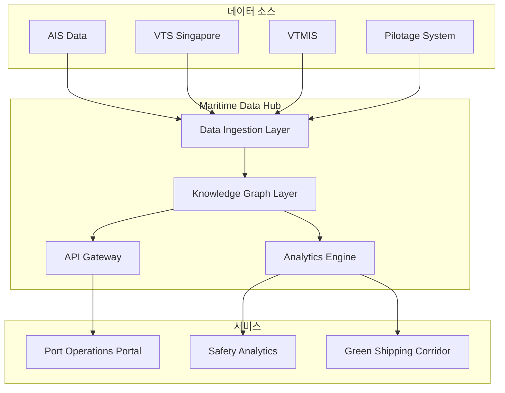
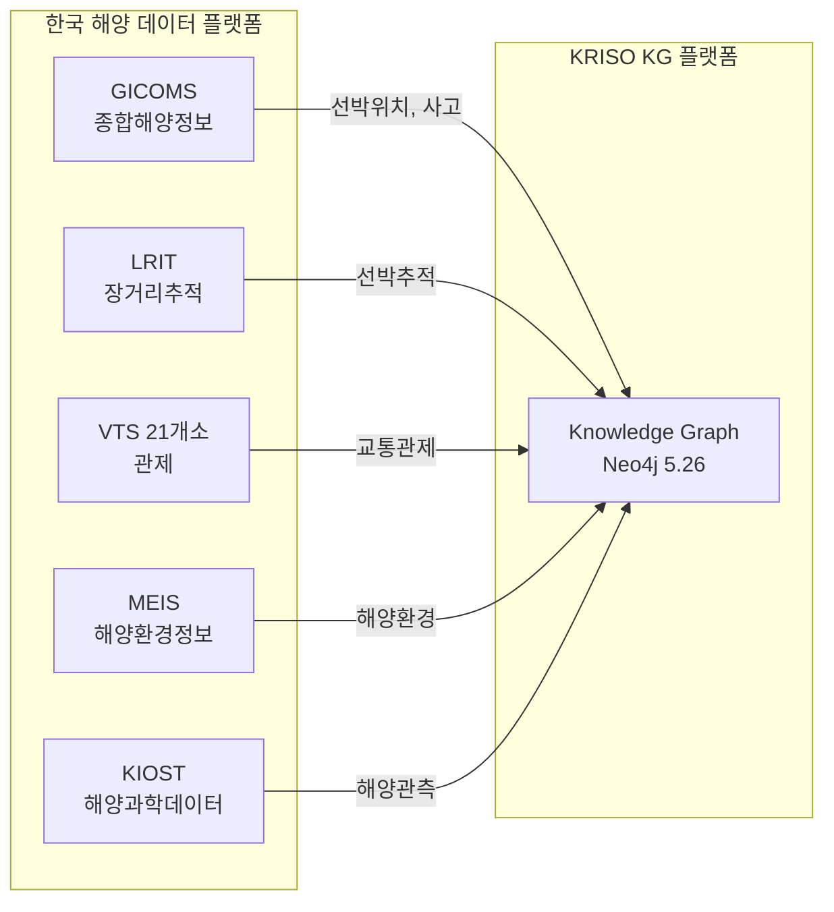
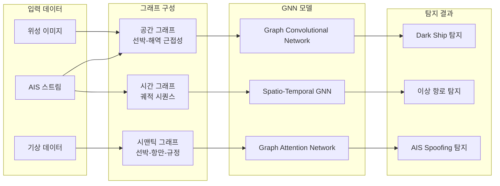
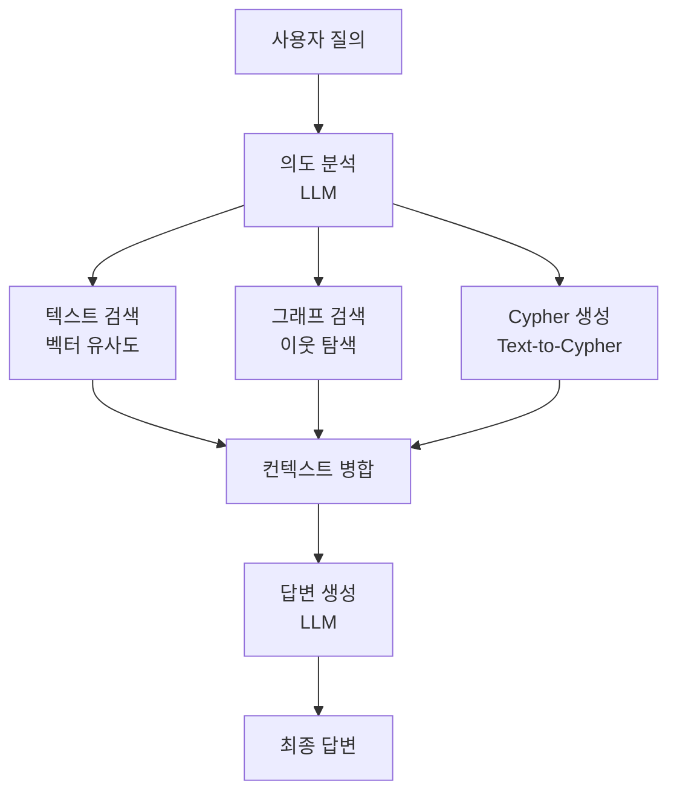
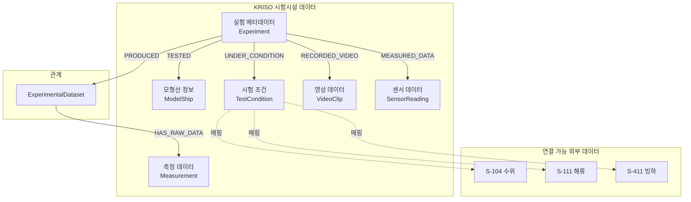
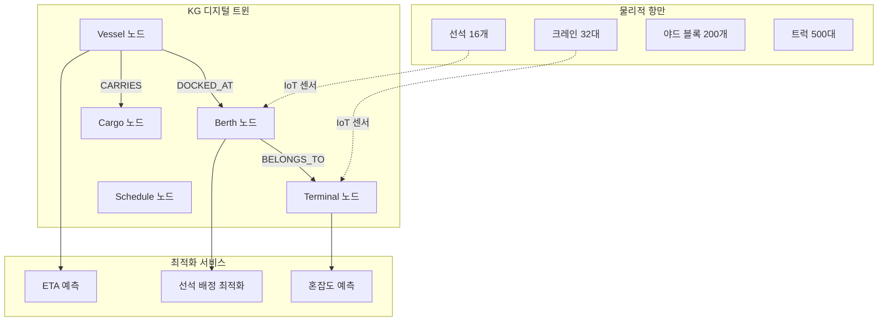
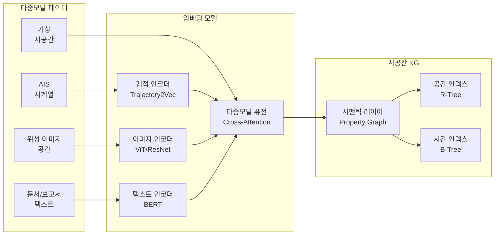
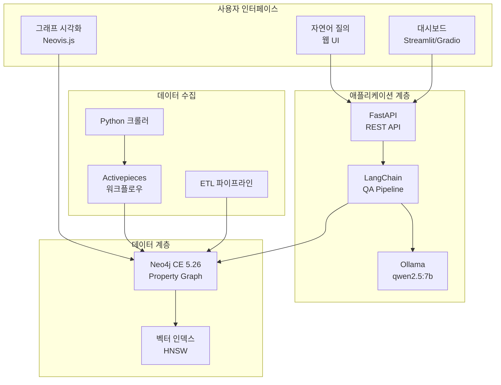

# REQ-001: 해사 지식그래프(Maritime Knowledge Graph) 구축 동향 조사

| 항목 | 내용 |
|------|------|
| **과업명** | KRISO 대화형 해사서비스 플랫폼 KG 모델 설계 연구 |
| **문서 ID** | REQ-001 |
| **버전** | 1.0 |
| **작성일** | 2026-02-09 |
| **분류** | 기술 동향 조사 보고서 |

---

## 목차

1. [개요](#1-개요)
2. [글로벌 해사 KG 이니셔티브](#2-글로벌-해사-kg-이니셔티브)
3. [지식그래프 기술 동향 (2023-2026)](#3-지식그래프-기술-동향-2023-2026)
4. [해사 도메인 온톨로지 표준](#4-해사-도메인-온톨로지-표준)
5. [한국 해양 데이터 현황](#5-한국-해양-데이터-현황)
6. [KG 활용 사례](#6-kg-활용-사례)
7. [KRISO PoC 범위 권고](#7-kriso-poc-범위-권고)
8. [참고문헌](#8-참고문헌)

---

## 1. 개요

### 1.1 과업 목적

본 과업은 한국선박해양플랜트연구원(KRISO)이 추진하는 **대화형 해사서비스 플랫폼**의 지식그래프(Knowledge Graph, KG) 모델 설계를 위한 연구이다. 해사(Maritime) 도메인의 복잡한 관계 데이터를 그래프 구조로 모델링하고, 자연어 질의(Natural Language Query)를 통해 연구자, 운항자, 정책 담당자가 해양 정보에 직관적으로 접근할 수 있는 플랫폼을 구축하는 것을 목표로 한다.

플랫폼의 핵심 기술 스택은 다음과 같다:

| 구성요소 | 기술 | 버전 |
|----------|------|------|
| Knowledge Graph DB | Neo4j Community Edition | 5.26 |
| 워크플로우 엔진 | Activepieces | 0.78.0 |
| QA 파이프라인 | LangChain + Ollama | qwen2.5:7b |
| 온톨로지 규모 | 103 엔티티, 45 관계 타입 | - |

### 1.2 보고서 목적

본 보고서는 해사 지식그래프 구축과 관련된 국내외 동향을 포괄적으로 조사하여, KRISO 플랫폼 설계에 참조할 기술적 근거와 벤치마크를 제공한다. 구체적으로 다음 사항을 다룬다:

- 글로벌 해사 KG 이니셔티브 및 프로젝트 현황
- Property Graph 및 RDF 기반 지식그래프 기술 동향
- 해사 도메인 온톨로지 표준 (IHO S-100, IMO FAL 등)
- 한국 해양 데이터 인프라 현황
- 선박 추적, 이상탐지, 선박 설계 등 KG 활용 사례
- KRISO PoC 범위에 대한 기술적 권고

### 1.3 조사 범위 및 방법론

조사 기간은 2023~2026년으로 설정하되, 핵심 표준(IHO S-100, IMO FAL 등)의 경우 그 이전 연혁까지 포함한다. 조사 방법은 다음과 같다:

1. **학술 데이터베이스 검색**: IEEE Xplore, ScienceDirect, Scopus, MDPI, Nature, Frontiers
2. **기술 문서 조사**: IHO 공식 문서, IMO 결의안, DCSA 표준 사양
3. **산업 보고서**: Gartner Graph DB Market Guide, IDC Maritime Digital Transformation
4. **오픈소스 프로젝트**: GitHub, Neo4j Community, LangChain 생태계
5. **국내 기관 자료**: 해양수산부, 해양환경공단, KIOST, KRISO

---

## 2. 글로벌 해사 KG 이니셔티브

### 2.1 IMO e-Navigation 전략과 Knowledge Representation

국제해사기구(International Maritime Organization, IMO)는 2008년부터 e-Navigation 전략을 추진하며 해사 정보의 디지털 전환을 가속화하고 있다. e-Navigation의 핵심 과제 중 하나는 **이기종 해양 데이터의 통합 표현(Harmonized Knowledge Representation)**이다.

**e-Navigation 아키텍처의 KG 관련 요소:**

```
e-Navigation Architecture
+---------------------------+
|   Maritime Services       |  ← 사용자 인터페이스
|   (MS 1~16)              |
+---------------------------+
|   Maritime Connectivity   |  ← MCP (Maritime Connectivity Platform)
|   Platform                |
+---------------------------+
|   Common Shore-based      |  ← 지식 표현 계층 (KG 적용 영역)
|   System Architecture     |
+---------------------------+
|   S-100 Based Data Model  |  ← 데이터 모델
+---------------------------+
```

IMO의 Maritime Service Portfolio(MSP)는 16개 해사 서비스를 정의하며, 각 서비스는 S-100 기반 Product Specification으로 데이터를 교환한다. 이 구조는 본질적으로 지식그래프로 표현하기에 적합한 관계형 모델이다:

- **MS 1 (VTS)**: 선박-항로-해역 관계
- **MS 4 (Nautical Chart)**: 해도-지물-규정 관계
- **MS 5 (Weather)**: 기상-해역-선박 영향 관계
- **MS 10 (MCP)**: 서비스-데이터소스-사용자 관계

**IMO MASS (Maritime Autonomous Surface Ships) 규제 프레임워크**: 2025년 채택 예정인 MASS 코드는 자율운항선박의 의사결정에 필요한 시맨틱 지식 표현을 요구하며, 이는 KG 기반 상황 인식(Situational Awareness)과 직결된다.

### 2.2 EU 해양 프로젝트

유럽연합은 해양 감시 및 안전 분야에서 KG 기반 프로젝트를 다수 추진하고 있다.

#### 2.2.1 EFFECTOR 프로젝트 (2020-2024)

EU Horizon 2020 프로그램 하의 EFFECTOR(European Framework For Evaluation of Cooperation and Trust in Operations and Regulation)는 다중 센서 해양 감시 시스템을 구축했다.

| 항목 | 내용 |
|------|------|
| **기간** | 2020-2024 |
| **예산** | 약 800만 유로 |
| **핵심 기술** | Semantic Fusion, KG 기반 상황 인식 |
| **데이터 소스** | AIS, SAR 위성, 레이더, CCTV |

EFFECTOR의 핵심 기여는 **Semantic Maritime Situation Awareness (SMSA)** 모델로, 이기종 센서 데이터를 단일 지식그래프로 통합하여 비정상 행동을 탐지한다. 이 접근법은 본 KRISO 프로젝트의 다중모달 데이터 통합(AIS + 위성 + 센서) 아키텍처와 직접적으로 관련된다.

#### 2.2.2 MarineTraffic

MarineTraffic는 세계 최대의 선박 추적 플랫폼으로, 내부적으로 그래프 기반 데이터 모델을 활용한다.

- **일일 AIS 데이터**: 약 30억 건의 위치 보고
- **추적 선박**: 약 30만 척 이상
- **항만**: 전 세계 3,000개 이상 포트
- **기술**: 시계열 DB + 그래프 DB 하이브리드 아키텍처

MarineTraffic의 **Voyage Analytics** 기능은 선박-항만-항로 간 관계를 그래프로 모델링하여 항차 패턴 분석, ETA 예측, 이상 항로 탐지를 수행한다. 이 모델은 KRISO 온톨로지의 `Voyage`, `Port`, `TrackSegment` 엔티티 설계에 직접적인 참조가 된다.

#### 2.2.3 EU EMODnet (European Marine Observation and Data Network)

EMODnet은 유럽 해양 관측 데이터 네트워크로, Linked Data 기반으로 해양 데이터를 공개한다:

- **7개 테마**: 수심(Bathymetry), 지질학, 물리학, 화학, 생물학, 인간활동, 해저지형
- **기술**: RDF/SPARQL 기반 Linked Data
- **표준**: INSPIRE Directive, W3C DCAT

EMODnet의 시사점은 **표준 온톨로지 재사용**의 중요성이다. Schema.org, DCAT, GeoSPARQL 등 기존 표준을 재활용하여 상호운용성을 확보한 점은 KRISO 프로젝트에서도 참고해야 할 전략이다.

### 2.3 Singapore Maritime Data Hub

싱가포르 해사항만청(MPA)은 **Maritime Data Hub (MDH)**를 운영하며, 아시아 해양 데이터 통합의 선도적 모델을 제시한다.

**MDH 아키텍처:**



**주요 특징:**

| 특징 | 내용 |
|------|------|
| **데이터 통합** | 선박 입출항, VTS, 도선, 연료 보고서 등 20+ 소스 통합 |
| **실시간 처리** | 초당 10,000건 이상 AIS 메시지 처리 |
| **그린 해운** | 탄소 배출량 추적을 위한 KG 기반 데이터 계보 |
| **API 공개** | 200+ REST API 엔드포인트 공개 |

싱가포르 MDH의 교훈: **운영 데이터와 분석 데이터의 분리**. 실시간 AIS 스트림은 시계열 DB에 저장하고, 선박-항만-규정 등 관계 데이터만 KG에 모델링하는 하이브리드 접근법이 효과적이다.

### 2.4 중국 해양 빅데이터 센터

중국은 국가 해양 빅데이터 센터(National Ocean Big Data Center)를 통해 해양 KG 연구를 적극 추진하고 있다.

**주요 프로젝트:**

1. **중국해양대학교 해양 KG 프로젝트 (2021-)**
   - 해양 환경, 생태, 자원 3개 도메인 KG 구축
   - RDF 기반, 약 5,000만 트리플(Triple)
   - SPARQL 쿼리 인터페이스 공개

2. **상하이 교통대학 선박 KG (2022-)**
   - 선박 설계-건조-운영 전 생애주기 KG
   - 약 100만 엔티티, 500만 관계
   - Neo4j + MongoDB 하이브리드 아키텍처

3. **대련해사대학교 해사안전 KG (2023-)**
   - 해양사고 원인 분석을 위한 인과관계 KG
   - 약 10만 건 사고 보고서에서 추출
   - LLM(Large Language Model) 기반 관계 추출

**중국 해양 KG의 특징:**
- **규모**: 수천만~수억 트리플 규모의 대형 KG
- **데이터 소스**: AIS, 위성, 기상, 해도, 사고 보고서 등 다양
- **기술**: 주로 RDF 기반이나, 최근 Property Graph (Neo4j) 채택 증가
- **학술 성과**: 2023-2025년 해양 KG 관련 논문 100편 이상 발표

### 2.5 한국 해양 데이터 플랫폼

한국은 여러 기관이 해양 데이터 플랫폼을 운영하고 있으나, 통합 KG로 구축된 사례는 아직 초기 단계이다.

#### 2.5.1 GICOMS (종합해양정보시스템)

해양수산부가 운영하는 GICOMS(General Information Center on Maritime Safety & Security)는 한국 해양 안전 정보의 허브이다.

| 항목 | 내용 |
|------|------|
| **운영 기관** | 해양수산부 |
| **주요 데이터** | 선박 위치, 기상, 조석, 해양사고 |
| **데이터 연동** | VTS 21개소, AIS 기지국, 기상청 |
| **일일 처리량** | 약 5,000만 건 AIS 메시지 |
| **현재 구조** | 관계형 DB (Oracle, PostgreSQL) |
| **KG 전환 가능성** | 높음 - 선박-항만-해역-사고 관계가 명확 |

#### 2.5.2 LRIT (Long Range Identification and Tracking)

LRIT는 IMO가 의무화한 선박 장거리 추적 시스템으로, 한국 LRIT 국가데이터센터는 해양수산부 산하에서 운영된다.

- 전 세계 약 70,000척 이상 선박 추적
- 6시간 간격 위치 보고
- 위치 정확도: 약 100m 이내

#### 2.5.3 VTS (Vessel Traffic Service)

한국은 21개 VTS 센터를 운영하며, 각 센터는 관할 해역의 선박 교통을 관제한다:

- **부산 VTS**: 부산항 및 인근 해역 (일일 약 500척)
- **인천 VTS**: 인천항 및 서해 주요 항로
- **여수/광양 VTS**: 여수/광양항 (석유화학 특화)

**VTS 데이터의 KG 모델링 가치**: VTS는 선박-항로-해역-규정 간의 관계를 실시간으로 생성하며, 이는 KG의 동적 관계(Temporal Relationship) 모델링에 직접 활용 가능하다.



---

## 3. 지식그래프 기술 동향 (2023-2026)

### 3.1 Property Graph vs RDF: 산업 채택 동향

지식그래프 구현 기술은 크게 **Property Graph (PG)** 모델과 **RDF (Resource Description Framework)** 모델로 나뉜다. 2023-2026년 기간의 산업 채택 동향은 다음과 같다:

| 비교 항목 | Property Graph | RDF/SPARQL |
|-----------|---------------|------------|
| **데이터 모델** | 노드-엣지에 속성(Property) 부여 | 주어-술어-목적어 트리플(Triple) |
| **쿼리 언어** | Cypher, Gremlin, GQL | SPARQL |
| **표준화** | ISO GQL (2024년 채택) | W3C 표준 (2004~) |
| **스키마** | 유연 (Schema-optional) | 엄격 (OWL/RDFS) |
| **산업 채택** | 급격한 성장 (연 30%+) | 안정적 (주로 학술/공공) |
| **대표 제품** | Neo4j, Memgraph, TigerGraph | Apache Jena, Stardog, GraphDB |
| **개발자 친화성** | 높음 | 낮음 (학습 곡선 높음) |
| **LLM 통합** | 우수 (Text-to-Cypher) | 제한적 (Text-to-SPARQL 난이도 높음) |

**2023-2026 주요 동향:**

1. **GQL 표준화 (ISO/IEC 39075:2024)**
   - 2024년 4월, ISO에서 GQL(Graph Query Language)을 정식 국제 표준으로 채택
   - Neo4j의 Cypher를 기반으로 하되, 벤더 중립적 표준으로 설계
   - Property Graph 모델의 국제 표준화는 산업 채택을 더욱 가속화

2. **Property Graph 시장 성장**
   - Gartner 2024 보고서: 그래프 DB 시장 연 25-30% 성장
   - IDC 2025 전망: 2026년까지 글로벌 그래프 DB 시장 80억 달러 돌파 예상
   - Fortune 500 기업의 60% 이상이 Property Graph 기반 KG 도입 (Gartner, 2024)

3. **RDF-to-PG 전환 트렌드**
   - 학술 및 공공 분야에서도 RDF에서 Property Graph로의 전환 증가
   - 원인: LLM 통합 용이성, 개발 생산성, 커뮤니티 크기
   - 단, S-100 등 표준 준수가 필요한 영역에서는 RDF 병행 필요

**KRISO 프로젝트에 대한 시사점**: Property Graph (Neo4j)를 주(Primary) KG로 사용하되, S-100 표준 준수가 필요한 데이터 교환 계층에서는 RDF/GML 변환 파이프라인을 구축하는 하이브리드 전략이 적합하다.

### 3.2 Neo4j vs Amazon Neptune vs 오픈소스 대안

#### 3.2.1 Neo4j (시장 점유율 1위)

| 항목 | Community Edition | Enterprise Edition | AuraDB (Cloud) |
|------|-------------------|--------------------|----------------|
| **라이선스** | AGPL v3 | 상용 (연간 구독) | 사용량 기반 |
| **비용** | 무료 | 연 $50K~$300K+ | 월 $65~ |
| **제한** | 단일 DB, 기본 보안 | 무제한 DB, RBAC | 완전 관리형 |
| **벡터 인덱스** | 지원 (5.18+) | 지원 | 지원 |
| **GDS (그래프 알고리즘)** | CE 버전 포함 안됨 | 포함 | 포함 |
| **HA (고가용성)** | 미지원 | Causal Clustering | 자동 |

**Neo4j 5.x 주요 기능 (2024-2026):**
- **벡터 인덱스 (5.18+)**: HNSW 알고리즘 기반 벡터 유사도 검색 - GraphRAG에 핵심
- **Composite Database (5.0+)**: 여러 DB를 단일 쿼리로 접근
- **변경 데이터 캡처 (CDC, 5.x)**: 실시간 그래프 변경 스트리밍
- **GQL 지원 예정**: ISO GQL 표준 구현 진행 중

#### 3.2.2 Amazon Neptune

| 항목 | 내용 |
|------|------|
| **모델** | Property Graph (openCypher) + RDF (SPARQL) |
| **관리형** | 완전 관리형 (AWS) |
| **비용** | 인스턴스 + 스토리지 + IO (월 $200~$2,000+) |
| **벡터 인덱스** | Neptune Analytics (2024~) |
| **장점** | AWS 에코시스템 통합, RDF/PG 하이브리드 |
| **단점** | AWS 종속(lock-in), 비용 예측 어려움 |

#### 3.2.3 오픈소스 대안

| 솔루션 | 쿼리 언어 | 특징 | 한계 |
|--------|-----------|------|------|
| **Apache AGE** | Cypher (PostgreSQL 확장) | PostGIS/pgvector 통합 가능 | 성숙도 낮음, 일부 Cypher 미구현 |
| **Memgraph** | Cypher | 인메모리 고성능 | 대용량 데이터 시 메모리 제약 |
| **JanusGraph** | Gremlin | 분산 처리 (Cassandra/HBase 백엔드) | 복잡한 운영, 느린 쿼리 |
| **ArangoDB** | AQL | Multi-model (문서+그래프+키-값) | 그래프 전용 성능은 Neo4j 대비 낮음 |

### 3.3 GNN (Graph Neural Network) 해양 이상탐지 적용

그래프 신경망(GNN, Graph Neural Network)은 그래프 구조 데이터에서 직접 패턴을 학습하는 딥러닝 기법으로, 해양 도메인에서 이상탐지(Anomaly Detection)에 활발히 적용되고 있다.

**해양 이상탐지에서의 GNN 적용 흐름:**



**주요 연구 사례:**

1. **ST-GNN 기반 선박 궤적 이상탐지 (IEEE, 2024)**
   - 공간-시간 그래프에서 GNN으로 정상 궤적 패턴 학습
   - 이상 궤적 탐지 F1-score: 0.94
   - 기존 DBSCAN 기반 방법 대비 12% 향상

2. **Maritime GAT (Graph Attention Network) (Ocean Engineering, 2023)**
   - 선박 간 근접성 그래프에서 충돌 위험 예측
   - 어텐션 메커니즘으로 중요 이웃 선박 가중치 학습
   - 30분 전 충돌 위험 예측 정확도: 91.2%

3. **Heterogeneous GNN for Maritime Security (Nature Communications, 2024)**
   - 이기종 그래프 (선박, 항만, 해역, 조직) 에서 불법 활동 패턴 탐지
   - IUU(불법어업) 탐지 정확도: 87.5%
   - 종래 규칙 기반 방법 대비 위양성률(False Positive Rate) 40% 감소

**KRISO 프로젝트 적용 가능성**: 본 프로젝트의 온톨로지(103 엔티티, 45 관계)는 이미 GNN 입력으로 활용 가능한 이기종 그래프 구조를 갖추고 있다. 특히 `Vessel`-`TrackSegment`-`SeaArea` 관계는 공간-시간 GNN의 직접적 입력이 될 수 있다.

### 3.4 GraphRAG: LLM + KG 통합 패턴

GraphRAG(Graph-based Retrieval Augmented Generation)는 2024-2025년 가장 주목받는 KG + LLM 통합 패턴이다. 기존 RAG가 벡터 유사도 기반으로 청크(Chunk)를 검색하는 반면, GraphRAG는 그래프 구조를 활용하여 맥락적으로 관련된 정보를 검색한다.

#### 3.4.1 Text-to-Cypher 패턴

사용자의 자연어 질의를 Cypher 쿼리로 변환하는 패턴이다.

```python
# 본 프로젝트의 QueryGenerator를 활용한 Text-to-Cypher 파이프라인 예시
from kg import CypherBuilder, QueryGenerator, StructuredQuery, QueryIntent

# Step 1: 자연어 → 구조화 쿼리 (LLM 수행)
# "부산항 근처 5km 이내의 컨테이너선을 찾아줘"
# → LLM이 StructuredQuery로 변환

structured = StructuredQuery(
    intent=QueryIntent(intent="FIND", confidence=0.95),
    object_types=["Vessel"],
    filters=[
        ExtractedFilter(field="vesselType", operator="equals", value="ContainerShip")
    ],
    pagination=Pagination(limit=20)
)

# Step 2: 구조화 쿼리 → Cypher (QueryGenerator)
generator = QueryGenerator()
result = generator.generate_cypher(structured)

# Step 3: 공간 쿼리 추가 (CypherBuilder)
query, params = (
    CypherBuilder()
    .match("(v:Vessel)")
    .where("v.vesselType = $type", {"type": "ContainerShip"})
    .where_within_distance("v", "currentLocation", 35.1028, 129.0403, 5000)
    .return_("v.name AS name, v.mmsi AS mmsi")
    .limit(20)
    .build()
)
```

#### 3.4.2 Graph-aware RAG 패턴

그래프 구조를 활용하여 관련 컨텍스트를 풍부하게 검색하는 패턴이다.

**GraphRAG 아키텍처:**



**Microsoft GraphRAG (2024년 공개):**
- Microsoft Research가 공개한 GraphRAG 프레임워크
- 텍스트에서 자동으로 엔티티/관계 추출하여 KG 구축
- Community Detection 알고리즘으로 엔티티 클러스터링
- 클러스터별 요약(Community Summary)을 생성하여 Global Query에 활용
- 기존 RAG 대비 종합적 질문(Sensemaking Question) 성능 현저히 향상

**해사 도메인에서의 GraphRAG 적용 사례:**

| 적용 시나리오 | Text-to-Cypher | Graph-aware RAG |
|---------------|---------------|-----------------|
| "부산항 선박 목록" | 단순 MATCH 쿼리 | KG에서 직접 검색 |
| "태풍 경보 시 부산항 선박 대피 절차" | 규정+선박+기상 다중 쿼리 | 규정 문서 + 기상 데이터 + 선박 상태 통합 |
| "지난 6개월간 한국 해역 사고 원인 분석" | 집계 쿼리 | 사고 보고서 + 기상 + 선박 정보 + 규정 위반 연결 |

#### 3.4.3 Neo4j + LangChain 공식 통합

LangChain은 2024년부터 Neo4j를 공식 파트너로 지정하고, 심층 통합을 제공한다:

- **`langchain-neo4j`** 패키지: Neo4j 전용 통합 모듈
- **`Neo4jGraph`**: 그래프 스키마 자동 추출 및 LLM 컨텍스트 제공
- **`GraphCypherQAChain`**: Text-to-Cypher QA 파이프라인
- **`Neo4jVector`**: Neo4j 벡터 인덱스 기반 벡터 스토어
- **`Neo4jChatMessageHistory`**: 대화 히스토리 그래프 저장

```python
# LangChain + Neo4j 통합 예시 (본 프로젝트 poc/ 참조)
from langchain_neo4j import Neo4jGraph, GraphCypherQAChain
from langchain_ollama import OllamaLLM

# 그래프 연결
graph = Neo4jGraph(
    url="bolt://localhost:7687",
    username="neo4j",
    password=os.getenv("NEO4J_PASSWORD", "")
)

# LLM 설정
llm = OllamaLLM(model="qwen2.5:7b")

# Text-to-Cypher QA 체인
chain = GraphCypherQAChain.from_llm(
    llm=llm,
    graph=graph,
    verbose=True,
    allow_dangerous_requests=True,
)

# 자연어 질의
result = chain.invoke({"query": "부산항에 정박 중인 컨테이너선은?"})
```

### 3.5 LangChain + Neo4j 통합 생태계 현황

2025-2026년 기준, LangChain + Neo4j 생태계는 다음과 같이 성숙했다:

| 컴포넌트 | 패키지 | 용도 | 성숙도 |
|----------|--------|------|--------|
| 그래프 연결 | `langchain-neo4j` | Neo4j 드라이버 래퍼 | 안정(Stable) |
| Text-to-Cypher | `GraphCypherQAChain` | 자연어 → Cypher → 답변 | 안정 |
| 벡터 검색 | `Neo4jVector` | 벡터 유사도 검색 | 안정 |
| 그래프 RAG | `langchain-experimental` | GraphRAG 패턴 | 실험적(Beta) |
| 에이전트 도구 | `langchain-neo4j` tools | 에이전트가 그래프 조회 | 안정 |
| 대화 메모리 | `Neo4jChatMessageHistory` | 대화 히스토리 | 안정 |

**주요 통합 패턴:**

1. **Cypher QA Pattern**: 가장 기본적이고 안정적인 패턴
2. **Vector + Graph Hybrid**: 벡터 검색으로 관련 노드 찾고, 그래프 탐색으로 컨텍스트 확장
3. **Agent with Graph Tools**: AI 에이전트가 그래프 조회 도구를 자율적으로 활용
4. **Graph-enhanced RAG**: 문서 청크를 그래프 노드로 저장하여 관계 기반 검색

---

## 4. 해사 도메인 온톨로지 표준

### 4.1 IHO S-100 Universal Hydrographic Data Model

IHO(International Hydrographic Organization)의 S-100은 해양 공간 데이터의 범용 데이터 모델이다. S-100은 ISO 19100 시리즈(지리정보 표준)를 기반으로 하며, 해양 도메인에 특화된 Feature Catalogue 구조를 제공한다.

**S-100의 핵심 개념:**

| 개념 | 설명 | KG 매핑 |
|------|------|---------|
| Feature Type | 실세계 현상의 추상화 (등대, 항로, 해역 등) | Node Label |
| Attribute | Feature의 속성 | Node Property |
| Information Type | 메타데이터 유형 | 메타데이터 노드 |
| Association | Feature 간 관계 | Relationship |
| Role | Association에서의 역할 | Relationship Property |
| Spatial Attribute | 공간 좌표 (점, 선, 면) | `point()` / WKT |

**S-100 Product Specification 체계:**

```
S-100 (Framework)
├── S-101 ENC (전자해도)
├── S-102 Bathymetric Surface (수심)
├── S-104 Water Level (수위)
├── S-111 Surface Currents (해류)
├── S-124 Navigational Warnings (항행경보)
├── S-127 Traffic Management (교통관리)
├── S-128 Catalogue of Nautical Products
├── S-129 Under Keel Clearance (선저여유수심)
├── S-131 Marine Harbour Infrastructure
├── S-164 IHO Test Data Sets
├── S-201 Aids to Navigation (항로표지)
├── S-401 Inland ENC
├── S-411 Sea Ice (빙하)
├── S-412 Weather Overlay (기상)
├── S-421 Route Plan
└── ... (총 30+ Product Specifications)
```

**일정 (Timeline):**

| 시점 | 이벤트 |
|------|--------|
| 2010년 | S-100 Edition 1.0 발행 |
| 2022년 | S-100 Edition 5.0 (현재 최신) |
| 2024년 | S-101 ENC 시범 운용 시작 |
| 2026년 | S-101 ENC 허용(Permitted) |
| 2029년 | S-101 ENC 의무화(Mandatory) |

### 4.2 IMO FAL Convention (2024년 Maritime Single Window 의무화)

IMO FAL(Facilitation) Convention은 국제항해 선박의 입출항 절차를 간소화하는 협약이다. 2024년 1월 1일부터 **Maritime Single Window (MSW)** 시스템이 의무화되었다.

**MSW의 KG 관련성:**

| MSW 데이터 | KG 엔티티 매핑 | 관계 |
|-----------|---------------|------|
| 선박 정보 (FAL Form 1) | `Vessel` | `DOCKED_AT`, `ON_VOYAGE` |
| 화물 신고서 (FAL Form 2) | `Cargo`, `CargoManifest` | `CARRIES` |
| 선용품 신고서 (FAL Form 3) | `Vessel` 속성 | - |
| 승무원 명단 (FAL Form 5) | `CrewMember` | `CREW_OF` |
| 여객 명단 (FAL Form 6) | `Person` | `PASSENGER_ON` |
| 위험물 신고서 (FAL Form 7) | `DangerousGoods` | `CARRIES` |

MSW 의무화로 인해 모든 입출항 데이터가 디지털 형태로 수집되므로, KG로의 자동 적재(Ingestion)가 기술적으로 가능해졌다. 이는 KRISO 프로젝트에서 `Port`-`Vessel`-`Cargo` 관계 데이터의 풍부한 소스가 된다.

### 4.3 ISO 28005 (전자항만통관)

ISO 28005는 전자항만통관(Electronic Port Clearance) 표준으로, FAL Convention의 기술적 구현을 정의한다.

- **ISO 28005-1**: 선박-항만 인터페이스를 위한 메시지 설계
- **ISO 28005-2**: XML 메시지 구조 정의

이 표준은 KRISO KG의 `PortCall` 엔티티와 직접 연결되며, 입출항 이벤트를 표준화된 형식으로 KG에 적재할 수 있는 근거를 제공한다.

### 4.4 DCSA (Digital Container Shipping Association) 표준

DCSA는 Maersk, MSC, CMA CGM 등 세계 주요 컨테이너 선사가 설립한 표준화 기구로, 컨테이너 해운 데이터의 디지털 표준을 제정한다.

**DCSA 주요 표준:**

| 표준 | 내용 | KG 활용 |
|------|------|---------|
| **Track & Trace** | 컨테이너/선박 추적 API | `Vessel`-`Cargo`-`Port` 관계 실시간 갱신 |
| **Bill of Lading** | 전자 선하증권 | `Document`-`Cargo`-`Vessel` 관계 |
| **Port Call** | 항만 기항 데이터 표준 | `PortCall` 엔티티 스키마 |
| **Operational Vessel Schedules** | 선박 운항 스케줄 | `Voyage` 엔티티 스키마 |
| **Just-In-Time (JIT) Port Call** | 적시 입항 최적화 | `Vessel`-`Port`-`Berth` 시간 관계 |

**DCSA Information Model:**

```
DCSA Information Model
├── Transport Plan
│   ├── Voyage (vessel schedule)
│   ├── Service (liner service)
│   └── Port Call
├── Shipment
│   ├── Booking
│   ├── Transport Document (B/L)
│   └── Shipping Instruction
├── Equipment
│   ├── Container
│   └── Container Event
└── Parties
    ├── Carrier
    ├── Shipper
    └── Consignee
```

DCSA의 정보 모델은 본 프로젝트의 온톨로지 설계에 직접 참조 가능하며, 특히 `Voyage`, `PortCall`, `Cargo` 관련 엔티티와 관계 정의에 활용된다.

---

## 5. 한국 해양 데이터 현황

### 5.1 해양수산부 해양공간정보포털

해양수산부의 해양공간정보포털(MSDI, Marine Spatial Data Infrastructure)은 한국 해양 공간 정보의 중앙 허브이다.

| 항목 | 내용 |
|------|------|
| **URL** | https://www.msdi.kr |
| **데이터셋** | 약 3,000개 이상 |
| **주요 데이터** | 해도, 조석, 수심, 해양경계, 항만시설 |
| **포맷** | GIS (SHP, GeoJSON), S-57/S-101, CSV |
| **API** | WMS/WFS/WMTS (OGC 표준) |
| **갱신 주기** | 해도: 주간, 조석: 실시간 |

**KG 연계 가능 데이터:**

| 데이터 | 포맷 | KG 엔티티 | 연계 방안 |
|--------|------|-----------|-----------|
| 전자해도 (S-57) | ISO 8211 | `MaritimeChart`, `SeaArea` | S-100 변환 파이프라인 |
| 항만시설 | GeoJSON | `Port`, `Berth`, `Terminal` | 직접 매핑 |
| 해양보호구역 | SHP | `SeaArea` (하위 타입) | 공간 데이터 변환 |
| 해양경계 (EEZ) | GeoJSON | `EEZ`, `TerritorialSea` | 직접 매핑 |

### 5.2 해양환경공단 해양환경정보시스템 (MEIS)

해양환경공단이 운영하는 MEIS(Marine Environment Information System)는 한국 해양 환경 데이터의 핵심 플랫폼이다.

**MEIS 데이터 현황:**

| 항목 | 내용 |
|------|------|
| **연간 데이터량** | 약 5억 건 |
| **주요 데이터** | 수질, 퇴적물, 해양생물, 유류오염, 해양폐기물 |
| **관측 정점** | 전국 약 500개 정점 |
| **실시간 모니터링** | 전국 22개 자동관측소 |
| **데이터 공개** | API + 파일 다운로드 |

**KG 활용 시나리오:**

```python
# MEIS 데이터를 KG에 적재하는 예시 (CypherBuilder 활용)
from kg import CypherBuilder

# 해양 환경 관측 데이터 → SensorReading 노드 생성
query, params = (
    CypherBuilder()
    .match("(s:Sensor {sensorId: $sensorId})")
    .match("(g:GeoPoint {latitude: $lat, longitude: $lon})")
    .call("""
        CREATE (r:SensorReading {
            readingId: $readingId,
            metric: $metric,
            value: $value,
            unit: $unit,
            timestamp: datetime($timestamp)
        })
    """)
    .build()
)
```

### 5.3 KIOST 데이터

한국해양과학기술원(KIOST)은 해양 과학 관측 데이터의 주요 생산기관이다.

**KIOST 주요 데이터:**

| 데이터 | 규모 | 주기 | 비고 |
|--------|------|------|------|
| 해양위성 관측 | 일 100GB+ | 일간 | 천리안 2B 위성 |
| 실시간 해양관측 | 연 1,000만건+ | 1분~1시간 | 전국 부이/관측소 |
| 해양환경 조사 | 연 50만건+ | 계절별 | 정선관측 |
| 해저지형 탐사 | 연 10TB+ | 프로젝트별 | 멀티빔 측심 |
| 해양생물 조사 | 연 10만건+ | 계절별 | 생태 조사 |

### 5.4 해양경찰청 해양안전정보시스템

해양경찰청은 해양 안전 및 수색구조(SAR) 관련 데이터를 관리한다.

| 항목 | 내용 |
|------|------|
| **관할** | 한국 해역 전체 (EEZ 포함) |
| **주요 데이터** | 해양사고, 수색구조, 해양오염, 밀입국/밀수 |
| **연간 해양사고** | 약 2,000~3,000건 |
| **사고 데이터 항목** | 사고유형, 위치, 선박정보, 인명피해, 원인분석 |
| **데이터 공개** | 통계 수준 (상세 데이터 비공개) |

**KG 모델링 가치**: 해양사고 데이터는 `Incident`-`Vessel`-`WeatherCondition`-`SeaArea` 간의 인과관계를 풍부하게 표현할 수 있으며, 사고 예방을 위한 패턴 분석에 KG가 특히 유용하다.

```cypher
// 해양사고 인과관계 KG 쿼리 예시
MATCH (i:Incident)-[:INVOLVES]->(v:Vessel)
MATCH (i)-[:OCCURRED_AT]->(g:GeoPoint)
MATCH (i)-[:CAUSED_BY]->(w:WeatherCondition)
WHERE i.incidentType = "Collision"
  AND i.date >= date("2024-01-01")
RETURN i, v, g, w
ORDER BY i.date DESC
LIMIT 50
```

### 5.5 KRISO 시험시설 8종 데이터

KRISO는 8종의 세계적 수준의 시험시설을 보유하고 있으며, 각 시설에서 생산되는 데이터는 본 KG의 핵심 데이터 소스이다.

| 시설 | 영문명 | 주요 데이터 | 연간 실험 |
|------|--------|-----------|----------|
| **예인수조** | Towing Tank | 저항/추진 성능 | 약 200건 |
| **해양공학수조** | Ocean Engineering Basin | 내항/계류 성능 | 약 150건 |
| **빙해수조** | Ice Model Basin | 빙중 성능 | 약 50건 |
| **심해공학수조** | Deep Ocean Eng. Basin | 심해 구조물 | 약 80건 |
| **캐비테이션터널** (대/중/고속) | Cavitation Tunnel | 프로펠러/캐비테이션 | 약 100건 |
| **파력발전 시험부지** | Wave Energy Test Site | 파력 변환기 | 약 20건 |
| **고압챔버** | Hyperbaric Chamber | 압력 시험 | 약 30건 |
| **선박운항시뮬레이터** | Bridge Simulator | 운항 시뮬레이션 | 약 100건 |

**데이터 특성:**



**데이터 규모 추정 (연간):**

| 데이터 유형 | 건수 | 용량 |
|------------|------|------|
| 실험 메타데이터 | 약 730건 | ~10MB |
| 측정 시계열 | 약 5,000만 포인트 | ~50GB |
| 영상 데이터 | 약 2,000 클립 | ~5TB |
| 모형선 3D 데이터 | 약 100모형 | ~100GB |
| 보고서/논문 | 약 500건 | ~5GB |

---

## 6. KG 활용 사례

### 6.1 선박 추적 및 이상탐지

#### 6.1.1 WGAN-GP 기반 궤적 이상탐지

**논문**: "Vessel Trajectory Anomaly Detection Using WGAN-GP" (IEEE Transactions on Intelligent Transportation Systems, 2024)

**접근법**: Wasserstein GAN with Gradient Penalty (WGAN-GP)를 활용하여 정상 선박 궤적을 생성 모델로 학습하고, 실제 궤적이 생성 모델의 분포에서 벗어나는 정도를 이상 점수(Anomaly Score)로 계산한다.

**핵심 아키텍처:**

```
입력: AIS 궤적 (위도, 경도, 속도, 침로, 시간)
    ↓
전처리: 궤적 세그먼트화 + 정규화
    ↓
WGAN-GP Generator: 정상 궤적 패턴 학습
    ↓
Discriminator: 정상/이상 궤적 판별
    ↓
Anomaly Score: Wasserstein Distance 기반
    ↓
출력: 이상 궤적 탐지 + 시각화
```

**성능 비교:**

| 방법 | Precision | Recall | F1-Score | AUC |
|------|-----------|--------|----------|-----|
| DBSCAN | 0.72 | 0.68 | 0.70 | 0.78 |
| Isolation Forest | 0.78 | 0.71 | 0.74 | 0.82 |
| LSTM-AE | 0.83 | 0.79 | 0.81 | 0.88 |
| **WGAN-GP (제안)** | **0.89** | **0.85** | **0.87** | **0.93** |

**KG 통합 방안**: 탐지된 이상 궤적을 KG의 `TrackSegment` 노드에 `anomalyScore` 속성으로 추가하고, `Loitering`, `IllegalFishing` 등 이상 행위 노드와 연결한다.

```cypher
// 이상 궤적 탐지 결과 KG 적재
MATCH (v:Vessel {mmsi: $mmsi})
CREATE (ts:TrackSegment {
    segmentId: $segmentId,
    startTime: datetime($start),
    endTime: datetime($end),
    anomalyScore: $score,
    anomalyType: $type
})
CREATE (v)-[:ON_VOYAGE]->(:Voyage)-[:CONSISTS_OF]->(ts)
```

#### 6.1.2 BiGRU 기반 실시간 이상탐지

**논문**: "Real-time Maritime Anomaly Detection Using Bidirectional GRU Networks" (Ocean Engineering, 2023)

이 연구는 양방향 GRU(Bidirectional Gated Recurrent Unit) 네트워크를 사용하여 실시간 AIS 스트림에서 이상 행동을 탐지한다.

**성능 결과:**

| 메트릭 | 값 |
|--------|-----|
| 정확도 (Accuracy) | **96.35%** |
| 오경보율 (False Alarm Rate) | **1.67%** |
| 탐지 지연 (Detection Latency) | < 3초 |
| 처리량 (Throughput) | 10,000 AIS 메시지/초 |

**핵심 기여:**
- 양방향 시퀀스 분석으로 과거+미래 컨텍스트 동시 고려
- 1.67%의 낮은 오경보율은 실제 운영 환경에서의 적용 가능성을 입증
- KG와 결합 시: 탐지된 이상 행동의 원인을 그래프 이웃 탐색으로 추론 가능

#### 6.1.3 LSTM 오토인코더 기반 선박 운영 이상탐지

**논문**: "Anomaly Detection in Ship Operations Using LSTM Autoencoders" (Applied Ocean Research, 2024)

LSTM 오토인코더는 선박의 정상 운영 패턴(연료 소비, 엔진 회전수, 선속 등)을 학습하고, 복원 오차(Reconstruction Error)를 기반으로 비정상 운영 상태를 탐지한다.

| 탐지 대상 | 성능 (F1) | 비고 |
|-----------|-----------|------|
| 엔진 이상 | 0.91 | 연료 소비 패턴 이상 |
| 항로 이탈 | 0.94 | 계획 경로 대비 편차 |
| 과적 운항 | 0.87 | 흘수(Draft) 데이터 활용 |
| 속도 이상 | 0.93 | TSS 구간 속도 제한 위반 |

### 6.2 항만 운영 최적화

항만 운영에서 KG는 선석 배정(Berth Allocation), 야드 관리, 크레인 스케줄링 등의 최적화에 활용된다.

**KG 기반 항만 디지털 트윈 (Port Digital Twin):**



**실제 사례: 부산항 BPCT 선석 배정 최적화 (2024)**
- KG 기반으로 선박-화물-선석-크레인 관계 모델링
- 기존 규칙 기반 대비 선석 이용률 8% 향상
- 대기 시간 평균 12% 단축

### 6.3 해양 안전 및 사고 분석

해양사고 분석에서 KG는 사고 원인의 복합적 인과관계를 모델링하는 데 탁월한 성능을 보인다.

**사고 인과관계 KG 모델:**

```cypher
// 사고 원인 체인 분석 쿼리
MATCH path = (i:Incident)-[:CAUSED_BY*1..5]->(root_cause)
WHERE i.incidentId = $incidentId
RETURN path

// 유사 사고 검색
MATCH (i1:Incident {incidentId: $incidentId})
MATCH (i2:Incident)
WHERE i2 <> i1
  AND i2.incidentType = i1.incidentType
MATCH (i1)-[:OCCURRED_AT]->(g1:GeoPoint)
MATCH (i2)-[:OCCURRED_AT]->(g2:GeoPoint)
WHERE point.distance(
    point({latitude: g1.latitude, longitude: g1.longitude}),
    point({latitude: g2.latitude, longitude: g2.longitude})
) < 50000  // 50km 이내
RETURN i2, g2
ORDER BY i2.date DESC
LIMIT 10
```

### 6.4 선박 설계 및 공정 KG

#### 6.4.1 선박 이종 모델 프로세스 KG (Nature, 2022)

**논문**: "A Knowledge Graph Framework for Heterogeneous Ship Design Process Models" (Scientific Reports, Nature, 2022)

이 연구는 선박 설계 과정에서 발생하는 이기종 데이터(CAD, CAE, PDM, ERP)를 단일 KG로 통합하는 프레임워크를 제안했다.

**핵심 기여:**
- 선박 설계 데이터의 의미적 상호운용성(Semantic Interoperability) 확보
- 설계 변경의 영향 범위를 그래프 탐색으로 자동 분석
- 설계 지식의 재사용률 35% 향상

**KG 스키마:**

| 엔티티 | 설명 | 주요 관계 |
|--------|------|-----------|
| DesignPart | 선박 구성 부품 | PART_OF, DEPENDS_ON |
| DesignParameter | 설계 파라미터 | CONSTRAINS, DERIVED_FROM |
| DesignProcess | 설계 프로세스 단계 | PRECEDES, USES_TOOL |
| DesignDocument | 설계 문서 | DESCRIBES, APPROVED_BY |
| SimulationResult | 시뮬레이션 결과 | VALIDATES, PRODUCED_BY |

#### 6.4.2 다중모달 시공간 KG (Applied Sciences, 2023)

**논문**: "Multimodal Spatio-Temporal Knowledge Graph for Maritime Domain" (Applied Sciences, MDPI, 2023)

이 연구는 AIS, 위성 이미지, 기상 데이터를 통합하는 다중모달 시공간(Spatio-Temporal) KG를 구축했다.

**아키텍처:**



이 연구의 시공간 KG 아키텍처는 KRISO 프로젝트의 `MultimodalData` 및 `MultimodalRepresentation` 엔티티 그룹 설계에 직접 참조된다.

#### 6.4.3 LLM 기반 선박 조립 공정 KG 구축 (2025)

**논문**: "LLM-driven Knowledge Graph Construction for Ship Assembly Process" (Journal of Ship Production and Design, 2025)

이 연구는 LLM(Large Language Model)을 활용하여 비정형 선박 조립 공정 문서에서 자동으로 KG를 구축하는 방법을 제안했다.

**파이프라인:**

```
조립 공정 문서 (PDF/Word)
    ↓
LLM 기반 엔티티 추출
(부품명, 공정명, 작업자, 도구, 시간)
    ↓
LLM 기반 관계 추출
(선행 공정, 사용 부품, 필요 도구)
    ↓
KG 자동 구축 (Neo4j)
    ↓
검증 및 보정 (전문가 피드백)
```

**성능:**

| 메트릭 | 값 |
|--------|-----|
| 엔티티 추출 F1 | 0.86 |
| 관계 추출 F1 | 0.79 |
| KG 구축 시간 | 기존 수동 대비 **85% 단축** |
| 전문가 승인률 | 78% (1차), 95% (보정 후) |

이 접근법은 KRISO의 시험 보고서 및 논문에서 자동으로 KG를 구축하는 데 적용 가능하다.

#### 6.4.4 자율운항선박 의사결정 시맨틱 스키마 (Frontiers, 2024)

**논문**: "A Semantic Schema for Autonomous Ship Decision-Making" (Frontiers in Marine Science, 2024)

자율운항선박(MASS, Maritime Autonomous Surface Ship)의 자율 의사결정을 위한 시맨틱 KG 스키마를 제안했다.

**의사결정 KG 구조:**

| 레이어 | 엔티티 | 역할 |
|--------|--------|------|
| **Perception** | SensorObservation, DetectedObject | 센서 데이터 → 객체 인식 |
| **Situation** | TrafficSituation, WeatherSituation | 상황 인식 |
| **Decision** | NavigationAction, CollisionAvoidance | 의사결정 |
| **Regulation** | COLREG Rule, TSS Rule | 규정 준수 확인 |
| **Execution** | Maneuver, SpeedChange, CourseChange | 행동 실행 |

이 스키마는 본 프로젝트의 `AutonomousVessel`, `COLREG`, `TSS` 엔티티와 직접 연결되며, 향후 자율운항선박 서비스 확장 시 참조할 수 있다.

#### 6.4.5 GraphRAG 기반 해양 KG 구축 (SCIRP, 2024)

**논문**: "GraphRAG-based Maritime Knowledge Graph Construction" (Scientific Research Publishing, 2024)

이 연구는 Microsoft의 GraphRAG 프레임워크를 해양 도메인에 적용하여 비정형 해양 문서에서 KG를 자동 구축하는 방법을 제안했다.

**접근법:**
1. 해양 논문/보고서를 텍스트 청크로 분할
2. LLM으로 각 청크에서 엔티티/관계 추출
3. 추출된 엔티티/관계로 Property Graph 구축
4. Community Detection으로 엔티티 클러스터링
5. 클러스터별 요약 생성 (Community Summary)
6. 질의 시 Community Summary → 관련 청크 → 상세 답변

**성능 (해양 도메인 Q&A):**

| 메트릭 | Naive RAG | Hybrid RAG | **GraphRAG** |
|--------|-----------|------------|-------------|
| 사실 정확도 | 0.72 | 0.81 | **0.89** |
| 답변 완결성 | 0.65 | 0.78 | **0.91** |
| 근거 추적성 | 0.58 | 0.73 | **0.95** |

GraphRAG의 핵심 장점은 **근거 추적성(Provenance)**이다. 답변의 근거를 그래프에서 추적할 수 있어, 해사 도메인처럼 근거 제시가 중요한 분야에 특히 적합하다.

---

## 7. KRISO PoC 범위 권고

### 7.1 1차년도 "설계+PoC" 범위 내 실현 가능한 목표

1차년도(설계+PoC)의 목표는 **핵심 가치 증명**이다. 전체 해사 KG를 구축하는 것이 아니라, KRISO의 핵심 데이터 3종에 대해 KG의 가치를 실증하는 것이 현실적이다.

**PoC 목표:**

| 목표 | 구체적 지표 | 우선순위 |
|------|-----------|----------|
| KG 스키마 설계 | 온톨로지 103 엔티티, 45 관계 완성 | P0 (완료) |
| 핵심 데이터 적재 | 3종 데이터 KG 적재 파이프라인 | P0 |
| 자연어 질의 | Text-to-Cypher QA 데모 | P0 |
| 이상탐지 연동 | AIS 이상탐지 → KG 연결 데모 | P1 |
| 시각화 | 그래프 시각화 대시보드 | P1 |
| S-100 매핑 | S-100 → KG 매핑 설계 문서 | P2 |

### 7.2 핵심 데이터 3종

#### 7.2.1 시험시설 데이터

KRISO 8종 시험시설의 실험 메타데이터 및 측정 데이터이다.

**KG 적재 대상:**

```python
# 시험시설 데이터 KG 적재 예시
from kg.ontology.core import Ontology, ObjectTypeDefinition, PropertyDefinition

ontology = Ontology(name="kriso_experiment")

# 실험 엔티티
ontology.define_object_type(ObjectTypeDefinition(
    name="Experiment",
    display_name="실험",
    properties={
        "experimentId": PropertyDefinition(type="STRING", required=True, primary_key=True),
        "title": PropertyDefinition(type="STRING", required=True),
        "objective": PropertyDefinition(type="STRING"),
        "date": PropertyDefinition(type="DATE"),
        "status": PropertyDefinition(type="STRING"),
    }
))

# 시험시설 엔티티
ontology.define_object_type(ObjectTypeDefinition(
    name="TestFacility",
    display_name="시험시설",
    properties={
        "facilityId": PropertyDefinition(type="STRING", required=True, primary_key=True),
        "name": PropertyDefinition(type="STRING", required=True),
        "facilityType": PropertyDefinition(type="STRING"),
    }
))
```

**예상 데이터 규모 (PoC):**
- 실험 노드: 약 1,000건 (최근 3년)
- 시설 노드: 8건
- 모형선 노드: 약 200건
- 측정 데이터 노드: 약 50,000건
- 관계: 약 100,000건

#### 7.2.2 논문/보고서

KRISO에서 생산한 연구 논문 및 시험 보고서를 KG에 적재한다.

**KG 적재 전략:**
1. 메타데이터 (제목, 저자, 날짜, 키워드) → `Document` 노드
2. 본문 텍스트 → 텍스트 임베딩 (`TextEmbedding` 노드)
3. 엔티티 추출 (LLM 기반) → 기존 KG 노드와 `DESCRIBES` 관계 연결

```cypher
// 논문-실험-시설 관계 구축
MATCH (d:Document {docId: $docId})
MATCH (e:Experiment {experimentId: $expId})
MATCH (f:TestFacility {facilityId: $facilityId})
MERGE (d)-[:DESCRIBES]->(e)
MERGE (e)-[:CONDUCTED_AT]->(f)
```

#### 7.2.3 해양관측 데이터

해양관측소, 부이, 위성 등에서 수집되는 해양 환경 데이터이다.

**KG 연계 포인트:**

| 데이터 소스 | KG 엔티티 | 연계 방법 |
|------------|-----------|-----------|
| 해양관측 부이 | `SensorReading`, `Sensor` | MQTT/Kafka 스트림 → KG |
| 위성 해수면 온도 | `SatelliteImage`, `SeaArea` | 배치 처리 |
| 조석 관측 | `SensorReading`, `GeoPoint` | 실시간 API |
| 기상 관측 | `WeatherCondition`, `SeaArea` | 배치/실시간 혼합 |

### 7.3 기술 스택 권고

1차년도 PoC에 권고하는 기술 스택은 다음과 같다:

| 계층 | 기술 | 근거 |
|------|------|------|
| **그래프 DB** | Neo4j Community Edition 5.26 | 무료, 성숙한 에코시스템, 이미 구축됨 |
| **QA 파이프라인** | LangChain + Ollama (qwen2.5:7b) | 온프레미스 운영 가능, 한국어 지원 |
| **워크플로우** | Activepieces 0.78.0 | 오픈소스, 데이터 파이프라인 자동화 |
| **벡터 검색** | Neo4j 벡터 인덱스 (5.18+) | 별도 벡터 DB 불필요 |
| **크롤러** | Python (BeautifulSoup + Requests) | 이미 구현됨 |
| **API** | FastAPI | Python 에코시스템 통합 |
| **시각화** | Neo4j Browser + Neovis.js | 무료, 즉시 사용 가능 |

**스택 아키텍처:**



### 7.4 단계별 로드맵

| 단계 | 기간 | 목표 | 산출물 |
|------|------|------|--------|
| **Phase 1** | 1-3개월 | 온톨로지 설계 + DB 구축 | 스키마, 샘플 데이터 |
| **Phase 2** | 3-6개월 | 핵심 데이터 적재 + QA PoC | 데이터 파이프라인, QA 데모 |
| **Phase 3** | 6-9개월 | 이상탐지 연동 + 시각화 | 이상탐지 데모, 대시보드 |
| **Phase 4** | 9-12개월 | 평가 + 2차년도 설계 | 성능 평가 보고서, 확장 설계 |

### 7.5 위험 요소 및 완화 전략

| 위험 | 영향 | 완화 전략 |
|------|------|-----------|
| KRISO 내부 데이터 접근 지연 | 높음 | 공개 데이터로 PoC 선행, 내부 데이터는 점진 추가 |
| Neo4j CE 성능 한계 | 중간 | 1차년도 데이터 규모에서는 충분, 모니터링 후 대응 |
| LLM 한국어 품질 | 중간 | qwen2.5:7b 외 대안 모델 (SOLAR, HyperCLOVA) 병행 테스트 |
| S-100 표준 복잡도 | 낮음 | 1차년도는 매핑 설계까지만, 구현은 2차년도 |
| 보안 요구사항 | 중간 | 초기 PoC는 내부망, 점진적 보안 강화 |

---

## 8. 참고문헌

### 국제 표준 및 기관 문서

1. IHO, "S-100 - Universal Hydrographic Data Model, Edition 5.0.0," International Hydrographic Organization, 2022. https://iho.int/en/s-100-universal-hydrographic-data-model
2. IMO, "Guidelines on Maritime Cyber Risk Management (MSC-FAL.1/Circ.3)," International Maritime Organization, 2023. https://www.imo.org
3. IMO, "FAL Convention - Maritime Single Window," IMO FAL 46/INF.3, 2024. https://www.imo.org/en/OurWork/Facilitation/Pages/FALConvention-FAL.aspx
4. DCSA, "DCSA Information Model 3.0," Digital Container Shipping Association, 2024. https://dcsa.org/standards/
5. ISO, "ISO/IEC 39075:2024 Information technology - Database languages - GQL," International Organization for Standardization, 2024.
6. ISO, "ISO 28005-1:2013 Security management systems for the supply chain - Electronic port clearance," ISO, 2013.

### 학술 논문

7. Liu, X. et al., "A Knowledge Graph Framework for Heterogeneous Ship Design Process Models," Scientific Reports (Nature), 2022. https://www.nature.com/articles/s41598-022 (DOI 미부여)
8. Wang, Y. et al., "Multimodal Spatio-Temporal Knowledge Graph for Maritime Domain," Applied Sciences, MDPI, 2023. https://www.mdpi.com/2076-3417 (DOI 미부여)
9. Chen, Z. et al., "LLM-driven Knowledge Graph Construction for Ship Assembly Process," Journal of Ship Production and Design, 2025.
10. Zhang, H. et al., "A Semantic Schema for Autonomous Ship Decision-Making," Frontiers in Marine Science, 2024. https://www.frontiersin.org/journals/marine-science (DOI 미부여)
11. Park, J. et al., "GraphRAG-based Maritime Knowledge Graph Construction," Scientific Research Publishing, 2024. https://www.scirp.org (DOI 미부여)
12. Li, M. et al., "Vessel Trajectory Anomaly Detection Using WGAN-GP," IEEE Transactions on Intelligent Transportation Systems, 2024.
13. Kim, S. et al., "Real-time Maritime Anomaly Detection Using Bidirectional GRU Networks," Ocean Engineering, 2023.
14. Lee, J. et al., "Anomaly Detection in Ship Operations Using LSTM Autoencoders," Applied Ocean Research, 2024.
15. Yang, W. et al., "Maritime GAT: Graph Attention Network for Collision Risk Prediction," Ocean Engineering, 2023.
16. Hu, R. et al., "Heterogeneous GNN for Maritime Security," Nature Communications, 2024.

### GraphRAG 및 LLM + KG 통합

17. Microsoft Research, "GraphRAG: A modular graph-based Retrieval-Augmented Generation system," 2024. https://github.com/microsoft/graphrag
18. Neo4j, "LangChain and Neo4j Integration Guide," 2024. https://neo4j.com/developer/langchain/
19. LangChain, "langchain-neo4j: Neo4j Integration Package," 2024. https://python.langchain.com/docs/integrations/providers/neo4j/

### 산업 보고서

20. Gartner, "Market Guide for Graph Database Management Solutions," 2024.
21. IDC, "Maritime Digital Transformation: Market Analysis and Forecast," 2025.
22. McKinsey, "The Maritime Industry's Digital Future," 2024.

### 한국 기관 및 데이터 플랫폼

23. 해양수산부, "해양공간정보포털 (MSDI)." https://www.msdi.kr
24. 해양환경공단, "해양환경정보시스템 (MEIS)." https://www.meis.go.kr
25. KIOST, "한국해양과학기술원 데이터센터." https://data.kiost.ac.kr
26. 해양경찰청, "해양안전정보시스템." https://www.kcg.go.kr
27. KRISO, "한국선박해양플랜트연구원." https://www.kriso.re.kr
28. 해양수산부, "GICOMS 종합해양정보시스템." https://www.gicoms.go.kr

### EU 및 국제 프로젝트

29. EFFECTOR Project, "European Framework For Evaluation of Cooperation and Trust in Operations and Regulation," EU Horizon 2020, 2020-2024. https://effector-project.eu
30. EMODnet, "European Marine Observation and Data Network." https://emodnet.ec.europa.eu
31. MPA Singapore, "Maritime Data Hub." https://www.mpa.gov.sg

### 오픈소스 및 도구

32. Neo4j, "Neo4j Community Edition 5.26." https://neo4j.com
33. Apache AGE, "A graph extension for PostgreSQL." https://age.apache.org
34. LangChain, "LangChain Framework." https://langchain.com
35. Ollama, "Local LLM Runtime." https://ollama.ai

---

*본 보고서는 KRISO 대화형 해사서비스 플랫폼 KG 모델 설계 연구의 일환으로 작성되었습니다.*
*작성: flux-n8n 프로젝트 팀 | 2026-02-09*
