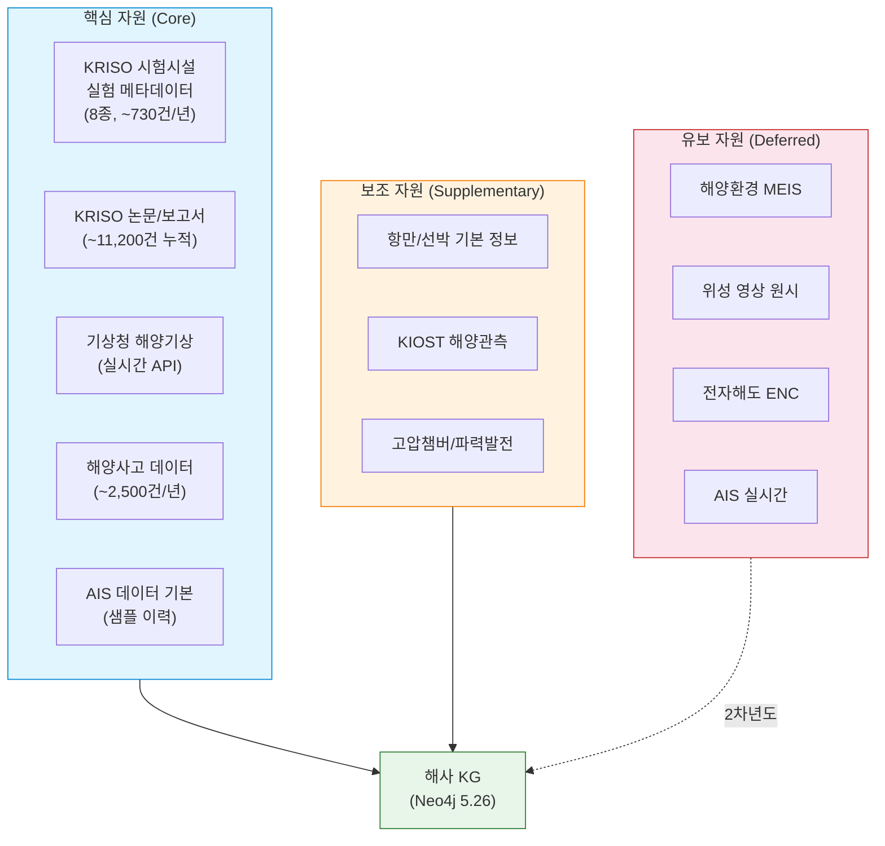
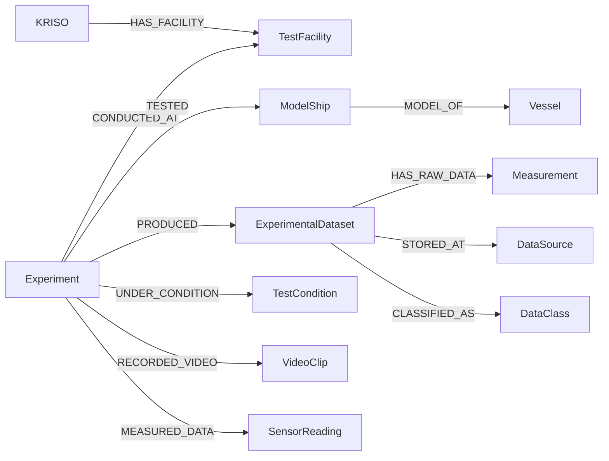
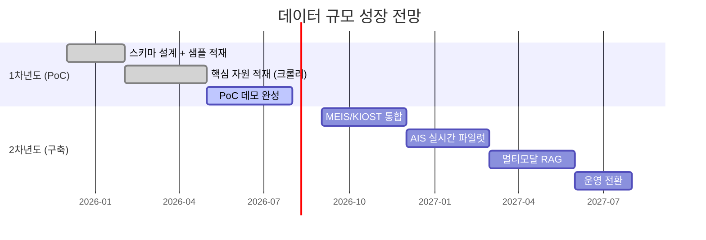

# REQ-002: KG 구축 대상 자원 선정 보고서

| 항목 | 내용 |
|------|------|
| **과업명** | KRISO 대화형 해사서비스 플랫폼 KG 모델 설계 연구 |
| **문서 ID** | REQ-002 |
| **버전** | Draft v0.9 |
| **작성일** | 2026-02-09 |
| **분류** | KG 구축 대상 자원 선정 보고서 |
| **관련 요구사항** | REQ-002 (과업지시서 2항) |
| **상위 과제** | 선박해양 디지털 전환 지원을 위한 디지털서비스 플랫폼 개발 |
| **상태** | Draft v0.9 (초안) |

---

## 목차

1. [개요](#1-개요)
2. [자원 선정 기준](#2-자원-선정-기준)
3. [KRISO 내부 데이터 자원](#3-kriso-내부-데이터-자원)
4. [외부 데이터 자원](#4-외부-데이터-자원)
5. [1차년도 PoC 대상 자원 선정 결과](#5-1차년도-poc-대상-자원-선정-결과)
6. [자원별 KG 적재 전략](#6-자원별-kg-적재-전략)
7. [2차년도 확장 계획](#7-2차년도-확장-계획)

---

## 1. 개요

### 1.1 문서 목적

본 문서는 KRISO(한국해양과학기술원 부설 선박해양플랜트연구소) 대화형 해사서비스 플랫폼의 지식그래프(Knowledge Graph) 구축을 위한 **데이터 자원 선정 및 평가 결과**를 기술합니다. 과업지시서 제2항 "KG 구축 대상 자원 선정 보고서"의 납품물에 해당하며, 계약 후 2개월 내 제출하는 산출물입니다.

### 1.2 선정 범위

본 보고서의 자원 선정 범위는 다음 두 가지 차원으로 구분합니다.

| 차원 | 범위 | 비고 |
|------|------|------|
| **내부 자원** | KRISO 보유 시험시설 데이터, 연구 논문/보고서, 실험 메타데이터 | 8종 시험시설 중심 |
| **외부 자원** | 해양수산부, 기상청, 해양경찰청 등 공공 해양 데이터 | API/포털 제공 데이터 |

### 1.3 선정 방법론

자원 선정은 다음 3단계 프로세스를 따릅니다.


1. **후보 자원 식별**: KRISO 내부 데이터 자산 목록 조사 및 외부 해양 공공데이터 포털 탐색
2. **정량 평가**: 5개 선정 기준에 대한 5점 척도 평가 매트릭스 적용
3. **PoC 우선순위 결정**: 1차년도 PoC 범위에 적합한 자원을 핵심(Core)/보조(Supplementary)/유보(Deferred)로 분류

### 1.4 관련 문서

| 문서 ID | 문서명 | 관계 |
|---------|--------|------|
| REQ-001 | 해사 데이터 현황 분석 보고서 | 본 보고서의 선행 조사 자료 |
| DES-001 | 지식그래프 모델 설계서 | 선정된 자원의 KG 매핑 대상 |
| REQ-003 | 그래프 DB 기술 비교 분석 보고서 | KG 저장소 기술 선정 근거 |
| REQ-004 | IHO S-100 표준 분석 보고서 | 해사 도메인 표준 참조 |

---

## 2. 자원 선정 기준

### 2.1 평가 기준 정의

KG 구축 대상 자원의 적합성을 판단하기 위해 5개 평가 기준을 정의하였습니다. 각 기준은 1~5점 척도로 평가합니다.

| # | 기준 | 설명 | 가중치 |
|---|------|------|--------|
| C1 | **데이터 가용성(Data Availability)** | 데이터에 실제로 접근 가능한지, API/파일/크롤링 등 획득 수단이 존재하는지 | 25% |
| C2 | **관계 풍부성(Relationship Richness)** | 다른 엔티티와 의미 있는 관계를 형성할 수 있는지(그래프 적합성) | 25% |
| C3 | **도메인 관련성(Domain Relevance)** | KRISO 해사 서비스 플랫폼의 미션과 직접적으로 관련되는지 | 20% |
| C4 | **데이터 품질(Data Quality)** | 구조화 수준, 정합성, 갱신 주기, 결측률 등 품질 요소 | 15% |
| C5 | **KG 표현 가능성(KG Representability)** | 그래프 노드/엣지/속성으로 자연스럽게 모델링 가능한지 | 15% |

### 2.2 점수 척도

| 점수 | 의미 | 설명 |
|------|------|------|
| 5 | 매우 우수 | 즉시 활용 가능, 제약 없음 |
| 4 | 우수 | 소규모 전처리 후 활용 가능 |
| 3 | 보통 | 일정 수준의 정제/변환 필요 |
| 2 | 미흡 | 상당한 가공 또는 협의 필요 |
| 1 | 부적합 | 현 단계에서 활용 어려움 |

### 2.3 평가 산식

가중 합산 점수(Weighted Score)를 기준으로 자원의 우선순위를 결정합니다.

```
WS = C1 x 0.25 + C2 x 0.25 + C3 x 0.20 + C4 x 0.15 + C5 x 0.15
```

- **WS >= 4.0**: 1차년도 PoC 핵심 자원 (Core)
- **3.0 <= WS < 4.0**: 1차년도 PoC 보조 자원 (Supplementary)
- **WS < 3.0**: 2차년도 이후 유보 (Deferred)

---

## 3. KRISO 내부 데이터 자원

### 3.1 개요

KRISO는 선박해양 분야의 국내 유일 종합 시험연구기관으로, 8종의 시험시설과 연간 약 730건 이상의 실험을 수행하고 있습니다. 내부 데이터 자원은 크게 **시험시설 실험 데이터**와 **연구 성과물(논문/보고서)**로 구분됩니다.

### 3.2 시험시설별 데이터 자원 (8종)

#### 3.2.1 대형 예인수조 (Large Towing Tank)

| 항목 | 내용 |
|------|------|
| **시설 ID** | TF-LTT |
| **규격** | 길이 200m x 폭 16m x 깊이 7m, 최대 예인 속도 6.0 m/s |
| **연간 실험 건수** | 약 200건/년 |
| **주요 실험 유형** | 저항 시험, 자항 시험, 파랑 중 부가저항 시험 |
| **생성 데이터** | 실험 메타데이터, 모형선 제원, 시험 조건(속도, 파고, 수온), 저항/추진 측정값, 시계열 센서 데이터, 실험 영상 |
| **데이터 형식** | CSV, 독자 바이너리, 실험 영상(MP4) |
| **보관 현황** | 내부 파일 서버, 일부 실험관리 시스템(LIMS) |

**KG 적합성 평가:**

| C1 가용성 | C2 관계성 | C3 관련성 | C4 품질 | C5 표현성 | **WS** |
|:---------:|:---------:|:---------:|:-------:|:---------:|:------:|
| 5 | 5 | 5 | 4 | 5 | **4.85** |

> 예인수조는 KRISO의 대표 시험시설로, 실험-시설-모형선-측정값 간 관계가 풍부하여 그래프 모델링에 매우 적합합니다.

#### 3.2.2 해양공학수조 (Ocean Engineering Basin)

| 항목 | 내용 |
|------|------|
| **시설 ID** | TF-OEB |
| **규격** | 길이 56m x 폭 30m x 깊이 4.5m |
| **연간 실험 건수** | 약 150건/년 |
| **주요 실험 유형** | 내항성능 시험, 해양구조물 거동 시험, 파력발전 모형 시험 |
| **생성 데이터** | 6자유도 운동 응답, 상대수위, 계류력, 파랑 스펙트럼, 실험 영상 |
| **데이터 형식** | CSV, MAT, 실험 영상(MP4) |
| **보관 현황** | 내부 파일 서버 |

**KG 적합성 평가:**

| C1 가용성 | C2 관계성 | C3 관련성 | C4 품질 | C5 표현성 | **WS** |
|:---------:|:---------:|:---------:|:-------:|:---------:|:------:|
| 5 | 5 | 5 | 4 | 5 | **4.85** |

#### 3.2.3 빙해수조 (Ice Model Basin)

| 항목 | 내용 |
|------|------|
| **시설 ID** | TF-ICE |
| **규격** | 길이 42m x 폭 32m x 깊이 2.5m |
| **연간 실험 건수** | 약 50건/년 |
| **주요 실험 유형** | 빙해 저항 시험, 빙하중 측정, 쇄빙 성능 평가 |
| **생성 데이터** | 빙두께/빙강도 조건, 빙해 저항값, 쇄빙 패턴 영상, 센서 데이터 |
| **데이터 형식** | CSV, 영상(MP4), 이미지(PNG/JPG) |
| **보관 현황** | 내부 파일 서버 |

**KG 적합성 평가:**

| C1 가용성 | C2 관계성 | C3 관련성 | C4 품질 | C5 표현성 | **WS** |
|:---------:|:---------:|:---------:|:-------:|:---------:|:------:|
| 4 | 4 | 5 | 4 | 4 | **4.20** |

> 빙해수조 데이터는 북극항로 관련 연구와 밀접하게 관련되어 도메인 관련성이 높으나, 연간 실험 건수가 상대적으로 적어 데이터 규모는 제한적입니다.

#### 3.2.4 심해공학수조 (Deep Ocean Engineering Basin)

| 항목 | 내용 |
|------|------|
| **시설 ID** | TF-DOB |
| **규격** | 길이 100m x 폭 50m x 깊이 15m |
| **연간 실험 건수** | 약 80건/년 |
| **주요 실험 유형** | 심해 계류 시스템 시험, 라이저 거동 시험, 해양플랜트 거동 시험 |
| **생성 데이터** | 계류선 장력, 라이저 응력, 6자유도 운동, 파랑 조건, 실험 영상 |
| **데이터 형식** | CSV, 독자 포맷, 영상(MP4) |
| **보관 현황** | 내부 파일 서버 |

**KG 적합성 평가:**

| C1 가용성 | C2 관계성 | C3 관련성 | C4 품질 | C5 표현성 | **WS** |
|:---------:|:---------:|:---------:|:-------:|:---------:|:------:|
| 4 | 4 | 4 | 4 | 4 | **4.00** |

#### 3.2.5 캐비테이션터널 (Cavitation Tunnel) - 대형/중형/고속

KRISO는 3종의 캐비테이션터널을 보유하고 있으며, 각 시설의 특성에 따라 상이한 실험을 수행합니다.

| 구분 | 시설 ID | 규격 (측정부) | 최대 유속 | 연간 실험 |
|------|---------|---------------|-----------|-----------|
| 대형 | TF-LCT | 12.5m x 2.8m x 2.8m | 16.0 m/s | ~50건 |
| 중형 | TF-MCT | 6.0m x 1.2m x 1.2m | 12.0 m/s | ~30건 |
| 고속 | TF-HSCT | 4.5m x 0.6m x 0.6m | 25.0 m/s | ~20건 |

| 항목 | 내용 |
|------|------|
| **주요 실험 유형** | 프로펠러 캐비테이션 시험, 수중방사소음 측정, 워터제트 성능 시험 |
| **생성 데이터** | 캐비테이션 패턴 영상(고속 카메라), 추력/토크 측정, 소음 스펙트럼, 압력 분포 |
| **데이터 형식** | CSV, WAV(소음), 고속 영상(AVI/MP4), 이미지 |
| **보관 현황** | 내부 파일 서버, 일부 DB 관리 |

**KG 적합성 평가 (3종 통합):**

| C1 가용성 | C2 관계성 | C3 관련성 | C4 품질 | C5 표현성 | **WS** |
|:---------:|:---------:|:---------:|:-------:|:---------:|:------:|
| 4 | 4 | 4 | 4 | 4 | **4.00** |

#### 3.2.6 파력발전 실해역 시험장 (Wave Energy Test Site)

| 항목 | 내용 |
|------|------|
| **시설 ID** | TF-WET |
| **규격** | 실해역 시험장 (제주 해역) |
| **연간 실험 건수** | 약 20건/년 |
| **주요 실험 유형** | 파력발전 장치 실해역 성능 시험, 장기 내구성 평가 |
| **생성 데이터** | 발전량 시계열, 파랑 관측 데이터, 구조 응답, 실해역 환경 모니터링 |
| **데이터 형식** | CSV, 센서 시계열, 모니터링 로그 |
| **보관 현황** | 원격 모니터링 시스템, 내부 서버 |

**KG 적합성 평가:**

| C1 가용성 | C2 관계성 | C3 관련성 | C4 품질 | C5 표현성 | **WS** |
|:---------:|:---------:|:---------:|:-------:|:---------:|:------:|
| 3 | 3 | 3 | 3 | 3 | **3.00** |

> 실해역 시험장 데이터는 현장 의존적이며 실시간 데이터 연동이 필요하여 PoC 단계에서는 메타데이터 수준으로 제한합니다.

#### 3.2.7 고압챔버 (Hyperbaric Chamber)

| 항목 | 내용 |
|------|------|
| **시설 ID** | TF-HPC |
| **규격** | 내부 직경 3.6m, 최대 가압 60기압 |
| **연간 실험 건수** | 약 30건/년 |
| **주요 실험 유형** | 수중 장비 내압 시험, 잠수 시뮬레이션, 해저 환경 재현 시험 |
| **생성 데이터** | 압력/온도 프로파일, 장비 응답 데이터, 시험 기록 |
| **데이터 형식** | CSV, 센서 로그 |
| **보관 현황** | 내부 파일 서버 |

**KG 적합성 평가:**

| C1 가용성 | C2 관계성 | C3 관련성 | C4 품질 | C5 표현성 | **WS** |
|:---------:|:---------:|:---------:|:-------:|:---------:|:------:|
| 3 | 3 | 3 | 4 | 3 | **3.10** |

#### 3.2.8 선박운항시뮬레이터 (Full Mission Bridge Simulator)

| 항목 | 내용 |
|------|------|
| **시설 ID** | TF-SIM |
| **규격** | Full Mission 브리지 시뮬레이터 (360도 시각 채널) |
| **연간 실험 건수** | 약 100건/년 |
| **주요 실험 유형** | 자율운항 알고리즘 검증, 항만 접근 시뮬레이션, 충돌 회피 시나리오 |
| **생성 데이터** | 항적(trajectory) 로그, 조종 입력 데이터, 시나리오 조건, 시뮬레이션 영상 |
| **데이터 형식** | CSV, 독자 로그 포맷, 영상(MP4) |
| **보관 현황** | 시뮬레이터 전용 서버 |

**KG 적합성 평가:**

| C1 가용성 | C2 관계성 | C3 관련성 | C4 품질 | C5 표현성 | **WS** |
|:---------:|:---------:|:---------:|:-------:|:---------:|:------:|
| 4 | 5 | 5 | 4 | 5 | **4.60** |

> 시뮬레이터 데이터는 선박-항로-시나리오-조건 간 복합 관계가 매우 풍부하며, 자율운항선박(MASS) 연구와 직결되어 높은 가치를 가집니다.

### 3.3 시험시설 데이터 종합 평가

| # | 시험시설 | 시설 ID | 연간 건수 | WS | 등급 |
|---|---------|---------|-----------|:---:|------|
| 1 | 대형 예인수조 | TF-LTT | ~200 | **4.85** | Core |
| 2 | 해양공학수조 | TF-OEB | ~150 | **4.85** | Core |
| 3 | 선박운항시뮬레이터 | TF-SIM | ~100 | **4.60** | Core |
| 4 | 빙해수조 | TF-ICE | ~50 | **4.20** | Core |
| 5 | 심해공학수조 | TF-DOB | ~80 | **4.00** | Core |
| 6 | 캐비테이션터널 (3종) | TF-LCT/MCT/HSCT | ~100 | **4.00** | Core |
| 7 | 고압챔버 | TF-HPC | ~30 | **3.10** | Supplementary |
| 8 | 파력발전 시험장 | TF-WET | ~20 | **3.00** | Supplementary |
| | **합계** | | **~730** | | |

### 3.4 KRISO 연구 성과물 (논문/보고서)

| 항목 | 내용 |
|------|------|
| **데이터 소스** | ScholarWorks@KRISO (학술성과 리포지터리) |
| **총 보유 건수** | 약 11,200건 (2024년 기준) |
| **연간 신규 등록** | 약 50건/년 |
| **메타데이터 항목** | 제목, 저자, 초록, 발행일, 키워드, DOI, 저널명, 언어, 문서 유형 |
| **획득 방법** | 웹 크롤러 구현 완료 (`kg/crawlers/kriso_papers.py`) |
| **크롤링 URL** | `https://www.kriso.re.kr/sciwatch/handle/2021.sw.kriso/{id}` |

**KG 적합성 평가:**

| C1 가용성 | C2 관계성 | C3 관련성 | C4 품질 | C5 표현성 | **WS** |
|:---------:|:---------:|:---------:|:-------:|:---------:|:------:|
| 5 | 4 | 5 | 4 | 5 | **4.60** |

> 논문/보고서 데이터는 Document-Organization-Experiment-Keyword 간 풍부한 관계 네트워크를 형성하며, 이미 크롤러가 구현되어 즉시 적재 가능합니다. Dublin Core 메타데이터 태그를 통해 구조화된 형태로 추출됩니다.

---

## 4. 외부 데이터 자원

### 4.1 외부 자원 후보 목록

해사 도메인의 주요 외부 공공 데이터 자원을 조사하고 평가하였습니다.

#### 4.1.1 해양수산부 해양공간정보포털 (MSDI)

| 항목 | 내용 |
|------|------|
| **운영 기관** | 해양수산부 |
| **포털 URL** | https://www.msdi.go.kr |
| **보유 데이터셋** | 약 3,000건 이상 |
| **주요 데이터** | 해양공간계획, 항만 기본 정보, 해양보호구역, 연안관리, 해양용도구역 |
| **제공 방식** | Open API, 파일 다운로드 |
| **갱신 주기** | 데이터별 상이 (월간~연간) |
| **라이선스** | 공공데이터 개방 (정부 3.0) |

**KG 적합성 평가:**

| C1 가용성 | C2 관계성 | C3 관련성 | C4 품질 | C5 표현성 | **WS** |
|:---------:|:---------:|:---------:|:-------:|:---------:|:------:|
| 4 | 3 | 4 | 3 | 3 | **3.45** |

#### 4.1.2 해양환경공단 MEIS (해양환경정보통합시스템)

| 항목 | 내용 |
|------|------|
| **운영 기관** | 해양환경공단 (KOEM) |
| **포털 URL** | https://www.meis.go.kr |
| **데이터 규모** | 연간 약 5억 건 (해양환경 관측 데이터) |
| **주요 데이터** | 수질 모니터링, 해양쓰레기, 적조 관측, 해양생태계, 오염원 정보 |
| **제공 방식** | Open API, 데이터 조회 |
| **갱신 주기** | 실시간~일간 |

**KG 적합성 평가:**

| C1 가용성 | C2 관계성 | C3 관련성 | C4 품질 | C5 표현성 | **WS** |
|:---------:|:---------:|:---------:|:-------:|:---------:|:------:|
| 3 | 3 | 2 | 4 | 3 | **2.95** |

> 해양환경 데이터는 규모가 방대하나, KRISO의 선박/시험 도메인과의 직접적 관련성이 낮아 2차년도 이후 통합을 권장합니다.

#### 4.1.3 KIOST 해양관측 데이터

| 항목 | 내용 |
|------|------|
| **운영 기관** | 한국해양과학기술원 (KIOST) |
| **주요 데이터** | 위성 해양관측, 실해역 해양관측(부이/관측소), 해양 수치모델 출력 |
| **데이터 규모** | 위성 영상 수만 건/년, 관측 부이 10여 개소 |
| **제공 방식** | 데이터 포털, FTP, 일부 API |
| **갱신 주기** | 일간~주간 |

**KG 적합성 평가:**

| C1 가용성 | C2 관계성 | C3 관련성 | C4 품질 | C5 표현성 | **WS** |
|:---------:|:---------:|:---------:|:-------:|:---------:|:------:|
| 3 | 3 | 3 | 4 | 3 | **3.10** |

#### 4.1.4 해양경찰청 해양사고 데이터

| 항목 | 내용 |
|------|------|
| **운영 기관** | 해양경찰청, 해양안전심판원 |
| **주요 데이터** | 해양사고 보고서, 사고 유형/위치/심각도, 관련 선박 정보, 심판 결과 |
| **데이터 규모** | 연간 약 2,000~3,000건 |
| **제공 방식** | 공개 보고서, 일부 데이터 포털 |
| **갱신 주기** | 사고 발생 시 수시 등록, 심판 결과 후 확정 |
| **구현 현황** | 크롤러 구현 완료 (`kg/crawlers/maritime_accidents.py`) |

**KG 적합성 평가:**

| C1 가용성 | C2 관계성 | C3 관련성 | C4 품질 | C5 표현성 | **WS** |
|:---------:|:---------:|:---------:|:-------:|:---------:|:------:|
| 4 | 5 | 4 | 3 | 5 | **4.25** |

> 해양사고 데이터는 사고-선박-위치-기상-규정 간 복합 관계를 형성하여 그래프 모델링에 매우 적합합니다. Incident, Vessel, GeoPoint, Regulation, WeatherCondition 등 다수 엔티티와 관계가 자연스럽게 연결됩니다.

#### 4.1.5 기상청 해양기상 데이터

| 항목 | 내용 |
|------|------|
| **운영 기관** | 기상청 (KMA) |
| **데이터 포털** | https://data.kma.go.kr |
| **주요 데이터** | 해상 풍속/풍향, 파고/파주기, 시정, 수온, 해면기압, 해상 예보 |
| **관측 지점** | 전국 연안 해양기상관측소 약 40여 개소, 해양기상부이 10여 개 |
| **데이터 규모** | 실시간 관측 + 이력 데이터 수억 건 |
| **제공 방식** | Open API (data.kma.go.kr) |
| **갱신 주기** | 실시간 (1시간 간격) |
| **구현 현황** | 크롤러 구현 완료 (`kg/crawlers/kma_marine.py`) |

**KG 적합성 평가:**

| C1 가용성 | C2 관계성 | C3 관련성 | C4 품질 | C5 표현성 | **WS** |
|:---------:|:---------:|:---------:|:-------:|:---------:|:------:|
| 5 | 4 | 4 | 5 | 4 | **4.40** |

> 해양기상 데이터는 API 접근성이 우수하고, WeatherCondition-SeaArea-Incident 간 관계를 통해 사고 원인 분석, 항해 안전도 평가 등에 활용 가능합니다.

#### 4.1.6 AIS (선박자동식별장치) 데이터

| 항목 | 내용 |
|------|------|
| **운영 기관** | 해양수산부 e-Navigation 센터, MarineTraffic 등 |
| **주요 데이터** | 선박 위치(lat/lon), 속도(SOG), 침로(COG), 선수방위(HDG), 선박 정보(MMSI/IMO) |
| **데이터 규모** | 한국 해역 기준 일간 수천만 건 |
| **제공 방식** | 실시간 수신(VHF), 이력 데이터(API/파일) |
| **갱신 주기** | 실시간 (2초~3분 간격) |

**KG 적합성 평가:**

| C1 가용성 | C2 관계성 | C3 관련성 | C4 품질 | C5 표현성 | **WS** |
|:---------:|:---------:|:---------:|:-------:|:---------:|:------:|
| 3 | 5 | 5 | 4 | 4 | **4.10** |

> AIS 데이터는 관계 풍부성과 도메인 관련성이 매우 높으나, 대용량 실시간 스트림 처리가 필요하여 PoC 단계에서는 이력 샘플 데이터 위주로 활용합니다.

### 4.2 외부 자원 종합 평가

| # | 외부 자원 | 운영 기관 | 연간 규모 | WS | 등급 |
|---|----------|-----------|-----------|:---:|------|
| 1 | 기상청 해양기상 | 기상청 | 수억 건 | **4.40** | Core |
| 2 | 해양사고 데이터 | 해양경찰청 | ~2,500건 | **4.25** | Core |
| 3 | AIS 데이터 | 해양수산부 | 수천만 건/일 | **4.10** | Core |
| 4 | 해양공간정보(MSDI) | 해양수산부 | ~3,000 데이터셋 | **3.45** | Supplementary |
| 5 | KIOST 해양관측 | KIOST | 수만 건/년 | **3.10** | Supplementary |
| 6 | 해양환경(MEIS) | 해양환경공단 | ~5억 건/년 | **2.95** | Deferred |

---

## 5. 1차년도 PoC 대상 자원 선정 결과

### 5.1 선정 결과 종합 매트릭스

1차년도 PoC에서 활용할 데이터 자원을 **핵심(Core)**, **보조(Supplementary)**, **유보(Deferred)**로 최종 분류하였습니다.

#### 핵심 자원 (Core) - PoC 필수 적재 대상

| 우선순위 | 자원 | 구분 | WS | PoC 적재 범위 | 구현 현황 |
|:--------:|------|------|:---:|--------------|-----------|
| 1 | KRISO 시험시설 실험 메타데이터 (8종) | 내부 | 4.85~3.00 | 시설 10개 노드 + 샘플 실험 3건 + 측정값 | 스키마 및 샘플 적재 완료 |
| 2 | KRISO 논문/보고서 | 내부 | 4.60 | ScholarWorks 크롤링 50~100건 | 크롤러 구현 완료 |
| 3 | 기상청 해양기상 | 외부 | 4.40 | 주요 해역 기상 조건 샘플 | 크롤러 구현 완료 |
| 4 | 해양사고 데이터 | 외부 | 4.25 | 사고 이력 10~20건 샘플 | 크롤러 구현 완료 |
| 5 | AIS 데이터 (기본) | 외부 | 4.10 | 선박 5척 위치/항적 샘플 | 샘플 데이터 적재 완료 |

#### 보조 자원 (Supplementary) - PoC 기본 정보 수준 적재

| 우선순위 | 자원 | 구분 | WS | PoC 적재 범위 |
|:--------:|------|------|:---:|--------------|
| 6 | 항만/선박 기본 정보 | 외부 | 3.45 | 주요 5개 항만 + 5척 선박 기본 정보 |
| 7 | KIOST 해양관측 | 외부 | 3.10 | 메타데이터 참조 수준 |
| 8 | 고압챔버/파력발전 시험장 | 내부 | 3.00~3.10 | 시설 노드만 생성 |

#### 유보 자원 (Deferred) - 2차년도 이후 통합

| 자원 | 구분 | WS | 유보 사유 |
|------|------|:---:|----------|
| 해양환경(MEIS) | 외부 | 2.95 | 도메인 관련성 낮음, 대용량 처리 필요 |
| 위성 영상 원시 데이터 | 외부 | 2.80 | 멀티모달 RAG 파이프라인 필요 (2차년도) |
| 전자해도(ENC) | 외부 | 2.70 | S-100/S-101 표준 파서 개발 필요 |
| AIS 실시간 스트림 | 외부 | 2.50 | 스트리밍 인프라 구축 필요 |

### 5.2 선정 결과 시각화



### 5.3 PoC 단계 예상 데이터 규모

| 자원 | 노드 수 (예상) | 관계 수 (예상) | 비고 |
|------|:-------------:|:-------------:|------|
| 시험시설 | 10 | 10 | TestFacility 노드 (Organization 연결) |
| 실험 메타데이터 | 3~10 | 20~60 | Experiment, TestCondition, ModelShip, Measurement |
| 실험 데이터셋 | 3~10 | 10~30 | ExperimentalDataset, DataSource |
| 논문/보고서 | 50~100 | 50~100 | Document + ISSUED_BY 관계 |
| 선박 | 5~10 | 15~30 | Vessel + LOCATED_AT, ON_VOYAGE 등 |
| 항만 | 5 | 10~15 | Port + SeaArea 연결 |
| 해역/수로 | 6 | 8~12 | SeaArea, Waterway, CONNECTS |
| 기상 조건 | 5~10 | 5~10 | WeatherCondition + AFFECTS |
| 해양사고 | 10~20 | 30~60 | Incident + INVOLVES, OCCURRED_AT 등 |
| 규정 | 3~5 | 6~10 | Regulation + ENFORCED_BY |
| 조직 | 7~10 | 10~15 | Organization (하위 레이블 포함) |
| 센서 | 2~5 | 4~10 | Sensor + HAS_FACILITY |
| RBAC | 8~12 | 12~20 | User, Role, DataClass, Permission |
| **합계** | **~120~230** | **~200~400** | |

---

## 6. 자원별 KG 적재 전략

### 6.1 온톨로지 개요

본 프로젝트의 해사 도메인 온톨로지는 **126개 엔티티 유형(Entity Labels)**, **83개 관계 유형(Relationship Types)**, **29개 속성 정의(Property Definitions)**로 구성되어 있으며, 11개 엔티티 그룹으로 분류됩니다.

| # | 엔티티 그룹 | 엔티티 수 | 설명 |
|---|------------|:---------:|------|
| 1 | PhysicalEntity | 27 | 선박, 항만, 수로, 화물, 센서 등 물리적 객체 |
| 2 | SpatialEntity | 5 | 해역, EEZ, 영해, 연안, 지리좌표 |
| 3 | TemporalEntity | 16 | 항해, 입항, 사고, 기상, 활동 등 시간적 이벤트 |
| 4 | InformationEntity | 19 | 규정, 문서, 데이터소스, 서비스 등 정보 객체 |
| 5 | Observation | 6 | SAR, 광학, CCTV, AIS, 레이더, 기상 관측 |
| 6 | Agent | 8 | 조직, 정부기관, 해운사, 연구소, 선급, 개인 |
| 7 | PlatformResource | 8 | 워크플로우, AI 모델, 데이터 파이프라인, AI 에이전트 |
| 8 | MultimodalData | 6 | AIS 데이터, 위성영상, 레이더영상, 센서, 해도, 영상 |
| 9 | MultimodalRepresentation | 4 | 시각/궤적/텍스트/융합 임베딩 |
| 10 | KRISO | 23 | 실험, 시험시설, 데이터셋, 모형선, 측정값 등 |
| 11 | RBAC | 4 | 사용자, 역할, 데이터등급, 권한 |

> **1차년도 PoC 집중 범위:** 전체 126개 엔티티 중 약 60개 핵심 엔티티에 집중하며, 나머지는 스키마만 정의하고 데이터 적재는 2차년도에 수행합니다.

### 6.2 KRISO 시험시설 실험 메타데이터 적재 전략

#### 소스-엔티티 매핑

| 소스 데이터 항목 | KG 엔티티 | KG 속성 |
|-----------------|-----------|---------|
| 시험시설 정보 | `TestFacility` (+ 하위 레이블) | facilityId, name, nameEn, facilityType, length, width, depth, maxSpeed |
| 실험 기본 정보 | `Experiment` | experimentId, title, objective, date, duration, status, principalInvestigator |
| 모형선 제원 | `ModelShip` | modelId, scale, length, beam, draft, displacement, hullForm |
| 시험 조건 | `TestCondition` | conditionId, speed, waveHeight, wavePeriod, windSpeed, iceThickness |
| 측정 데이터 | `Measurement` (+ Resistance/Propulsion 등) | measurementId, measurementType, value, unit |
| 데이터셋 | `ExperimentalDataset` | datasetId, title, dataType, format, fileSize, recordCount |

#### 관계 매핑



#### ETL 접근 방식

| 단계 | 방법 | 도구 |
|------|------|------|
| 추출(Extract) | KRISO 시설 웹 크롤링 + 내부 파일 파싱 | `kg/crawlers/kriso_facilities.py` |
| 변환(Transform) | Python 스크립트로 정규화 및 엔티티/관계 매핑 | `kg/schema/load_sample_data.py` |
| 적재(Load) | Neo4j Python Driver, MERGE 기반 멱등 적재 | Cypher UNWIND + MERGE |

#### 샘플 Cypher

```cypher
// 실험 생성 및 시설 연결
MERGE (exp:Experiment {experimentId: 'EXP-2024-001'})
SET exp.title = 'KVLCC2 저항성능 시험',
    exp.date = date('2024-06-15'),
    exp.status = 'COMPLETED'
WITH exp
MATCH (tf:TestFacility {facilityId: 'TF-LTT'})
MERGE (exp)-[:CONDUCTED_AT]->(tf)

// 실험 조건 연결
MERGE (tc:TestCondition {conditionId: 'TC-2024-001-01'})
SET tc.speed = 1.5, tc.waveHeight = 0.0
WITH tc
MATCH (exp:Experiment {experimentId: 'EXP-2024-001'})
MERGE (exp)-[:UNDER_CONDITION]->(tc)
```

#### PoC 예상 데이터량

| 항목 | 건수 |
|------|:----:|
| TestFacility 노드 | 10 |
| Experiment 노드 | 3~10 |
| ModelShip 노드 | 2~5 |
| TestCondition 노드 | 4~15 |
| Measurement 노드 | 5~30 |
| ExperimentalDataset 노드 | 3~10 |

### 6.3 KRISO 논문/보고서 적재 전략

#### 소스-엔티티 매핑

| ScholarWorks 메타데이터 | KG 엔티티/속성 |
|------------------------|---------------|
| `DC.title` / `citation_title` | `Document.title` |
| `DC.creator` / `citation_author` | `Document.authors` (LIST) |
| `DC.description` | `Document.content` (초록) |
| `DC.date` / `citation_date` | `Document.issueDate` |
| `DC.subject` / `citation_keywords` | `Document.keywords` (LIST) |
| `citation_doi` | `Document.doi` |
| `citation_journal_title` | `Document.journal` |
| `DC.type` | `Document.docType` |
| `DC.language` | `Document.language` |

#### 관계 매핑

| 관계 | 설명 |
|------|------|
| `(doc:Document)-[:ISSUED_BY]->(org:Organization {orgId: 'ORG-KRISO'})` | 논문 발행 기관 |
| `(doc:Document)-[:DESCRIBES]->(exp:Experiment)` | 논문이 기술하는 실험 (키워드 매칭 시) |
| `(doc:Document)-[:REFERENCES]->(reg:Regulation)` | 참조 규정 (향후 확장) |

#### ETL 접근 방식

| 단계 | 방법 |
|------|------|
| 추출 | `KRISOPapersCrawler.crawl(start_id=1, end_id=11200, limit=100)` |
| 변환 | `parse_paper()` - Dublin Core 메타태그 파싱 |
| 적재 | `save_to_neo4j()` - 배치 100건씩 MERGE |

### 6.4 해양사고 데이터 적재 전략

#### 소스-엔티티 매핑

| 사고 데이터 항목 | KG 엔티티 | 비고 |
|-----------------|-----------|------|
| 사고 기본 정보 | `Incident` (+ Collision/Grounding 등) | 하위 레이블로 사고 유형 분류 |
| 사고 위치 | `GeoPoint` | lat/lon 좌표 |
| 관련 선박 | `Vessel` | INVOLVES 관계 |
| 관련 해역 | `SeaArea` | OCCURRED_IN 관계 |
| 위반 규정 | `Regulation` | VIOLATED 관계 |
| 사고 보고서 | `Document:AccidentReport` | DESCRIBES 관계 |
| 조사 기관 | `Organization` | INVESTIGATED_BY 관계 |

#### 샘플 Cypher

```cypher
// 해양사고 적재
MERGE (inc:Incident {incidentId: 'INC-2024-0042'})
SET inc.incidentType = 'Collision',
    inc.severity = 'MODERATE',
    inc.date = datetime('2024-11-15T14:30:00+09:00'),
    inc.location = point({latitude: 35.08, longitude: 129.02})
WITH inc
MATCH (v:Vessel {mmsi: 440123001})
MERGE (inc)-[:INVOLVES {role: 'PRIMARY'}]->(v)
WITH inc
MATCH (reg:Regulation {code: 'COLREG-1972'})
MERGE (inc)-[:VIOLATED {severity: 'MODERATE'}]->(reg)
```

### 6.5 해양기상 데이터 적재 전략

#### 소스-엔티티 매핑

| 기상 데이터 항목 | KG 엔티티/속성 |
|-----------------|---------------|
| 관측 시각 | `WeatherCondition.timestamp` |
| 풍속/풍향 | `WeatherCondition.windSpeed`, `.windDirection` |
| 파고/파주기 | `WeatherCondition.waveHeight`, `.wavePeriod` |
| 시정 | `WeatherCondition.visibility` |
| 해상 상태 | `WeatherCondition.seaState` |
| 수온/기압 | `WeatherCondition.temperature`, `.pressure` |
| 위험 등급 | `WeatherCondition.riskLevel` |
| 관측 해역 | `SeaArea` (AFFECTS 관계) |

#### ETL 접근 방식

| 단계 | 방법 |
|------|------|
| 추출 | `KMAMarineCrawler.crawl()` - data.kma.go.kr API 연동 |
| 변환 | 관측 해역 매핑, 위험등급 자동 산출 |
| 적재 | MERGE 기반 WeatherCondition 노드 생성 + SeaArea 연결 |

### 6.6 AIS/선박/항만 기본 정보 적재 전략

#### 소스-엔티티 매핑

| 소스 | KG 엔티티 | 주요 속성 |
|------|-----------|----------|
| 선박 등록 정보 | `Vessel` | mmsi, imo, name, vesselType, flag, grossTonnage, length, beam, draft |
| AIS 위치 데이터 | `AISObservation` | timestamp, location, speed, course |
| AIS 시계열 배치 | `AISData` | batchId, mmsi, startTime, endTime, pointCount |
| 항만 정보 | `Port` | unlocode, name, location, portType, maxDraft, berthCount |
| 항해 이력 | `Voyage` | voyageId, status, FROM_PORT, TO_PORT |
| 항적 구간 | `TrackSegment` | segmentId, startTime, endTime, distance, avgSpeed |

#### 제약조건 및 인덱스

본 프로젝트에서는 24개 고유 제약조건(Unique Constraints)과 44개 인덱스를 정의하고 있습니다.

**주요 제약조건:**

| 대상 | 제약조건 | 속성 |
|------|---------|------|
| Vessel | UNIQUE | mmsi, imo |
| Port | UNIQUE | unlocode |
| Experiment | UNIQUE | experimentId |
| TestFacility | UNIQUE | facilityId |
| Document | UNIQUE | docId |
| Incident | UNIQUE | incidentId |

**주요 인덱스 유형:**

| 유형 | 개수 | 용도 |
|------|:----:|------|
| Vector Index | 4 | 임베딩 벡터 유사도 검색 (visual, text, trajectory, fused) |
| Spatial(Point) Index | 5 | 공간 쿼리 (선박 위치, 사고 위치, 항만 위치) |
| Full-text Index | 8 | 자연어 텍스트 검색 (문서, 규정, 선박명, 실험) |
| Range Index | 19 | 범위 조회 (날짜, 유형, 상태 등) |
| RBAC Index | 8 | 접근 제어 관련 조회 |

---

## 7. 2차년도 확장 계획

### 7.1 유보 자원 통합 로드맵

2차년도에는 1차년도에 유보된 자원과 신규 자원을 단계적으로 통합합니다.

| 분기 | 통합 대상 | 예상 데이터 규모 | 필요 인프라 |
|------|----------|:---------------:|------------|
| Q1 | 해양환경(MEIS) 기본 데이터 | ~10만 건 | ETL 파이프라인 |
| Q1 | KIOST 위성 영상 메타데이터 | ~5,000건 | 이미지 메타 파서 |
| Q2 | AIS 실시간 스트림 (파일럿) | ~100만 건/일 | Kafka/MQTT 스트리밍 |
| Q2 | 전자해도(ENC) S-101 데이터 | ~500 차트 | S-100 파서 |
| Q3 | 멀티모달 RAG 파이프라인 | 임베딩 ~50만 벡터 | GPU 서버, 벡터 DB |
| Q4 | 전체 데이터 통합 운영 | 노드 ~100만, 관계 ~500만 | Neo4j Enterprise 검토 |

### 7.2 데이터 규모 성장 전망



| 단계 | 시점 | 노드 수 | 관계 수 | 비고 |
|------|------|--------:|--------:|------|
| PoC 초기 | 2026-02 | ~50 | ~80 | 스키마 + 샘플 |
| PoC 완료 | 2026-08 | ~500 | ~1,500 | 크롤러 적재 포함 |
| 2차년도 Q2 | 2027-03 | ~50,000 | ~200,000 | AIS/위성 파일럿 |
| 2차년도 완료 | 2027-08 | ~1,000,000 | ~5,000,000 | 전체 운영 |

### 7.3 추가 데이터 소스 후보

2차년도 이후 검토할 추가 데이터 소스입니다.

| 데이터 소스 | 제공 기관 | 예상 활용 |
|------------|----------|----------|
| 선박 검사 기록 | 한국선급(KR) | InspectionReport 노드, 선박 안전 이력 |
| VTS(해상교통관제) 데이터 | 지방해양수산청 | 항만 교통 흐름 분석 |
| 항만 하역 실적 | 항만공사 | 물동량-선박-항만 관계 |
| IMO GloFouling 데이터 | IMO | 생물 부착(biofouling) 관리 |
| Copernicus 해양 데이터 | EU CMEMS | 전구 해양 관측 데이터 |
| Lloyd's List Intelligence | Lloyd's | 글로벌 선박 데이터베이스 |

### 7.4 기술적 확장 고려사항

| 항목 | 1차년도 (PoC) | 2차년도 (구축) |
|------|-------------|-------------|
| 그래프 DB | Neo4j Community 5.26 | Neo4j Enterprise 검토 (클러스터링, Fabric) |
| 임베딩 | 스키마만 정의 (Vector Index) | 실제 임베딩 생성 + 적재 (GPU) |
| ETL | Python 스크립트, 배치 | Activepieces 워크플로우 자동화 |
| 실시간 | 없음 | Kafka/MQTT → Neo4j Streams 연동 |
| 검색 | Full-text Index | Full-text + Vector Similarity + GDS |
| 접근 제어 | RBAC 스키마 + 샘플 | Enterprise 보안 + 행 수준 접근 제어 |

---

## 부록 A: 자원 평가 상세 점수표

### A.1 KRISO 내부 자원 상세 평가

| 자원 | C1 가용성 | C2 관계성 | C3 관련성 | C4 품질 | C5 표현성 | **WS** |
|------|:---------:|:---------:|:---------:|:-------:|:---------:|:------:|
| 대형 예인수조 (TF-LTT) | 5 | 5 | 5 | 4 | 5 | **4.85** |
| 해양공학수조 (TF-OEB) | 5 | 5 | 5 | 4 | 5 | **4.85** |
| 선박운항시뮬레이터 (TF-SIM) | 4 | 5 | 5 | 4 | 5 | **4.60** |
| KRISO 논문/보고서 | 5 | 4 | 5 | 4 | 5 | **4.60** |
| 빙해수조 (TF-ICE) | 4 | 4 | 5 | 4 | 4 | **4.20** |
| 심해공학수조 (TF-DOB) | 4 | 4 | 4 | 4 | 4 | **4.00** |
| 캐비테이션터널 3종 | 4 | 4 | 4 | 4 | 4 | **4.00** |
| 고압챔버 (TF-HPC) | 3 | 3 | 3 | 4 | 3 | **3.10** |
| 파력발전 시험장 (TF-WET) | 3 | 3 | 3 | 3 | 3 | **3.00** |

### A.2 외부 자원 상세 평가

| 자원 | C1 가용성 | C2 관계성 | C3 관련성 | C4 품질 | C5 표현성 | **WS** |
|------|:---------:|:---------:|:---------:|:-------:|:---------:|:------:|
| 기상청 해양기상 | 5 | 4 | 4 | 5 | 4 | **4.40** |
| 해양사고 데이터 | 4 | 5 | 4 | 3 | 5 | **4.25** |
| AIS 데이터 | 3 | 5 | 5 | 4 | 4 | **4.10** |
| 해양공간정보 MSDI | 4 | 3 | 4 | 3 | 3 | **3.45** |
| KIOST 해양관측 | 3 | 3 | 3 | 4 | 3 | **3.10** |
| 해양환경 MEIS | 3 | 3 | 2 | 4 | 3 | **2.95** |

---

## 부록 B: 구현 참조

### B.1 크롤러 구현 현황

본 프로젝트에서 구현된 데이터 수집 크롤러 목록입니다.

| 크롤러 | 모듈 경로 | 대상 | 상태 |
|--------|----------|------|------|
| KRISO 논문 | `kg/crawlers/kriso_papers.py` | ScholarWorks@KRISO (~11,200건) | 구현 완료 |
| KRISO 시설 | `kg/crawlers/kriso_facilities.py` | KRISO 홈페이지 시설 페이지 | 구현 완료 |
| 해양기상 | `kg/crawlers/kma_marine.py` | data.kma.go.kr 해양기상 API | 구현 완료 |
| 해양사고 | `kg/crawlers/maritime_accidents.py` | KMST/해양안전심판원 사고 데이터 | 구현 완료 |
| 관계 추출 | `kg/crawlers/relation_extractor.py` | 크롤링 데이터 간 관계 추출 | 구현 완료 |

### B.2 스키마 관련 파일

| 파일 | 경로 | 내용 |
|------|------|------|
| 제약조건 | `kg/schema/constraints.cypher` | 24개 UNIQUE 제약조건 |
| 인덱스 | `kg/schema/indexes.cypher` | 44개 인덱스 (벡터/공간/풀텍스트/범위/RBAC) |
| 스키마 초기화 | `kg/schema/init_schema.py` | 제약조건 + 인덱스 일괄 적용 |
| 샘플 데이터 | `kg/schema/load_sample_data.py` | PoC 샘플 데이터 적재 (1,336줄) |

### B.3 온톨로지 파일

| 파일 | 경로 | 내용 |
|------|------|------|
| 코어 프레임워크 | `kg/ontology/core.py` | Ontology, ObjectType, LinkType 정의 (666줄) |
| 해사 온톨로지 | `kg/ontology/maritime_ontology.py` | 126 엔티티, 83 관계, 29 속성 (1,081줄) |
| 로더/검증 | `kg/ontology/maritime_loader.py` | 온톨로지 로드 및 일관성 검증 |
| NLP 용어 사전 | `kg/nlp/maritime_terms.py` | 한국어 해사 용어 105개 동의어, 22개 관계 키워드 |

---

> **문서 상태:** Draft v0.9 (초안) - 내부 검토 후 최종본(v1.0) 확정 예정
>
> **변경 이력:**
> | 버전 | 일자 | 변경 내용 | 작성자 |
> |------|------|----------|--------|
> | v0.9 | 2026-02-09 | 초안 작성 | 플랫폼 개발팀 |
