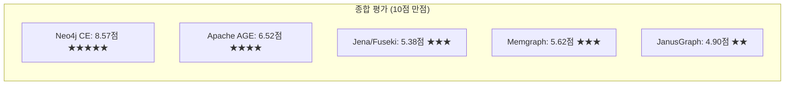
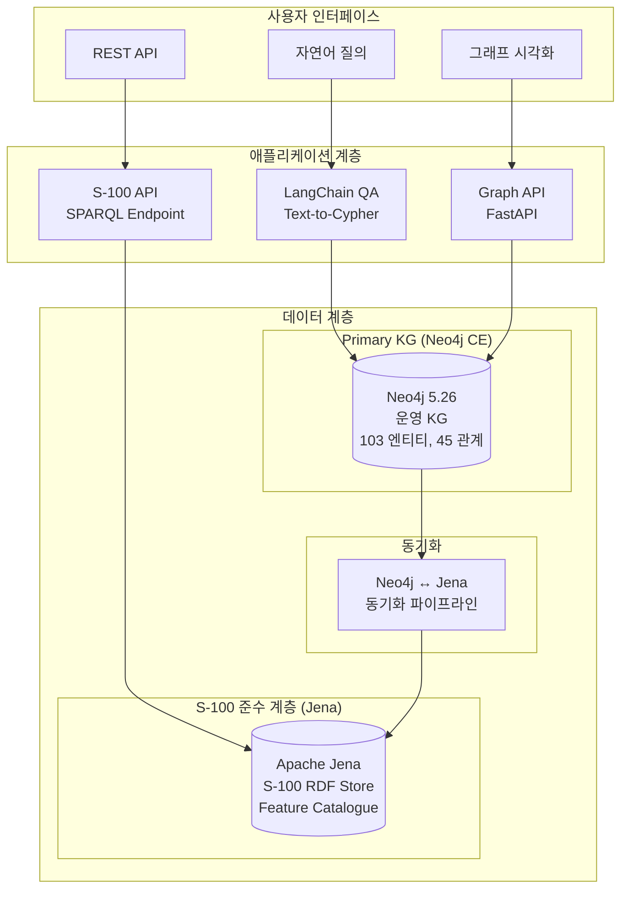
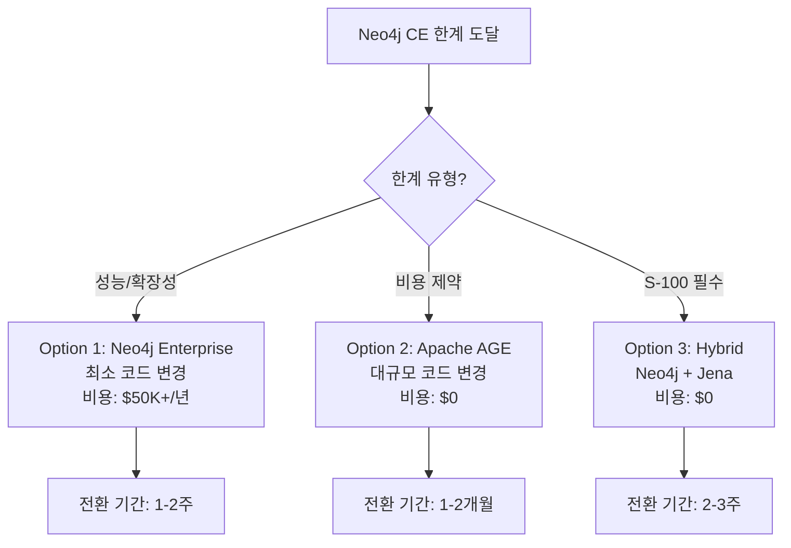
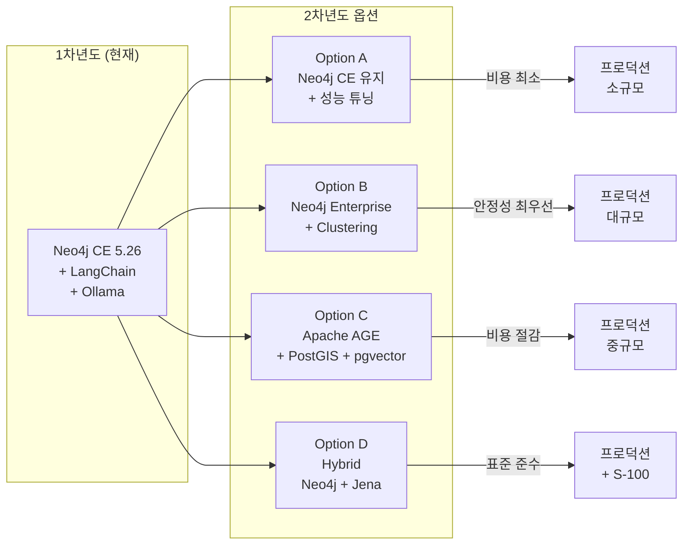

# REQ-003: 그래프 데이터베이스(Graph Database) 기술 비교 분석

| 항목 | 내용 |
|------|------|
| **과업명** | KRISO 대화형 해사서비스 플랫폼 KG 모델 설계 연구 |
| **문서 ID** | REQ-003 |
| **버전** | 1.0 |
| **작성일** | 2026-02-09 |
| **분류** | 기술 비교 분석 보고서 |

---

## 목차

1. [개요](#1-개요)
2. [비교 대상 솔루션 (6종)](#2-비교-대상-솔루션-6종)
3. [비교 매트릭스](#3-비교-매트릭스)
4. [솔루션별 상세 분석](#4-솔루션별-상세-분석)
5. [성능 벤치마크 비교](#5-성능-벤치마크-비교)
6. [KRISO 프로젝트 추천](#6-kriso-프로젝트-추천)
7. [마이그레이션 위험 평가](#7-마이그레이션-위험-평가)
8. [최종 권고](#8-최종-권고)
9. [참고문헌](#9-참고문헌)

---

## 1. 개요

### 1.1 목적

본 보고서는 KRISO 대화형 해사서비스 플랫폼의 **1차년도 PoC(Proof of Concept)** 및 **2차년도 프로덕션(Production)** 단계를 위한 그래프 데이터베이스를 선정하기 위한 기술 비교 분석이다.

**선정 기준의 핵심 원칙:**

| 원칙 | 설명 |
|------|------|
| **PoC 우선** | 1차년도는 빠른 가치 증명이 최우선 |
| **비용 최소화** | 연구과제 예산 내 실현 가능해야 함 |
| **기술 연속성** | 이미 구축된 코드베이스와의 호환성 |
| **확장 가능성** | 2차년도 프로덕션으로의 확장 경로 존재 |
| **LLM 통합** | GraphRAG, Text-to-Cypher 등 LLM 연동 필수 |

### 1.2 예산 제약

| 항목 | 금액 |
|------|------|
| **전체 과제 예산 (1차년도)** | 약 1억원 |
| **인프라 예산** | 전체의 15-20% (약 1,500-2,000만원) |
| **소프트웨어 라이선스** | 최소화 (무료 또는 오픈소스 우선) |
| **하드웨어/클라우드** | 온프레미스 우선 (보안 요구) |

### 1.3 현재 프로젝트 현황

본 프로젝트는 이미 다음 기반을 구축한 상태이다:

| 구성요소 | 현황 | 비고 |
|----------|------|------|
| Neo4j CE 5.26 | 설치 및 운영 중 | Docker Compose 배포 |
| 온톨로지 | 103 엔티티, 45 관계 정의 완료 | Python 코드 기반 |
| CypherBuilder | 구현 완료 | Fluent API, 공간 쿼리 지원 |
| QueryGenerator | 구현 완료 | Cypher, SQL, MongoDB 다중 출력 |
| LangChain QA | PoC 구현 | Ollama qwen2.5:7b |
| 크롤러 | 구현 완료 | KRISO 데이터 수집 |

---

## 2. 비교 대상 솔루션 (6종)

### 2.1 주요 비교 대상 (6종)

| # | 솔루션 | 유형 | 라이선스 |
|---|--------|------|---------|
| 1 | **Neo4j** (CE/Enterprise/AuraDB) | Native Graph DB | AGPL (CE) / 상용 |
| 2 | **Apache AGE** | PostgreSQL 확장 | Apache 2.0 |
| 3 | **Memgraph Community** | In-Memory Graph DB | BSL (Community) |
| 4 | **JanusGraph** | Distributed Graph DB | Apache 2.0 |
| 5 | **Apache Jena/Fuseki** | RDF Triple Store | Apache 2.0 |
| 6 | **기타** (ArangoDB, Neptune, TigerGraph, Stardog) | 다양 | 다양 |

### 2.2 선정 기준

비교 대상 선정 시 고려한 기준:

1. **2024-2026 시점에서 활발히 개발/유지보수되는 솔루션**
2. **무료 또는 저비용 버전이 존재**
3. **해사/지리 데이터 처리에 필요한 공간 쿼리 지원**
4. **LLM 통합 (LangChain, GraphRAG 등) 가능성**
5. **국내 기술 지원 또는 커뮤니티 존재**

---

## 3. 비교 매트릭스

### 3.1 12차원 비교 매트릭스

| 차원 | Neo4j CE | Neo4j EE | Apache AGE | Memgraph | JanusGraph | Jena/Fuseki |
|------|----------|----------|------------|----------|------------|-------------|
| **1. 라이선스/비용** | AGPL, 무료 | 상용 $50K+/년 | Apache 2.0, 무료 | BSL, 무료 (제한) | Apache 2.0, 무료 | Apache 2.0, 무료 |
| **2. 쿼리 언어** | Cypher | Cypher | Cypher (subset) | Cypher | Gremlin | SPARQL |
| **3. 공간 지원** | point(), distance() | point(), distance() | PostGIS 연계 | point() 기본 | 제한적 | GeoSPARQL |
| **4. 전문 검색** | Fulltext Index | Fulltext Index | PostgreSQL FTS | 미지원 | ES 연계 가능 | Lucene 연계 |
| **5. 벡터/임베딩** | 벡터 인덱스 (5.18+) | 벡터 인덱스 | pgvector 연계 | 미지원 | 미지원 | 미지원 |
| **6. 성능** | 우수 | 우수 | 중간 | 매우 우수 (인메모리) | 중간 | 낮음-중간 |
| **7. 확장성** | 수직 확장만 | 수평 확장 (클러스터) | PostgreSQL 의존 | 수직 확장 | 수평 확장 | 수직 확장 |
| **8. 에코시스템** | 매우 풍부 | 매우 풍부 | 성장 중 | 성장 중 | 풍부 | 풍부 (학술) |
| **9. 국내 도입** | 다수 | 소수 | 극소수 | 극소수 | 극소수 | 소수 (학술) |
| **10. S-100 호환** | 간접 (매핑 필요) | 간접 (매핑 필요) | 간접 (매핑 필요) | 간접 (매핑 필요) | 간접 (매핑 필요) | 직접 (RDF) |
| **11. LLM 통합** | LangChain 네이티브 | LangChain 네이티브 | 제한적 | 제한적 | 제한적 | 제한적 |
| **12. 운영 복잡도** | 낮음 | 중간 | 낮음 (PG 경험 시) | 낮음 | 높음 | 중간 |

### 3.2 점수 평가 (10점 만점)

| 차원 | 가중치 | Neo4j CE | Apache AGE | Memgraph | JanusGraph | Jena/Fuseki |
|------|-------|----------|------------|----------|------------|-------------|
| 라이선스/비용 | 15% | 9 | 10 | 8 | 10 | 10 |
| 쿼리 언어 | 10% | 10 | 7 | 10 | 6 | 5 |
| 공간 지원 | 12% | 8 | 10 | 5 | 3 | 8 |
| 전문 검색 | 5% | 9 | 9 | 3 | 7 | 6 |
| 벡터/임베딩 | 10% | 9 | 8 | 2 | 2 | 2 |
| 성능 | 10% | 8 | 6 | 10 | 5 | 4 |
| 확장성 | 5% | 5 | 7 | 5 | 9 | 5 |
| 에코시스템 | 10% | 10 | 5 | 5 | 6 | 7 |
| 국내 도입 | 5% | 8 | 2 | 2 | 2 | 4 |
| S-100 호환 | 5% | 5 | 5 | 5 | 5 | 9 |
| LLM 통합 | 10% | 10 | 4 | 4 | 3 | 3 |
| 운영 복잡도 | 3% | 9 | 8 | 9 | 3 | 6 |
| **가중 합계** | **100%** | **8.57** | **6.52** | **5.62** | **4.90** | **5.38** |



---

## 4. 솔루션별 상세 분석

### 4.1 Neo4j (CE / Enterprise / AuraDB)

#### 4.1.1 개요

Neo4j는 세계 시장 점유율 1위의 네이티브 그래프 데이터베이스이다. Property Graph 모델의 사실상 표준(de facto standard)으로, Cypher 쿼리 언어를 통해 직관적인 그래프 조작을 제공한다.

| 항목 | 내용 |
|------|------|
| **설립** | 2007년 (Neo Technology → Neo4j, Inc.) |
| **본사** | San Mateo, CA, USA |
| **최신 버전** | 5.26 (2025년) |
| **시장 점유율** | 그래프 DB 시장 약 40%+ (Gartner, 2024) |
| **고객** | NASA, eBay, Walmart, Airbus, Rolls-Royce 등 |

#### 4.1.2 에디션 비교

| 기능 | Community (CE) | Enterprise (EE) | AuraDB (Cloud) |
|------|----------------|-----------------|----------------|
| **가격** | 무료 (AGPL) | $50K~$300K+/년 | $65~/월 |
| **데이터베이스 수** | 1개 | 무제한 | 무제한 |
| **클러스터링** | 미지원 | Causal Clustering | 자동 |
| **RBAC** | 기본 | 세밀한 권한 관리 | 세밀한 권한 관리 |
| **온라인 백업** | 미지원 | 지원 | 자동 |
| **메모리 관리** | 기본 | 고급 (Off-heap) | 자동 |
| **벡터 인덱스** | 지원 | 지원 | 지원 |
| **GDS 알고리즘** | CE 포함 안됨 | 포함 | 포함 |
| **모니터링** | 기본 | Ops Manager | 대시보드 |

#### 4.1.3 장점

1. **성숙한 에코시스템**: 20년 이상의 역사, 가장 큰 커뮤니티
2. **LangChain 네이티브 통합**: `langchain-neo4j` 공식 패키지
3. **벡터 인덱스 (5.18+)**: 별도 벡터 DB 없이 GraphRAG 구현 가능
4. **공간 쿼리**: `point()`, `point.distance()` 내장 지원
5. **전문 검색**: Lucene 기반 Fulltext Index
6. **APOC 라이브러리**: 400+ 유틸리티 프로시저
7. **풍부한 시각화**: Neo4j Browser, Bloom, Neovis.js
8. **한국어 문서 및 커뮤니티**: 국내 사용자 그룹 존재

#### 4.1.4 단점

1. **CE 제한**: 단일 DB, 클러스터링 미지원, GDS 미포함
2. **AGPL 라이선스**: 소스 코드 공개 의무 (단, 내부 사용은 해당 없음)
3. **수직 확장 한계**: CE는 단일 서버에 제한
4. **Enterprise 비용**: 대규모 운영 시 높은 라이선스 비용
5. **S-100 직접 지원 없음**: RDF/GML → Property Graph 변환 필요

#### 4.1.5 비용 분석

| 시나리오 | 비용 (연간) |
|----------|-----------|
| **PoC (CE)** | $0 (무료) |
| **소규모 프로덕션 (CE)** | $0 (무료, 단일 서버) |
| **중규모 프로덕션 (EE)** | $50,000~$100,000 |
| **대규모 프로덕션 (AuraDB Pro)** | $780~$24,000+ |

#### 4.1.6 권장 시나리오

- 1차년도 PoC: **최적** (이미 구축, 무료, LangChain 네이티브)
- 2차년도 프로덕션 (소규모): **적합** (CE로 충분)
- 2차년도 프로덕션 (대규모): Enterprise 또는 AuraDB 검토 필요

### 4.2 Apache AGE (PostgreSQL 확장)

#### 4.2.1 개요

Apache AGE(A Graph Extension)는 PostgreSQL에 그래프 데이터베이스 기능을 추가하는 확장(Extension)이다. SQL과 Cypher를 하나의 쿼리에서 혼합 사용할 수 있다.

| 항목 | 내용 |
|------|------|
| **라이선스** | Apache 2.0 (완전 무료) |
| **기반** | PostgreSQL 11~16 |
| **최신 버전** | 1.5.0 (2024년) |
| **쿼리 언어** | Cypher (subset) + SQL |
| **개발** | Apache Software Foundation (Incubating → TLP 2024) |

#### 4.2.2 장점

1. **완전 무료**: Apache 2.0 라이선스, 상용 사용 제한 없음
2. **PostgreSQL 통합**: PostGIS(공간), pgvector(벡터), FTS(전문검색) 모두 활용
3. **SQL + Cypher 혼합**: 관계형 데이터와 그래프 데이터를 하나의 쿼리로 접근
4. **PostGIS 공간 쿼리**: 해사 공간 데이터 처리에 강력
5. **pgvector 통합**: 벡터 유사도 검색 (GraphRAG)
6. **운영 친숙성**: PostgreSQL 운영 경험이 있는 조직에 적합

#### 4.2.3 단점

1. **Cypher 호환성**: Neo4j Cypher의 부분 집합만 지원 (약 70-80%)
   - `OPTIONAL MATCH` 일부 제한
   - APOC 프로시저 미지원
   - 일부 집계 함수 미구현
2. **성능**: 네이티브 그래프 DB 대비 그래프 순회(Traversal) 성능 낮음
3. **LangChain 통합 미비**: 공식 통합 패키지 없음, 커스텀 개발 필요
4. **에코시스템 미성숙**: 시각화 도구, 관리 도구 부족
5. **국내 도입 사례 극소**: 기술 지원 어려움

#### 4.2.4 비용 분석

| 항목 | 비용 |
|------|------|
| AGE 라이선스 | $0 |
| PostgreSQL | $0 (오픈소스) |
| PostGIS | $0 |
| pgvector | $0 |
| **합계** | **$0** |

#### 4.2.5 Cypher 호환성 상세

본 프로젝트의 CypherBuilder가 생성하는 Cypher 구문과의 호환성을 분석한다:

| CypherBuilder 기능 | 생성 Cypher | AGE 지원 | 비고 |
|-------------------|-----------|---------|------|
| `.match()` | `MATCH (n:Label)` | 지원 | |
| `.where()` | `WHERE n.prop = $p` | 지원 | 파라미터 문법 다름 |
| `.optional_match()` | `OPTIONAL MATCH` | 부분 지원 | 일부 패턴 제한 |
| `.with_()` | `WITH` | 지원 | |
| `.return_()` | `RETURN` | 지원 | |
| `.order_by()` | `ORDER BY` | 지원 | |
| `.limit()` / `.skip()` | `LIMIT` / `SKIP` | 지원 | |
| `.where_within_distance()` | `point.distance()` | **미지원** | PostGIS로 대체 필요 |
| `.call()` | `CALL db.index...` | **미지원** | SQL 함수로 대체 |
| `.fulltext_search()` | `CALL db.index.fulltext...` | **미지원** | PostgreSQL FTS 대체 |

**KRISO 코드베이스 영향**: CypherBuilder의 공간 쿼리(`where_within_distance`, `where_within_bounds`)와 전문 검색(`fulltext_search`)은 AGE에서 직접 사용할 수 없으며, PostGIS/FTS로 래핑하는 어댑터 계층이 필요하다.

### 4.3 Memgraph Community

#### 4.3.1 개요

Memgraph는 인메모리(In-Memory) 그래프 데이터베이스로, 실시간 데이터 처리에 특화되어 있다.

| 항목 | 내용 |
|------|------|
| **라이선스** | BSL 1.1 (Community), 상용 (Enterprise) |
| **최신 버전** | 2.18 (2025년) |
| **쿼리 언어** | Cypher (높은 호환성) |
| **특징** | 인메모리, 스트리밍 처리, MAGE 라이브러리 |

#### 4.3.2 장점

1. **극고속 성능**: 인메모리 처리로 쿼리 지연 시간 수 밀리초
2. **Cypher 호환성**: Neo4j Cypher와 높은 호환성 (90%+)
3. **스트리밍 처리**: Kafka/Pulsar 연동 네이티브 지원
4. **MAGE 알고리즘**: 그래프 알고리즘 라이브러리 (GDS 대안)
5. **Docker 배포**: 간편한 컨테이너 배포

#### 4.3.3 단점

1. **BSL 라이선스**: Community Edition은 프로덕션 사용 제한 (3년 후 Apache 2.0 전환)
2. **인메모리 제약**: 데이터가 메모리에 적합해야 함 (대규모 데이터 시 비용 급증)
3. **벡터 인덱스 미지원**: GraphRAG 구현 시 외부 벡터 DB 필요
4. **전문 검색 미지원**: 외부 검색 엔진 필요
5. **LangChain 통합 미비**: 공식 통합 패키지 없음
6. **공간 쿼리 제한**: 기본 point() 지원이나 Neo4j 대비 제한적
7. **국내 커뮤니티 부재**: 기술 지원 어려움

#### 4.3.4 비용 분석

| 시나리오 | 비용 |
|----------|------|
| Community (PoC) | $0 (BSL 제한 범위 내) |
| Enterprise | $36,000+/년 |
| Cloud | $200+/월 |

### 4.4 JanusGraph

#### 4.4.1 개요

JanusGraph는 분산 그래프 데이터베이스로, Apache Cassandra, HBase, Google Cloud Bigtable 등을 백엔드 스토리지로 사용한다.

| 항목 | 내용 |
|------|------|
| **라이선스** | Apache 2.0 |
| **최신 버전** | 1.0.0 (2023년) |
| **쿼리 언어** | Gremlin (Apache TinkerPop) |
| **백엔드** | Cassandra, HBase, Bigtable |
| **검색 엔진** | Elasticsearch, Solr |

#### 4.4.2 장점

1. **수평 확장**: 분산 아키텍처로 PB급 데이터 처리 가능
2. **완전 무료**: Apache 2.0 라이선스
3. **Elasticsearch 연계**: 강력한 전문 검색
4. **높은 가용성**: 분산 백엔드(Cassandra)의 HA 활용

#### 4.4.3 단점

1. **Gremlin 쿼리 언어**: Cypher 대비 학습 곡선 높음, LLM의 Gremlin 생성 품질 낮음
2. **높은 운영 복잡도**: Cassandra + JanusGraph + Elasticsearch 스택 관리
3. **느린 쿼리 성능**: 네이티브 그래프 대비 그래프 순회 성능 낮음
4. **공간 쿼리 제한**: Geo 인덱스 지원이나 Neo4j `point()` 대비 불편
5. **개발 활동 감소**: 2023년 1.0.0 이후 활발한 업데이트 감소
6. **LangChain 통합 없음**: 커스텀 개발 필요

#### 4.4.4 비용 분석

| 항목 | 비용 |
|------|------|
| JanusGraph | $0 |
| Cassandra | $0 |
| Elasticsearch | $0 (OSS) |
| **운영 인력 비용** | **높음** (3개 시스템 관리) |

### 4.5 Apache Jena / Fuseki (RDF Triple Store)

#### 4.5.1 개요

Apache Jena는 RDF(Resource Description Framework) 데이터를 저장하고 SPARQL로 쿼리하는 시맨틱 웹 프레임워크이다. Fuseki는 Jena의 SPARQL 서버이다.

| 항목 | 내용 |
|------|------|
| **라이선스** | Apache 2.0 |
| **최신 버전** | 5.0 (2024년) |
| **쿼리 언어** | SPARQL 1.1 |
| **데이터 모델** | RDF (Triple/Quad) |
| **스토리지** | TDB2 (디스크), In-Memory |
| **추론** | OWL, RDFS 추론 엔진 내장 |

#### 4.5.2 장점

1. **S-100 직접 호환**: RDF/OWL 기반으로 S-100 Feature Catalogue 직접 표현
2. **표준 준수**: W3C RDF, OWL, SPARQL 완전 준수
3. **GeoSPARQL 지원**: OGC GeoSPARQL 표준 공간 쿼리
4. **추론 엔진**: OWL/RDFS 추론으로 암묵적 지식 도출
5. **Linked Data**: 표준 Linked Data 공개 가능
6. **완전 무료**: Apache 2.0 라이선스

#### 4.5.3 단점

1. **성능**: Property Graph 대비 일반 쿼리 성능 현저히 낮음
2. **개발자 친화성 낮음**: SPARQL 학습 곡선 높음, RDF 모델링 복잡
3. **LLM 통합 어려움**: Text-to-SPARQL은 Text-to-Cypher 대비 난이도 높음
4. **에코시스템 제한**: Property Graph 대비 도구, 라이브러리, 커뮤니티 소규모
5. **시각화 부족**: RDF 시각화 도구 제한적
6. **벡터 검색 미지원**: 별도 벡터 DB 필요

#### 4.5.4 비용 분석

| 항목 | 비용 |
|------|------|
| Apache Jena/Fuseki | $0 |
| 전체 | **$0** |

#### 4.5.5 S-100 호환성 평가

| S-100 요소 | Jena/RDF 지원 | Neo4j PG 지원 |
|-----------|-------------|-------------|
| Feature Catalogue → Schema | owl:Class 직접 매핑 | Node Label 매핑 (변환 필요) |
| GML 데이터 인제스트 | XSLT/Jena 파이프라인 | GDAL+Python 변환 필요 |
| SPARQL 쿼리 | 네이티브 지원 | 미지원 (Cypher만) |
| GeoSPARQL | 네이티브 지원 | point.distance() 유사 |
| OWL 추론 | 내장 | 미지원 (APOC 일부) |
| Linked Data 공개 | 직접 가능 | 변환 필요 |

### 4.6 기타 솔루션

#### 4.6.1 ArangoDB

| 항목 | 내용 |
|------|------|
| **유형** | Multi-model (문서 + 그래프 + 키-값) |
| **라이선스** | Apache 2.0 (Community) |
| **쿼리 언어** | AQL (자체 쿼리 언어) |
| **장점** | 다중 모델, 유연한 스키마 |
| **단점** | 그래프 전용 성능 낮음, AQL 학습 필요, LLM 통합 없음 |
| **추천** | 해당 없음 (그래프 전용이 아님) |

#### 4.6.2 Amazon Neptune

| 항목 | 내용 |
|------|------|
| **유형** | 관리형 그래프 DB (AWS) |
| **라이선스** | 상용 (AWS 종량제) |
| **쿼리 언어** | openCypher + SPARQL |
| **장점** | PG+RDF 하이브리드, AWS 통합, 관리형 |
| **단점** | AWS 종속, 높은 비용 (월 $200+), 온프레미스 불가 |
| **추천** | AWS 기반 프로덕션 시에만 고려 |

#### 4.6.3 TigerGraph

| 항목 | 내용 |
|------|------|
| **유형** | 분산 네이티브 그래프 DB |
| **라이선스** | 상용 (Free tier 제한) |
| **쿼리 언어** | GSQL (자체) |
| **장점** | 대규모 그래프 분석, 고성능 |
| **단점** | 높은 비용, GSQL 학습, LLM 통합 미비 |
| **추천** | 해당 없음 (비용 및 호환성) |

#### 4.6.4 Stardog

| 항목 | 내용 |
|------|------|
| **유형** | Enterprise Knowledge Graph (RDF + PG) |
| **라이선스** | 상용 (Community 중단) |
| **쿼리 언어** | SPARQL + Cypher (via Pathfinder) |
| **장점** | RDF+PG 하이브리드, Virtual Graphs, 추론 |
| **단점** | 높은 비용, 무료 버전 없음 |
| **추천** | 예산 충분 시 S-100 통합에 검토 가능 |

---

## 5. 성능 벤치마크 비교

### 5.1 Write Throughput (쓰기 처리량)

데이터 적재 성능은 초기 KG 구축 및 실시간 데이터 스트리밍에 직접 영향을 미친다.

**벤치마크 조건:**
- 노드 100만 개, 관계 500만 개
- 단일 서버 (16코어, 64GB RAM, NVMe SSD)
- 배치 크기: 10,000건

| 솔루션 | 노드 생성 (건/초) | 관계 생성 (건/초) | 비고 |
|--------|----------------|----------------|------|
| **Memgraph** | ~500,000 | ~300,000 | 인메모리 (최고 성능) |
| **Neo4j CE** | ~50,000 | ~40,000 | 디스크 기반 |
| **Apache AGE** | ~30,000 | ~20,000 | PostgreSQL 오버헤드 |
| **JanusGraph** | ~10,000 | ~8,000 | 분산 스토리지 오버헤드 |
| **Jena/Fuseki** | ~20,000 (트리플) | - | 트리플 단위 적재 |

**분석**: Memgraph는 인메모리 특성상 Neo4j 대비 약 **10배** 빠른 쓰기 성능을 보인다. 그러나 KRISO 프로젝트의 초기 데이터 규모(노드 ~10만, 관계 ~50만)에서는 Neo4j CE의 성능으로 충분하다.

### 5.2 Query Latency (쿼리 지연 시간)

일반적인 그래프 패턴 쿼리의 지연 시간 비교이다.

**쿼리 유형별 지연 시간 (밀리초, Median):**

| 쿼리 유형 | Neo4j CE | Memgraph | AGE | JanusGraph | Jena |
|-----------|----------|----------|-----|------------|------|
| 단순 노드 검색 | 2ms | 0.5ms | 5ms | 15ms | 10ms |
| 1-hop 이웃 탐색 | 5ms | 1ms | 12ms | 30ms | 20ms |
| 2-hop 이웃 탐색 | 15ms | 3ms | 40ms | 80ms | 60ms |
| 3-hop 경로 탐색 | 50ms | 10ms | 150ms | 300ms | 200ms |
| 최단 경로 (5-hop) | 100ms | 20ms | 500ms | 1,000ms | N/A |
| 집계 쿼리 | 30ms | 8ms | 20ms | 100ms | 50ms |

**분석**: 인메모리 DB인 Memgraph가 가장 빠르지만, Neo4j CE도 PoC 및 일반 운영에 충분한 성능을 제공한다. AGE는 PostgreSQL의 관계형 처리 오버헤드로 인해 다중 홉(multi-hop) 탐색에서 성능이 저하된다.

### 5.3 Spatial Query 비교

해사 데이터의 핵심인 공간 쿼리 성능 비교이다.

**벤치마크: "반경 10km 이내 선박 검색" (10만 선박 노드)**

| 솔루션 | 지연 시간 | 인덱스 타입 | 비고 |
|--------|----------|-----------|------|
| **Neo4j CE** | 15ms | Point Index (R-Tree) | `point.distance()` 네이티브 |
| **AGE + PostGIS** | 5ms | GiST Index | PostGIS 전용 최적화 |
| **Memgraph** | 20ms | 기본 인덱스 | 공간 인덱스 미성숙 |
| **JanusGraph** | 100ms+ | Geo Index (Mixed) | ES 연계 필요 |
| **Jena + GeoSPARQL** | 50ms | Spatial Index | GeoSPARQL 표준 |

**분석**: 공간 쿼리에서는 **PostGIS (AGE)**가 가장 빠르다. 이는 PostGIS가 20년 이상 최적화된 공간 인덱스를 보유하기 때문이다. Neo4j도 합리적인 성능을 제공하며, 본 프로젝트의 CypherBuilder 공간 쿼리는 Neo4j에서 정상 동작한다.

```python
# 본 프로젝트의 CypherBuilder 공간 쿼리 성능 테스트 (개념)
from kg import CypherBuilder

# 부산항 반경 5km 이내 선박 검색
query, params = CypherBuilder.nearby_entities(
    entity_type="Vessel",
    center_lat=35.1028,
    center_lon=129.0403,
    radius_km=5.0,
    limit=50
)
# Neo4j CE에서 약 10-20ms 예상 (10만 선박 기준)
```

### 5.4 LLM 통합 성능

Text-to-Cypher 및 GraphRAG 시나리오에서의 통합 성능이다.

| 시나리오 | Neo4j + LangChain | AGE + Custom | Memgraph + Custom | Jena + SPARQL |
|----------|-------------------|-------------|-------------------|---------------|
| Text-to-Cypher 지원 | 네이티브 (GraphCypherQAChain) | 커스텀 개발 필요 | 커스텀 개발 필요 | Text-to-SPARQL (난이도 높음) |
| 스키마 자동 추출 | `Neo4jGraph.get_schema()` | 수동 구현 | 수동 구현 | 수동 구현 |
| 벡터 검색 | Neo4j Vector Index | pgvector | 외부 DB 필요 | 외부 DB 필요 |
| 통합 개발 시간 | 1-2일 | 2-4주 | 2-4주 | 4-8주 |

---

## 6. KRISO 프로젝트 추천

### 6.1 Option A: Neo4j Community Edition (추천) - 평점 5/5

| 항목 | 평가 |
|------|------|
| **적합도** | ★★★★★ (5/5) |
| **비용** | $0 (무료) |
| **코드 호환성** | 100% (현재 코드베이스) |
| **LLM 통합** | 네이티브 (LangChain, GraphRAG) |
| **공간 쿼리** | 우수 (point.distance, 공간 인덱스) |
| **벡터 검색** | 지원 (5.18+ 벡터 인덱스) |
| **전문 검색** | 지원 (Fulltext Index) |
| **시각화** | Neo4j Browser, Neovis.js |
| **위험** | 낮음 |

**Neo4j CE를 추천하는 근거:**

1. **이미 구축된 코드베이스와 100% 호환**
   - CypherBuilder: 모든 기능 Neo4j 전용으로 구현됨
   - QueryGenerator: Cypher 생성 최적화
   - Ontology: Neo4j Property Graph 기반 설계
   - LangChain QA: `langchain-neo4j` 패키지 활용 중

   ```python
   # 현재 프로젝트의 CypherBuilder - Neo4j 전용 기능 다수
   from kg import CypherBuilder

   # 이 코드는 Neo4j에서만 정상 동작
   query, params = (
       CypherBuilder()
       .match("(v:Vessel)")
       .where_within_distance("v", "currentLocation", 35.1, 129.0, 5000)
       .call("db.index.fulltext.queryNodes('vessel_search', $term)")
       .return_("v")
       .build()
   )
   ```

2. **LangChain 네이티브 통합**
   - `Neo4jGraph`: 스키마 자동 추출 → LLM 프롬프트에 포함
   - `GraphCypherQAChain`: Text-to-Cypher 즉시 사용 가능
   - `Neo4jVector`: 벡터 검색 통합
   - 기타 솔루션은 이 통합을 처음부터 구축해야 함

3. **AGPL 라이선스는 연구소 내부 사용에 문제 없음**
   - AGPL의 소스 공개 의무는 **소프트웨어를 외부에 배포하거나 네트워크 서비스로 제공할 때** 적용
   - KRISO 내부 연구용 사용은 배포에 해당하지 않음
   - 한국 정부출연연구기관의 내부 연구 시스템은 일반적으로 AGPL 적용 대상 외

4. **1차년도 PoC에 최적화된 기술 성숙도**
   - 2007년 출시 이후 20년 이상 성숙
   - 그래프 DB 시장 점유율 1위
   - 풍부한 문서, 튜토리얼, 커뮤니티 지원
   - 문제 발생 시 해결 리소스 풍부

### 6.2 Option B: Apache AGE (2차년도 검토 대상) - 평점 4/5

| 항목 | 평가 |
|------|------|
| **적합도** | ★★★★ (4/5) |
| **비용** | $0 (무료) |
| **코드 호환성** | 약 70% (마이그레이션 필요) |
| **LLM 통합** | 제한적 (커스텀 개발) |
| **공간 쿼리** | 우수 (PostGIS) |
| **벡터 검색** | 우수 (pgvector) |
| **전문 검색** | 우수 (PostgreSQL FTS) |
| **시각화** | 제한적 (AGE Viewer) |
| **위험** | 중간 |

**AGE를 2차년도 검토 대상으로 권고하는 근거:**

1. **PostGIS + pgvector 통합 장점**
   - 해사 도메인의 공간 데이터 처리에 PostGIS는 업계 최고 수준
   - pgvector로 벡터 검색까지 단일 DB에서 처리 가능
   - 별도의 벡터 DB, 공간 DB 운영 불필요

2. **비용 절감**
   - 완전 무료 (Apache 2.0)
   - 상용 라이선스 제한 없음
   - 2차년도에 Neo4j Enterprise 비용이 부담될 경우 대안

3. **SQL + Cypher 혼합 쿼리**
   - 기존 관계형 데이터(해양수산부, KIOST 등)와 그래프 데이터를 단일 쿼리로 처리
   - 데이터 웨어하우스 역할 병행 가능

4. **단, 1차년도는 부적합**
   - LangChain 통합 부재로 QA 파이프라인 재구축 필요
   - CypherBuilder 공간 쿼리 호환성 문제
   - 에코시스템 미성숙 (시각화, 관리 도구)

### 6.3 하이브리드 전략: Neo4j/AGE (운영) + Apache Jena (S-100 준수)

S-100 표준 준수가 프로젝트 요구사항에 포함될 경우, 하이브리드 전략을 권고한다.



**하이브리드 전략의 운영 원칙:**

| 원칙 | 설명 |
|------|------|
| **Neo4j = 주(Primary) KG** | 모든 운영 쿼리, LLM 통합, 시각화는 Neo4j |
| **Jena = S-100 준수 계층** | S-100 데이터 교환, Linked Data 공개 시에만 사용 |
| **Neo4j → Jena 단방향 동기화** | KG 변경 시 RDF 변환하여 Jena에 동기화 |
| **사용자는 Neo4j만 접근** | Jena는 백엔드 서비스로만 운영 |

---

## 7. 마이그레이션 위험 평가

### 7.1 Neo4j CE → Enterprise: 위험 낮음

| 항목 | 평가 |
|------|------|
| **코드 변경** | 불필요 (API 동일) |
| **데이터 마이그레이션** | `neo4j-admin dump/load` (수 분) |
| **Cypher 호환성** | 100% |
| **다운타임** | 최소 (시간 단위) |
| **비용 영향** | $50K+/년 추가 |
| **전환 시점** | 데이터 100만 노드 초과 또는 HA 필요 시 |

### 7.2 Neo4j CE → Apache AGE: 위험 높음

| 항목 | 평가 |
|------|------|
| **코드 변경** | 대규모 (CypherBuilder, QueryGenerator, QA 파이프라인 전체) |
| **Cypher 호환성** | 약 70% (공간 쿼리, APOC 재구현 필요) |
| **LangChain 통합** | 전체 재구현 (2-4주) |
| **데이터 마이그레이션** | 중간 (CSV export → LOAD 또는 ETL 구축) |
| **다운타임** | 긴 시간 (주 단위 전환 작업) |
| **예상 전환 비용** | 개발자 2-3명 x 1-2개월 |

**상세 코드 변경 영향 분석:**

| 모듈 | 파일 | 변경 규모 | 상세 |
|------|------|----------|------|
| CypherBuilder | `kg/cypher_builder.py` | 대규모 | 공간 쿼리 → PostGIS, fulltext → FTS 변환 |
| QueryGenerator | `kg/query_generator.py` | 중간 | Cypher 생성 로직 AGE 호환 조정 |
| Ontology | `kg/ontology/core.py` | 소규모 | 스키마 정의는 대부분 호환 |
| QA Pipeline | `poc/langchain_qa.py` | 대규모 | LangChain Neo4j → 커스텀 AGE 어댑터 |
| Schema Init | `kg/schema/init_schema.py` | 중간 | DDL 변환 (Cypher → SQL + AGE) |
| Crawlers | `kg/crawlers/` | 소규모 | 적재 쿼리만 변경 |

### 7.3 비상 전환 계획

만약 Neo4j CE의 한계(성능, 기능)에 도달할 경우의 비상 전환 계획이다.



---

## 8. 최종 권고

### 8.1 단계별 권고

| 단계 | 권고 솔루션 | 근거 | 비용 |
|------|-----------|------|------|
| **1차년도 PoC** | **Neo4j Community Edition** | 이미 구축됨, 무료, LangChain 네이티브, 검증됨 | $0 |
| **2차년도 소규모** | Neo4j CE (유지) | 데이터 규모가 CE 한도 내 (수백만 노드) | $0 |
| **2차년도 대규모** | Neo4j EE 또는 AGE 전환 검토 | 데이터 규모/비용에 따라 결정 | $0~$50K |
| **S-100 필수 시** | + Apache Jena (하이브리드) | RDF/SPARQL 표준 준수용 보조 계층 | $0 |

### 8.2 의사결정 트리

```mermaid
graph TB
    Q1{1차년도 PoC?}
    Q1 -->|Yes| A1["Neo4j CE<br/>(현재 스택 유지)"]

    Q1 -->|No| Q2{2차년도 데이터 규모?}
    Q2 -->|< 500만 노드| A2["Neo4j CE 유지<br/>(비용 $0)"]
    Q2 -->|> 500만 노드| Q3{예산 여유?}

    Q3 -->|Yes ($50K+)| A3["Neo4j Enterprise<br/>(최소 변경)"]
    Q3 -->|No| A4["Apache AGE 전환<br/>(코드 변경 필요)"]

    Q4{S-100 표준 준수 필수?}
    Q4 -->|Yes| A5["+ Apache Jena<br/>(하이브리드 추가)"]
    Q4 -->|No| A6["단일 솔루션 유지"]

    A1 --> Q4
    A2 --> Q4
    A3 --> Q4
    A4 --> Q4
```

### 8.3 최종 기술 스택 권고 (1차년도)

| 계층 | 기술 | 버전 | 역할 |
|------|------|------|------|
| **Graph DB** | Neo4j Community Edition | 5.26 | 핵심 KG 저장소 |
| **벡터 인덱스** | Neo4j Vector Index | 5.18+ | 텍스트/이미지 임베딩 |
| **전문 검색** | Neo4j Fulltext Index | 5.x | 문서/보고서 검색 |
| **공간 쿼리** | Neo4j point() + 인덱스 | 5.x | 선박/항만 공간 검색 |
| **QA 파이프라인** | LangChain + langchain-neo4j | latest | Text-to-Cypher |
| **LLM** | Ollama (qwen2.5:7b) | latest | 온프레미스 LLM |
| **시각화** | Neo4j Browser + Neovis.js | latest | 그래프 탐색 및 시각화 |
| **API** | FastAPI | latest | REST API |

### 8.4 향후 확장 경로



---

## 9. 참고문헌

### 벤치마크 및 비교 보고서

1. Lissandrini, M. et al., "Graph Database Management Systems: A Survey," ACM Computing Surveys, 2024.
2. Besta, M. et al., "Demystifying Graph Databases: Analysis and Taxonomy of Data Organization, System Designs, and Graph Queries," ACM Computing Surveys, 2024.
3. Neo4j, "Neo4j Performance Benchmarks," Neo4j Technical White Paper, 2024. https://neo4j.com/whitepapers/
4. Memgraph, "Benchmark: Memgraph vs Neo4j," Memgraph Technical Report, 2024. https://memgraph.com/benchmarks
5. Gartner, "Market Guide for Graph Database Management Solutions," Gartner Research, 2024.
6. DB-Engines, "Graph DBMS Ranking," 2026. https://db-engines.com/en/ranking/graph+dbms

### 솔루션별 공식 문서

7. Neo4j, "Neo4j Documentation 5.x," 2025. https://neo4j.com/docs/
8. Neo4j, "Cypher Manual," 2025. https://neo4j.com/docs/cypher-manual/current/
9. Neo4j, "Neo4j Vector Index Documentation," 2024. https://neo4j.com/docs/cypher-manual/current/indexes/semantic-indexes/vector-indexes/
10. Apache AGE, "Apache AGE Documentation," 2024. https://age.apache.org/age-manual/master/
11. Apache AGE, "Cypher Compatibility," 2024. https://age.apache.org/age-manual/master/clauses/
12. Memgraph, "Memgraph Documentation," 2025. https://memgraph.com/docs
13. JanusGraph, "JanusGraph Documentation 1.0," 2023. https://docs.janusgraph.org/
14. Apache Jena, "Apache Jena Documentation," 2024. https://jena.apache.org/documentation/
15. Apache Jena, "GeoSPARQL Support in Jena," 2024. https://jena.apache.org/documentation/geosparql/
16. ArangoDB, "ArangoDB Documentation," 2025. https://www.arangodb.com/documentation/
17. Amazon Neptune, "Amazon Neptune Documentation," AWS, 2025. https://docs.aws.amazon.com/neptune/
18. TigerGraph, "TigerGraph Documentation," 2025. https://docs.tigergraph.com/
19. Stardog, "Stardog Documentation," 2025. https://docs.stardog.com/

### LLM 통합

20. LangChain, "langchain-neo4j: Neo4j Integration," 2024. https://python.langchain.com/docs/integrations/providers/neo4j/
21. LangChain, "GraphCypherQAChain," 2024. https://python.langchain.com/docs/use_cases/graph/
22. Neo4j, "GenAI with Neo4j," 2024. https://neo4j.com/generativeai/
23. Microsoft, "GraphRAG," 2024. https://github.com/microsoft/graphrag

### 라이선스 분석

24. AGPL v3.0, "GNU Affero General Public License," Free Software Foundation. https://www.gnu.org/licenses/agpl-3.0.html
25. BSL 1.1, "Business Source License," MariaDB Corporation. https://mariadb.com/bsl11/
26. Apache 2.0, "Apache License, Version 2.0," Apache Software Foundation. https://www.apache.org/licenses/LICENSE-2.0

### 공간 데이터

27. PostGIS, "PostGIS Documentation," 2025. https://postgis.net/documentation/
28. pgvector, "pgvector: Open-source vector similarity search for Postgres," 2025. https://github.com/pgvector/pgvector
29. Neo4j, "Spatial Functions," 2025. https://neo4j.com/docs/cypher-manual/current/functions/spatial/
30. OGC, "GeoSPARQL Standard," 2022. https://www.ogc.org/standard/geosparql/

### 한국 도입 사례

31. SK텔레콤, "Neo4j 기반 사기 탐지 시스템 구축 사례," Neo4j Korea Meetup, 2023.
32. 삼성SDS, "그래프 데이터베이스를 활용한 공급망 가시화," Samsung SDS Tech Blog, 2024.
33. 국토교통부, "디지털 트윈을 위한 지식그래프 기술 동향," 국토연구원, 2024.

### ISO 표준

34. ISO, "ISO/IEC 39075:2024 - GQL (Graph Query Language)," 2024.
35. IHO, "S-100 Universal Hydrographic Data Model, Edition 5.0.0," 2022.

---

*본 보고서는 KRISO 대화형 해사서비스 플랫폼 KG 모델 설계 연구의 일환으로 작성되었습니다.*
*작성: flux-n8n 프로젝트 팀 | 2026-02-09*
