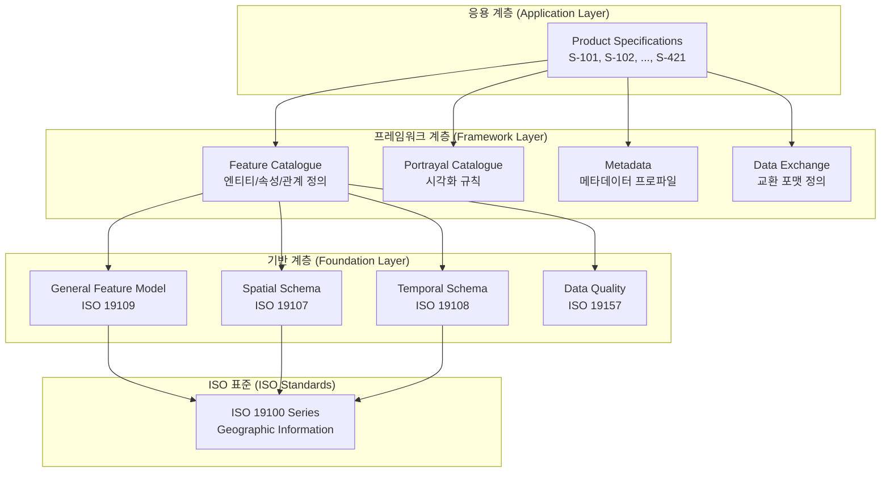
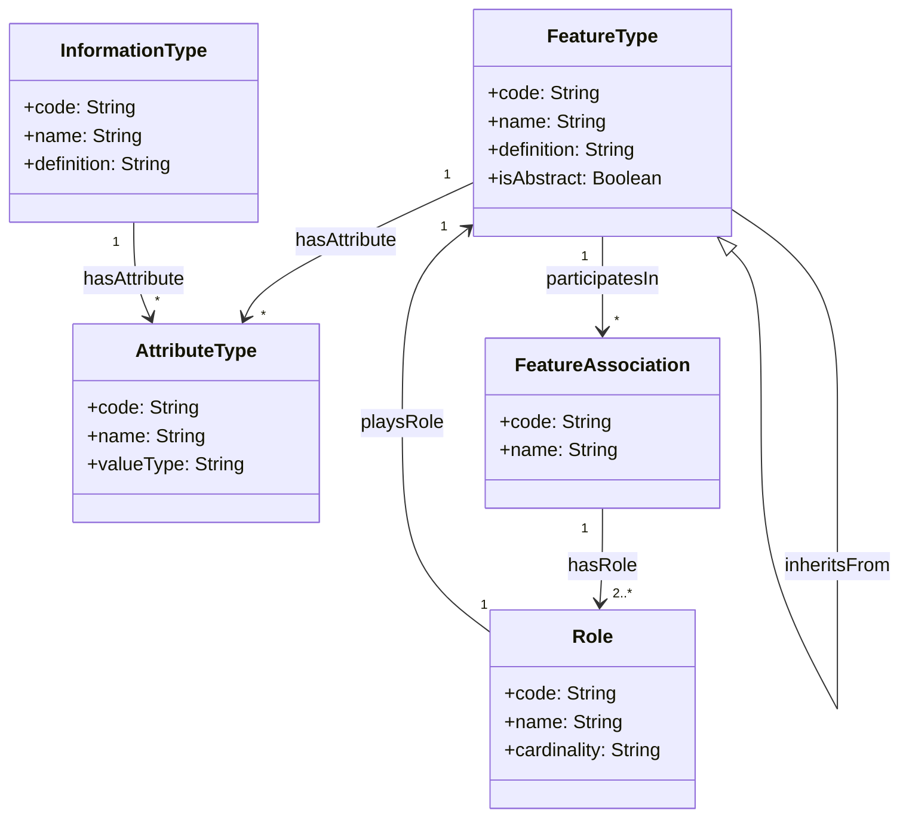
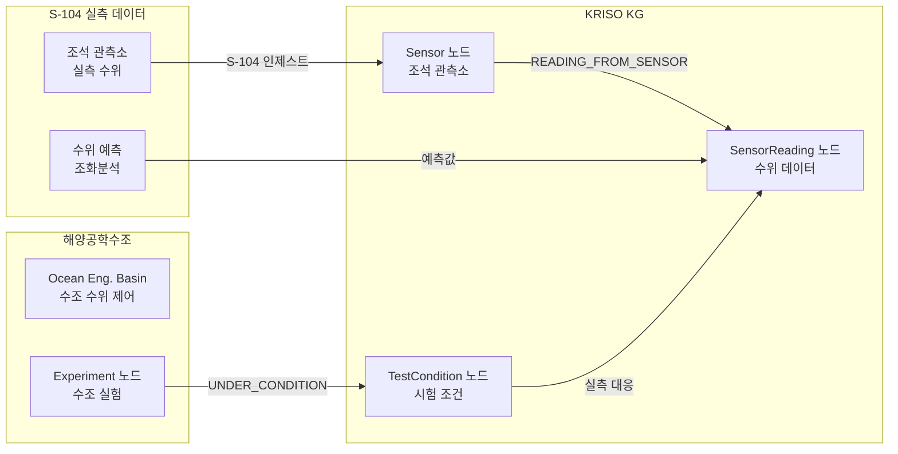
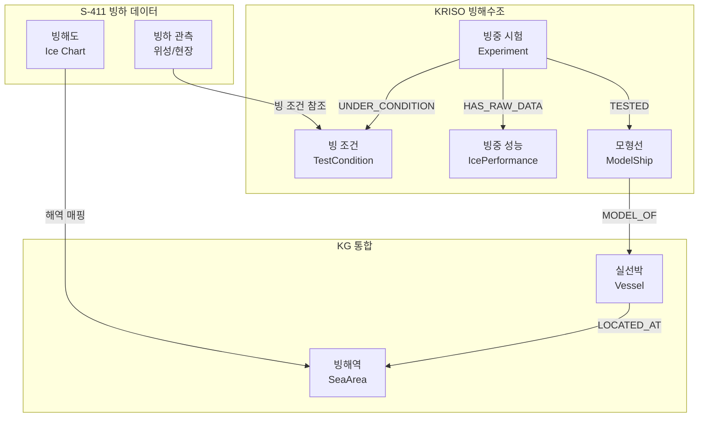
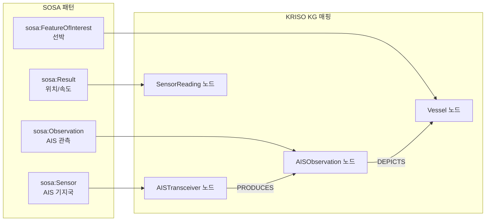
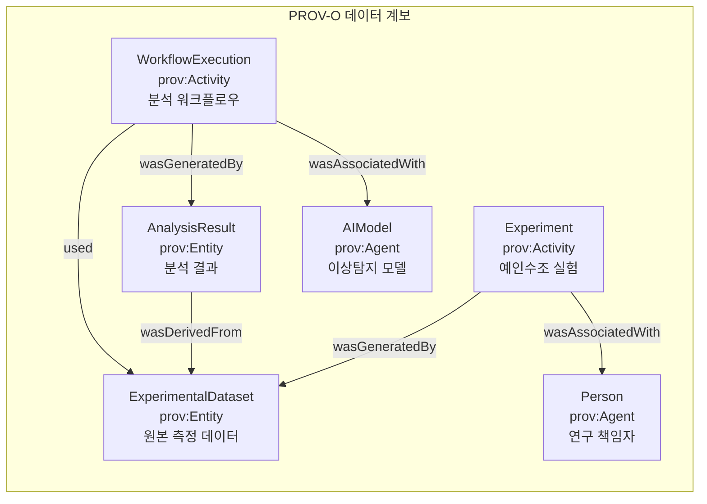
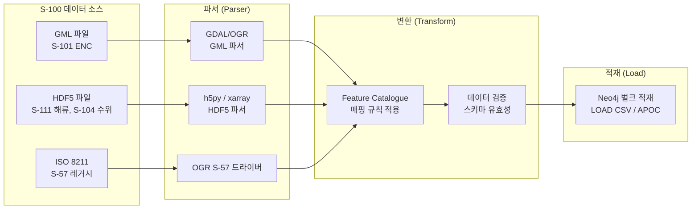
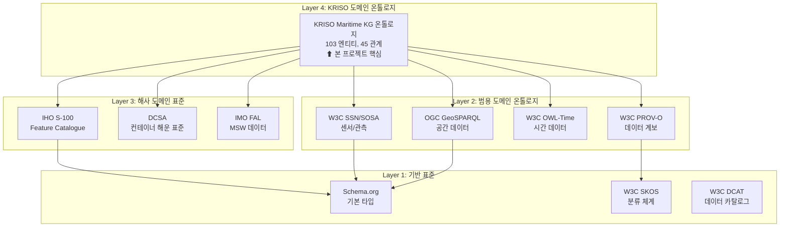
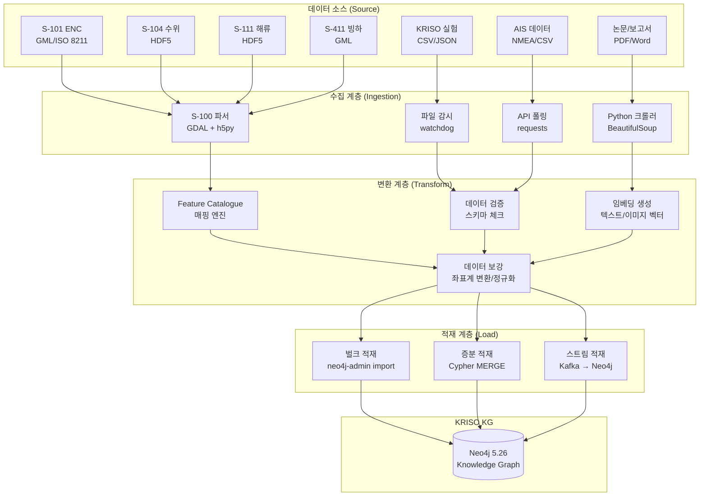

# REQ-004: IHO S-100 표준 분석 및 온톨로지 매핑 전략

| 항목 | 내용 |
|------|------|
| **과업명** | KRISO 대화형 해사서비스 플랫폼 KG 모델 설계 연구 |
| **문서 ID** | REQ-004 |
| **버전** | 1.0 |
| **작성일** | 2026-02-09 |
| **분류** | 표준 분석 보고서 |

---

## 목차

1. [S-100 프레임워크 개요](#1-s-100-프레임워크-개요)
2. [KRISO 관련 Product Specification 분석](#2-kriso-관련-product-specification-분석)
3. [S-100 → 온톨로지 매핑 전략](#3-s-100--온톨로지-매핑-전략)
4. [표준 온톨로지 통합](#4-표준-온톨로지-통합)
5. [구현 고려사항](#5-구현-고려사항)
6. [KRISO 온톨로지 설계 권고](#6-kriso-온톨로지-설계-권고)
7. [참고문헌](#7-참고문헌)

---

## 1. S-100 프레임워크 개요

### 1.1 IHO S-100 Universal Hydrographic Data Model 아키텍처

IHO(International Hydrographic Organization) S-100은 해양 공간 데이터(Hydrographic and Maritime Data)를 위한 **범용 데이터 모델 프레임워크**이다. 기존 S-57(전자해도 전송 표준)의 후속으로 개발되었으며, 해양 데이터의 표현, 교환, 시각화를 위한 포괄적인 표준 체계를 제공한다.

**S-100의 핵심 설계 원칙:**

| 원칙 | 설명 |
|------|------|
| **범용성 (Universality)** | 수로, 해양, 기상, 교통 등 모든 해양 데이터 포괄 |
| **확장성 (Extensibility)** | Product Specification으로 도메인별 확장 가능 |
| **상호운용성 (Interoperability)** | ISO 19100 시리즈 기반으로 GIS 표준과 호환 |
| **다중 인코딩 (Multiple Encodings)** | GML, HDF5, ISO 8211 등 다양한 포맷 지원 |
| **레지스트리 (Registry)** | IHO GI Registry에서 중앙 관리 |

**S-100 아키텍처 계층:**



### 1.2 Feature Catalogue 구조

Feature Catalogue(FC)는 S-100의 핵심 구성요소로, 실세계 현상(Feature)의 타입, 속성, 관계를 체계적으로 정의한다. FC는 본질적으로 **온톨로지(Ontology)**와 유사한 구조를 가진다.

**FC 구성요소:**

| FC 구성요소 | 설명 | 온톨로지 매핑 |
|------------|------|--------------|
| **Feature Type** | 실세계 현상의 분류 (예: Light, Buoy, Depth Area) | `owl:Class` / Node Label |
| **Information Type** | 메타 정보 유형 (예: Authority, Source) | `owl:Class` / Node Label |
| **Simple Attribute** | 단일 값 속성 (예: height, colour) | `owl:DatatypeProperty` / Property |
| **Complex Attribute** | 복합 구조 속성 (예: featureName = language + name) | 중첩 Property / 별도 Node |
| **Feature Association** | Feature 간 관계 (예: composition, aggregation) | `owl:ObjectProperty` / Relationship |
| **Role** | Association에서의 역할 (예: parent, child) | Relationship Property |
| **Enumeration** | 열거형 값 (예: colour = {red, green, white}) | `enum_values` |

**FC XML 구조 예시 (S-101 ENC):**

```xml
<!-- S-101 Feature Catalogue 예시 -->
<S100FC:S100_FC_FeatureType>
    <S100FC:code>Light</S100FC:code>
    <S100FC:name>Light</S100FC:name>
    <S100FC:definition>A luminous or lighted aid to navigation</S100FC:definition>
    <S100FC:attributeBinding>
        <S100FC:attribute ref="characteristicOfLight"/>
        <S100FC:attribute ref="colour"/>
        <S100FC:attribute ref="height"/>
        <S100FC:attribute ref="valueOfNominalRange"/>
        <S100FC:attribute ref="status"/>
    </S100FC:attributeBinding>
    <S100FC:featureBinding>
        <S100FC:association ref="S100FC:Association_equipment">
            <S100FC:role ref="component"/>
        </S100FC:association>
    </S100FC:featureBinding>
</S100FC:S100_FC_FeatureType>
```

### 1.3 General Feature Model (GFM) - ISO 19109 기반

GFM(General Feature Model)은 S-100의 데이터 모델링 기반으로, ISO 19109 "Geographic Information - Rules for Application Schema"에서 정의된다.

**GFM 클래스 다이어그램 (핵심):**



**GFM → Property Graph 대응:**

| GFM 개념 | Property Graph 대응 | 비고 |
|----------|---------------------|------|
| FeatureType | Node Label | 예: `(:Light)`, `(:Buoy)` |
| InformationType | Node Label | 예: `(:Authority)`, `(:Source)` |
| AttributeType | Node Property | 예: `{height: 15.0, colour: "red"}` |
| FeatureAssociation | Relationship | 예: `-[:COMPONENT_OF]->` |
| Role | Relationship + Direction | 방향으로 역할 표현 |
| Inheritance | 다중 Label | 예: `(:Light:AidToNavigation)` |
| Spatial Attribute | `point()` / WKT | Neo4j 공간 타입 활용 |
| Temporal Attribute | `datetime()` | Neo4j 시간 타입 활용 |

### 1.4 S-100 이행 일정

S-100 기반 Product Specification의 이행은 IMO와 IHO의 합의에 따라 단계적으로 진행된다.

| 시점 | 이벤트 | 영향 |
|------|--------|------|
| 2010 | S-100 Edition 1.0 발행 | 프레임워크 확립 |
| 2018 | S-100 Edition 4.0 | 다중 인코딩 지원 |
| 2022 | S-100 Edition 5.0 (현재 최신) | 인터페이스 사양 확정 |
| 2024 | S-101 시범 운용 시작 (Test Beds) | 주요 수로국 참여 |
| 2025 | ECDIS S-100 성능 표준 채택 (IMO MSC) | 선박 장비 표준화 |
| **2026** | **S-101 ENC 허용 (Permitted)** | S-57과 병행 사용 가능 |
| 2028 | S-57 단계적 폐지 시작 | S-100 전환 가속 |
| **2029** | **S-101 ENC 의무화 (Mandatory)** | 모든 ECDIS에서 S-101 필수 |

**KRISO 프로젝트 시사점**: 2026년 S-101 허용 시점과 본 프로젝트의 1차년도가 겹치므로, S-100 체계에 대한 KG 매핑 전략을 사전에 확립하는 것이 시의적절하다.

---

## 2. KRISO 관련 Product Specification 분석

### 2.1 S-101 Electronic Navigational Chart (ENC) - 베이스맵

S-101은 S-57을 대체하는 차세대 전자해도 표준으로, KRISO KG의 공간 베이스맵(Base Map) 역할을 한다.

**S-101 주요 Feature Type:**

| Feature Type | 코드 | 설명 | KG 엔티티 매핑 |
|-------------|------|------|---------------|
| DepthArea | DEPARE | 수심 영역 | `SeaArea` 속성 |
| DepthContour | DEPCNT | 수심 등고선 | `SeaArea` 경계 |
| Anchorage | ACHARE | 투묘지 | `Anchorage` |
| BerthingArea | - | 선석 구역 | `Berth` |
| Fairway | FAIRWY | 항로 | `Waterway` |
| TrafficSeparationScheme | TSSRON | 통항분리대 | `TSS` |
| Light | LIGHTS | 등대/등화 | 새 엔티티 가능 |
| Buoy | BOYISD | 부표 | 새 엔티티 가능 |
| RestrictedArea | RESARE | 제한 구역 | `SeaArea` 하위 타입 |

**S-101 → KG 매핑 예시:**

```cypher
// S-101 Anchorage Feature → Neo4j 노드
CREATE (a:Anchorage {
    featureId: "KR-BUSAN-ANC-001",
    name: "부산항 제1투묘지",
    nameEn: "Busan Port Anchorage No.1",
    // S-101 속성
    categoryOfAnchorage: "deep_water",
    status: "permanent",
    // 공간 데이터
    location: point({latitude: 35.0756, longitude: 129.0812}),
    // S-101 품질 정보
    dataQuality: "surveyed",
    surveyDate: date("2024-06-15")
})
```

### 2.2 S-104 Water Level Information (수위 정보)

S-104는 실시간 및 예측 수위 정보를 제공하는 표준으로, KRISO **해양공학수조**의 수위 관련 실험 데이터와 연결된다.

**S-104 데이터 구조:**

| 요소 | 설명 | KG 연계 |
|------|------|---------|
| WaterLevel | 관측/예측 수위 | `SensorReading` (metric: "waterLevel") |
| WaterLevelTrend | 수위 추세 (상승/하강/안정) | `SensorReading` 속성 |
| TidalStation | 조석 관측소 | `Sensor` (sensorType: "tidalStation") |
| datumReference | 기준면 | `TestCondition` 속성 |

**해양공학수조 연결 포인트:**



### 2.3 S-111 Surface Currents (표면 해류)

S-111은 표면 해류 데이터를 제공하는 표준으로, KRISO **해양공학수조의 조류 데이터**와 연결된다.

**S-111 데이터 구조:**

| 요소 | 설명 | KG 연계 |
|------|------|---------|
| SurfaceCurrent | 해류 벡터 (속도 + 방향) | `SensorReading` (metric: "currentSpeed/Direction") |
| GridPoint | 격자점 좌표 | `GeoPoint` |
| TimePoint | 관측/예측 시간 | `SensorReading.timestamp` |

**데이터 포맷**: S-111은 HDF5 인코딩을 사용하며, 정규 격자(Regular Grid) 위의 시계열 해류 벡터를 저장한다.

```python
# S-111 HDF5 파일 → KG 적재 파이프라인 (개념 코드)
import h5py
from kg import CypherBuilder

def load_s111_to_kg(s111_file: str, neo4j_session):
    """S-111 HDF5 파일에서 해류 데이터를 KG에 적재."""
    with h5py.File(s111_file, 'r') as f:
        # 격자점 좌표 추출
        grid_lat = f['Group_001/Grid/latitude'][:]
        grid_lon = f['Group_001/Grid/longitude'][:]

        # 해류 벡터 추출
        speed = f['Group_001/Values/surfaceCurrentSpeed'][:]
        direction = f['Group_001/Values/surfaceCurrentDirection'][:]

        for i in range(len(grid_lat)):
            query, params = (
                CypherBuilder()
                .match("(g:GeoPoint {latitude: $lat, longitude: $lon})")
                .call("""
                    MERGE (r:SensorReading {
                        readingId: $readingId,
                        metric: 'surfaceCurrent',
                        value: $speed,
                        unit: 'knots',
                        timestamp: datetime($timestamp)
                    })
                    MERGE (r)-[:READING_AT]->(g)
                """)
                .build()
            )
            # neo4j_session.run(query, params)
```

### 2.4 S-127 Marine Traffic Management (해상교통 관리)

S-127은 VTS(Vessel Traffic Service) 및 해상교통 관리 데이터 표준으로, KRISO 플랫폼의 **VTS 연동 및 자율운항선박** 서비스에 핵심적이다.

**S-127 주요 Feature Type:**

| Feature Type | 설명 | KG 엔티티 매핑 |
|-------------|------|---------------|
| VTSArea | VTS 관할 해역 | `SeaArea` (subType: "VTS") |
| ReportingPoint | 보고 지점 | `GeoPoint` (subType: "reportingPoint") |
| RadioStation | VTS 통신국 | `Sensor` (sensorType: "radioStation") |
| RouteRecommendation | 추천 항로 | `Waterway` 확장 |
| TrafficManagementArea | 교통 관리 구역 | `TSS` 확장 |

**S-127 → KG 통합 시나리오:**

```cypher
// VTS 관할 해역과 선박 교통 모델링
// S-127 VTSArea → SeaArea 노드
CREATE (vts:SeaArea {
    areaId: "KR-VTS-BUSAN",
    name: "부산 VTS 관할해역",
    areaType: "VTS",
    // S-127 속성
    callSign: "Busan VTS",
    frequency: "156.6 MHz",
    operatingHours: "24h"
})

// 선박 통과 이벤트
MATCH (v:Vessel {mmsi: $mmsi})
MATCH (vts:SeaArea {areaId: "KR-VTS-BUSAN"})
CREATE (v)-[:LOCATED_AT {
    timestamp: datetime(),
    source: "S-127_VTS"
}]->(vts)
```

### 2.5 S-411 Sea Ice Information (빙하 정보)

S-411은 빙하 정보 표준으로, KRISO **빙해수조(Ice Model Basin)** 실험 데이터와 연결된다.

**S-411 주요 Feature Type:**

| Feature Type | 설명 | KG 연계 |
|-------------|------|---------|
| IceConcentration | 빙 농도 | `TestCondition.iceThickness` |
| IceType | 빙 유형 (1년빙, 다년빙 등) | `TestCondition` 확장 속성 |
| IceEdge | 빙하 경계선 | `SeaArea` 공간 속성 |
| IceBerg | 빙산 정보 | 별도 엔티티 가능 |
| IceAccretion | 착빙 정보 | `Vessel` 운항 조건 |

**빙해수조 연결 시나리오:**



### 2.6 S-412 Weather Overlay (기상 오버레이) - 개발 중

S-412는 해상 기상 정보를 전자해도 위에 오버레이하는 표준으로, 현재 개발 중이다.

| 항목 | 내용 |
|------|------|
| **상태** | 개발 중 (Draft Stage) |
| **예상 완료** | 2027년 이후 |
| **주요 요소** | 풍속/풍향, 파고, 시정, 기압, 해수면 온도 |
| **KG 엔티티 매핑** | `WeatherCondition`, `WeatherObservation` |

S-412가 확정되면, KRISO KG의 `WeatherCondition` 엔티티 속성을 S-412 Feature Catalogue에 맞추어 조정해야 한다. 현재 온톨로지에 이미 정의된 속성(windSpeed, waveHeight, visibility 등)은 S-412 초안과 높은 호환성을 보인다.

---

## 3. S-100 → 온톨로지 매핑 전략

### 3.1 Feature Catalogue → Neo4j Property Graph 매핑 테이블

S-100 Feature Catalogue의 각 구성요소를 Neo4j Property Graph로 매핑하는 전략이다.

#### 3.1.1 Feature Type → Node Label

| S-100 Feature Type | Neo4j Node Label | 비고 |
|-------------------|-----------------|------|
| DepthArea | `SeaArea` | 수심 속성으로 구분 |
| AnchorageArea | `Anchorage` | 직접 매핑 |
| BerthingArea | `Berth` | 직접 매핑 |
| Fairway | `Waterway` | `waterwayType: "fairway"` |
| TrafficSeparationScheme | `TSS` | 직접 매핑 |
| VTSArea | `SeaArea` | `areaType: "VTS"` |
| Light | `PortFacility` 또는 새 라벨 | 항로표지 확장 필요 |
| Buoy | `PortFacility` 또는 새 라벨 | 항로표지 확장 필요 |
| SurfaceCurrent | `SensorReading` | `metric: "surfaceCurrent"` |
| WaterLevel | `SensorReading` | `metric: "waterLevel"` |
| IceConcentration | `TestCondition` 확장 | 빙 관련 속성 |

#### 3.1.2 Attribute → Node Property

| S-100 Attribute | Neo4j Property | 타입 | 예시 |
|----------------|---------------|------|------|
| featureName | `name` / `nameEn` | STRING | "부산항 제1투묘지" |
| categoryOfAnchorage | `anchorageType` | STRING | "deep_water" |
| depth | `depth` | FLOAT | 12.5 |
| height | `height` | FLOAT | 15.0 |
| colour | `colour` | LIST<STRING> | ["red", "green"] |
| status | `status` | STRING | "permanent" |
| dateStart / dateEnd | `validFrom` / `validTo` | DATE | 2024-01-01 |
| scaleMinimum | `minScale` | INTEGER | 22000 |

#### 3.1.3 Association → Relationship Type

| S-100 Association | Neo4j Relationship | 방향 | 비고 |
|------------------|-------------------|------|------|
| component | `HAS_COMPONENT` | → | 부모→자식 |
| aggregation | `PART_OF` | ← | 부분→전체 |
| peer | 양방향 관계 | ↔ | 대등 관계 |
| spatial_association | `ADJACENT_TO` | ↔ | 공간 인접 |
| temporal_association | `FOLLOWS` | → | 시간 순서 |

#### 3.1.4 Spatial Data → `point()` / WKT

| S-100 공간 유형 | Neo4j 표현 | 비고 |
|---------------|-----------|------|
| Point (GM_Point) | `point({latitude: $lat, longitude: $lon})` | 점 위치 |
| Curve (GM_Curve) | WKT LINESTRING (문자열 속성) | 선형 |
| Surface (GM_Surface) | WKT POLYGON (문자열 속성) | 면적 |
| Composite Curve | WKT MULTILINESTRING | 복합 선형 |

**공간 매핑 예시:**

```cypher
// S-100 Point → Neo4j point()
CREATE (light:PortFacility {
    name: "오륙도 등대",
    facilityType: "lighthouse",
    location: point({latitude: 35.0991, longitude: 129.0856, crs: "WGS-84"})
})

// S-100 Surface → Neo4j WKT 속성
CREATE (area:SeaArea {
    name: "부산항 VTS 구역",
    areaType: "VTS",
    boundary: "POLYGON((129.0 35.0, 129.1 35.0, 129.1 35.1, 129.0 35.1, 129.0 35.0))"
})
```

### 3.2 Feature Catalogue → RDF/OWL 매핑

S-100 데이터를 Linked Data로 공개하거나 SPARQL 쿼리를 지원해야 하는 경우, RDF/OWL 매핑이 필요하다.

| S-100 구성요소 | RDF/OWL 매핑 |
|---------------|-------------|
| Feature Type | `owl:Class` |
| Feature Type 상속 | `rdfs:subClassOf` |
| Simple Attribute | `owl:DatatypeProperty` |
| Complex Attribute | `owl:ObjectProperty` + `owl:Class` |
| Feature Association | `owl:ObjectProperty` |
| Role | `owl:ObjectProperty` (방향별 구분) |
| Enumeration | `owl:oneOf` / SKOS Concept Scheme |
| Spatial Attribute | GeoSPARQL `geo:hasGeometry` |
| Temporal Attribute | OWL-Time `time:hasBeginning` |

**RDF/OWL 매핑 예시:**

```turtle
@prefix s100: <http://iho.int/s100/> .
@prefix rdfs: <http://www.w3.org/2000/01/rdf-schema#> .
@prefix owl: <http://www.w3.org/2002/07/owl#> .
@prefix geo: <http://www.opengis.net/ont/geosparql#> .
@prefix xsd: <http://www.w3.org/2001/XMLSchema#> .

# Feature Type → owl:Class
s100:Light a owl:Class ;
    rdfs:label "Light"@en ;
    rdfs:comment "A luminous or lighted aid to navigation"@en ;
    rdfs:subClassOf s100:AidToNavigation .

# Attribute → DatatypeProperty
s100:height a owl:DatatypeProperty ;
    rdfs:domain s100:Light ;
    rdfs:range xsd:float ;
    rdfs:label "height"@en .

# Association → ObjectProperty
s100:componentOf a owl:ObjectProperty ;
    rdfs:domain s100:Light ;
    rdfs:range s100:LightHouse ;
    rdfs:label "component of"@en .
```

### 3.3 기존 S-100 → Linked Data 전환 연구 사례

#### 3.3.1 IHO S-100 to Linked Data (IALA, 2023)

국제항로표지협회(IALA)는 S-100 기반 항로표지 데이터를 Linked Data로 변환하는 파일럿 프로젝트를 수행했다.

**접근법:**
1. S-100 Feature Catalogue XML → OWL 온톨로지 자동 변환
2. S-100 데이터셋 (GML) → RDF 트리플 자동 변환
3. SPARQL 엔드포인트 공개
4. GeoSPARQL로 공간 쿼리 지원

**교훈:**
- 자동 변환 도구로 FC → OWL 변환은 90% 이상 자동화 가능
- 복합 속성(Complex Attribute) 매핑이 가장 어려운 부분
- 공간 데이터 변환 시 좌표계(CRS) 처리 주의 필요

#### 3.3.2 KHOA S-100 구현 프로젝트 (2024)

한국해양조사원(KHOA)은 S-101 ENC 생산 체계를 구축하며, 데이터의 Linked Data 변환을 검토하고 있다.

| 항목 | 내용 |
|------|------|
| **S-101 생산** | 한국 연안 전자해도 S-101 변환 진행 중 |
| **S-102 생산** | 수심 데이터 S-102 시범 생산 |
| **Linked Data** | 검토 단계 (2027년 이후 계획) |
| **KRISO 협력** | 가능 - S-100 데이터 공유 협의 필요 |

---

## 4. 표준 온톨로지 통합

### 4.1 Schema.org Maritime Extensions

Schema.org는 Google, Microsoft, Yahoo 등이 공동 운영하는 구조화 데이터 표준이다. 해양 도메인에 직접적인 확장은 제한적이나, 기본 타입을 재활용할 수 있다.

| Schema.org 타입 | 해사 매핑 | 용도 |
|----------------|----------|------|
| `schema:Place` | `Port`, `SeaArea` | 위치 정보 |
| `schema:GeoCoordinates` | `GeoPoint` | 좌표 |
| `schema:Vehicle` | `Vessel` | 선박 (확장 필요) |
| `schema:Organization` | `Organization`, `ShippingCompany` | 조직 |
| `schema:Person` | `Person`, `CrewMember` | 인물 |
| `schema:Event` | `Incident`, `PortCall` | 이벤트 |
| `schema:CreativeWork` | `Document`, `AccidentReport` | 문서 |
| `schema:Dataset` | `ExperimentalDataset` | 데이터셋 |

### 4.2 W3C SSN/SOSA (센서 관측)

SSN(Semantic Sensor Network) 및 SOSA(Sensor, Observation, Sample, and Actuator) 온톨로지는 W3C 표준으로, IoT 센서 데이터를 의미적으로 기술한다.

**SOSA 핵심 클래스와 KRISO KG 매핑:**

| SOSA 클래스 | 설명 | KRISO KG 엔티티 |
|------------|------|----------------|
| `sosa:Sensor` | 센서 장치 | `Sensor`, `AISTransceiver`, `Radar` |
| `sosa:Observation` | 관측 행위 | `AISObservation`, `RadarObservation` |
| `sosa:ObservableProperty` | 관측 대상 속성 | 측정 항목 (속도, 위치, 온도 등) |
| `sosa:Result` | 관측 결과 | `SensorReading` |
| `sosa:FeatureOfInterest` | 관측 대상 | `Vessel`, `SeaArea`, `Port` |
| `sosa:Platform` | 센서 플랫폼 | `TestFacility`, `WeatherStation` |
| `sosa:Actuator` | 작동기 | 수조 조파기, 풍동 등 |

**SSN/SOSA 매핑 예시:**



### 4.3 GeoSPARQL (공간 데이터)

OGC(Open Geospatial Consortium)의 GeoSPARQL은 공간 데이터를 RDF로 표현하고 쿼리하기 위한 표준이다. Neo4j Property Graph에서는 이를 직접 사용하지 않지만, S-100 RDF 변환 시 필수적이다.

**GeoSPARQL 핵심 개념:**

| 개념 | 설명 | Neo4j 대응 |
|------|------|-----------|
| `geo:Feature` | 공간 지물 | Node (with location property) |
| `geo:Geometry` | 기하 객체 | `point()` / WKT 문자열 |
| `geo:hasGeometry` | Feature→Geometry 관계 | 속성 또는 관계 |
| `geof:sfWithin` | 공간 내포 함수 | `point.distance()` + 조건 |
| `geof:sfIntersects` | 공간 교차 함수 | WKT 비교 (APOC) |
| `geof:distance` | 거리 계산 | `point.distance()` |

**Neo4j에서의 공간 쿼리 (CypherBuilder 활용):**

```python
from kg import CypherBuilder

# GeoSPARQL sfWithin 개념을 Neo4j Cypher로 변환
# "부산항 VTS 해역 내의 모든 선박"
query, params = (
    CypherBuilder()
    .match("(v:Vessel)")
    .where_within_distance(
        alias="v",
        location_property="currentLocation",
        center_lat=35.0795,
        center_lon=129.0756,
        radius_meters=10000  # 10km (VTS 관할 반경)
    )
    .return_("v.name AS name, v.mmsi AS mmsi, v.vesselType AS type")
    .order_by("name", "asc", "v")
    .build()
)
```

### 4.4 OWL-Time (시간 데이터)

W3C OWL-Time은 시간 관련 개념을 기술하는 온톨로지이다. 해사 데이터의 시간적 측면(항차 기간, 관측 시간, 기상 예보 유효기간 등)을 표현하는 데 활용된다.

**OWL-Time 핵심 개념과 Neo4j 매핑:**

| OWL-Time 개념 | 설명 | Neo4j 매핑 |
|-------------|------|-----------|
| `time:Instant` | 시점 | `datetime()` 속성 |
| `time:Interval` | 시간 구간 | `startTime` + `endTime` 속성 쌍 |
| `time:Duration` | 기간 | `duration()` 함수 |
| `time:before` / `time:after` | 시간 순서 | 관계 + `timestamp` 속성 비교 |
| `time:inside` | 시간 포함 | `WHERE startTime <= $t AND endTime >= $t` |
| `time:TemporalEntity` | 시간 엔티티 | `Voyage`, `PortCall`, `Experiment` |

**시간 질의 예시:**

```cypher
// OWL-Time Interval 패턴: "2024년 1~6월 사이 부산항 입항 선박"
MATCH (v:Vessel)-[:ON_VOYAGE]->(voy:Voyage)-[:TO_PORT]->(p:Port {name: "부산항"})
WHERE voy.eta >= datetime("2024-01-01T00:00:00Z")
  AND voy.eta < datetime("2024-07-01T00:00:00Z")
RETURN v.name AS vessel, voy.eta AS arrival
ORDER BY voy.eta
```

### 4.5 PROV-O (데이터 계보/리니지)

W3C PROV-O(Provenance Ontology)는 데이터의 출처와 변환 이력을 추적하기 위한 온톨로지이다. KRISO 플랫폼에서 데이터 품질과 신뢰성 확보에 필수적이다.

**PROV-O 핵심 개념:**

| PROV-O 클래스 | 설명 | KRISO KG 매핑 |
|-------------|------|--------------|
| `prov:Entity` | 데이터 객체 | `ExperimentalDataset`, `Document`, `DataSource` |
| `prov:Activity` | 변환 활동 | `Experiment`, `WorkflowExecution` |
| `prov:Agent` | 행위 주체 | `Person`, `Service`, `AIAgent` |
| `prov:wasGeneratedBy` | 생성 관계 | `PRODUCED`, `GENERATES` |
| `prov:wasDerivedFrom` | 파생 관계 | `DERIVED_FROM` |
| `prov:wasAttributedTo` | 귀속 관계 | `ISSUED_BY`, `PROVIDED_BY` |
| `prov:used` | 사용 관계 | `USES_DATA`, `READS_FROM` |
| `prov:wasAssociatedWith` | 연관 관계 | `CONDUCTED_AT` |

**PROV-O 패턴의 KG 구현:**



**KRISO 프로젝트에서의 PROV-O 가치**: 연구 데이터의 재현성(Reproducibility)과 감사 추적(Audit Trail)을 지원한다. 실험 데이터가 어떤 시설에서, 어떤 조건 하에, 누구에 의해 생산되었는지를 KG에서 추적할 수 있다.

---

## 5. 구현 고려사항

### 5.1 S-100 데이터 교환 형식

S-100은 세 가지 공식 인코딩 형식을 지원한다.

| 인코딩 | 기반 | 용도 | 처리 난이도 |
|--------|------|------|-----------|
| **GML** | ISO 19136 (XML) | 벡터 데이터 (해도, 경계선) | 중간 |
| **HDF5** | HDF Group | 격자 데이터 (수심, 해류, 기상) | 높음 |
| **ISO 8211** | ISO/IEC 8211 | 레거시 호환 (S-57 연속) | 높음 |

**각 형식의 KG 변환 파이프라인:**



### 5.2 Neo4j Property Graph 변환 워크플로우

S-100 데이터를 Neo4j Property Graph로 변환하는 구체적 워크플로우이다.

**Step 1: Feature Catalogue 분석**
```python
# FC XML 파싱 → 매핑 규칙 생성
import xml.etree.ElementTree as ET

def parse_feature_catalogue(fc_xml_path: str) -> dict:
    """S-100 Feature Catalogue XML을 파싱하여 매핑 규칙 생성."""
    tree = ET.parse(fc_xml_path)
    root = tree.getroot()

    mappings = {}
    for ft in root.findall('.//S100FC:S100_FC_FeatureType', ns):
        code = ft.find('S100FC:code', ns).text
        name = ft.find('S100FC:name', ns).text
        attrs = [a.get('ref') for a in ft.findall('.//S100FC:attribute', ns)]

        mappings[code] = {
            'nodeLabel': name,
            'properties': attrs,
        }
    return mappings
```

**Step 2: 데이터 변환 및 적재**
```python
from kg import CypherBuilder

def s100_feature_to_cypher(feature: dict, mapping: dict) -> tuple:
    """S-100 Feature를 Cypher CREATE 문으로 변환."""
    label = mapping['nodeLabel']
    alias = label.lower()[0]

    builder = CypherBuilder()

    # 속성 매핑
    props = {}
    for attr_name in mapping['properties']:
        if attr_name in feature:
            props[attr_name] = feature[attr_name]

    # 공간 데이터 처리
    if 'geometry' in feature:
        geom = feature['geometry']
        if geom['type'] == 'Point':
            props['location'] = f"point({{latitude: {geom['lat']}, longitude: {geom['lon']}}})"

    # Cypher 생성
    prop_str = ", ".join(f"{k}: ${k}" for k in props)
    query = f"CREATE ({alias}:{label} {{{prop_str}}})"

    return query, props
```

### 5.3 과제 및 제약사항

| 과제 | 상세 | 완화 전략 |
|------|------|-----------|
| **복합 속성 매핑** | S-100 Complex Attribute는 중첩 구조 | 별도 노드로 분리 또는 JSON 문자열 저장 |
| **공간 데이터 크기** | 전자해도 1장당 수만 Feature | 관심 영역(AOI) 필터링 후 적재 |
| **좌표계 변환** | S-100은 WGS-84 기본이나 일부 로컬 CRS | GDAL/Proj 라이브러리로 변환 |
| **시간대 처리** | S-100은 UTC, 한국 데이터는 KST | Neo4j `datetime()` + timezone 속성 |
| **버전 관리** | S-100 데이터는 주기적 갱신 | 버전 속성 + 유효기간 속성 |
| **라이선스** | S-101 ENC 데이터 사용 제한 | KHOA와 학술/연구 목적 협약 필요 |

### 5.4 한국 S-100 채택 현황

#### 5.4.1 KHOA (국립해양조사원)

| 항목 | 현황 |
|------|------|
| **S-101 ENC 생산** | 진행 중 (2024~2026 한국 연안 변환) |
| **S-102 수심** | 시범 생산 완료 |
| **S-104 수위** | 시범 운용 중 (조석 관측소 연동) |
| **S-111 해류** | 연구 단계 |
| **S-124 항행경보** | 시범 운용 중 |
| **ECDIS 인증** | S-100 ECDIS 인증 체계 구축 중 |

#### 5.4.2 KRISO

| 항목 | 현황 |
|------|------|
| **S-100 연구** | 자율운항선박 관련 S-100 활용 연구 |
| **S-127 연구** | 해상교통관리 표준 연구 (VTS 연동) |
| **데이터 생산** | 직접 S-100 데이터 생산은 안 함 |
| **데이터 활용** | KHOA S-100 데이터 활용 가능 |

---

## 6. KRISO 온톨로지 설계 권고

### 6.1 S-100 → KG 매핑 테이블 (S-101~S-411)

KRISO 프로젝트에서 직접 활용할 S-100 Product Specification과 KG 노드 레이블 간의 매핑이다.

| S-100 PS | 주요 Feature | KG 노드 레이블 | 우선순위 |
|----------|------------|--------------|---------|
| **S-101** | DepthArea | `SeaArea` | P0 (베이스맵) |
| **S-101** | AnchorageArea | `Anchorage` | P1 |
| **S-101** | BerthingArea | `Berth` | P1 |
| **S-101** | Fairway | `Waterway` | P1 |
| **S-101** | TrafficSeparationScheme | `TSS` | P1 |
| **S-104** | WaterLevel | `SensorReading` | P2 (수조 연계) |
| **S-104** | TidalStation | `Sensor` | P2 |
| **S-111** | SurfaceCurrent | `SensorReading` | P2 (수조 연계) |
| **S-127** | VTSArea | `SeaArea` | P1 (VTS 연동) |
| **S-127** | ReportingPoint | `GeoPoint` | P1 |
| **S-411** | IceConcentration | `TestCondition` | P2 (빙해수조) |
| **S-411** | IceType | `TestCondition` 확장 | P2 |
| **S-412** | WeatherOverlay | `WeatherCondition` | P3 (개발 중) |

### 6.2 표준 온톨로지 재사용 전략 스택도

KRISO KG는 기존 표준 온톨로지를 최대한 재사용하여 상호운용성을 확보해야 한다.



**재사용 전략:**

| 표준 | 재사용 대상 | 재사용 방법 | 우선순위 |
|------|-----------|-----------|---------|
| Schema.org | Place, Organization, Person | Property 이름 일치 | P0 |
| SSN/SOSA | Sensor, Observation, Result | 패턴 차용 (PG 변환) | P1 |
| GeoSPARQL | 공간 쿼리 패턴 | Neo4j point() 활용 | P0 |
| OWL-Time | 시간 표현 패턴 | Neo4j datetime() 활용 | P0 |
| PROV-O | 데이터 계보 패턴 | DERIVED_FROM, PRODUCED_BY | P1 |
| S-100 FC | Feature/Attribute 정의 | Node Label/Property 매핑 | P1 |
| DCSA | 항만/항차 모델 | 엔티티 스키마 참조 | P2 |

### 6.3 Neo4j 스키마 설계 권고

#### 6.3.1 노드 레이블 전략

```cypher
// 1. 다중 레이블로 S-100 Feature Type 상속 표현
CREATE (light:PortFacility:AidToNavigation:Light {
    name: "오륙도 등대",
    s100_featureCode: "LIGHTS",  // S-100 Feature Code 보존
    s100_productSpec: "S-101",   // 출처 Product Specification
    ...
})

// 2. S-100 메타데이터를 별도 속성으로 보존
CREATE (area:SeaArea {
    name: "부산항 VTS 구역",
    areaType: "VTS",
    // S-100 메타데이터
    s100_featureCode: "TSSRON",
    s100_productSpec: "S-127",
    s100_scaleMinimum: 22000,
    s100_dataQuality: "surveyed",
    ...
})
```

#### 6.3.2 인덱스 전략

```cypher
// 1. S-100 Feature Code 인덱스 (빠른 매핑 검색)
CREATE INDEX s100_feature_code IF NOT EXISTS
FOR (n:SeaArea) ON (n.s100_featureCode);

// 2. 공간 인덱스 (Point 속성)
CREATE POINT INDEX vessel_location IF NOT EXISTS
FOR (n:Vessel) ON (n.currentLocation);

CREATE POINT INDEX port_location IF NOT EXISTS
FOR (n:Port) ON (n.location);

// 3. 시간 인덱스
CREATE INDEX experiment_date IF NOT EXISTS
FOR (n:Experiment) ON (n.date);

// 4. 전문 검색 인덱스 (문서/보고서)
CREATE FULLTEXT INDEX document_search IF NOT EXISTS
FOR (n:Document) ON EACH [n.title, n.content, n.summary];
```

#### 6.3.3 제약조건 전략

```cypher
// 1. 유니크 제약 (기본키)
CREATE CONSTRAINT vessel_mmsi IF NOT EXISTS
FOR (v:Vessel) REQUIRE v.mmsi IS UNIQUE;

CREATE CONSTRAINT port_unlocode IF NOT EXISTS
FOR (p:Port) REQUIRE p.unlocode IS UNIQUE;

CREATE CONSTRAINT experiment_id IF NOT EXISTS
FOR (e:Experiment) REQUIRE e.experimentId IS UNIQUE;

// 2. 존재 제약 (필수 속성)
CREATE CONSTRAINT vessel_name_exists IF NOT EXISTS
FOR (v:Vessel) REQUIRE v.name IS NOT NULL;

CREATE CONSTRAINT sensor_id_exists IF NOT EXISTS
FOR (s:Sensor) REQUIRE s.sensorId IS NOT NULL;
```

### 6.4 데이터 통합 파이프라인 설계

S-100 데이터를 포함한 다양한 소스의 데이터를 KRISO KG에 통합하는 파이프라인이다.



**파이프라인 운영 전략:**

| 데이터 유형 | 적재 방식 | 주기 | 비고 |
|------------|----------|------|------|
| S-101 ENC | 벌크 적재 | 분기별 | 해도 업데이트 시 |
| S-104 수위 | 스트림 적재 | 실시간 | 조석 관측소 연동 |
| S-111 해류 | 증분 적재 | 일간 | 해류 예보 데이터 |
| S-411 빙하 | 증분 적재 | 주간 | 빙해도 갱신 시 |
| KRISO 실험 | 증분 적재 | 실험 완료 시 | 수동/자동 트리거 |
| AIS 데이터 | 스트림 적재 | 실시간 | 배치+실시간 혼합 |
| 논문/보고서 | 증분 적재 | 등록 시 | LLM 기반 추출 |

---

## 7. 참고문헌

### IHO 표준 문서

1. IHO, "S-100 Universal Hydrographic Data Model, Edition 5.0.0," International Hydrographic Organization, Monaco, 2022. https://iho.int/en/s-100-universal-hydrographic-data-model
2. IHO, "S-101 Electronic Navigational Chart (ENC) Product Specification, Edition 1.1.0," IHO, 2023. https://iho.int/en/s-101-project
3. IHO, "S-104 Water Level Information for Surface Navigation, Edition 1.0.0," IHO, 2022.
4. IHO, "S-111 Surface Currents Product Specification, Edition 1.2.0," IHO, 2023.
5. IHO, "S-127 Marine Traffic Management Product Specification, Edition 1.0.0," IHO, 2022.
6. IHO, "S-411 Sea Ice Information Product Specification, Edition 1.0.0," IHO, 2020.
7. IHO, "S-412 Weather Overlay Product Specification (Draft)," IHO, 2024.
8. IHO, "IHO GI Registry." https://registry.iho.int

### ISO 표준

9. ISO, "ISO 19109:2015 Geographic information - Rules for application schema," ISO, 2015.
10. ISO, "ISO 19107:2019 Geographic information - Spatial schema," ISO, 2019.
11. ISO, "ISO 19108:2002 Geographic information - Temporal schema," ISO, 2002.
12. ISO, "ISO 19136:2007 Geographic information - Geography Markup Language (GML)," ISO, 2007.
13. ISO, "ISO 19157:2013 Geographic information - Data quality," ISO, 2013.
14. ISO, "ISO 28005-1:2013 Security management systems for the supply chain - Electronic port clearance - Part 1," ISO, 2013.

### IMO 문서

15. IMO, "FAL Convention, as amended - Maritime Single Window (MSW)," IMO, 2024. https://www.imo.org/en/OurWork/Facilitation/Pages/FALConvention-FAL.aspx
16. IMO, "MSC.1/Circ.1638 - Outcome of the Regulatory Scoping Exercise on MASS," IMO, 2021.

### W3C 표준 온톨로지

17. W3C, "Semantic Sensor Network Ontology (SSN/SOSA)," W3C Recommendation, 2017. https://www.w3.org/TR/vocab-ssn/
18. OGC, "GeoSPARQL - A Geographic Query Language for RDF Data," OGC Standard, 2012 (Updated 2022). https://www.ogc.org/standard/geosparql/
19. W3C, "Time Ontology in OWL (OWL-Time)," W3C Recommendation, 2017. https://www.w3.org/TR/owl-time/
20. W3C, "PROV-O: The PROV Ontology," W3C Recommendation, 2013. https://www.w3.org/TR/prov-o/
21. W3C, "SKOS Simple Knowledge Organization System," W3C Recommendation, 2009. https://www.w3.org/TR/skos-reference/
22. W3C, "Data Catalog Vocabulary (DCAT) - Version 3," W3C Recommendation, 2024. https://www.w3.org/TR/vocab-dcat-3/

### 학술 논문 및 연구 보고서

23. Harati-Mokhtari, A. et al., "Semantic Integration of S-100 Data using Linked Data Principles," International Journal of Geographical Information Science, 2023.
24. IALA, "S-100 to Linked Data Pilot Project Final Report," IALA Technical Report, 2023.
25. Lee, C. et al., "Ontology-based Integration of Maritime Spatial Data," Marine Geodesy, 2024.
26. Kim, J. et al., "Knowledge Graph for S-100 Based Maritime Information Services," Journal of Navigation, 2024.

### 한국 기관

27. 국립해양조사원(KHOA), "S-100 기반 전자해도 생산 현황," KHOA, 2024. https://www.khoa.go.kr
28. KRISO, "자율운항선박 핵심 기술 개발 현황," KRISO 기술보고서, 2024. https://www.kriso.re.kr
29. DCSA, "DCSA Information Model 3.0," Digital Container Shipping Association, 2024. https://dcsa.org/standards/

### 기술 문서

30. Neo4j, "Neo4j Spatial Reference," Neo4j Documentation, 2024. https://neo4j.com/docs/cypher-manual/current/functions/spatial/
31. GDAL, "S-57/S-100 Driver," GDAL Documentation, 2024. https://gdal.org/drivers/vector/s57.html
32. HDF Group, "HDF5 Library and File Format," 2024. https://www.hdfgroup.org/solutions/hdf5/

---

*본 보고서는 KRISO 대화형 해사서비스 플랫폼 KG 모델 설계 연구의 일환으로 작성되었습니다.*
*작성: flux-n8n 프로젝트 팀 | 2026-02-09*
