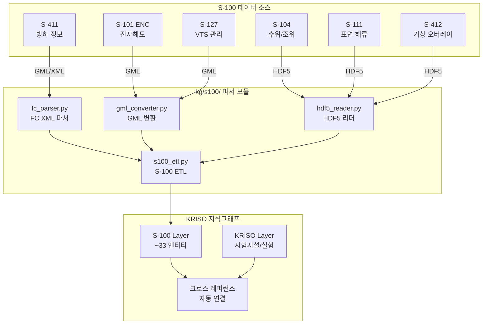

# RFP 보강 전략서 -- K8S 인프라 및 S-100 온톨로지 통합

| 항목 | 내용 |
|------|------|
| **과업명** | KRISO 대화형 해사서비스 플랫폼 KG 모델 설계 연구 |
| **문서 ID** | RFP-보강 |
| **문서 버전** | v1.1 |
| **작성일** | 2026-02-20 |
| **문서 유형** | RFP 보강 전략서 (제안서 차별화 항목) |
| **대상 과업** | 대화형 해사서비스 플랫폼 2차년도 본 시스템 구축 |
| **관련 문서** | PRD v1.0, REQ-004, DES-004, RPT-001 |

---

## 목차

1. [문서 개요](#1-문서-개요)
2. [전략 1: IHO S-100 기반 확장형 온톨로지](#2-전략-1-iho-s-100-기반-확장형-온톨로지)
3. [전략 2: Kubernetes 기반 클라우드 네이티브 인프라](#3-전략-2-kubernetes-기반-클라우드-네이티브-인프라)
4. [1차년도 PoC 성과와 2차년도 연계](#4-1차년도-poc-성과와-2차년도-연계)
5. [경쟁 차별화 요약](#5-경쟁-차별화-요약)

---

## 1. 문서 개요

### 1.1 목적

본 문서는 KRISO 대화형 해사서비스 플랫폼 제안서(RFP)에 추가하여 기술적 차별화를 강화하기 위한 전략서이다. 경쟁 제안서 대비 다음 두 가지 핵심 영역에서의 구체적인 실행 전략을 제시한다:

1. **IHO S-100 국제 표준 기반 온톨로지 확장 전략** -- 해사 데이터의 국제 호환성 확보
2. **Kubernetes 기반 클라우드 네이티브 인프라 전략** -- KRISO 기존 환경과의 연동 및 확장성 보장

두 전략은 1차년도 PoC에서 이미 검증된 기술 자산(127 엔티티 온톨로지, 5종 GraphRAG Retriever, 5단계 RBAC 보안 모델 등) 위에 구축되며, 2차년도 본 시스템 구축의 핵심 차별화 요소로 기능한다.

### 1.2 배경

KRISO 과업지시서(V. 기타 상세 특수조건)에는 **K8S(Kubernetes) 기반 디지털서비스 플랫폼과의 연동**이 명시되어 있다. 이는 KRISO가 이미 Kubernetes 클러스터 환경을 운영 중이거나 2차년도 내 구축할 계획임을 의미하며, 본 과업의 결과물이 해당 인프라 위에서 원활하게 배포/운영되어야 함을 요구한다.

동시에, 해사 분야 국제 표준인 **IHO S-100**은 2026년 S-101 ENC 허용(Permitted) 시점과 맞물려 전략적 중요성이 극대화되고 있다. IMO Maritime Safety Committee(MSC)의 2025년 ECDIS 성능 표준 채택에 이어, 2026년부터 S-101 전자해도가 S-57과 병행 사용 가능해지며, 2029년에는 모든 ECDIS에서 S-101이 의무화된다. 이러한 국제 전환 시점에 S-100 기반 온톨로지 통합 전략을 수립하는 것은 시의적절하다.

1차년도 PoC에서 이미 REQ-004 문서(1,157줄)를 통해 S-100 프레임워크를 상세 분석하고, 6개 Product Specification에 대한 온톨로지 매핑 테이블을 완성한 바 있다. 2차년도에는 이 분석 결과를 실제 파서 모듈과 ETL 파이프라인으로 구현하여 KRISO 지식그래프에 S-100 데이터를 통합한다.

### 1.3 1차년도 PoC 달성 현황

| 영역 | 달성 내역 | 주요 지표 |
|------|-----------|-----------|
| **온톨로지** | 해사 도메인 온톨로지 설계 및 구현 완료 | 127 엔티티, 83 관계, 29 속성 정의 |
| **GraphRAG** | 5종 Retriever 구현 완료 | Vector, VectorCypher, Text2Cypher, Hybrid, ToolsRetriever |
| **RBAC** | 5역할 + 5등급 접근제어 체계 구축 | Admin, InternalResearcher, ExternalResearcher, Developer, Public |
| **ETL** | ETL 파이프라인 프레임워크 완성 | FULL/INCREMENTAL 모드, Dead Letter Queue |
| **품질** | 다단계 품질 보증 체계 구현 | 환각 감지기, Cypher 검증기/교정기, 품질 게이트(8종 자동 검증) |
| **테스트** | 포괄적 테스트 스위트 완성 | 1,095 단위 테스트 / 1,140 전체 테스트 |
| **S-100** | IHO S-100 표준 분석 보고서 완료 | REQ-004 (1,157줄), 6개 PS 매핑 테이블 |
| **n10s OWL 통합** | OWL 온톨로지 생성 + n10s 임포트 파이프라인 구현 완료 | OWL 2 Turtle (1,433 트리플), 8 네임스페이스, 35 테스트 |
| **NLP** | 한국어 해사 NLP 사전 구축 | 105 동의어, 22 관계 키워드, NL Parser |
| **인프라** | Docker Compose 기반 PoC 환경 운영 | Neo4j 5.26 + Activepieces 0.78 + PostgreSQL 14.4 + Redis 7.0 |
| **리니지** | W3C PROV-O 기반 데이터 리니지 추적 | 리니지 레코더, RBAC 연동 기록 정책 |
| **Entity Resolution** | 3단계 엔티티 해석기 구현 | 퍼지 매칭 + 규칙 기반 해석 |
| **평가** | 평가 프레임워크 구축 | 30개 해사 평가 질문, CypherAccuracy/QueryRelevancy 메트릭 |

---

## 2. 전략 1: IHO S-100 기반 확장형 온톨로지

### 2.1 S-100 표준의 전략적 중요성

IHO S-100은 기존 S-57 전자해도 표준을 대체하는 차세대 범용 해양 데이터 모델 프레임워크이다. 본 프로젝트에서 S-100을 온톨로지 확장의 기반으로 채택하는 전략적 근거는 다음과 같다.

**첫째, 프로젝트 일정과 S-100 이행 일정의 정합성이다.** 2026년 S-101 ENC 허용 시점은 본 프로젝트 2차년도와 정확히 일치한다. 2025년 IMO MSC에서 ECDIS S-100 성능 표준이 채택되었고, 2026년부터 S-101 전자해도가 공식 허용된다. 2029년 S-101 의무화까지의 전환기에 KRISO 플랫폼이 S-100 데이터를 수용할 수 있는 체계를 갖추는 것은 선도적 위치를 확보하는 핵심 전략이다.

| 시점 | S-100 이벤트 | KRISO 프로젝트 연계 |
|------|-------------|-------------------|
| 2025 | ECDIS S-100 성능 표준 채택 (IMO MSC) | 1차년도: S-100 분석 완료 (REQ-004) |
| **2026** | **S-101 ENC 허용 (Permitted)** | **2차년도: S-100 파서 개발 + 온톨로지 확장** |
| 2028 | S-57 단계적 폐지 시작 | 3차년도: S-100 데이터 본격 활용 |
| **2029** | **S-101 ENC 의무화 (Mandatory)** | 4차년도: 전면 S-100 기반 운영 |

**둘째, S-100 Feature Catalogue가 본질적으로 온톨로지 구조이다.** S-100의 Feature Catalogue(FC)는 Feature Type(엔티티), Attribute(속성), Feature Association(관계)을 체계적으로 정의하며, 이는 지식그래프의 온톨로지 개념(Class, Property, Relationship)과 직접 대응된다. FC를 온톨로지 기초로 활용하면 별도의 매핑 계층 없이 S-100 데이터를 KG에 자연스럽게 통합할 수 있다.

**셋째, 국제 데이터 호환성 확보이다.** S-100 기반 온톨로지를 채택하면 IHO 회원국(94개국)의 수로 데이터와 표준적 방식으로 데이터를 교환할 수 있다. 특히 KHOA(국립해양조사원)가 생산 중인 차세대 S-101 전자해도 데이터와 즉시 연동이 가능해진다.

### 2.2 1차년도 수행 내역: S-100 분석 및 매핑 전략

1차년도에 작성된 REQ-004 문서(1,157줄)에서 달성한 S-100 분석 내역은 다음과 같다.

#### 2.2.1 S-100 프레임워크 분석 완료

- **Feature Catalogue 구조 분석**: Feature Type, Information Type, Simple/Complex Attribute, Feature Association, Role, Enumeration의 7대 구성요소 상세 분석
- **General Feature Model(GFM) 분석**: ISO 19109 기반 GFM 클래스 다이어그램 매핑 및 Property Graph 대응 체계 확립
- **S-100 아키텍처 계층 분석**: 응용 계층(Product Specifications) -- 프레임워크 계층(FC, PC, Metadata, Exchange) -- 기반 계층(GFM, Spatial/Temporal Schema) -- ISO 표준 계층의 4계층 분석

#### 2.2.2 6개 Product Specification 상세 분석

| Product Specification | 분석 범위 | KRISO 연계 시설 |
|----------------------|-----------|----------------|
| **S-101** Electronic Navigational Chart | 9개 Feature Type 매핑 | 선박운항시뮬레이터 (ENC 베이스맵) |
| **S-104** Water Level Information | 4개 데이터 요소 매핑 | 해양공학수조, 심해공학수조 |
| **S-111** Surface Currents | 3개 데이터 요소 매핑 | 해양공학수조, 캐비테이션터널 |
| **S-127** Marine Traffic Management | 5개 Feature Type 매핑 | 선박운항시뮬레이터 (VTS 연동) |
| **S-411** Sea Ice Information | 5개 Feature Type 매핑 | 빙해수조 |
| **S-412** Weather Overlay | 초안 분석 (개발 중) | 전 시설 (기상 조건 연동) |

#### 2.2.3 완성된 매핑 테이블

- **Feature Type -> Neo4j Node Label**: 11개 Feature Type에 대한 직접 매핑 테이블
- **Attribute -> Node Property**: 8개 주요 속성에 대한 타입별 매핑 테이블
- **Association -> Relationship Type**: 5개 관계 유형에 대한 방향성 포함 매핑 테이블
- **Spatial Data -> point()/WKT**: 4개 공간 유형(Point, Curve, Surface, Composite)에 대한 Neo4j 표현 체계
- **GFM -> Property Graph**: 8개 GFM 개념에 대한 Property Graph 대응표
- **RDF/OWL 매핑**: Feature Type -> `owl:Class`, Attribute -> `owl:DatatypeProperty`, Association -> `owl:ObjectProperty` 등 7개 요소 매핑
- **OWL/Turtle 온톨로지 구현 완료**: 1차년도에 `kg/n10s/owl_exporter.py`를 구현하여 127개 엔티티, 83개 관계, 255개 속성을 OWL 2 Turtle 형식(`kg/ontology/maritime.ttl`, 1,845줄, 1,433 트리플)으로 변환 완료. Neosemantics (n10s) 플러그인을 통한 Neo4j 임포트 파이프라인(`kg/n10s/importer.py`)도 구축하여 **"분석 → 매핑 → 구현"의 전 과정을 1차년도에 완료**하였다.

### 2.3 2차년도 구현 전략: S-100 Feature Catalogue 파서

> **[1차년도 선행 구현 완료]** n10s (Neosemantics) 기반 OWL 온톨로지 통합이 1차년도에 이미 구현되었다. `kg/n10s/` 모듈(owl_exporter.py, config.py, importer.py)과 `kg/ontology/maritime.ttl` OWL 파일이 완성되어, 2차년도 S-100 Feature Catalogue 파서가 생성하는 온톨로지 확장분을 즉시 OWL로 변환하고 Neo4j에 임포트할 수 있는 인프라가 갖춰져 있다. 이는 2차년도 Q1 일정을 최소 1개월 단축시키는 효과가 있다.

#### 2.3.1 Feature Catalogue XML 파서 모듈

2차년도에 신규 개발할 S-100 전용 모듈의 디렉토리 구조는 다음과 같다.

```
kg/s100/
├── __init__.py               # S-100 모듈 공개 API
├── fc_parser.py              # Feature Catalogue XML 파서
├── gml_converter.py          # GML → Neo4j 공간 데이터 변환
├── hdf5_reader.py            # HDF5 격자 데이터 → KG 적재
├── s100_etl.py               # S-100 전용 ETL 파이프라인
├── mapping_registry.py       # S-100 ↔ KG 매핑 레지스트리
└── tests/
    ├── test_fc_parser.py     # FC 파서 단위 테스트
    ├── test_gml_converter.py # GML 변환 테스트
    └── test_hdf5_reader.py   # HDF5 리더 테스트
```

**이미 구현된 n10s 통합 모듈 (1차년도 완료):**

```
kg/n10s/                         # Neosemantics (n10s) OWL 통합 [구현 완료]
├── __init__.py                  # 공개 API (N10sConfig, N10sImporter, OWLExporter)
├── config.py                    # n10s 그래프 설정 + 8개 네임스페이스 (248줄)
├── importer.py                  # OWL → Neo4j 임포트 파이프라인 (373줄)
└── owl_exporter.py              # Python 온톨로지 → OWL/Turtle 변환기 (564줄)

kg/ontology/
└── maritime.ttl                 # OWL 2 Turtle 온톨로지 (1,845줄, 1,433 트리플)
```

**`fc_parser.py` 핵심 구현 설계:**

```python
"""S-100 Feature Catalogue XML 파서.

IHO S-100 Feature Catalogue(FC) XML 파일을 파싱하여
KRISO 온톨로지 확장에 필요한 엔티티/속성/관계 정의를 추출한다.
"""

from __future__ import annotations

import xml.etree.ElementTree as ET
from dataclasses import dataclass, field
from pathlib import Path
from typing import Optional

from kg.ontology.core import ObjectTypeDefinition, PropertyDefinition, LinkTypeDefinition


@dataclass
class S100FeatureType:
    """S-100 Feature Type 정의."""
    code: str
    name: str
    definition: str
    is_abstract: bool = False
    super_type: Optional[str] = None
    attributes: list[S100Attribute] = field(default_factory=list)
    associations: list[S100Association] = field(default_factory=list)


@dataclass
class S100Attribute:
    """S-100 Attribute 정의."""
    code: str
    name: str
    value_type: str  # STRING, INTEGER, REAL, BOOLEAN, DATE, ENUMERATION
    cardinality: str = "1..1"
    enumeration_values: list[str] = field(default_factory=list)


@dataclass
class S100Association:
    """S-100 Feature Association 정의."""
    code: str
    name: str
    role_source: str
    role_target: str
    cardinality: str = "0..*"


class FeatureCatalogueParser:
    """S-100 Feature Catalogue XML 파서.

    IHO S-100 Edition 5.0 기준 FC XML 스키마를 파싱한다.
    파싱 결과는 KRISO 온톨로지 확장에 직접 활용 가능한
    ObjectTypeDefinition, PropertyDefinition, LinkTypeDefinition으로 변환된다.

    사용 예시:
        parser = FeatureCatalogueParser()
        catalogue = parser.parse("S-101_FC_1.2.0.xml")
        ontology_extensions = parser.to_ontology_definitions(
            catalogue, prefix="s101"
        )
    """

    S100FC_NS = "http://www.iho.int/S100FC/5.0"

    def parse(self, fc_path: str | Path) -> list[S100FeatureType]:
        """FC XML 파일을 파싱하여 Feature Type 목록을 반환한다."""
        tree = ET.parse(fc_path)
        root = tree.getroot()
        ns = {"fc": self.S100FC_NS}

        features: list[S100FeatureType] = []
        for ft_elem in root.findall(".//fc:S100_FC_FeatureType", ns):
            feature = self._parse_feature_type(ft_elem, ns)
            features.append(feature)
        return features

    def to_ontology_definitions(
        self,
        features: list[S100FeatureType],
        prefix: str = "s100",
    ) -> list[ObjectTypeDefinition]:
        """S-100 Feature Type을 KRISO 온톨로지 정의로 변환한다.

        Args:
            features: 파싱된 Feature Type 목록
            prefix: 온톨로지 네임스페이스 접두어 (예: "s101", "s104")

        Returns:
            KRISO 온톨로지에 등록 가능한 ObjectTypeDefinition 목록
        """
        definitions: list[ObjectTypeDefinition] = []
        for ft in features:
            label = f"{prefix}_{ft.code}"  # 예: s101_Light, s104_WaterLevel
            properties = [
                PropertyDefinition(
                    name=attr.code,
                    data_type=self._map_value_type(attr.value_type),
                    description=attr.name,
                )
                for attr in ft.attributes
            ]
            definitions.append(ObjectTypeDefinition(
                label=label,
                description=f"[S-100/{prefix.upper()}] {ft.definition}",
                properties=properties,
            ))
        return definitions
```

**`mapping_registry.py` 매핑 레지스트리 설계:**

```python
"""S-100 ↔ KRISO KG 매핑 레지스트리.

S-100 Feature Type과 KRISO 기존 온톨로지 엔티티 간의
매핑 규칙을 관리한다. REQ-004에서 정의한 매핑 테이블을 코드로 구현한다.
"""

from __future__ import annotations

from dataclasses import dataclass
from enum import Enum
from typing import Optional


class MappingStrategy(Enum):
    """매핑 전략 유형."""
    DIRECT = "direct"           # S-100 Feature → 기존 엔티티 직접 매핑
    PROPERTY = "property"       # S-100 Feature → 기존 엔티티의 속성으로 매핑
    NEW_LABEL = "new_label"     # 새로운 Neo4j 라벨 생성
    EXTENSION = "extension"     # 기존 엔티티 확장 (속성 추가)


@dataclass
class S100Mapping:
    """S-100 ↔ KG 매핑 규칙."""
    s100_feature: str           # S-100 Feature Type 코드
    s100_product: str           # Product Specification (예: "S-101")
    kg_label: str               # Neo4j Node Label
    strategy: MappingStrategy   # 매핑 전략
    property_filter: Optional[dict] = None  # PROPERTY 전략 시 필터 조건


# REQ-004에서 정의한 매핑 테이블 구현
S100_MAPPING_REGISTRY: list[S100Mapping] = [
    # S-101 ENC
    S100Mapping("DepthArea", "S-101", "SeaArea",
                MappingStrategy.PROPERTY, {"depthRange": True}),
    S100Mapping("AnchorageArea", "S-101", "Anchorage",
                MappingStrategy.DIRECT),
    S100Mapping("BerthingArea", "S-101", "Berth",
                MappingStrategy.DIRECT),
    S100Mapping("Fairway", "S-101", "Waterway",
                MappingStrategy.PROPERTY, {"waterwayType": "fairway"}),
    S100Mapping("TrafficSeparationScheme", "S-101", "TSS",
                MappingStrategy.DIRECT),
    S100Mapping("Light", "S-101", "s101_Light",
                MappingStrategy.NEW_LABEL),
    S100Mapping("Buoy", "S-101", "s101_Buoy",
                MappingStrategy.NEW_LABEL),

    # S-104 Water Level
    S100Mapping("WaterLevel", "S-104", "SensorReading",
                MappingStrategy.PROPERTY, {"metric": "waterLevel"}),
    S100Mapping("TidalStation", "S-104", "Sensor",
                MappingStrategy.PROPERTY, {"sensorType": "tidalStation"}),

    # S-111 Surface Currents
    S100Mapping("SurfaceCurrent", "S-111", "SensorReading",
                MappingStrategy.PROPERTY, {"metric": "surfaceCurrent"}),

    # S-127 Marine Traffic Management
    S100Mapping("VTSArea", "S-127", "SeaArea",
                MappingStrategy.PROPERTY, {"areaType": "VTS"}),

    # S-411 Sea Ice
    S100Mapping("IceConcentration", "S-411", "TestCondition",
                MappingStrategy.EXTENSION),
]
```

#### 2.3.2 S-100 -- KRISO 온톨로지 통합 아키텍처

```
┌─────────────────────────────────────────────────────────────────┐
│                      KRISO KG 온톨로지                           │
│                                                                  │
│  ┌──────────────────┐  ┌──────────────────┐  ┌───────────────┐  │
│  │    S-100 Layer   │  │   KRISO Layer    │  │ Platform Layer│  │
│  │                  │  │                  │  │               │  │
│  │ - S-101 ENC     │  │ - Experiment     │  │ - User        │  │
│  │ - S-104 수위     │  │ - TestFacility   │  │ - Role        │  │
│  │ - S-111 해류     │  │ - ModelShip      │  │ - Workflow    │  │
│  │ - S-127 VTS     │  │ - Measurement    │  │ - DataClass   │  │
│  │ - S-411 빙하     │  │ - ExperimentalDS │  │ - Lineage     │  │
│  │ - S-412 기상     │  │ - TestCondition  │  │ - ETLRun      │  │
│  │                  │  │                  │  │               │  │
│  │ ~33 엔티티 확장   │  │ 70+ 엔티티       │  │ 24+ 엔티티    │  │
│  └────────┬─────────┘  └────────┬─────────┘  └───────┬───────┘  │
│           │                     │                     │          │
│           └─────────────┬───────┘─────────────────────┘          │
│                         │                                        │
│                 Neo4j Property Graph                              │
│           (127 기존 엔티티 + S-100 확장 → ~160 엔티티)             │
│                                                                  │
│  ┌─── 크로스 레퍼런스 관계 ───────────────────────────────────┐   │
│  │ S-104 수위 ←─ CONDITION_REFERENCE ─→ TestCondition        │   │
│  │ S-111 해류 ←─ ENVIRONMENTAL_CONTEXT ─→ Experiment         │   │
│  │ S-101 해도 ←─ SIMULATION_BASEMAP ─→ SimulationScenario   │   │
│  │ S-411 빙하 ←─ ICE_CONDITION_REF ─→ IcePerformanceTest    │   │
│  └────────────────────────────────────────────────────────────┘   │
└──────────────────────────────────────────────────────────────────┘
```

#### 2.3.3 KRISO 8대 시험시설 x S-100 연결 매핑

KRISO의 8대 시험시설 각각에 대해 관련 S-100 Product Specification과의 데이터 연결 전략을 정의한다. 이 매핑은 실험 데이터에 국제 표준 기반 환경 컨텍스트를 자동으로 부여하는 핵심 기능이다.

| KRISO 시험시설 | S-100 연관 표준 | 연결 데이터 | KG 통합 시나리오 |
|---|---|---|---|
| **해양공학수조** (Ocean Engineering Basin) | S-104 (수위), S-111 (해류), S-412 (기상) | 수위 제어, 파랑 조건, 해류 벡터 | 실측 해양 환경 데이터와 수조 시험 조건 자동 비교. S-104 실시간 조위 데이터를 시험 조건 기준면으로 참조 |
| **선형시험수조** (Towing Tank) | S-101 (항로 수심), S-111 (해류) | 선형 저항, 수심 영향, 해류 보정 | 항로별 수심 조건(S-101)을 시험 수심 설정에 반영. 해류(S-111)를 저항 보정 파라미터로 활용 |
| **빙해수조** (Ice Tank) | S-411 (빙하), S-412 (기상) | 빙 두께, 빙 농도, 빙 유형 | 실해역 빙 조건(S-411 Ice Chart)과 빙해수조 모형 빙 조건을 자동 대조. 빙중 성능 시험 결과의 실해역 대응성 평가 |
| **심해공학수조** (Deep Ocean Engineering Basin) | S-104 (수위/압력), S-101 (수심) | 심해 압력, 수심 프로파일 | S-101 정밀 수심 데이터를 심해 환경 재현 파라미터로 활용. 심해 구조물 거동 시험에 실제 해저 지형 데이터 반영 |
| **파력발전 시험장** (Wave Energy Test Site) | S-111 (해류), S-104 (수위), S-412 (기상) | 파고, 해류 속도/방향, 조위 | 실해역 파랑/해류 관측 데이터(S-111)와 파력발전 효율 시험 결과를 연계. 시험 결과의 실해역 적용성 자동 산정 |
| **고압챔버** (Hyperbaric Chamber) | S-104 (수위/압력) | 심해 압력 조건 | S-104 수위 데이터에서 역산한 수압 프로파일을 고압챔버 시험 조건과 매핑. 깊이별 압력 환경 자동 설정 |
| **캐비테이션터널** (Cavitation Tunnel) | S-111 (해류), S-101 (수심) | 유속, 압력 분포 | 실해역 해류 속도(S-111)를 캐비테이션 시험 유속 조건으로 참조. 프로펠러 성능 평가에 실해역 운항 조건 자동 반영 |
| **선박운항시뮬레이터** (Full Mission Bridge Simulator) | S-101 (ENC), S-127 (VTS), S-104 (수위), S-111 (해류) | 전자해도, VTS 구역, 조위, 해류 | S-101 ENC 데이터를 시뮬레이션 베이스맵으로 직접 로딩. S-127 VTS 구역/보고 지점을 시나리오에 반영. 실시간 조위(S-104)와 해류(S-111) 오버레이 |

**통합 데이터 흐름:**



#### 2.3.4 S-100 전용 ETL 파이프라인

기존 `kg/etl/pipeline.py`의 ETLPipeline 프레임워크를 확장하여 S-100 데이터 소스를 지원한다.

```python
"""S-100 전용 ETL 파이프라인.

기존 kg.etl.pipeline.ETLPipeline을 확장하여
S-100 Product Specification별 데이터 수집/변환/적재를 수행한다.
"""

from __future__ import annotations

from pathlib import Path
from typing import Any

from kg.etl.pipeline import ETLPipeline
from kg.etl.models import ETLMode, IncrementalConfig
from kg.s100.fc_parser import FeatureCatalogueParser
from kg.s100.gml_converter import GMLToNeo4jConverter
from kg.s100.hdf5_reader import HDF5GridReader
from kg.s100.mapping_registry import S100_MAPPING_REGISTRY, MappingStrategy


class S100ETLPipeline(ETLPipeline):
    """S-100 데이터 전용 ETL 파이프라인.

    지원 데이터 포맷:
    - Feature Catalogue XML (온톨로지 정의)
    - GML (공간 데이터: S-101, S-127)
    - HDF5 (격자 데이터: S-104, S-111, S-412)

    사용 예시:
        pipeline = S100ETLPipeline(
            product_spec="S-101",
            mode=ETLMode.INCREMENTAL,
        )
        result = pipeline.run(source_path="/data/s101/KR_ENC_2026Q1.gml")
    """

    def __init__(
        self,
        product_spec: str,
        mode: ETLMode = ETLMode.FULL,
        incremental_config: IncrementalConfig | None = None,
    ):
        super().__init__(mode=mode, incremental_config=incremental_config)
        self.product_spec = product_spec
        self.fc_parser = FeatureCatalogueParser()
        self.gml_converter = GMLToNeo4jConverter()
        self.hdf5_reader = HDF5GridReader()
        self.mappings = [
            m for m in S100_MAPPING_REGISTRY
            if m.s100_product == product_spec
        ]

    def extract(self, source_path: str | Path) -> list[dict[str, Any]]:
        """S-100 데이터 소스에서 Feature를 추출한다."""
        path = Path(source_path)
        if path.suffix == ".xml":
            return self._extract_from_xml(path)
        elif path.suffix in (".gml", ".gml.gz"):
            return self._extract_from_gml(path)
        elif path.suffix in (".h5", ".hdf5"):
            return self._extract_from_hdf5(path)
        else:
            raise ValueError(f"지원하지 않는 S-100 파일 형식: {path.suffix}")

    def transform(self, records: list[dict]) -> list[dict]:
        """S-100 Feature를 KRISO KG 노드/관계로 변환한다."""
        transformed = []
        for record in records:
            mapping = self._find_mapping(record.get("feature_type", ""))
            if mapping is None:
                self.dlq.enqueue(record, reason="매핑 규칙 없음")
                continue
            transformed.append(self._apply_mapping(record, mapping))
        return transformed
```

#### 2.3.5 구현 마일스톤

| 시기 | 마일스톤 | 산출물 | 테스트 목표 |
|------|---------|--------|------------|
| 2차년도 Q1 (1~2개월) | Feature Catalogue XML 파서 개발 | `kg/s100/fc_parser.py` | FC 파서 단위 테스트 30개+ |
| 2차년도 Q1 (2~3개월) | S-100 속성 접두어 온톨로지 확장 | `kg/ontology/maritime_ontology.py` 업데이트 | 온톨로지 검증 테스트 20개+ |
| 2차년도 Q2 (3~4개월) | GML/HDF5 데이터 변환 ETL 개발 | `kg/s100/gml_converter.py`, `hdf5_reader.py` | 변환 정합성 테스트 40개+ |
| 2차년도 Q2 (4~5개월) | S-101 ENC 베이스맵 적재 | Neo4j 공간 레이어 + 공간 인덱스 | KHOA S-101 샘플 데이터 적재 검증 |
| 2차년도 Q3 (5~7개월) | S-104/S-111 실시간 수위/해류 연동 | 스트리밍 파이프라인 (Kafka Consumer) | 실시간 데이터 지연 5초 이내 |
| 2차년도 Q3 (7~8개월) | S-127 VTS 데이터 통합 | VTS 구역/보고지점 KG 적재 | 시뮬레이터 연동 검증 |
| 2차년도 Q4 (9~10개월) | S-411 빙하 데이터 -- 빙해수조 통합 | 크로스 레퍼런스 자동 생성 기능 | 빙 조건 매핑 정확도 95%+ |
| 2차년도 Q4 (11~12개월) | 전체 S-100 통합 검증 및 문서화 | S-100 통합 보고서 | 통합 테스트 100개+ |

### 2.4 기대 효과

- **n10s 기반 OWL 통합 인프라 선행 구축**: 1차년도에 이미 Neosemantics (n10s) 플러그인 기반의 OWL 온톨로지 생성/임포트 파이프라인을 구현 완료하였다. 127개 엔티티를 포함한 maritime.ttl(1,433 트리플)이 검증 완료되어, 2차년도 S-100 Feature Catalogue 파서 출력물을 즉시 OWL로 변환하고 Neo4j에 반영할 수 있다. 이는 경쟁사가 "2차년도에 OWL 통합을 구현하겠다"고 제안하는 것에 비해 **이미 동작하는 코드**를 보유한 결정적 우위이다.
- **국제 표준 기반 데이터 호환성**: IHO S-100 프레임워크를 온톨로지 기반으로 채택함으로써, 94개 IHO 회원국과 표준적 방식으로 해양 데이터를 교환할 수 있는 체계를 확보한다. 이는 KRISO의 국제 공동 연구 역량을 강화하는 핵심 인프라가 된다.
- **KHOA 차세대 전자해도 즉시 연동**: 국립해양조사원(KHOA)이 생산 중인 S-101 전자해도 데이터를 별도 변환 작업 없이 KRISO 지식그래프에 직접 적재할 수 있다. 한국 연안 정밀 수심/항로/항만 정보가 실험 데이터의 공간 컨텍스트로 활용된다.
- **S-100 기반 멀티소스 데이터 통합**: S-104(수위), S-111(해류), S-411(빙하), S-412(기상) 등 다양한 해양 환경 데이터를 단일 지식그래프에서 통합 질의할 수 있다. "빙해수조 시험 당시 북극해 빙 농도는 얼마였는가?" 같은 크로스 레퍼런스 질의가 가능해진다.
- **KRISO 시험 데이터의 국제 컨텍스트 확보**: 8대 시험시설의 실험 결과에 S-100 기반 실해역 환경 데이터가 자동으로 연결됨으로써, 실험 조건과 실해역 조건의 대응성을 정량적으로 평가할 수 있다. 이는 시험 결과의 신뢰성과 활용도를 크게 향상시킨다.

---

## 3. 전략 2: Kubernetes 기반 클라우드 네이티브 인프라

### 3.1 KRISO K8S 환경 연동의 중요성

과업지시서(V. 기타 상세 특수조건)에는 "K8S 기반 디지털서비스 플랫폼"과의 연동이 명시되어 있다. 이는 KRISO가 조직 수준에서 Kubernetes를 표준 인프라로 채택하였으며, 본 과업의 결과물 역시 K8S 클러스터 위에서 운영되어야 함을 의미한다.

1차년도 PoC에서는 **Docker Compose** 기반으로 빠른 기술 검증에 집중하였다. Neo4j 5.26, Activepieces 0.78, PostgreSQL 14.4, Redis 7.0의 4개 서비스를 단일 호스트에서 구동하는 구성은 PoC 목적에 적합하였으나, 운영 환경의 요구사항(고가용성, 수평 확장, GPU 관리, 보안)을 충족하지 못한다.

중요한 것은, 1차년도 PoC 결과물이 이미 K8S 전환을 고려하여 설계되었다는 점이다:

- **컨테이너화**: 모든 서비스가 Docker 이미지 기반으로 동작
- **환경변수 분리**: `.env` 파일을 통한 설정 외부화 (12-Factor App 원칙 준수)
- **상태 비보존 API**: FastAPI 서버가 Stateless로 설계되어 수평 확장 가능
- **볼륨 분리**: Neo4j 데이터, 로그, 플러그인이 Named Volume으로 분리

이러한 설계 덕분에 2차년도 K8S 전환은 아키텍처 재설계가 아닌 **배포 환경 마이그레이션**으로 수행 가능하다.

### 3.2 1차년도 PoC -> 2차년도 K8S 전환 전략

#### 3.2.1 현재 Docker Compose 아키텍처

```yaml
# 현재 docker-compose.yml 구성 (4개 서비스)
# 파일 위치: /docker-compose.yml
services:
  neo4j:        # Neo4j 5.26 Community (그래프DB + APOC + n10s 플러그인)
                # Ports: 7474 (Browser), 7687 (Bolt)
                # Memory: heap 1G, pagecache 1G
  activepieces: # Activepieces 0.78 (워크플로우 자동화 엔진)
                # Port: 8080
                # Dependencies: postgres, redis
  postgres:     # PostgreSQL 14.4 (Activepieces 메타데이터)
                # Healthcheck: pg_isready
  redis:        # Redis 7.0 (BullMQ 작업 큐)
                # Healthcheck: redis-cli ping
```

#### 3.2.2 목표 Kubernetes 아키텍처

```
┌─────────────────────── KRISO K8S Cluster ─────────────────────────┐
│                                                                    │
│  ┌── Ingress Controller (Kong / Nginx) ──────────────────────┐    │
│  │  /api/*     → maritime-api (FastAPI)                       │    │
│  │  /app/*     → maritime-frontend (Next.js)                  │    │
│  │  /neo4j/*   → neo4j-browser (HTTP 7474)                   │    │
│  │  /workflow/* → activepieces (HTTP 80)                      │    │
│  │  TLS Termination: cert-manager (Let's Encrypt)            │    │
│  └────────────────────────────────────────────────────────────┘    │
│                                                                    │
│  ┌── Namespace: maritime-platform ────────────────────────────┐   │
│  │                                                             │   │
│  │  ┌─ Deployment ──────┐  ┌─ Deployment ──────┐             │   │
│  │  │ maritime-api      │  │ maritime-frontend  │             │   │
│  │  │ (FastAPI)         │  │ (Next.js SSR)      │             │   │
│  │  │ replicas: 2~5     │  │ replicas: 2~3      │             │   │
│  │  │ HPA: CPU 70%      │  │ HPA: CPU 70%       │             │   │
│  │  │ resources:         │  │ resources:          │             │   │
│  │  │   cpu: 500m~2     │  │   cpu: 250m~1       │             │   │
│  │  │   mem: 512Mi~2Gi  │  │   mem: 256Mi~1Gi    │             │   │
│  │  └───────────────────┘  └────────────────────┘             │   │
│  │                                                             │   │
│  │  ┌─ StatefulSet ─────┐  ┌─ Deployment ──────────────────┐ │   │
│  │  │ neo4j             │  │ activepieces                   │ │   │
│  │  │ Neo4j 5.26 CE     │  │ + postgres (sidecar/별도 SS)   │ │   │
│  │  │ PVC: 500Gi SSD    │  │ + redis (sidecar/별도 Deploy)  │ │   │
│  │  │ resources:         │  │ replicas: 1                    │ │   │
│  │  │   cpu: 2~4        │  │ PVC: 50Gi (postgres)           │ │   │
│  │  │   mem: 4Gi~8Gi    │  └────────────────────────────────┘ │   │
│  │  └───────────────────┘                                      │   │
│  │                                                             │   │
│  │  ┌─ Deployment ──────┐  ┌─ CronJob ──────────────────┐   │   │
│  │  │ ollama-server     │  │ etl-pipelines              │   │   │
│  │  │ GPU: 1x A100/H100│  │ ┌ papers     (토 02:00)     │   │   │
│  │  │ Models:            │  │ ├ weather    (매 3시간)     │   │   │
│  │  │  - qwen2.5:7b     │  │ ├ accidents  (매일 04:00)   │   │   │
│  │  │  - nomic-embed    │  │ ├ facilities (매월 1일)     │   │   │
│  │  │ resources:         │  │ ├ relations  (월 05:00)     │   │   │
│  │  │   gpu: 1           │  │ └ s100-sync  (매주 수)      │   │   │
│  │  │   mem: 16Gi        │  └────────────────────────────┘   │   │
│  │  └───────────────────┘                                      │   │
│  └─────────────────────────────────────────────────────────────┘   │
│                                                                    │
│  ┌── Namespace: monitoring ───────────────────────────────────┐   │
│  │  Prometheus │ Grafana │ AlertManager │ Loki (로그)          │   │
│  │  Neo4j Exporter │ Node Exporter │ kube-state-metrics       │   │
│  └────────────────────────────────────────────────────────────┘   │
│                                                                    │
│  ┌── Namespace: auth ─────────────────────────────────────────┐   │
│  │  Keycloak (SSO) ─── OIDC ─→ maritime-api RBAC 연동         │   │
│  │  5역할 매핑: Admin, InternalResearcher, ExternalResearcher, │   │
│  │              Developer, Public                              │   │
│  └────────────────────────────────────────────────────────────┘   │
│                                                                    │
│  ┌── Storage Classes ─────────────────────────────────────────┐   │
│  │  ssd-fast    │ Neo4j 데이터, 벡터 인덱스 (IOPS 보장)        │   │
│  │  hdd-bulk    │ S-100 원본 데이터, HDF5 파일 (대용량)         │   │
│  │  nfs-shared  │ 모델 파일, 공유 설정 (ReadWriteMany)          │   │
│  └────────────────────────────────────────────────────────────┘   │
└────────────────────────────────────────────────────────────────────┘
```

#### 3.2.3 Helm 차트 구성 계획

Helm 차트를 통해 전체 플랫폼을 단일 패키지로 관리하며, 환경별(dev/staging/prod) 설정을 `values` 파일로 분리한다.

```
helm/maritime-platform/
├── Chart.yaml                    # 차트 메타데이터 (v1.0.0)
├── values.yaml                   # 기본 설정값
├── values-dev.yaml               # 개발 환경 오버라이드
├── values-staging.yaml           # 스테이징 환경 오버라이드
├── values-prod.yaml              # 운영 환경 오버라이드
├── values-kriso.yaml             # KRISO 환경 전용 오버라이드
├── templates/
│   ├── _helpers.tpl              # 공통 템플릿 헬퍼
│   ├── neo4j/
│   │   ├── statefulset.yaml      # Neo4j StatefulSet (PVC 바인딩)
│   │   ├── service.yaml          # Bolt(7687) + HTTP(7474) Service
│   │   ├── configmap.yaml        # neo4j.conf 설정 (heap, pagecache)
│   │   └── pvc.yaml              # PersistentVolumeClaim (SSD)
│   ├── api/
│   │   ├── deployment.yaml       # FastAPI Deployment (HPA 적용)
│   │   ├── service.yaml          # ClusterIP Service
│   │   ├── hpa.yaml              # HorizontalPodAutoscaler
│   │   └── configmap.yaml        # 환경변수 (NEO4J_URI 등)
│   ├── ollama/
│   │   ├── deployment.yaml       # GPU 워크로드 (nodeSelector)
│   │   ├── service.yaml          # Ollama API Service
│   │   └── model-init.yaml       # InitContainer: 모델 다운로드
│   ├── activepieces/
│   │   ├── deployment.yaml       # Activepieces + 의존성
│   │   ├── service.yaml
│   │   └── configmap.yaml        # AP_* 환경변수
│   ├── etl/
│   │   ├── cronjob-papers.yaml   # 매주 토 02:00 (논문 크롤링)
│   │   ├── cronjob-weather.yaml  # 매 3시간 (기상 수집)
│   │   ├── cronjob-accidents.yaml # 매일 04:00 (사고 수집)
│   │   ├── cronjob-facilities.yaml # 매월 1일 03:00 (시설)
│   │   ├── cronjob-relations.yaml # 매주 월 05:00 (관계 추출)
│   │   └── cronjob-s100.yaml     # S-100 데이터 동기화
│   ├── monitoring/
│   │   ├── prometheus.yaml       # Prometheus 설정
│   │   ├── grafana.yaml          # Grafana 대시보드
│   │   └── neo4j-exporter.yaml   # Neo4j 메트릭 수집기
│   ├── ingress.yaml              # Ingress 규칙 (경로 기반 라우팅)
│   ├── networkpolicy.yaml        # Pod 간 통신 정책
│   └── external-secrets.yaml     # External Secrets Operator 참조
```

**`values-kriso.yaml` 주요 설정:**

```yaml
# KRISO 환경 전용 오버라이드
# 사용법: helm install maritime . -f values-kriso.yaml

global:
  environment: "kriso-prod"
  imageRegistry: "harbor.kriso.re.kr"  # KRISO 내부 레지스트리
  storageClass:
    ssd: "kriso-ssd-csi"
    hdd: "kriso-hdd-csi"
    nfs: "kriso-nfs-csi"

neo4j:
  resources:
    requests: { cpu: "2", memory: "4Gi" }
    limits:   { cpu: "4", memory: "8Gi" }
  persistence:
    size: "500Gi"
    storageClass: "kriso-ssd-csi"
  config:
    heapSize: "4G"
    pagecacheSize: "4G"

api:
  replicas: 2
  autoscaling:
    enabled: true
    minReplicas: 2
    maxReplicas: 5
    targetCPU: 70

ollama:
  gpu:
    enabled: true
    count: 1
    type: "nvidia.com/gpu"
  nodeSelector:
    gpu-type: "a100"
  models:
    - "qwen2.5:7b"
    - "nomic-embed-text"

etl:
  s100:
    enabled: true
    schedule: "0 6 * * 3"  # 매주 수요일 06:00
    dataSource: "/mnt/s100-data"  # NFS 마운트

auth:
  keycloak:
    enabled: true
    realm: "maritime"
    roles:
      - "admin"
      - "internal-researcher"
      - "external-researcher"
      - "developer"
      - "public"
```

#### 3.2.4 GPU 워크로드 스케줄링

LLM 추론 워크로드(Ollama, 향후 vLLM)를 K8S 환경에서 효율적으로 관리하기 위한 전략이다.

**NVIDIA GPU Operator 활용:**

```yaml
# ollama deployment (GPU 워크로드)
apiVersion: apps/v1
kind: Deployment
metadata:
  name: ollama-server
  namespace: maritime-platform
spec:
  replicas: 1
  selector:
    matchLabels:
      app: ollama
  template:
    metadata:
      labels:
        app: ollama
    spec:
      nodeSelector:
        gpu-type: "a100"          # GPU 노드 선택
      tolerations:
        - key: "nvidia.com/gpu"
          operator: "Exists"
          effect: "NoSchedule"
      initContainers:
        - name: model-downloader
          image: ollama/ollama:latest
          command: ["sh", "-c"]
          args:
            - |
              ollama serve &
              sleep 5
              ollama pull qwen2.5:7b
              ollama pull nomic-embed-text
          volumeMounts:
            - name: model-storage
              mountPath: /root/.ollama
      containers:
        - name: ollama
          image: ollama/ollama:latest
          ports:
            - containerPort: 11434
          resources:
            limits:
              nvidia.com/gpu: 1       # GPU 1장 할당
              memory: "16Gi"
              cpu: "4"
            requests:
              nvidia.com/gpu: 1
              memory: "12Gi"
              cpu: "2"
          volumeMounts:
            - name: model-storage
              mountPath: /root/.ollama
      volumes:
        - name: model-storage
          persistentVolumeClaim:
            claimName: ollama-models-pvc    # NFS: 모델 파일 공유
```

**2차년도 LLM 서빙 진화 경로:**

| 단계 | 시기 | 서빙 엔진 | GPU | 처리량 |
|------|------|-----------|-----|--------|
| Phase 1 | Q1~Q2 | Ollama | 1x A100 | ~30 req/min |
| Phase 2 | Q3 | vLLM | 1x A100 | ~100 req/min |
| Phase 3 | Q4 | vLLM + 텐서 병렬화 | 2x A100 | ~200 req/min |

Phase 2 전환 시 Ollama Deployment를 vLLM Deployment로 교체하며, GPU 자원 할당은 동일한 K8S 리소스 관리 체계를 활용한다. vLLM은 PagedAttention 기반 배치 추론으로 동일 GPU에서 3~4배 높은 처리량을 달성한다.

#### 3.2.5 CI/CD 파이프라인

```
┌─────────────────────────────────────────────────────────────┐
│                    CI/CD Pipeline                             │
│                                                              │
│  GitHub/GitLab Push                                          │
│       │                                                      │
│       ▼                                                      │
│  ┌─ CI (GitHub Actions / GitLab CI) ─────────────────────┐  │
│  │                                                        │  │
│  │  1. Lint (ruff, mypy)                                 │  │
│  │  2. Unit Tests (pytest: 1,095+ tests)                 │  │
│  │  3. Build Docker Images                               │  │
│  │  4. Helm Chart Lint + Template Validation              │  │
│  │  5. Trivy Image Scan (취약점 검사)                     │  │
│  │  6. Push to Harbor Registry                           │  │
│  │                                                        │  │
│  └────────────────────────┬───────────────────────────────┘  │
│                           │                                   │
│                           ▼                                   │
│  ┌─ CD (ArgoCD / Flux) ──────────────────────────────────┐  │
│  │                                                        │  │
│  │  ┌──────┐    ┌──────────┐    ┌────────┐               │  │
│  │  │ dev  │    │ staging  │    │  prod  │               │  │
│  │  │      │    │          │    │        │               │  │
│  │  │ Auto │───▶│  Manual  │───▶│Approval│               │  │
│  │  │Deploy│    │  Promote │    │ Gate   │               │  │
│  │  └──────┘    └──────────┘    └────────┘               │  │
│  │                                                        │  │
│  └────────────────────────────────────────────────────────┘  │
│                                                              │
│  Rollback: ArgoCD 자동 롤백 (Health Check 실패 시)            │
│  GitOps: Helm values 변경 → Git commit → 자동 동기화          │
│                                                              │
└──────────────────────────────────────────────────────────────┘
```

**CI 파이프라인 주요 단계:**

- **Lint/Type Check**: `ruff` + `mypy`로 코드 품질 자동 검증
- **Unit Tests**: `pytest`로 1,095개 이상 단위 테스트 실행 (Neo4j 불필요)
- **통합 테스트**: K8S 내 임시 Neo4j Pod 생성 후 통합 테스트 (45개) 실행
- **Docker Build**: 멀티스테이지 빌드로 이미지 크기 최소화
- **Helm Lint**: `helm lint` + `helm template` 검증으로 매니페스트 오류 사전 탐지
- **보안 스캔**: Trivy로 Docker 이미지 내 CVE 취약점 검사
- **이미지 푸시**: KRISO Harbor 레지스트리 또는 사설 레지스트리에 태그 푸시

**CD 환경 전략:**

| 환경 | 배포 방식 | 승인 | Neo4j 데이터 | GPU |
|------|-----------|------|-------------|-----|
| dev | 자동 (push to main) | 불필요 | 샘플 데이터 | 미사용 (CPU 모드) |
| staging | 수동 프로모션 | 개발팀 리드 | 운영 복사본 | 1x A100 |
| prod | 승인 게이트 | 프로젝트 매니저 | 운영 데이터 | 1x A100 |

#### 3.2.6 보안 설계

K8S 환경에서의 다층 보안 체계를 설계한다. 특히 기존 5역할(Admin, InternalResearcher, ExternalResearcher, Developer, Public) + 5등급(PUBLIC, INTERNAL, CONFIDENTIAL, RESTRICTED, TOP_SECRET) RBAC 모델을 K8S 수준까지 확장한다.

**네트워크 보안 (NetworkPolicy):**

```yaml
# Pod 간 최소 권한 통신 정책
apiVersion: networking.k8s.io/v1
kind: NetworkPolicy
metadata:
  name: neo4j-access-policy
  namespace: maritime-platform
spec:
  podSelector:
    matchLabels:
      app: neo4j
  policyTypes:
    - Ingress
  ingress:
    # maritime-api만 Neo4j Bolt 접근 허용
    - from:
        - podSelector:
            matchLabels:
              app: maritime-api
      ports:
        - port: 7687
          protocol: TCP
    # ETL CronJob만 Neo4j 접근 허용
    - from:
        - podSelector:
            matchLabels:
              app: etl-pipeline
      ports:
        - port: 7687
          protocol: TCP
    # 그 외 모든 Pod의 Neo4j 접근 차단
```

**이중 RBAC 적용:**

| 계층 | RBAC 체계 | 적용 범위 |
|------|-----------|-----------|
| K8S 수준 | K8S RBAC (ServiceAccount, ClusterRole) | Pod/Service/Secret 접근 제어 |
| 애플리케이션 수준 | KRISO RBAC (5역할 x 5등급) | KG 데이터/쿼리 접근 제어 |
| SSO 연동 | Keycloak OIDC | 통합 인증, 역할 자동 매핑 |

**Secret 관리:**

- External Secrets Operator를 통해 HashiCorp Vault 또는 AWS Secrets Manager에서 시크릿을 동적으로 주입
- Neo4j 비밀번호, API 키, JWT 시크릿 등 민감 정보는 K8S Secret으로 관리하되, 평문 저장을 금지
- `sealed-secrets` 또는 `sops`를 활용하여 GitOps 환경에서 암호화된 시크릿 관리

**추가 보안 조치:**

- **TLS**: cert-manager를 통한 자동 인증서 발급/갱신 (Let's Encrypt 또는 KRISO 내부 CA)
- **Pod Security Standards**: `restricted` 프로파일 적용 (root 실행 금지, capability 제한)
- **이미지 스캐닝**: Trivy를 CI 파이프라인에 통합하여 빌드 시점에 CVE 탐지
- **감사 로깅**: K8S Audit Log + 애플리케이션 리니지 레코더(`kg/lineage/recorder.py`)로 이중 감사 추적

### 3.3 Docker Compose -> K8S 전환 마일스톤

| 시기 | 마일스톤 | 산출물 | 검증 기준 |
|------|---------|--------|----------|
| Q1 (1~2개월) | Helm 차트 v1.0 (Neo4j + API + Ollama) | `helm/maritime-platform/` | `helm install` 성공, 기본 API 응답 확인 |
| Q1 (2~3개월) | CI/CD 파이프라인 구축 | `.github/workflows/` 또는 `.gitlab-ci.yml` | Push → Build → Test → Deploy 자동화 |
| Q2 (3~4개월) | GPU 워크로드 배포 (Ollama) | GPU scheduling manifest | LLM 추론 응답 시간 3초 이내 |
| Q2 (4~5개월) | ETL CronJob + S-100 파이프라인 | K8S CronJob manifests (7개) | 스케줄 정상 동작, DLQ 모니터링 |
| Q3 (5~7개월) | Monitoring + Alerting 구축 | Prometheus/Grafana 대시보드 | Neo4j 메트릭, API 지연 시간 모니터링 |
| Q3 (7~8개월) | Keycloak SSO 통합 | Auth namespace, OIDC 연동 | SSO 로그인 → RBAC 역할 자동 매핑 |
| Q4 (9~10개월) | 보안 강화 (NetworkPolicy, Vault) | Security manifests | 침투 테스트 통과, 시크릿 암호화 |
| Q4 (11~12개월) | 성능 최적화 + 부하 테스트 | HPA/VPA 설정, 부하 보고서 | 동시 100명 사용자, 응답 시간 5초 이내 |

### 3.4 기대 효과

- **KRISO K8S 환경 즉시 배포**: Helm 차트를 통해 `helm install maritime . -f values-kriso.yaml` 한 줄로 전체 플랫폼을 KRISO K8S 클러스터에 배포할 수 있다. 과업지시서 특수조건의 K8S 연동 요구사항을 완전히 충족한다.
- **수평적 자동 확장**: HPA(Horizontal Pod Autoscaler)를 통해 API 서버가 트래픽 증가 시 자동으로 Pod를 확장한다. KRISO 내부 연구자 동시 접속 증가 시에도 서비스 품질이 유지된다.
- **GPU 워크로드 격리 및 효율적 자원 관리**: LLM 추론 워크로드를 GPU 노드에 격리 배치하여 CPU 워크로드와 간섭을 방지한다. GPU 자원의 시분할 활용으로 비용 효율성을 확보한다.
- **GitOps 기반 배포 재현성**: ArgoCD/Flux를 통한 선언적 배포 관리로, 모든 인프라 변경이 Git 커밋으로 추적된다. 배포 이력의 완전한 감사 가능성(Auditability)을 확보하며, 장애 시 즉시 이전 버전으로 롤백할 수 있다.
- **다환경 일관성**: dev/staging/prod 환경이 동일한 Helm 차트에서 `values` 파일만 달리하여 구성되므로, "내 환경에서는 동작했다"는 문제가 구조적으로 방지된다.

---

## 4. 1차년도 PoC 성과와 2차년도 연계

### 4.1 1차년도 PoC에서 이미 구축된 차별화 요소

| 차별화 항목 | 구현 상태 | 주요 지표 | 소스 코드 위치 |
|---|---|---|---|
| 해사 온톨로지 | 완료 | 127 엔티티, 83 관계, 29 속성 | `kg/ontology/maritime_ontology.py` |
| GraphRAG 5종 Retriever | 완료 | Vector, VectorCypher, Text2Cypher, Hybrid, ToolsRetriever | `poc/langchain_qa.py` |
| Agentic GraphRAG | 완료 | LLM이 최적 검색 전략 자동 선택 | DES-004 Section 4 |
| 5단계 Text-to-Cypher | 완료 | Parse -> Generate -> Validate -> Correct -> HallucinationDetect | `kg/pipeline.py` |
| RBAC 보안 모델 | 완료 | 5역할 x 5등급, SecureCypherBuilder | `kg/rbac/policy.py` |
| 한국어 NLP | 완료 | 105 동의어, 22 관계 키워드, NLParser | `kg/nlp/maritime_terms.py`, `kg/nlp/nl_parser.py` |
| ETL 파이프라인 | 완료 | FULL/INCREMENTAL 모드, DLQ | `kg/etl/pipeline.py` |
| 데이터 리니지 | 완료 | W3C PROV-O 기반 | `kg/lineage/recorder.py` |
| Entity Resolution | 완료 | 3단계 해석기 (퍼지 매칭 + 규칙) | `kg/entity_resolution/resolver.py` |
| 평가 프레임워크 | 완료 | 30개 해사 평가 질문, CypherAccuracy | `kg/evaluation/runner.py` |
| 품질 게이트 | 완료 | 8가지 자동 검증 (CI/CD용) | `kg/quality_gate.py` |
| 환각 감지기 | 완료 | 온톨로지 기반 환각 검출 | `kg/hallucination_detector.py` |
| Cypher 검증기/교정기 | 완료 | 6가지 검증 + FailureType + 규칙 기반 교정 | `kg/cypher_validator.py`, `kg/cypher_corrector.py` |
| 테스트 커버리지 | 완료 | 1,095 단위 / 1,140 전체 | `tests/` |
| S-100 표준 분석 | 완료 | REQ-004 (1,157줄), 6개 PS 매핑 | `docs/REQ-004_IHO_S100_표준_분석.md` |
| **n10s OWL 통합** | **완료** | OWL 2 Turtle (1,433 트리플), n10s 임포트, 8 네임스페이스 | `kg/n10s/`, `kg/ontology/maritime.ttl` |
| 크롤러 5종 | 완료 | 논문, 시설, 기상, 사고, 관계 추출 | `kg/crawlers/` |
| 워크플로우 6종 | 완료 | Activepieces 자동화 정의 | `workflows/` |

### 4.2 2차년도 확장 로드맵 요약

| 분기 | S-100 통합 | K8S 인프라 | 플랫폼 고도화 |
|------|-----------|-----------|-------------|
| **Q1** (1~3개월) | FC XML 파서 개발 + 온톨로지 확장 | Helm 차트 v1.0 + CI/CD 파이프라인 | 커뮤니티 탐지 기반 GraphRAG 강화 |
| **Q2** (3~6개월) | GML/HDF5 ETL + S-101 베이스맵 적재 | GPU 워크로드(Ollama/vLLM) + ETL CronJob | MCP 에이전트 아키텍처 구현 |
| **Q3** (6~9개월) | S-104/S-111 실시간 연동 + S-127 VTS | Monitoring/Alerting + Keycloak SSO | AIS 실시간 스트리밍 (Kafka) |
| **Q4** (9~12개월) | S-411 빙해수조 통합 검증 + 문서화 | 보안 강화 + 부하 테스트 | 통합 테스트 + UAT + 운영 이관 |

---

## 5. 경쟁 차별화 요약

### 5.1 기존 구축 완료 항목 (경쟁사 대비 우위)

- **1,095개 단위 테스트로 검증된 코드베이스**: PoC 단계에서 이미 산업 수준의 테스트 커버리지를 확보하였다. 경쟁 제안서가 "설계 문서"를 제출하는 단계에서, 우리는 **동작하는 코드와 검증 결과**를 제시한다.
- **5종 GraphRAG Retriever**: 단일 검색 전략이 아닌, 질의 유형에 따라 최적의 검색 전략을 LLM이 자동 선택하는 Agentic GraphRAG를 이미 구현하였다.
- **127 엔티티 해사 온톨로지**: 8대 시험시설 모델링을 포함한 해사 도메인 전문 온톨로지를 완성하였으며, 이는 2차년도 S-100 확장의 견고한 기반이 된다.
- **OWL 2 Turtle 온톨로지 + n10s 통합**: 127개 엔티티 온톨로지를 OWL 2 Turtle 형식(1,433 트리플)으로 공식화하고, Neosemantics (n10s) 플러그인을 통한 Neo4j 임포트 파이프라인을 구축하였다. IHO S-100 표준과의 호환성을 코드 수준에서 증명할 수 있는 경쟁사 대비 결정적 우위이다.
- **5단계 품질 보증 파이프라인**: Text-to-Cypher 변환의 각 단계(파싱, 생성, 검증, 교정, 환각 감지)에 독립적인 품질 검증 모듈을 갖추고 있어, 오답 생성률을 구조적으로 억제한다.
- **W3C PROV-O 기반 데이터 리니지**: 정부 R&D 과제의 데이터 관리 요구사항을 충족하는 표준 기반 리니지 추적 체계를 이미 확보하였다.
- **ETL 프레임워크**: FULL/INCREMENTAL 모드 지원, Dead Letter Queue 기반 오류 관리, 온톨로지 인식 검증을 포함하는 성숙한 ETL 체계를 보유한다.

### 5.2 2차년도 신규 구축 항목 (본 문서의 핵심)

본 문서에서 제시한 두 가지 전략은 2차년도 제안서의 핵심 차별화 축이다:

**전략 1 -- S-100 온톨로지 통합**: 1차년도 REQ-004 분석(1,157줄)을 기반으로, Feature Catalogue XML 파서부터 GML/HDF5 데이터 변환, S-100 전용 ETL 파이프라인까지 구체적인 구현 계획과 코드 설계를 제시하였다. 2026년 S-101 ENC 허용 시점과의 전략적 정합성, KRISO 8대 시험시설별 S-100 데이터 연결 매핑, 크로스 레퍼런스 자동 생성 기능은 경쟁사가 쉽게 모방할 수 없는 도메인 전문성의 결정체이다. 특히, 1차년도에 이미 n10s 기반 OWL 통합 파이프라인(`kg/n10s/`, 1,185줄)을 구현 완료하여, S-100 파서가 생성하는 온톨로지 확장분을 즉시 OWL로 변환하고 Neo4j에 반영할 수 있는 인프라가 갖춰져 있다.

**전략 2 -- K8S 인프라**: 과업지시서의 K8S 연동 요구사항을 충족하면서, GPU 워크로드 관리, GitOps 기반 배포, 이중 RBAC 보안, Keycloak SSO 통합까지 포괄하는 운영 수준의 인프라 설계를 제시하였다. Docker Compose PoC에서 K8S로의 전환이 아키텍처 재설계가 아닌 매끄러운 마이그레이션으로 가능함을 구체적인 Helm 차트 구성과 YAML 매니페스트로 증명하였다.

### 5.3 RFP 기술 제안서 삽입 권고문

다음 세 단락은 RFP 기술 제안서의 "기술적 차별화" 또는 "핵심 전략" 섹션에 직접 삽입할 수 있도록 작성되었다.

---

**[S-100 통합 전략]** 본 제안팀은 1차년도 PoC에서 IHO S-100 프레임워크에 대한 심층 분석(REQ-004, 1,157줄)을 완료하고, 6개 Product Specification(S-101, S-104, S-111, S-127, S-411, S-412)에 대한 Feature Type -> Node Label, Attribute -> Property, Association -> Relationship 매핑 테이블을 확립하였다. 2차년도에는 이를 기반으로 Feature Catalogue XML 파서(`kg/s100/fc_parser.py`), GML/HDF5 변환기(`gml_converter.py`, `hdf5_reader.py`), S-100 전용 ETL 파이프라인(`s100_etl.py`)을 구현하여 KRISO 지식그래프에 국제 표준 해양 데이터를 통합한다. 2026년 S-101 ENC 허용 시점과의 전략적 정합성을 갖추고 있으며, KHOA 차세대 전자해도 데이터와의 즉시 연동이 가능하다. 또한, 1차년도에 이미 Neosemantics (n10s) 기반 OWL 온톨로지 통합 파이프라인을 구현 완료하여(`kg/n10s/`, maritime.ttl 1,433 트리플), 2차년도 S-100 확장분의 OWL 변환 및 Neo4j 임포트 인프라가 검증된 상태이다.

**[K8S 인프라 전략]** 과업지시서의 K8S 기반 플랫폼 연동 요구사항을 충족하기 위해, 1차년도 Docker Compose PoC 결과물을 Helm 차트 기반 Kubernetes 패키지로 전환한다. Neo4j StatefulSet(PVC 500Gi SSD), GPU 워크로드 스케줄링(NVIDIA GPU Operator, A100), ETL CronJob(7개 스케줄), Keycloak SSO 통합(5역할 자동 매핑)을 포함하는 운영 수준의 인프라를 구축한다. ArgoCD 기반 GitOps로 dev/staging/prod 다환경 배포를 자동화하며, NetworkPolicy + External Secrets + Pod Security Standards로 다층 보안을 적용한다.

**[검증된 PoC 역량]** 본 제안팀은 1차년도에 127개 엔티티 해사 온톨로지, 5종 GraphRAG Retriever(Vector, VectorCypher, Text2Cypher, Hybrid, ToolsRetriever), 5단계 Text-to-Cypher 파이프라인(파싱 -> 생성 -> 검증 -> 교정 -> 환각감지), 5역할x5등급 RBAC 보안 모델을 구현 완료하였다. 1,095개 단위 테스트와 1,140개 전체 테스트로 코드 품질을 검증하였으며, 환각 감지기, Cypher 검증기/교정기, 8가지 품질 게이트를 통해 AI 응답의 신뢰성을 구조적으로 보장한다. 이는 "설계서"가 아닌 **동작하는 PoC 시스템**으로, 2차년도 본 시스템 구축의 견고한 기반이 된다.

---

## 부록

### A. 참고 문서

| 문서 ID | 문서명 | 위치 | 비고 |
|---------|--------|------|------|
| PRD | 대화형 해사서비스 플랫폼 제품 요구사항 정의서 | `docs/PRD.md` | 전체 프로젝트 범위 |
| REQ-004 | IHO S-100 표준 분석 및 온톨로지 매핑 전략 | `docs/REQ-004_IHO_S100_표준_분석.md` | S-100 분석 (1,157줄) |
| DES-004 | 자연어 탐색 아키텍처 설계서 | `docs/DES-004_자연어_탐색_아키텍처_설계서.md` | GraphRAG 아키텍처 |
| DES-001 | 지식그래프 모델 설계서 | `docs/DES-001_지식그래프_모델_설계서.md` | 온톨로지 상세 |
| DES-003 | ETL 파이프라인 설계서 | `docs/DES-003_ETL_파이프라인_설계서.md` | ETL 프레임워크 |
| RPT-001 | 과업 완료 보고서 | `docs/RPT-001_과업_완료_보고서.md` | 1차년도 성과 종합 |
| TER-001 | 테스트 계획서 | `docs/TER-001_테스트계획서.md` | 테스트 전략/결과 |

### B. 용어 정의

| 용어 | 정의 |
|------|------|
| S-100 | IHO Universal Hydrographic Data Model. 해양 공간 데이터를 위한 범용 데이터 모델 프레임워크 |
| Feature Catalogue (FC) | S-100의 엔티티/속성/관계 정의 체계. 온톨로지 구조와 직접 대응 |
| GFM | General Feature Model. ISO 19109 기반 지리 정보 Feature 모델링 표준 |
| GML | Geography Markup Language. OGC 표준 공간 데이터 인코딩 포맷 |
| HDF5 | Hierarchical Data Format version 5. 대규모 격자/배열 데이터 저장 포맷 |
| HPA | Horizontal Pod Autoscaler. K8S의 수평적 Pod 자동 확장 컨트롤러 |
| VPA | Vertical Pod Autoscaler. K8S의 수직적 리소스 자동 조정 컨트롤러 |
| StatefulSet | K8S의 상태 유지 워크로드 관리 리소스 (데이터베이스 등에 적합) |
| Helm | K8S 패키지 매니저. 차트(Chart) 단위로 K8S 리소스를 패키징 |
| GitOps | Git 저장소를 단일 진실 공급원(Single Source of Truth)으로 사용하는 인프라 선언적 관리 패러다임 |
| ArgoCD | K8S용 GitOps 연속 배포 도구 |
| GraphRAG | Graph-based Retrieval-Augmented Generation. 그래프 구조를 활용한 검색 증강 생성 기법 |
| ECDIS | Electronic Chart Display and Information System. 전자해도 표시 장치 |
| KHOA | Korea Hydrographic and Oceanographic Agency. 국립해양조사원 |
| VTS | Vessel Traffic Service. 해상교통관제 서비스 |
| DLQ | Dead Letter Queue. 처리 실패 레코드의 격리 저장소 |
| PROV-O | W3C Provenance Ontology. 데이터 출처/이력 추적을 위한 W3C 표준 온톨로지 |
| RBAC | Role-Based Access Control. 역할 기반 접근 제어 |
| MCP | Model Context Protocol. AI 에이전트의 도구 사용을 표준화하는 프로토콜 |
| vLLM | PagedAttention 기반 고성능 LLM 서빙 엔진 |
| n10s | Neosemantics. Neo4j 플러그인으로 OWL/RDF/Turtle 온톨로지를 Property Graph로 변환 |
| OWL | Web Ontology Language. W3C 표준 온톨로지 표현 언어 |
| Turtle | Terse RDF Triple Language. RDF 데이터의 인간 가독성 높은 직렬화 형식 |

### C. 변경 이력

| 버전 | 일자 | 변경 내용 | 작성자 |
|------|------|----------|--------|
| v1.0 | 2026-02-20 | 초판 작성 | - |
| v1.1 | 2026-02-21 | n10s OWL 온톨로지 통합 구현 완료 반영 (1,095 단위 / 1,140 전체 테스트) | - |
