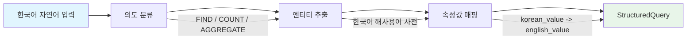
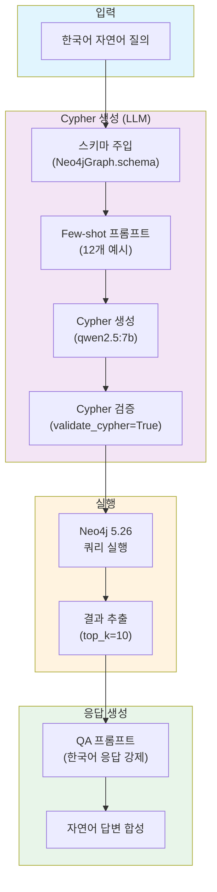
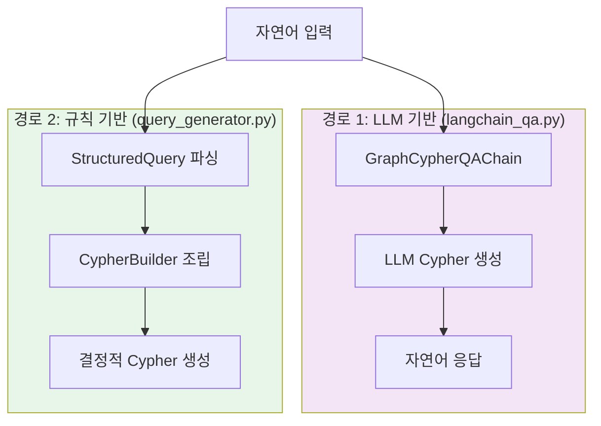
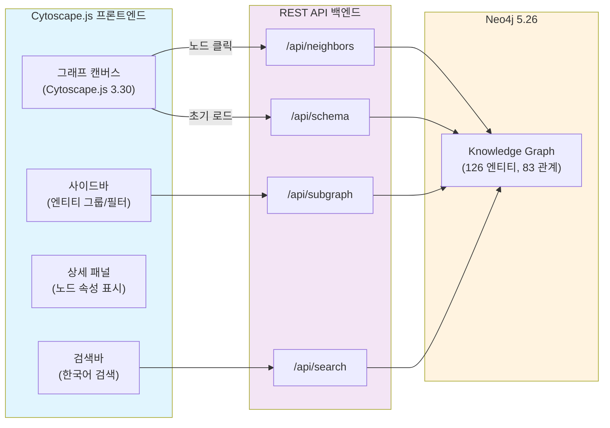
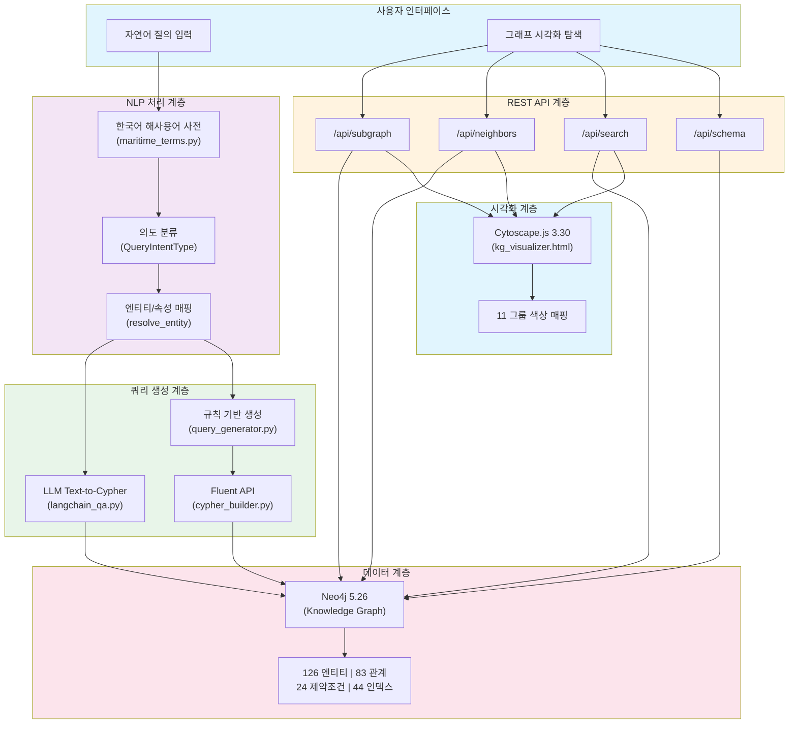

# SFR-003: Text-to-Cypher 및 시각화 기능 명세서

## KRISO 대화형 해사서비스 플랫폼 - 자연어 질의 변환 및 그래프 시각화 기능 요구사항

| 항목 | 내용 |
|------|------|
| **문서번호** | SFR-003 |
| **버전** | 1.0 |
| **작성일** | 2026-02-10 |
| **분류** | 소프트웨어 기능 요구사항 명세서 (Software Functional Requirements) |
| **대상 납품물** | #6 PoC 프로토타입 및 시험 결과 보고서 |
| **단계** | 1차년도 (설계 + PoC) |
| **상태** | Draft |

---

## 변경 이력

| 버전 | 일자 | 작성자 | 변경 내용 |
|------|------|--------|-----------|
| 1.0 | 2026-02-10 | 플랫폼팀 | 초안 작성 - PoC 구현 기준 기능 명세 |

---

## 목차

1. [개요](#1-개요)
2. [기능 요구사항](#2-기능-요구사항)
3. [비기능 요구사항](#3-비기능-요구사항)
4. [PoC 구현 현황](#4-poc-구현-현황)
5. [2차년도 확장 계획](#5-2차년도-확장-계획)
6. [부록](#부록)

---

## 1. 개요

### 1.1 목적

본 문서는 KRISO 대화형 해사서비스 플랫폼의 **자연어 질의 -> Cypher 변환 -> 그래프 시각화** 파이프라인에 대한 소프트웨어 기능 요구사항(SFR, Software Functional Requirements)을 정의한다. RFP 전략 항목 "Text-to-Cypher/SPARQL PoC"에 해당하며, 아키텍처 설계서(DES-004)와 과업 완료 보고서(RPT-001)에 분산된 기능 요건을 독립 SFR 문서로 통합 정리한다.

본 명세서가 다루는 핵심 기능 영역은 다음과 같다:

| 기능 영역 | 설명 | 구현 상태 |
|-----------|------|-----------|
| **자연어 질의 처리** | 한국어 자연어 입력의 의도 분류 및 구조화 | PoC 완료 |
| **Text-to-Cypher 변환** | LLM 기반 자연어 -> Cypher 쿼리 변환 | PoC 완료 |
| **Cypher vs SPARQL 비교** | Property Graph / RDF 쿼리 언어 선택 근거 | 분석 완료 |
| **그래프 시각화** | Cytoscape.js 기반 인터랙티브 그래프 탐색 | PoC 완료 |
| **시각화 REST API** | 그래프 데이터 조회/검색 HTTP API | PoC 완료 |

### 1.2 적용 범위

**1차년도 PoC 범위:**
- LangChain `GraphCypherQAChain` + Ollama(qwen2.5:7b) 기반 Text-to-Cypher 변환
- Cytoscape.js 기반 그래프 시각화 웹 프론트엔드
- Python stdlib `http.server` 기반 시각화 REST API
- 한국어 해사용어 사전(105 동의어, 22 관계 키워드) 연동

**2차년도 확장 범위:**
- GraphRAG(커뮤니티 탐지 + 엔티티 요약) 기반 검색 증강 생성
- MCP(Model Context Protocol) 기반 AI 에이전트 아키텍처
- Text-to-SPARQL 프로토타입(S-100 호환 요구 시)
- 고급 시각화(D3.js, 3D 뷰, 시계열 타임라인)

### 1.3 관련 문서

| 문서 ID | 문서명 | 관련 내용 |
|---------|--------|-----------|
| DES-004 | 자연어 탐색 아키텍처 설계서 | NL Query 파이프라인 전체 아키텍처 |
| DES-001 | 지식그래프 모델 설계서 | 126 엔티티, 83 관계 온톨로지 정의 |
| REQ-003 | 그래프DB 기술 비교 | Property Graph vs RDF, Cypher vs SPARQL |
| REQ-004 | IHO S-100 표준 분석 | S-100 Feature Catalogue 매핑 전략 |
| RPT-001 | 과업 완료 보고서 | PoC 데모 결과 및 시험 현황 |
| TER-001 | 테스트 계획서 | 테스트 전략 및 커버리지 |

### 1.4 용어 정의

| 용어 | 정의 |
|------|------|
| **Text-to-Cypher** | 자연어 텍스트를 Neo4j Cypher 쿼리 언어로 변환하는 기술 |
| **Text-to-SPARQL** | 자연어 텍스트를 RDF SPARQL 쿼리로 변환하는 기술 |
| **GraphCypherQAChain** | LangChain 프레임워크의 그래프 QA 체인. NL -> Cypher -> 실행 -> NL 응답 파이프라인 |
| **Few-shot Prompting** | LLM에 입출력 예시를 제공하여 정확도를 높이는 프롬프트 엔지니어링 기법 |
| **Cytoscape.js** | JavaScript 기반 오픈소스 그래프 시각화 라이브러리 |
| **NER** | Named Entity Recognition. 자연어에서 고유명사(선박명, 항구명 등) 식별 |
| **RBAC** | Role-Based Access Control. 역할 기반 접근 제어 |
| **StructuredQuery** | 자연어를 파싱하여 생성한 중간 표현 객체 (의도, 필터, 집계 등 포함) |
| **CypherBuilder** | Fluent API 패턴의 Cypher 쿼리 빌더 (`kg/cypher_builder.py`) |
| **QueryGenerator** | StructuredQuery를 Cypher/SQL/MongoDB 쿼리로 변환하는 모듈 (`kg/query_generator.py`) |
| **Property Graph** | 노드와 엣지에 속성(key-value)을 부여하는 그래프 데이터 모델 |
| **RDF** | Resource Description Framework. W3C 표준 트리플(주어-서술어-목적어) 모델 |

---

## 2. 기능 요구사항

### 2.1 자연어 질의 처리 (SFR-003-01)

#### 2.1.1 기능 개요

한국어 자연어 입력을 의도 분류(Intent Classification) 및 엔티티 추출(Entity Extraction)을 거쳐 구조화된 쿼리(StructuredQuery)로 변환한다.



#### 2.1.2 지원 질의 유형

QueryGenerator 모듈(`kg/query_generator.py`)이 지원하는 질의 의도(QueryIntentType):

| 의도 유형 | 코드 | 설명 | 예시 질의 |
|-----------|------|------|-----------|
| **검색** | `FIND` | 조건에 맞는 엔티티 조회 | "부산항 반경 50km 이내 선박" |
| **개수** | `COUNT` | 조건에 맞는 엔티티 수 집계 | "KRISO 연구 논문 몇 편이야?" |
| **집계** | `AGGREGATE` | 그룹핑 및 통계 함수 적용 | "선종별 선박 수를 알려줘" |
| **생성** | `CREATE` | 엔티티 또는 관계 생성 | (관리자 전용, PoC 미지원) |
| **수정** | `UPDATE` | 속성값 갱신 | (관리자 전용, PoC 미지원) |
| **삭제** | `DELETE` | 엔티티 또는 관계 삭제 | (관리자 전용, PoC 미지원) |

> **PoC 범위 제한:** 1차년도 PoC에서는 `FIND`, `COUNT`, `AGGREGATE`만 지원한다. `CREATE`, `UPDATE`, `DELETE`는 2차년도 관리 기능으로 확장 예정이다.

#### 2.1.3 해사 도메인 최적화

한국어 해사용어 사전(`kg/nlp/maritime_terms.py`)은 다음 네 가지 매핑 테이블을 제공한다:

| 매핑 테이블 | 항목 수 | 설명 | 예시 |
|-------------|---------|------|------|
| `ENTITY_SYNONYMS` | 105개 | 한국어 -> Neo4j Label | "선박" -> `Vessel`, "예인수조" -> `TowingTank` |
| `RELATIONSHIP_KEYWORDS` | 22개 | 한국어 관계 표현 -> Relationship Type | "항해중인" -> `ON_VOYAGE`, "정박한" -> `DOCKED_AT` |
| `PROPERTY_VALUE_MAP` | 6 그룹 | 속성별 한국어값 -> 영문값 | vesselType: "컨테이너선" -> `ContainerShip` |
| `NAMED_ENTITIES` | 11개 | 고유명사 -> Cypher MATCH 조건 | "부산항" -> `{label: "Port", key: "unlocode", value: "KRPUS"}` |

**엔티티 해석 로직 (`resolve_entity`):**

```
1. 정확 매칭: ENTITY_SYNONYMS[korean_term] 조회
2. 부분 매칭: ENTITY_SYNONYMS 키에 대한 부분 문자열 포함 검사
3. 미발견 시: None 반환 → LLM 자체 판단에 위임
```

**속성값 해석 로직 (`resolve_property_value`):**

```
1. PROPERTY_VALUE_MAP[property_name] 조회
2. 해당 속성의 한국어 -> 영어 매핑 적용
3. 미발견 시: None 반환 → 원본 한국어 값 사용
```

#### 2.1.4 요구사항 상세

| ID | 요구사항 | 우선순위 | 상태 |
|----|---------|---------|------|
| SFR-003-01-01 | 한국어 자연어 질의를 수신하여 의도(Intent)를 분류해야 한다 | 필수 | 구현 완료 |
| SFR-003-01-02 | 해사 도메인 용어를 Neo4j 엔티티 레이블로 변환해야 한다 (105개 동의어) | 필수 | 구현 완료 |
| SFR-003-01-03 | 관계 표현을 Neo4j Relationship Type으로 변환해야 한다 (22개 키워드) | 필수 | 구현 완료 |
| SFR-003-01-04 | 한국어 속성값을 영문 속성값으로 자동 매핑해야 한다 (6개 속성 그룹) | 필수 | 구현 완료 |
| SFR-003-01-05 | 고유명사(항구, 기관, 해역)를 Cypher MATCH 조건으로 해석해야 한다 | 필수 | 구현 완료 |
| SFR-003-01-06 | LLM 프롬프트에 주입 가능한 용어 레퍼런스를 생성해야 한다 (`get_term_context_for_llm`) | 권장 | 구현 완료 |

---

### 2.2 Text-to-Cypher 변환 (SFR-003-02)

#### 2.2.1 기능 개요

LangChain `GraphCypherQAChain`을 활용하여 자연어 질의를 Cypher 쿼리로 변환하고, Neo4j에서 실행한 결과를 자연어 응답으로 합성한다.



#### 2.2.2 LangChain 체인 구성

PoC 구현(`poc/langchain_qa.py`)의 핵심 구성 요소:

| 구성 요소 | 설정 | 비고 |
|-----------|------|------|
| **LLM** | `ChatOllama(model="qwen2.5:7b", temperature=0)` | 로컬 온프레미스 실행 |
| **그래프** | `Neo4jGraph(enhanced_schema=False)` | 전체 스키마 자동 추출 |
| **체인** | `GraphCypherQAChain.from_llm()` | LangChain 표준 체인 |
| **Cypher 프롬프트** | 커스텀 `CYPHER_GENERATION_TEMPLATE` | 12개 Few-shot 예시 포함 |
| **QA 프롬프트** | 커스텀 `QA_TEMPLATE` | 한국어 응답 강제 |
| **검증** | `validate_cypher=True` | 구문 유효성 사전 검사 |
| **결과 제한** | `top_k=10` | 최대 10건 결과 반환 |
| **중간 단계** | `return_intermediate_steps=True` | 생성 Cypher + 컨텍스트 확인 가능 |

#### 2.2.3 Few-shot 프롬프트 전략

커스텀 Cypher 생성 프롬프트(`CYPHER_GENERATION_TEMPLATE`)는 다음 구성을 따른다:

```
1. 시스템 역할 정의: "Neo4j Cypher expert working with Korean Maritime KG"
2. 한국어 응답 강제: "IMPORTANT: Always answer in Korean"
3. 스키마 주입: {schema} 플레이스홀더 → Neo4jGraph 자동 생성
4. Cypher 구문 규칙: CONTAINS 사용법, 정확/부분 매칭, 풀텍스트 검색
5. Document 검색 규칙: KRISO 연구논문 특수 지침
6. 핵심 엔티티 레퍼런스: 항구, 선박, 해역, 기관, 시설 한국어명
7. Few-shot 예시: 12종 패턴 (아래 표 참조)
8. 출력 제약: "Do not include any text except the generated Cypher statement"
```

**Few-shot 예시 12종 패턴:**

| # | 질의 패턴 | 핵심 Cypher 기법 |
|---|-----------|-----------------|
| 1 | 부산항 반경 50km 이내 선박 | `point.distance()`, 공간 필터 |
| 2 | HMM 알헤시라스 항해 정보 | `CONTAINS`, 다단계 관계 순회 |
| 3 | KRISO 시험설비 목록 | `orgId` 기반 매칭, `HAS_FACILITY` 관계 |
| 4 | 최근 해양사고 이력 | `Incident`, `INVOLVES`, `VIOLATED` 관계 |
| 5 | 남해 기상 상태 | `WeatherCondition`-`AFFECTS`-`SeaArea` |
| 6 | 자율운항선박 관련 논문 | `Document.title CONTAINS` |
| 7 | 해양오염 관련 연구 논문 | `db.index.fulltext.queryNodes()` |
| 8 | KRISO 연구 논문 수 | `count()`, `collect(DISTINCT)` |
| 9 | KVLCC2 저항시험 결과 | `Experiment`-`PRODUCED`-`ExperimentalDataset`-`CONTAINS`-`Measurement` |
| 10 | 해양공학수조 실험 이력 | `CONDUCTED_AT`, `facilityId` 매칭 |
| 11 | 빙해수조 시험 조건 | `HAS_CONDITION`-`TestCondition`, 빙해 속성 |
| 12 | 사용자 역할별 접근 권한 | `Role`-`CAN_ACCESS`-`DataClass`, RBAC 구조 |

#### 2.2.4 쿼리 검증 및 안전성 검사

| 검증 항목 | 방법 | 적용 위치 |
|-----------|------|-----------|
| **Cypher 구문 검증** | `validate_cypher=True` (LangChain 내장) | 체인 실행 시 자동 |
| **파라미터 바인딩** | `$paramName` 형식 강제 | Few-shot 프롬프트에서 예시로 유도 |
| **READ-only 제한** | Cypher 생성 프롬프트에서 MATCH/RETURN만 유도 | 프롬프트 제약 |
| **결과 건수 제한** | `top_k=10` | 체인 설정 |
| **에러 핸들링** | `try/except` 블록, 에러 타입 출력 | `ask()` 함수 |

> **Cypher Injection 방지:** Few-shot 예시에서 `$paramName` 패턴 사용을 시범 보이고, `validate_cypher=True`로 구문 검증을 수행한다. 다만 LLM 생성 Cypher의 특성상 완벽한 방지는 어려우므로, 2차년도에 별도 Cypher 파서 기반 화이트리스트 검증 모듈 도입을 권장한다.

#### 2.2.5 이중 경로(Dual-Path) 쿼리 생성

PoC에서는 두 가지 독립적인 쿼리 생성 경로를 제공한다:



| 특성 | 경로 1: LLM 기반 | 경로 2: 규칙 기반 |
|------|------------------|------------------|
| **구현 파일** | `poc/langchain_qa.py` | `kg/query_generator.py` + `kg/cypher_builder.py` |
| **변환 방식** | LLM이 Cypher 직접 생성 | StructuredQuery -> CypherBuilder 조립 |
| **유연성** | 높음 (자유 형식 질의 가능) | 중간 (정의된 패턴에 한정) |
| **정확도** | LLM 의존적 (Few-shot로 보강) | 높음 (결정적 생성) |
| **지원 쿼리** | 스키마 범위 내 모든 패턴 | FIND, COUNT, AGGREGATE + 필터/정렬/페이지네이션 |
| **용도** | 대화형 QA 인터페이스 | 프로그래밍 API / 시각화 백엔드 |

#### 2.2.6 요구사항 상세

| ID | 요구사항 | 우선순위 | 상태 |
|----|---------|---------|------|
| SFR-003-02-01 | 한국어 자연어를 Cypher 쿼리로 변환해야 한다 | 필수 | 구현 완료 |
| SFR-003-02-02 | 12종 이상의 Few-shot 예시를 프롬프트에 포함해야 한다 | 필수 | 구현 완료 |
| SFR-003-02-03 | 생성된 Cypher의 구문 유효성을 검증해야 한다 | 필수 | 구현 완료 |
| SFR-003-02-04 | 쿼리 결과를 한국어 자연어 응답으로 합성해야 한다 | 필수 | 구현 완료 |
| SFR-003-02-05 | 중간 단계(생성 Cypher, 컨텍스트)를 확인할 수 있어야 한다 | 권장 | 구현 완료 |
| SFR-003-02-06 | CypherBuilder를 통한 결정적 쿼리 생성 경로를 제공해야 한다 | 필수 | 구현 완료 |
| SFR-003-02-07 | 공간 질의(point.distance)를 지원해야 한다 | 필수 | 구현 완료 |
| SFR-003-02-08 | 풀텍스트 검색(db.index.fulltext)을 지원해야 한다 | 권장 | 구현 완료 |

---

### 2.3 Text-to-SPARQL 비교 (SFR-003-03)

#### 2.3.1 Cypher vs SPARQL 비교 분석

REQ-003(그래프DB 기술 비교)에서 분석한 내용을 기반으로, 자연어 -> 쿼리 변환 관점의 비교를 제시한다.

| 비교 항목 | Cypher (Neo4j) | SPARQL (RDF) |
|-----------|----------------|--------------|
| **데이터 모델** | Property Graph (노드/엣지에 속성 직접 부여) | Triple Store (주어-서술어-목적어) |
| **스키마 유연성** | Schema-optional (PoC에 유리) | Schema-strict (온톨로지 필수 선행) |
| **한국어 지원** | 속성값에 한국어 직접 저장 | 리터럴에 언어 태그 필요 (`@ko`) |
| **공간 질의** | `point()`, `point.distance()` 내장 | GeoSPARQL 확장 필요 |
| **LLM 생성 난이도** | 낮음 (ASCII 패턴, MATCH/WHERE/RETURN) | 높음 (PREFIX, URI, 트리플 패턴) |
| **Few-shot 효율** | 높음 (직관적 패턴 매칭) | 낮음 (PREFIX 선언 반복 필요) |
| **LangChain 지원** | `GraphCypherQAChain` 공식 지원 | `GraphSparqlQAChain` 지원 (제한적) |
| **커뮤니티/생태계** | 풍부 (Neo4j + LangChain 통합 성숙) | 학술 중심 (실무 도구 제한적) |

#### 2.3.2 SPARQL 변환 난이도 비교

동일 질의에 대한 Cypher vs SPARQL 생성 복잡도 예시:

**질의:** "부산항 반경 50km 이내 선박을 알려줘"

**Cypher (26 토큰):**
```cypher
MATCH (p:Port {name: '부산항'})
MATCH (v:Vessel)
WHERE point.distance(v.currentLocation, p.location) < 50000
RETURN v.name AS vessel, round(point.distance(v.currentLocation, p.location) / 1000.0, 1) AS distance_km
ORDER BY distance_km
```

**SPARQL (예상, 약 45 토큰):**
```sparql
PREFIX geo: <http://www.opengis.net/ont/geosparql#>
PREFIX geof: <http://www.opengis.net/def/function/geosparql/>
PREFIX maritime: <http://kriso.re.kr/ontology/maritime#>

SELECT ?vessel ?distance_km WHERE {
  ?port a maritime:Port ;
        maritime:name "부산항" ;
        geo:hasGeometry/geo:asWKT ?portGeom .
  ?v a maritime:Vessel ;
     maritime:name ?vessel ;
     geo:hasGeometry/geo:asWKT ?vesselGeom .
  BIND(geof:distance(?vesselGeom, ?portGeom, <http://www.opengis.net/def/uom/OGC/1.0/metre>) AS ?distance)
  FILTER(?distance < 50000)
  BIND(?distance / 1000.0 AS ?distance_km)
}
ORDER BY ?distance_km
```

| 비교 지표 | Cypher | SPARQL |
|-----------|--------|--------|
| 토큰 수 | ~26 | ~45 (1.7배) |
| PREFIX 선언 | 불필요 | 3~5개 필수 |
| URI 관리 | 불필요 | 네임스페이스 필수 |
| 공간 함수 | 내장 (`point.distance`) | GeoSPARQL 확장 |
| LLM 생성 난이도 | 낮음 | 높음 |

#### 2.3.3 Property Graph(Cypher) 선택 근거

| 선택 근거 | 설명 |
|-----------|------|
| **PoC 속도** | Cypher는 스키마 없이 즉시 시작 가능, RDF는 온톨로지 OWL 정의 선행 필요 |
| **LLM 친화성** | Cypher 패턴이 자연어에 가까워 LLM 생성 정확도가 높음 |
| **공간 질의** | Neo4j 내장 공간 타입으로 해사 지리 질의 즉시 가능 |
| **한국어 처리** | 속성값 직접 저장 방식이 리터럴 언어 태그보다 간결 |
| **기존 코드베이스** | CypherBuilder(640줄), QueryGenerator(628줄) 이미 구현 완료 |
| **LangChain 통합** | `GraphCypherQAChain` 공식 지원, 성숙한 문서와 커뮤니티 |

#### 2.3.4 S-100 호환 시 SPARQL 확장 전략 (2차년도)

IHO S-100 Feature Catalogue가 GML/XML 기반으로 정의되어 있어, RDF/SPARQL이 필요할 수 있다. 확장 전략:

```
Phase 1 (PoC): Property Graph(Cypher) 단독 → 현재
Phase 2 (2차년도): Neo4j + RDF4J 병행
  - Neo4j: 운영 KG (OLTP 질의, 시각화, 대화형 QA)
  - RDF4J: S-100 온톨로지 매핑 (SPARQL 변환 가능 영역)
  - 브릿지: Neo4j Neosemantics (n10s) 플러그인으로 RDF 임포트/익스포트
Phase 3 (고도화): 통합 쿼리 엔진
  - Text-to-Query → Cypher OR SPARQL 자동 라우팅
```

#### 2.3.5 요구사항 상세

| ID | 요구사항 | 우선순위 | 상태 |
|----|---------|---------|------|
| SFR-003-03-01 | Cypher vs SPARQL 비교 분석을 문서화해야 한다 | 필수 | 완료 |
| SFR-003-03-02 | S-100 호환 시 SPARQL 확장 경로를 제시해야 한다 | 권장 | 완료 |
| SFR-003-03-03 | 2차년도 Text-to-SPARQL 프로토타입 요건을 정의해야 한다 | 선택 | 정의 완료 |

---

### 2.4 그래프 시각화 (SFR-003-04)

#### 2.4.1 기능 개요

Cytoscape.js 기반의 인터랙티브 그래프 시각화 웹 인터페이스를 제공한다. 해사 지식그래프의 노드와 엣지를 시각적으로 탐색하고, 부분그래프 조회, 이웃 노드 확장, 한국어 검색 등을 지원한다.



#### 2.4.2 UI 구성

시각화 프론트엔드(`poc/kg_visualizer.html`)의 레이아웃:

```
+------------------------------------------------------------+
|  TopBar: 로고 | 검색바 | 새로고침 | 레이아웃 선택            |
+----------+---------------------------------+----------------+
|          |                                 |                |
| Sidebar  |     Graph Canvas                |  Detail Panel  |
| (280px)  |     (Cytoscape.js)              |  (320px)       |
|          |                                 |                |
| - 엔티티 |     노드/엣지 렌더링              | - 노드 정보     |
|   그룹   |     인터랙션 (확대/축소/드래그)     | - 속성 목록     |
| - 라벨   |     레이아웃 자동 배치             | - 관계 목록     |
|   필터   |                                 | - 이웃 확장     |
|          |                                 |                |
+----------+---------------------------------+----------------+
|  StatusBar: 노드 수 | 엣지 수 | 연결 상태                    |
+------------------------------------------------------------+
```

#### 2.4.3 엔티티 그룹별 시각화 규칙

11개 엔티티 그룹별 색상 매핑(`kg_visualizer_api.py`):

| 엔티티 그룹 | 색상 코드 | 포함 레이블 수 | 대표 엔티티 |
|-------------|-----------|---------------|-------------|
| **PhysicalEntity** | `#4A90D9` (파랑) | 24 | Vessel, Port, Cargo, Sensor |
| **SpatialEntity** | `#50C878` (초록) | 5 | SeaArea, EEZ, GeoPoint |
| **TemporalEntity** | `#E67E22` (주황) | 15 | Voyage, Incident, WeatherCondition |
| **InformationEntity** | `#9B59B6` (보라) | 18 | Regulation, Document, Service |
| **Observation** | `#E74C3C` (빨강) | 6 | SARObservation, AISObservation |
| **Agent** | `#F39C12` (금색) | 8 | Organization, Person |
| **PlatformResource** | `#1ABC9C` (청록) | 8 | Workflow, AIModel, MCPTool |
| **MultimodalData** | `#3498DB` (하늘) | 6 | AISData, SatelliteImage |
| **MultimodalRepresentation** | `#5DADE2` (연하늘) | 4 | VisualEmbedding, TextEmbedding |
| **KRISO** | `#FF6B35` (오렌지) | 22 | Experiment, TestFacility, Measurement |
| **RBAC** | `#95A5A6` (회색) | 4 | User, Role, DataClass, Permission |

> 총 120개 레이블이 11개 그룹으로 분류되며, 미분류 레이블은 `#888888` (기본 회색)으로 표시된다.

#### 2.4.4 인터랙션 기능

| 기능 | 동작 | 트리거 |
|------|------|--------|
| **부분그래프 조회** | 선택 레이블의 노드 + 연결 관계 로드 | 사이드바 라벨 클릭 |
| **이웃 노드 확장** | 선택 노드의 1-hop 이웃 추가 | 노드 클릭 |
| **한국어 검색** | name/title/nameEn/description CONTAINS 검색 | 검색바 입력 |
| **노드 상세** | 속성, 레이블, 그룹 정보 표시 | 노드 선택 |
| **레이아웃 자동 배치** | cose/circle/grid/breadthfirst 등 | 레이아웃 드롭다운 |
| **확대/축소** | 마우스 휠 / 핀치 줌 | 캔버스 조작 |
| **드래그 이동** | 노드 위치 수동 조정 | 노드 드래그 |

#### 2.4.5 요구사항 상세

| ID | 요구사항 | 우선순위 | 상태 |
|----|---------|---------|------|
| SFR-003-04-01 | Cytoscape.js 기반 그래프 시각화를 제공해야 한다 | 필수 | 구현 완료 |
| SFR-003-04-02 | 11개 엔티티 그룹별 색상 구분이 적용되어야 한다 | 필수 | 구현 완료 |
| SFR-003-04-03 | 노드 클릭 시 이웃 확장이 가능해야 한다 | 필수 | 구현 완료 |
| SFR-003-04-04 | 한국어 키워드 검색을 지원해야 한다 | 필수 | 구현 완료 |
| SFR-003-04-05 | 노드 상세 속성을 패널에 표시해야 한다 | 필수 | 구현 완료 |
| SFR-003-04-06 | 다양한 그래프 레이아웃을 지원해야 한다 | 권장 | 구현 완료 |
| SFR-003-04-07 | 500노드 이하에서 원활한 렌더링을 보장해야 한다 | 권장 | 검증 필요 |

---

### 2.5 시각화 REST API (SFR-003-05)

#### 2.5.1 API 개요

Python stdlib `http.server` 기반의 경량 REST API(`poc/kg_visualizer_api.py`)로, 그래프 시각화 프론트엔드에 데이터를 공급한다.

**서버 설정:**

| 항목 | 값 | 환경변수 |
|------|-----|---------|
| 호스트 | `0.0.0.0` | `KG_VIS_HOST` |
| 포트 | `8765` | `KG_VIS_PORT` |
| CORS | 허용 (`Access-Control-Allow-Origin: *`) | - |
| 정적 파일 | `poc/` 디렉토리 서빙 | - |
| 루트 경로 | `/` -> `kg_visualizer.html` | - |

#### 2.5.2 엔드포인트 명세

##### GET /api/subgraph

레이블 기반 부분그래프 조회. 지정 레이블의 노드와 연결된 관계, 이웃 노드를 함께 반환한다.

| 항목 | 내용 |
|------|------|
| **Method** | GET |
| **Path** | `/api/subgraph` |
| **Parameters** | `label` (string, default: "Vessel") - Neo4j 노드 레이블<br/>`limit` (int, default: 50, max: 200) - 반환 노드 상한 |
| **Response** | `{ nodes: Node[], edges: Edge[], meta: { label, limit, nodeCount, edgeCount } }` |
| **Validation** | `label.isalnum()` 체크로 레이블 인젝션 방지 |

**내부 Cypher:**
```cypher
MATCH (n:{label})
WITH n LIMIT $limit
OPTIONAL MATCH (n)-[r]-(m)
RETURN n, r, m
```

##### GET /api/neighbors

노드 ID 기반 이웃 확장. 지정 노드의 1-hop 이웃 노드와 관계를 반환한다.

| 항목 | 내용 |
|------|------|
| **Method** | GET |
| **Path** | `/api/neighbors` |
| **Parameters** | `nodeId` (string, required) - Neo4j element ID |
| **Response** | `{ nodes: Node[], edges: Edge[], meta: { centerNodeId, nodeCount, edgeCount } }` |
| **Error** | nodeId 미제공 시 `{ error: "nodeId is required" }` |

**내부 Cypher:**
```cypher
MATCH (n)
WHERE elementId(n) = $nodeId
OPTIONAL MATCH (n)-[r]-(m)
RETURN n, r, m
```

##### GET /api/search

한국어 키워드 기반 노드 검색. name, title, nameEn, description 속성에 대해 CONTAINS 검색을 수행한다.

| 항목 | 내용 |
|------|------|
| **Method** | GET |
| **Path** | `/api/search` |
| **Parameters** | `q` (string, required) - 검색 키워드<br/>`limit` (int, default: 30, max: 100) - 반환 노드 상한 |
| **Response** | `{ nodes: Node[], edges: Edge[], meta: { query, nodeCount, edgeCount } }` |
| **Error** | `q` 미제공 시 `{ error: "Search query (q) is required" }` |

**내부 Cypher:**
```cypher
MATCH (n)
WHERE n.name CONTAINS $query
   OR n.title CONTAINS $query
   OR n.nameEn CONTAINS $query
   OR n.description CONTAINS $query
WITH n LIMIT $limit
OPTIONAL MATCH (n)-[r]-(m)
RETURN n, r, m
```

##### GET /api/schema

그래프 메타데이터 조회. 사용 가능한 노드 레이블, 관계 타입, 엔티티 그룹 정보를 반환한다.

| 항목 | 내용 |
|------|------|
| **Method** | GET |
| **Path** | `/api/schema` |
| **Parameters** | 없음 |
| **Response** | `{ labels: LabelInfo[], relationshipTypes: string[], entityGroups: GroupInfo, totalLabels, totalRelationshipTypes }` |

#### 2.5.3 응답 데이터 구조

**Node 객체:**
```json
{
  "id": "4:xxx:0",
  "labels": ["Vessel", "CargoShip"],
  "primaryLabel": "Vessel",
  "group": "PhysicalEntity",
  "color": "#4A90D9",
  "properties": {
    "name": "HMM 알헤시라스",
    "vesselType": "ContainerShip",
    "mmsi": "440123456",
    "currentLocation": {"lat": 35.1, "lon": 129.0}
  },
  "displayName": "HMM 알헤시라스"
}
```

**Edge 객체:**
```json
{
  "id": "5:xxx:0",
  "type": "ON_VOYAGE",
  "sourceId": "4:xxx:0",
  "targetId": "4:xxx:1",
  "properties": {}
}
```

**특수 타입 직렬화 (`_serialize_value`):**

| Neo4j 타입 | JSON 변환 | 예시 |
|-----------|-----------|------|
| `Point` | `{"lat": y, "lon": x}` | `{"lat": 35.1, "lon": 129.0}` |
| `Date/DateTime` | ISO 8601 문자열 | `"2026-01-15"` |
| 기타 | `str()` 변환 | - |

#### 2.5.4 에러 처리

| HTTP 상태 | 조건 | 응답 |
|-----------|------|------|
| 200 | 정상 처리 | `{ nodes: [...], edges: [...], meta: {...} }` |
| 200 | 결과 없음 | `{ nodes: [], edges: [], meta: { nodeCount: 0, edgeCount: 0 } }` |
| 200 | 파라미터 누락 | `{ error: "...", nodes: [], edges: [] }` |
| 500 | 서버 에러 | `{ error: "...", type: "ExceptionTypeName" }` |

> **참고:** 현재 PoC에서는 파라미터 검증 실패도 HTTP 200으로 반환한다. 2차년도에 FastAPI 전환 시 적절한 HTTP 상태 코드(400, 404 등)로 개선 예정이다.

#### 2.5.5 요구사항 상세

| ID | 요구사항 | 우선순위 | 상태 |
|----|---------|---------|------|
| SFR-003-05-01 | `/api/subgraph` 엔드포인트를 제공해야 한다 | 필수 | 구현 완료 |
| SFR-003-05-02 | `/api/neighbors` 엔드포인트를 제공해야 한다 | 필수 | 구현 완료 |
| SFR-003-05-03 | `/api/search` 엔드포인트를 제공해야 한다 | 필수 | 구현 완료 |
| SFR-003-05-04 | `/api/schema` 엔드포인트를 제공해야 한다 | 필수 | 구현 완료 |
| SFR-003-05-05 | 레이블 인젝션 방지를 위한 입력 검증을 수행해야 한다 | 필수 | 구현 완료 |
| SFR-003-05-06 | CORS 헤더를 포함해야 한다 | 권장 | 구현 완료 |
| SFR-003-05-07 | Neo4j 공간/시간 타입을 JSON 직렬화해야 한다 | 필수 | 구현 완료 |
| SFR-003-05-08 | 정적 파일(HTML/JS/CSS)을 서빙해야 한다 | 필수 | 구현 완료 |

---

## 3. 비기능 요구사항

### 3.1 성능

| ID | 항목 | 목표 | 비고 |
|----|------|------|------|
| NFR-003-01 | 자연어 -> Cypher 변환 | 3초 이내 | qwen2.5:7b 로컬 LLM 기준 |
| NFR-003-02 | Cypher 실행 + 결과 반환 | 1초 이내 | 인덱스 활용 전제 |
| NFR-003-03 | 시각화 초기 렌더링 | 2초 이내 | 500노드 이하 기준 |
| NFR-003-04 | 이웃 확장 응답 | 500ms 이내 | 1-hop 이웃 기준 |
| NFR-003-05 | 검색 응답 | 1초 이내 | CONTAINS 기반 |
| NFR-003-06 | 최대 동시 시각화 노드 수 | 500개 | Cytoscape.js 렌더링 한계 고려 |

> **LLM 성능 참고:** qwen2.5:7b 모델의 첫 호출 시 Cold Start로 5~10초 소요될 수 있다. 이후 호출은 Ollama 캐시로 3초 이내 응답이 기대된다. 2차년도에 GPU 서버 도입 시 1초 이내로 개선 가능하다.

### 3.2 보안

| ID | 항목 | 방안 | 상태 |
|----|------|------|------|
| NFR-003-07 | **Cypher Injection 방지** | 파라미터 바인딩(`$paramName`) 필수, `label.isalnum()` 검증 | 부분 구현 |
| NFR-003-08 | **READ-only 쿼리 제한** | Few-shot 프롬프트로 MATCH/RETURN만 유도, 2차년도에 Cypher 파서 기반 화이트리스트 도입 | 부분 구현 |
| NFR-003-09 | **RBAC 기반 데이터 필터링** | User-Role-DataClass 모델 구현 완료, 쿼리 시 자동 필터 적용은 2차년도 | 모델 완료 |
| NFR-003-10 | **Neo4j 인증** | 환경변수 기반 인증(`NEO4J_USER`/`NEO4J_PASSWORD`), `.env` 파일 git 제외 | 구현 완료 |
| NFR-003-11 | **API 접근 제어** | 현재 오픈 접근, 2차년도에 Bearer Token 인증 도입 | 미구현 |

### 3.3 확장성

| ID | 항목 | 설계 | 상태 |
|----|------|------|------|
| NFR-003-12 | **커스텀 쿼리 템플릿** | `CYPHER_GENERATION_TEMPLATE`에 Few-shot 예시 추가로 패턴 확장 | 설계 완료 |
| NFR-003-13 | **다국어 확장** | `ENTITY_SYNONYMS`, `PROPERTY_VALUE_MAP` 딕셔너리에 영어/일본어 키 추가 가능 | 설계 완료 |
| NFR-003-14 | **LLM 교체** | `ChatOllama(model=...)` 파라미터 변경으로 모델 교체 가능 | 설계 완료 |
| NFR-003-15 | **API 프레임워크 전환** | 현재 stdlib `http.server`, 2차년도에 FastAPI 전환 용이한 핸들러 분리 구조 | 설계 완료 |
| NFR-003-16 | **시각화 라이브러리 확장** | Cytoscape.js 위에 D3.js, Three.js 레이어 추가 가능한 모듈 구조 | 설계 완료 |

### 3.4 운용성

| ID | 항목 | 방안 |
|----|------|------|
| NFR-003-17 | **원클릭 설정** | `python -m poc.setup_poc`로 스키마/데이터/RBAC 일괄 초기화 |
| NFR-003-18 | **데모 실행** | `python -m poc.run_poc_demo --no-llm`으로 LLM 없이 데모 가능 |
| NFR-003-19 | **로그 출력** | `[KG-API]` 접두어로 API 요청 로그 표시 |
| NFR-003-20 | **리소스 정리** | `atexit.register(_close_driver)` 자동 Neo4j 드라이버 종료 |

---

## 4. PoC 구현 현황

### 4.1 구현 완료 기능

| 구현물 | 파일 | 줄 수 | 핵심 기능 |
|--------|------|-------|-----------|
| **Text-to-Cypher 파이프라인** | `poc/langchain_qa.py` | 340줄 | GraphCypherQAChain, 12 Few-shot, 한국어 QA |
| **시각화 REST API** | `poc/kg_visualizer_api.py` | 665줄 | 4개 엔드포인트, 11 그룹 색상, 타입 직렬화 |
| **시각화 프론트엔드** | `poc/kg_visualizer.html` | - | Cytoscape.js 3.30, 다크 테마, 반응형 레이아웃 |
| **한국어 해사용어 사전** | `kg/nlp/maritime_terms.py` | 331줄 | 105 동의어, 22 관계, 6 속성 그룹, 11 고유명사 |
| **Cypher 쿼리 빌더** | `kg/cypher_builder.py` | 640줄 | Fluent API, QueryOptions, 공간쿼리 |
| **쿼리 생성기** | `kg/query_generator.py` | 628줄 | StructuredQuery -> Cypher/SQL/MongoDB |
| **PoC 데모** | `poc/run_poc_demo.py` | - | Neo4j/Ollama 체크, 10종 시나리오 |
| **PoC 설정** | `poc/setup_poc.py` | - | 스키마 + 샘플 + RBAC 원클릭 |

### 4.2 테스트 현황

| 테스트 파일 | 테스트 수 | 유형 | 대상 |
|-------------|-----------|------|------|
| `tests/test_nlp_unit.py` | 31개 | 단위 | 해사용어 사전 해석, 엔티티/속성/관계 매핑 |
| `tests/test_nl_query_scenarios.py` | 3개 | 시나리오 | NL 쿼리 엔드투엔드 시나리오 |
| `tests/test_query_generator.py` | - | 단위 | QueryGenerator Cypher/SQL/MongoDB 생성 |
| `tests/test_cypher_builder.py` | - | 단위 | CypherBuilder Fluent API |
| `tests/test_integration.py` | 42개 | 통합 | Neo4j 연동 전체 파이프라인 |
| `tests/test_ontology_core.py` | - | 단위 | Ontology, ObjectType, LinkType |
| `tests/test_maritime_ontology.py` | - | 단위 | 해사 도메인 온톨로지 검증 |
| `tests/test_rbac_unit.py` | - | 단위 | RBAC 모델 및 정책 |
| `tests/test_exceptions.py` | - | 단위 | 예외 클래스 |
| `tests/test_crawlers_unit.py` | - | 단위 | 크롤러 모듈 |

**실행 명령:**
```bash
# NLP 관련 단위 테스트
PYTHONPATH=. python3 -m pytest tests/test_nlp_unit.py -v

# NL 쿼리 시나리오 테스트
PYTHONPATH=. python3 -m pytest tests/test_nl_query_scenarios.py -v

# 통합 테스트 (Neo4j 필요)
PYTHONPATH=. python3 -m pytest tests/test_integration.py -v

# 전체 테스트
PYTHONPATH=. python3 -m pytest tests/ -v
```

### 4.3 PoC 데모 결과

**실행 명령:**
```bash
PYTHONPATH=. python3 -m poc.run_poc_demo --no-llm
```

**데모 시나리오 7종:**

| # | 질의 | 검증 항목 |
|---|------|-----------|
| 1 | "부산항 반경 50km 이내 선박을 알려줘" | 공간 쿼리 (`point.distance`) |
| 2 | "HMM 알헤시라스는 어디로 항해 중이야?" | 다단계 관계 순회 |
| 3 | "KRISO 시험설비 목록을 보여줘" | 기관-시설 관계 |
| 4 | "최근 해양사고 이력을 알려줘" | 사고-선박-규정 관계 |
| 5 | "남해 기상 상태는 어때?" | 기상-해역 관계 |
| 6 | "KRISO 실험 데이터셋을 보여줘" | KRISO 연구 데이터 |
| 7 | "캐비테이션터널 시설 정보를 알려줘" | 시험시설 상세 |

**PoC 데모 구성:**

```
1. 환경 점검 (Neo4j 연결, Ollama 상태)
2. 스키마/데이터 설정 (setup_poc)
3. 그래프 통계 출력
4. 샘플 Cypher 쿼리 7종 실행
5. RBAC 접근 제어 데모
6. KRISO 실험 데이터 탐색
7. (선택) LangChain NL 쿼리 데모
```

---

## 5. 2차년도 확장 계획

### 5.1 GraphRAG 통합 (DES-004 참조)

| 항목 | 내용 |
|------|------|
| **기술** | Microsoft GraphRAG 패턴 적용 |
| **핵심 기능** | 커뮤니티 탐지 → 엔티티 요약 → 컨텍스트 생성 → LLM 답변 보강 |
| **기대 효과** | 단순 Cypher 결과 나열 → 맥락 기반 종합 답변 |
| **전제 조건** | 충분한 그래프 데이터 적재 (최소 1,000+ 엔티티) |

### 5.2 MCP 에이전트 연동 (DES-004 참조)

| 항목 | 내용 |
|------|------|
| **기술** | Model Context Protocol (MCP) 기반 AI 에이전트 |
| **핵심 기능** | 도구 호출 기반 자동화 (Cypher 실행, 데이터 조회, 알림) |
| **연동 대상** | Neo4j MCP Tool, Workflow MCP Resource |
| **기대 효과** | 자연어 → 다단계 자동 분석 파이프라인 |

### 5.3 Text-to-SPARQL 프로토타입 (S-100 요구 시)

| 항목 | 내용 |
|------|------|
| **트리거** | IHO S-100 Feature Catalogue RDF 매핑 요구 시 |
| **기술** | LangChain `GraphSparqlQAChain` + Apache Jena/RDF4J |
| **범위** | S-100 온톨로지 매핑 대상 엔티티에 한정 |
| **브릿지** | Neo4j Neosemantics(n10s) 플러그인으로 RDF 임포트/익스포트 |

### 5.4 고급 시각화

| 기능 | 기술 | 용도 |
|------|------|------|
| **D3.js 확장** | D3.js force-directed + SVG | 대규모 그래프 (1,000+ 노드) |
| **3D 뷰** | Three.js / WebGL | 해양 공간 데이터 3D 시각화 |
| **시계열 타임라인** | D3.js timeline | 항해/사고 시간축 탐색 |
| **지도 오버레이** | Leaflet.js / Mapbox | GIS 기반 선박/항구 지도 표시 |
| **대시보드** | Grafana / Superset | 운영 모니터링 대시보드 |

### 5.5 API 고도화

| 항목 | 현재 (PoC) | 2차년도 (목표) |
|------|-----------|---------------|
| 프레임워크 | Python stdlib `http.server` | FastAPI |
| 인증 | 없음 | Bearer Token / OAuth2 |
| API 문서 | 소스 주석 | OpenAPI 3.0 (Swagger UI) |
| 상태 코드 | 일괄 200 | RESTful (200/400/401/404/500) |
| 페이지네이션 | `limit` 파라미터 | cursor 기반 페이지네이션 |
| 캐싱 | 없음 | Redis 캐싱 |
| Cypher 직접 실행 | 미구현 | `POST /api/graph/query` (인증 필수) |

---

## 부록

### A. Few-shot 프롬프트 예시

`poc/langchain_qa.py`의 `CYPHER_GENERATION_TEMPLATE`에 포함된 12종 Few-shot 예시 전문:

#### A.1 공간 질의 - 부산항 반경 선박 검색

```
Question: 부산항 반경 50km 이내 선박을 알려줘
Cypher:
MATCH (p:Port {name: '부산항'})
MATCH (v:Vessel)
WHERE point.distance(v.currentLocation, p.location) < 50000
RETURN v.name AS vessel, v.vesselType AS type,
       round(point.distance(v.currentLocation, p.location) / 1000.0, 1) AS distance_km
ORDER BY distance_km
```

#### A.2 관계 순회 - 선박 항해 정보

```
Question: HMM 알헤시라스는 어디로 항해 중이야?
Cypher:
MATCH (v:Vessel)-[:ON_VOYAGE]->(voy:Voyage)-[:TO_PORT]->(dest:Port)
WHERE v.name CONTAINS 'HMM 알헤시라스'
OPTIONAL MATCH (voy)-[:FROM_PORT]->(orig:Port)
RETURN v.name AS vessel, orig.name AS origin, dest.name AS destination,
       v.currentStatus AS status, v.speed AS speed_knots
```

#### A.3 기관-시설 관계 - KRISO 시험설비

```
Question: KRISO 시험설비 목록을 보여줘
Cypher:
MATCH (org:Organization {orgId: 'ORG-KRISO'})-[:HAS_FACILITY]->(tf:TestFacility)
RETURN tf.name AS facility, tf.nameEn AS facility_en,
       tf.facilityType AS type, tf.length AS length_m,
       tf.width AS width_m, tf.depth AS depth_m
```

#### A.4 사고 이력 조회

```
Question: 최근 해양사고 이력을 알려줘
Cypher:
MATCH (inc:Incident)
OPTIONAL MATCH (inc)-[:INVOLVES]->(v:Vessel)
OPTIONAL MATCH (inc)-[:VIOLATED]->(reg:Regulation)
RETURN inc.incidentId AS id, inc.incidentType AS type,
       inc.severity AS severity, inc.description AS description,
       v.name AS involved_vessel, reg.title AS violated_regulation
ORDER BY inc.date DESC
```

#### A.5 기상-해역 관계

```
Question: 남해 기상 상태는 어때?
Cypher:
MATCH (w:WeatherCondition)-[:AFFECTS]->(sa:SeaArea {name: '남해'})
RETURN sa.name AS sea_area, w.windSpeed AS wind_speed_ms,
       w.waveHeight AS wave_height_m, w.visibility AS visibility_km,
       w.seaState AS sea_state, w.temperature AS temp_c, w.riskLevel AS risk
```

#### A.6 풀텍스트 검색 - 논문 검색

```
Question: 자율운항선박 관련 논문을 찾아줘
Cypher:
MATCH (doc:Document)
WHERE doc.title CONTAINS '자율운항'
OPTIONAL MATCH (doc)-[:ISSUED_BY]->(org:Organization)
RETURN doc.docId AS id, doc.title AS title, doc.authors AS authors,
       doc.issueDate AS date, doc.docType AS type, org.name AS publisher
ORDER BY doc.issueDate DESC
```

```
Question: 해양오염 관련 연구 논문 있어?
Cypher:
CALL db.index.fulltext.queryNodes('document_search', '해양오염') YIELD node AS doc, score
OPTIONAL MATCH (doc)-[:ISSUED_BY]->(org:Organization)
RETURN doc.docId AS id, doc.title AS title, doc.authors AS authors,
       doc.issueDate AS date, score
ORDER BY score DESC
LIMIT 10
```

#### A.7 집계 - KRISO 논문 수

```
Question: KRISO 연구 논문 몇 편이야?
Cypher:
MATCH (doc:Document)-[:ISSUED_BY]->(org:Organization {orgId: 'ORG-KRISO'})
RETURN count(doc) AS paper_count, collect(DISTINCT doc.docType) AS types
```

#### A.8 KRISO 실험 데이터

```
Question: KVLCC2 저항시험 결과를 보여줘
Cypher:
MATCH (exp:Experiment)-[:PRODUCED]->(ds:ExperimentalDataset)-[:CONTAINS]->(m:Measurement)
WHERE exp.title CONTAINS 'KVLCC2'
RETURN exp.title AS experiment, ds.title AS dataset,
       m.measurementType AS type, m.value AS value, m.unit AS unit,
       m.description AS description
ORDER BY m.testSpeed
```

```
Question: 해양공학수조에서 진행된 실험은?
Cypher:
MATCH (exp:Experiment)-[:CONDUCTED_AT]->(tf:TestFacility {facilityId: 'TF-OEB'})
OPTIONAL MATCH (exp)-[:PRODUCED]->(ds:ExperimentalDataset)
RETURN exp.experimentId AS id, exp.title AS title, exp.date AS date,
       exp.status AS status, ds.title AS dataset
ORDER BY exp.date DESC
```

```
Question: 빙해수조 시험 조건을 알려줘
Cypher:
MATCH (exp:Experiment)-[:CONDUCTED_AT]->(tf:TestFacility {facilityId: 'TF-ICE'})
MATCH (exp)-[:HAS_CONDITION]->(tc:TestCondition)
RETURN exp.title AS experiment, tc.description AS condition,
       tc.iceThickness AS ice_thickness_m, tc.iceStrength AS ice_strength_kPa,
       tc.testSpeed AS speed, tc.testSpeedUnit AS speed_unit
```

#### A.9 RBAC 접근 권한

```
Question: 사용자 역할별 접근 권한을 보여줘
Cypher:
MATCH (r:Role)-[:CAN_ACCESS]->(dc:DataClass)
RETURN r.name AS role, r.level AS role_level,
       collect(dc.name) AS accessible_data, r.description AS description
ORDER BY r.level DESC
```

---

### B. 시각화 API 응답 스키마 예시

#### B.1 /api/subgraph 응답 예시

```json
{
  "nodes": [
    {
      "id": "4:abc123:0",
      "labels": ["Vessel", "CargoShip"],
      "primaryLabel": "Vessel",
      "group": "PhysicalEntity",
      "color": "#4A90D9",
      "properties": {
        "name": "HMM 알헤시라스",
        "vesselType": "ContainerShip",
        "mmsi": "440123456",
        "imo": "9863297",
        "currentStatus": "UNDERWAY",
        "currentLocation": {"lat": 35.1, "lon": 129.0},
        "speed": 18.5
      },
      "displayName": "HMM 알헤시라스"
    },
    {
      "id": "4:def456:0",
      "labels": ["Port", "TradePort"],
      "primaryLabel": "Port",
      "group": "PhysicalEntity",
      "color": "#4A90D9",
      "properties": {
        "name": "부산항",
        "nameEn": "Busan Port",
        "unlocode": "KRPUS",
        "location": {"lat": 35.1028, "lon": 129.0403}
      },
      "displayName": "부산항"
    }
  ],
  "edges": [
    {
      "id": "5:ghi789:0",
      "type": "DOCKED_AT",
      "sourceId": "4:abc123:0",
      "targetId": "4:def456:0",
      "properties": {}
    }
  ],
  "meta": {
    "label": "Vessel",
    "limit": 50,
    "nodeCount": 2,
    "edgeCount": 1
  }
}
```

#### B.2 /api/schema 응답 예시 (발췌)

```json
{
  "labels": [
    {"label": "Vessel", "group": "PhysicalEntity", "color": "#4A90D9", "count": 15},
    {"label": "Port", "group": "PhysicalEntity", "color": "#4A90D9", "count": 5},
    {"label": "SeaArea", "group": "SpatialEntity", "color": "#50C878", "count": 4},
    {"label": "Incident", "group": "TemporalEntity", "color": "#E67E22", "count": 8},
    {"label": "TestFacility", "group": "KRISO", "color": "#FF6B35", "count": 8}
  ],
  "relationshipTypes": [
    "AFFECTS", "ANCHORED_AT", "BELONGS_TO", "CAN_ACCESS",
    "CARRIES", "CAUSED_BY", "CONDUCTED_AT", "CONTAINS",
    "DOCKED_AT", "FROM_PORT", "HAS_CONDITION", "HAS_FACILITY",
    "HAS_ROLE", "INSPECTED_BY", "INVOLVES", "ISSUED_BY",
    "LOCATED_AT", "ON_VOYAGE", "OWNED_BY", "PERFORMS",
    "PRODUCED", "PRODUCES", "TO_PORT", "VIOLATED"
  ],
  "entityGroups": {
    "PhysicalEntity": {
      "color": "#4A90D9",
      "labels": ["Vessel", "CargoShip", "Tanker", "Port", "Berth", "Sensor"]
    },
    "KRISO": {
      "color": "#FF6B35",
      "labels": ["Experiment", "TestFacility", "ExperimentalDataset", "Measurement"]
    }
  },
  "totalLabels": 120,
  "totalRelationshipTypes": 24
}
```

---

### C. 전체 파이프라인 아키텍처



---

### D. 요구사항 추적 매트릭스

| 요구사항 ID | 구현 파일 | 테스트 파일 | 상태 |
|-------------|-----------|-------------|------|
| SFR-003-01-01 ~ 06 | `kg/nlp/maritime_terms.py` | `tests/test_nlp_unit.py` | 구현 완료 |
| SFR-003-02-01 ~ 08 | `poc/langchain_qa.py`, `kg/query_generator.py`, `kg/cypher_builder.py` | `tests/test_nl_query_scenarios.py`, `tests/test_query_generator.py`, `tests/test_cypher_builder.py` | 구현 완료 |
| SFR-003-03-01 ~ 03 | 본 문서 (섹션 2.3) | - | 분석 완료 |
| SFR-003-04-01 ~ 07 | `poc/kg_visualizer.html`, `poc/kg_visualizer_api.py` | `tests/test_integration.py` | 구현 완료 |
| SFR-003-05-01 ~ 08 | `poc/kg_visualizer_api.py` | `tests/test_integration.py` | 구현 완료 |
| NFR-003-01 ~ 06 | 전체 | 벤치마크 필요 | 설계 완료 |
| NFR-003-07 ~ 11 | `poc/kg_visualizer_api.py`, `poc/langchain_qa.py` | - | 부분 구현 |
| NFR-003-12 ~ 16 | 전체 아키텍처 | - | 설계 완료 |
| NFR-003-17 ~ 20 | `poc/setup_poc.py`, `poc/run_poc_demo.py`, `poc/kg_visualizer_api.py` | - | 구현 완료 |

---

*문서 끝*
