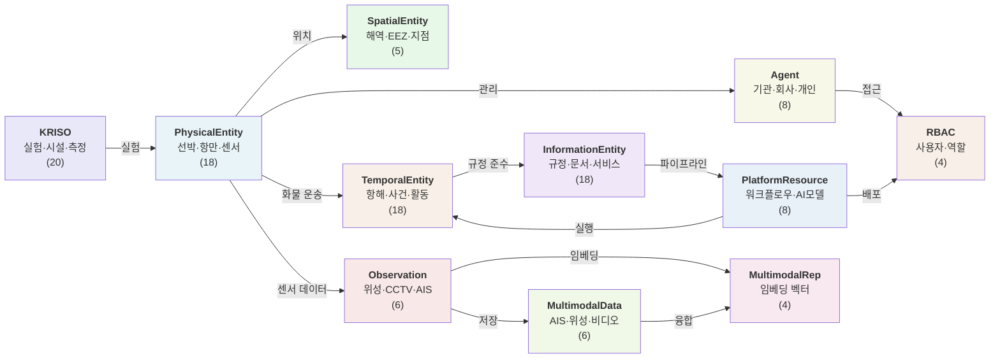
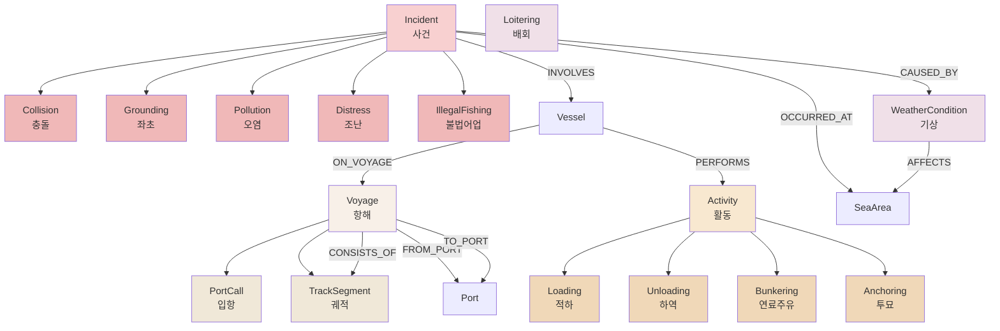
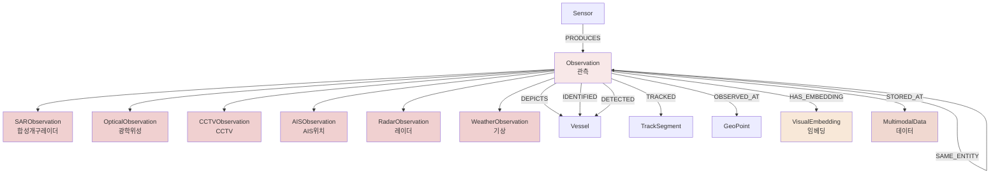
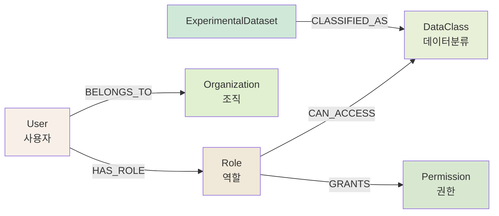
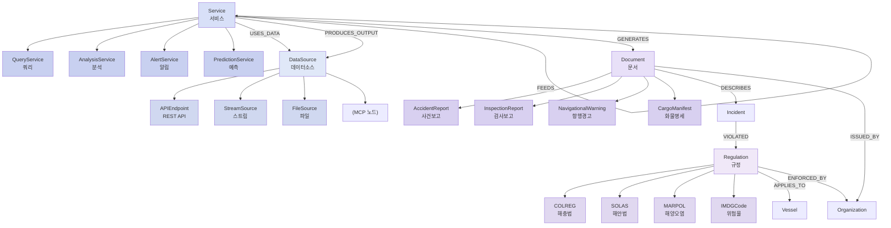
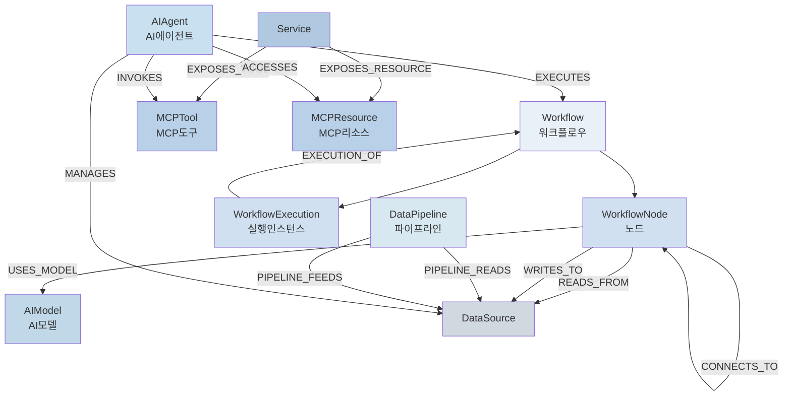
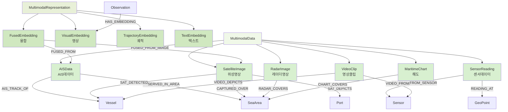
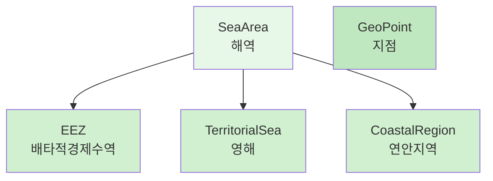

# 해사 지식그래프 온톨로지 다이어그램

## 개요

해사(Maritime) 도메인 지식그래프는 **103개 엔티티**와 **45개 이상의 관계타입**으로 구성된 포괄적인 해양 정보 모델입니다.

### 11개 엔티티 그룹

1. **PhysicalEntity** (18개): 선박, 항만, 항로, 화물, 센서 등 물리적 인프라
2. **SpatialEntity** (5개): 해역, EEZ, 영해, 지역, 지점 등 공간정보
3. **TemporalEntity** (18개): 항해, 사건, 활동, 기상 등 시간기반 데이터
4. **InformationEntity** (18개): 규정, 문서, 데이터소스, 서비스 등 정보자산
5. **Observation** (6개): SAR, 광학, CCTV, AIS, 레이더, 기상 관측
6. **Agent** (8개): 기관, 회사, 연구소, 개인 등 행위자
7. **PlatformResource** (8개): 워크플로우, AI모델, 데이터파이프라인, MCP
8. **MultimodalData** (6개): AIS, 위성영상, 레이더, 센서, 해도, 영상
9. **MultimodalRepresentation** (4개): 임베딩 벡터 (영상, 궤적, 텍스트, 융합)
10. **KRISO** (20개): 실험, 시설, 측정 데이터 (해양과학 전용)
11. **RBAC** (4개): 사용자, 역할, 데이터분류, 권한 (접근제어)

---

## 1. 고수준 개요 - 11개 그룹 관계도



---

## 2. PhysicalEntity 그룹 (물리적 인프라)

18개 엔티티: 선박 6종, 항만 4종, 수로 3종, 화물 3종, 센서 5종

```mermaid
graph TD
    V["Vessel<br/>선박"]
    V --> CS["CargoShip<br/>화물선"]
    V --> TK["Tanker<br/>유조선"]
    V --> FV["FishingVessel<br/>어선"]
    V --> PS["PassengerShip<br/>여객선"]
    V --> NV["NavalVessel<br/>군함"]
    V --> AV["AutonomousVessel<br/>무인선"]

    P["Port<br/>항만"]
    P --> TP["TradePort<br/>무역항"]
    P --> CP["CoastalPort<br/>연안항"]
    P --> FP["FishingPort<br/>어항"]
    P --> PF["PortFacility<br/>항만시설"]

    W["Waterway<br/>수로"]
    W --> TSS["TSS<br/>분리통항방식"]
    W --> CH["Channel<br/>항로"]

    C["Cargo<br/>화물"]
    C --> DG["DangerousGoods<br/>위험물"]
    C --> BC["BulkCargo<br/>산적화물"]
    C --> CC["ContainerCargo<br/>컨테이너"]

    S["Sensor<br/>센서"]
    S --> AIS["AISTransceiver<br/>AIS"]
    S --> RD["Radar<br/>레이더"]
    S --> CCTV["CCTVCamera<br/>CCTV"]
    S --> WS["WeatherStation<br/>기상관측"]

    B["Berth<br/>선석"]
    A["Anchorage<br/>투묘지"]

    V -->|DOCKED_AT| B
    V -->|ANCHORED_AT| A
    V -->|CARRIES| C
    V -->|LOCATED_AT| W
    P -->|HAS_FACILITY| PF
    P -->|CONNECTED_VIA| W
    S -->|PRODUCES| OBS["Observation"]

    style V fill:#e8f4f8
    style CS fill:#d0e8f0
    style TK fill:#d0e8f0
    style FV fill:#d0e8f0
    style PS fill:#d0e8f0
    style NV fill:#d0e8f0
    style AV fill:#d0e8f0
    style P fill:#c0e0e8
    style TP fill:#b0d8e0
    style CP fill:#b0d8e0
    style FP fill:#b0d8e0
    style PF fill:#b0d8e0
    style W fill:#a0d0d8
    style TSS fill:#90c8d0
    style CH fill:#90c8d0
    style C fill:#d0e0f0
    style DG fill:#b8d0e8
    style BC fill:#b8d0e8
    style CC fill:#b8d0e8
    style S fill:#e0d0f0
    style AIS fill:#d0c0e8
    style RD fill:#d0c0e8
    style CCTV fill:#d0c0e8
    style WS fill:#d0c0e8
    style B fill:#a0c0d8
    style A fill:#a0c0d8
```



---

## 3. TemporalEntity 그룹 (시간기반 데이터)

18개 엔티티: 항해 2종, 사건 5종, 활동 4종, 기상 1종, 기타 6종



---

## 4. KRISO 그룹 (해양과학 실험)

20개 엔티티: 실험 1종, 시설 10종, 측정 6종, 기타 3종

```mermaid
graph TD
    EXP["Experiment<br/>실험"]

    TF["TestFacility<br/>시험시설"]
    TF --> TT["TowingTank<br/>예인수로"]
    TF --> OEB["OceanEngBasin<br/>해양공학수조"]
    TF --> IT["IceTank<br/>빙해수조"]
    TF --> DOB["DeepOceanBasin<br/>심해수조"]
    TF --> WETS["WaveEnergySite<br/>파력발전"]
    TF --> HC["HyperbaricChamber<br/>고압실"]
    TF --> CT["CavitationTunnel<br/>캐비테이션터널"]
    CT --> LCT["LargeCavTunnel<br/>대형"]
    CT --> MCT["MediumCavTunnel<br/>중형"]
    CT --> HCT["HighSpeedCavTunnel<br/>고속"]
    TF --> BS["BridgeSimulator<br/>선박운항시뮬레이터"]

    MS["ModelShip<br/>모형선"]
    TC["TestCondition<br/>시험조건"]
    ED["ExperimentalDataset<br/>실험데이터"]

    MEA["Measurement<br/>측정"]
    MEA --> RES["Resistance<br/>저항"]
    MEA --> PROP["Propulsion<br/>추진"]
    MEA --> MAN["Maneuvering<br/>조종"]
    MEA --> SEA["Seakeeping<br/>내항성"]
    MEA --> ICE["IcePerformance<br/>빙해성능"]
    MEA --> SR["StructuralResp<br/>구조응답"]

    V["Vessel"]

    EXP -->|CONDUCTED_AT| TF
    EXP -->|TESTED| MS
    EXP -->|PRODUCED| ED
    EXP -->|UNDER_CONDITION| TC
    MS -->|MODEL_OF| V
    ED -->|HAS_RAW_DATA| MEA
    EXP -->|RECORDED_VIDEO| VC["VideoClip"]
    EXP -->|MEASURED_DATA| SR2["SensorReading"]

    style EXP fill:#e8e8f8
    style TF fill:#d8d8f0
    style TT fill:#c0c0e8
    style OEB fill:#c0c0e8
    style IT fill:#c0c0e8
    style DOB fill:#c0c0e8
    style WETS fill:#c0c0e8
    style HC fill:#c0c0e8
    style CT fill:#c0c0e8
    style LCT fill:#b0b0e0
    style MCT fill:#b0b0e0
    style HCT fill:#b0b0e0
    style BS fill:#c0c0e8
    style MS fill:#d0d0e8
    style TC fill:#d0d0e8
    style ED fill:#d0d0e8
    style MEA fill:#c8c8f0
    style RES fill:#b8b8e8
    style PROP fill:#b8b8e8
    style MAN fill:#b8b8e8
    style SEA fill:#b8b8e8
    style ICE fill:#b8b8e8
    style SR fill:#b8b8e8
```



---

## 5. Observation 그룹 (다중모달 관측)

6개 엔티티: 위성 2종, 영상기반 3종, 기상 1종



---

## 6. RBAC 그룹 (접근제어)

4개 엔티티: 사용자, 역할, 데이터분류, 권한



---

## 7. InformationEntity 그룹 (규정 및 서비스)

18개 엔티티: 규정 4종, 문서 4종, 데이터소스 4종, 서비스 4종



---

## 8. PlatformResource 그룹 (플랫폼 자산)

8개 엔티티: 워크플로우 3종, AI자산 2종, 파이프라인 1종, MCP 2종



---

## 9. MultimodalData & Representation 그룹

**MultimodalData (6개)**: AIS, 위성영상, 레이더, 센서, 해도, 비디오

**MultimodalRepresentation (4개)**: 영상, 궤적, 텍스트, 융합 임베딩



---

## 10. SpatialEntity 그룹 (공간정보)

5개 엔티티: 해역, EEZ, 영해, 지역, 지점



---

## 요약 테이블

| 그룹 | 엔티티 수 | 주요 엔티티 | 설명 |
|------|----------|----------|------|
| **PhysicalEntity** | 18 | Vessel, Port, Waterway, Cargo, Sensor | 선박, 항만, 항로, 화물, 센서 등 물리적 해양 인프라 |
| **SpatialEntity** | 5 | SeaArea, EEZ, TerritorialSea, GeoPoint | 해역, EEZ, 영해, 지점 등 공간좌표 정보 |
| **TemporalEntity** | 18 | Voyage, Incident, Activity, WeatherCondition | 항해, 사건, 활동, 기상 등 시간기반 이벤트 |
| **InformationEntity** | 18 | Regulation, Document, DataSource, Service | 규정(COLREG/SOLAS/MARPOL), 문서, 데이터소스, 서비스 |
| **Observation** | 6 | SARObservation, OpticalObservation, AISObservation, CCTVObservation | SAR, 광학, AIS, CCTV 관측 데이터 |
| **Agent** | 8 | Organization, GovernmentAgency, ShippingCompany, ResearchInstitute, Person | 해양 관련 기관, 회사, 개인 |
| **PlatformResource** | 8 | Workflow, WorkflowNode, AIModel, DataPipeline, AIAgent, MCPTool | 플랫폼 워크플로우, AI모델, 데이터파이프라인, MCP |
| **MultimodalData** | 6 | AISData, SatelliteImage, RadarImage, SensorReading, MaritimeChart, VideoClip | AIS, 위성영상, 레이더, 센서, 해도, 비디오 |
| **MultimodalRepresentation** | 4 | VisualEmbedding, TrajectoryEmbedding, TextEmbedding, FusedEmbedding | 임베딩 벡터 (영상, 궤적, 텍스트, 융합) |
| **KRISO** | 20 | Experiment, TestFacility, TowingTank, Measurement, ModelShip | KRISO 실험, 시설(수로/수조), 측정, 모형선 |
| **RBAC** | 4 | User, Role, DataClass, Permission | 사용자, 역할, 데이터분류, 권한 (접근제어) |
| **TOTAL** | **103** | - | 해사 도메인 포괄적 온톨로지 |

---

## 주요 관계 패턴

### 1. 물리적 위치 관계 (Physical Location)
```
Vessel -[LOCATED_AT]-> SeaArea
Vessel -[DOCKED_AT]-> Berth
Vessel -[ANCHORED_AT]-> Anchorage
Port -[CONNECTED_VIA]-> Waterway
Waterway -[CONNECTS]-> SeaArea
```

### 2. 운영 항해 관계 (Operational Voyage)
```
Vessel -[ON_VOYAGE]-> Voyage
Voyage -[FROM_PORT]-> Port
Voyage -[TO_PORT]-> Port
Voyage -[CONSISTS_OF]-> TrackSegment
Vessel -[CARRIES]-> Cargo
Vessel -[PERFORMS]-> Activity
```

### 3. 관측 및 감지 관계 (Observation & Detection)
```
Sensor -[PRODUCES]-> Observation
Observation -[DEPICTS|IDENTIFIED|DETECTED]-> Vessel
Observation -[TRACKED]-> TrackSegment
Observation -[HAS_EMBEDDING]-> VisualEmbedding
Observation -[MATCHED_WITH]-> Observation (크로스모달)
```

### 4. 환경 및 사건 관계 (Environmental & Incident)
```
WeatherCondition -[AFFECTS]-> SeaArea
Incident -[CAUSED_BY]-> WeatherCondition
Incident -[INVOLVES]-> Vessel
Incident -[OCCURRED_AT]-> GeoPoint
Incident -[VIOLATED]-> Regulation
```

### 5. KRISO 실험 관계 (KRISO Experiment)
```
Experiment -[CONDUCTED_AT]-> TestFacility
Experiment -[TESTED]-> ModelShip
Experiment -[PRODUCED]-> ExperimentalDataset
Experiment -[UNDER_CONDITION]-> TestCondition
Experiment -[RECORDED_VIDEO|MEASURED_DATA]-> MultimodalData
ExperimentalDataset -[HAS_RAW_DATA]-> Measurement
```

### 6. 플랫폼 서비스 관계 (Platform & Service)
```
Service -[USES_DATA]-> DataSource
Service -[PRODUCES_OUTPUT]-> DataSource
Service -[FEEDS]-> Service (파이프라인)
Service -[EXPOSES_TOOL|EXPOSES_RESOURCE]-> MCP*
AIAgent -[EXECUTES]-> Workflow
Workflow -[CONTAINS_NODE]-> WorkflowNode
WorkflowNode -[CONNECTS_TO]-> WorkflowNode
```

### 7. 접근제어 관계 (RBAC)
```
User -[HAS_ROLE]-> Role
User -[BELONGS_TO]-> Organization
Role -[CAN_ACCESS]-> DataClass
Role -[GRANTS]-> Permission
ExperimentalDataset -[CLASSIFIED_AS]-> DataClass
```

---

## 마지막 수정일: 2026-02-09
